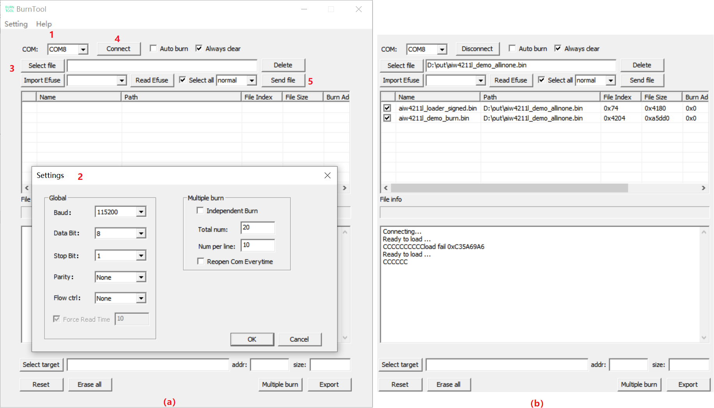
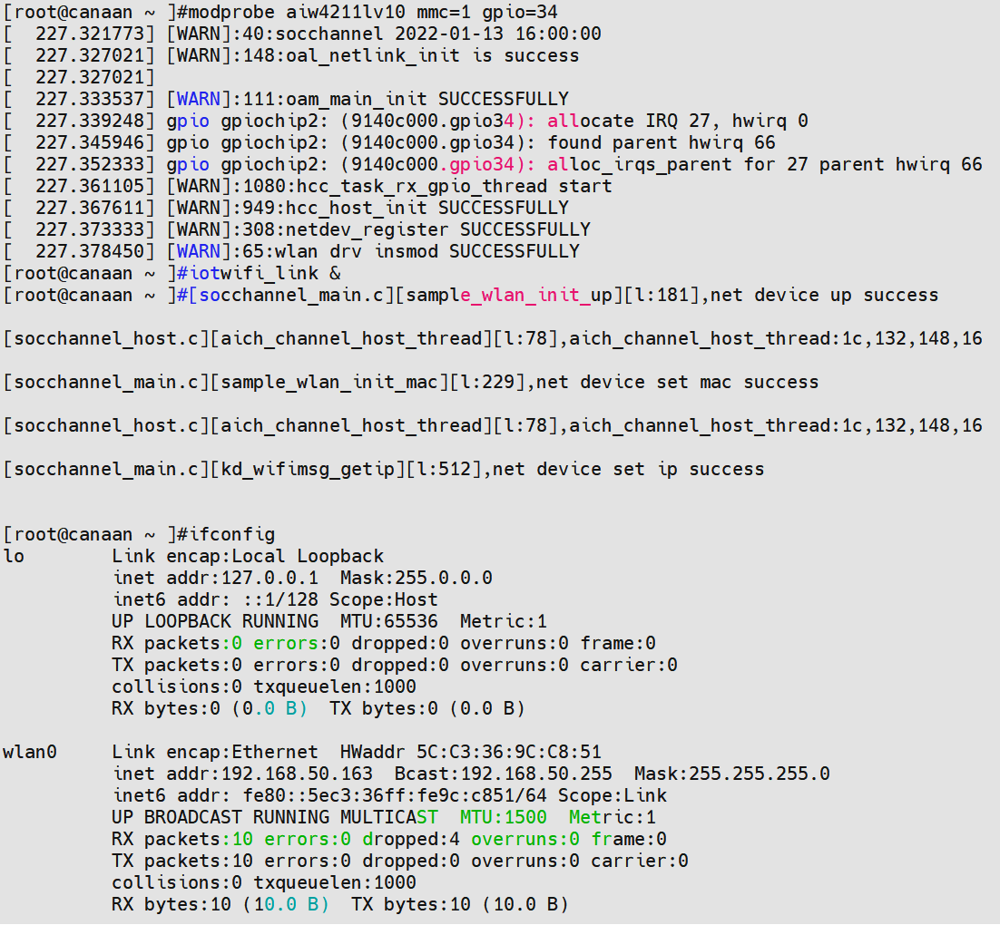
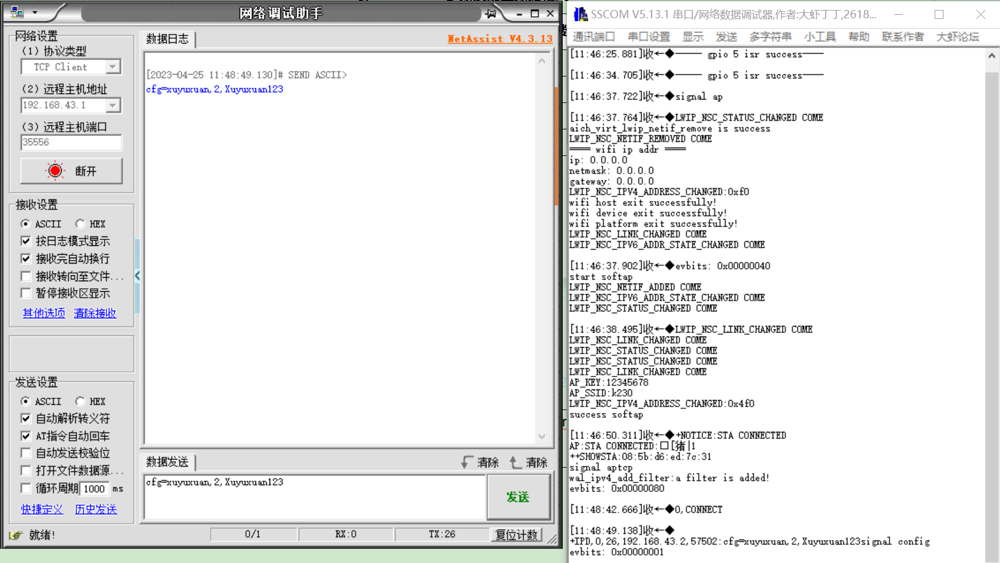
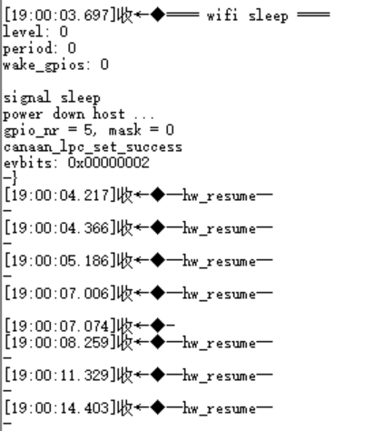
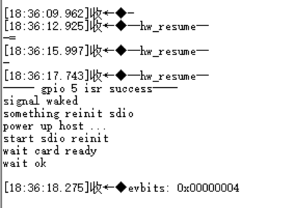

# K230 SDK IoT WiFi AiW4211LV10使用指南

## 1. 功能介绍

AiW4211LV10是一款低功耗IoT WiFi芯片，我司采用该芯片平台设计了一款AiW4211LV10开发板，该开发板可通过TF卡插槽接入K230 EVB板。K230 EVB加载AiW4211LV10驱动之后，可以生成wlan0无线网卡，实现网络数据通信。


图1-1 AiW4211LV10开发板

WiFi主要功能如图1-1所示：


图1-1 WiFi功能框图

WiFi主要功能简介：

- 消息通信：WiFi接收并解析Host端发送的消息指令及指令参数，触发相应事件执行
- 网络通信：网络数据透传
- 参数配置：建立SoftAP，接收配置参数，并触发配置事件
- 配置存取：管理配置数据形成的配置文件，存储在flash上
- AP接入：接入指定AP，监控接入状态并进行相应处理
- 保活链路：建立维护与远程服务器之间的保活链路
- 休眠：设置软硬件环境，给Host下电（依据平台特性，K230自下电），WiFi进入休眠模式
- IO唤醒：处理button或PIR唤醒信号，恢复软硬件环境，给Host上电
- 网络唤醒：处理来自保活链路的唤醒数据包，恢复软硬件环境，给Host上电

## 2. 模块依赖

硬件上依赖AiW4211LV10开发板，依赖K230 EVB开发板。软件上依赖于K230 SDK。

### 2.1 软件环境

K230 SDK V0.5.1及后续版本。 AiW4211LV10 SDK。

### 2.2 硬件环境

K230 EVB开发板设置emmc启动，空出TF卡插槽用于AiW4211LV10开发板接入。 开发板硬件版本及跳线见表2-1：

表2-1开发板版本

| **开发板**  | **硬件版本** | **设置**                                                     |
| ----------- | ------------ | ------------------------------------------------------------ |
| K230 EVB    | V1.1         | POWER BY BUTTON启动模式，跳线关系： 1.JUMPER J1 1—-2 2.JUMPER J1 13–14 |
| AiW4211LV10 | V1.1         |                                                              |

K230 EVB开发板飞线到AiW4211LV10开发板排针，连接关系见表2-2：

表2-2 飞线关系

|                   | **Link1**    | **Link2**              | **Link3**          | **Link4**        | **Link5**    | **Link6**    | **Link7**     |
| ----------------- | ------------ | ---------------------- | ------------------ | ---------------- | ------------ | ------------ | ------------- |
| **K230** **排针** | TP21 (5V)    | J8.PIN9 (GPIO34)       | J1.PIN9 (RTC_INT4) | J1.PIN14 (PW_EN) |              |              |               |
| **WiFi** **排针** | J6.PIN1 (5V) | J2.PIN3 (SDIO_INT_OUT) | J6.PIN3 (WH)       | J2.PIN2 (GPIO2)  | J2.PIN4 (TX) | J2.PIN5 (RX) | J2.PIN6 (GND) |
| **TTL-USB**       |              |                        |                    |                  | RX           | TX           | GND           |
| **说明**          | 5V供电线     | WiFi数据中断线         | WiFi唤醒K230中断线 | WiFi监控K230电平 | com口收发    | com口收发    | com口GND      |

连接说明：

- TP21是5V电压测试点，需要焊接一个插针，如果K230 EVB版本为V1.0则需要连接到J5 PIN16
- 如果使用不涉及WiFi唤醒K230 EVB则无需建立Link3
- 如果WiFi配置成通过监控K230 core的电源状态进入休眠则建立Link4，否则不需要。
- TTL-USB与WiFi的连线主要是为了观察WiFi的固件输出，无需要可以不连接
- AiW4211LV10开发板排针说明见表2-3

表2-3 WiFi开发板排针说明

| **WIFI子板** **接口** | **信号定义** | **描述**          | **电平**             | **必要性** | **K230 USIP LP3 EVB** **接口** |                             |
| --------------------- | ------------ | ----------------- | -------------------- | ---------- | ------------------------------ | --------------------------- |
| J4                    | 金手指       | SDIO_CLK/CMD/DATA | SDIO信号及GND        | 3.3V       | 必连                           | TF卡槽                      |
| J6                    | PIN1         | VDD_5V_WIFI       | 供电输入_5V          | POWER      | 必连                           | TP21(V1.1) 或J5.PIN16(V1.0) |
|                       | PIN2         | GND               | GND                  | GND        | 预留                           |                             |
|                       | PIN3         | WIFI_WAKE_HOST    | WIFI唤醒K230         | 1.8V       | 功能信号                       | J1.PIN9                     |
|                       | PIN4         | WIFI_UART0_TX     | 串口TX，可连接K230   | 1.8V       | 预留                           | J8.PIN15，目前无连接需求    |
|                       | PIN5         | WIFI_UART0_RX     | 串口RX，可连接K230   | 1.8V       | 预留                           | J8.PIN13，目前无连接需求    |
|                       | PIN6         | HOST_WAKE_WIFI    | K230唤醒WIFI         | 1.8V       | 功能信号                       | J8.PIN11, 目前无连接需求    |
| J2                    | PIN1         | WIFI_POWER_EN     | WIFI使能，预留       | 3.3V       | 预留                           |                             |
|                       | PIN2         | GPIO2             | 监控K230电平         | 3.3V       | 功能信号                       | J1.PIN14                    |
|                       | PIN3         | SDIO_INT_OUT      | SDIO中断             | 1.8V       | 功能信号                       | J8.PIN9                     |
|                       | PIN4         | UART0_TXD         | 调试串口TXD          | 3.3V       | 调试串口                       | 连PC                        |
|                       | PIN5         | UART0_RXD         | 调试串口RXD          | 3.3V       | 调试串口                       | 连PC                        |
|                       | PIN6         | GND               | GND                  | GND        | 调试串口                       | 连PC                        |
| J3                    | PIN1         | PIR_WAKE_HOST     | PIR唤醒K230          | 1.8V       | 可选                           | J1.PIN待定                  |
|                       | PIN2         | GND               | PIR供电，接PIR黑色线 | GND        | \                              | \                           |
|                       | PIN3         | PIR_WAKE_WiFi     | PIR信号，接PIR棕色线 | 3.3V       | \                              | \                           |
|                       | PIN4         | VDD_3V3           | PIR供电，接PIR红色线 | POWER      | \                              | \                           |

## 3. 模块配置

### 3.1 SDK目录结构

WiFi SDK的目录结构如下：

├── README.txt //简要编译及使用说明文档

├── support //存放固件烧写工具BurnTool.exe，编译环境搭建说明文档及支持包

├── toolchain //固件交叉编译工具链

├── Makefile //编译入口Makefile，可实现一键编译

├── SocChannel //WiFi驱动及配置工具源码

├── AiW4211LV10 //WiFi固件源码

编译驱动的工具链因与平台相关，故未放入SDK之中，如有需要请联系我们。

### 3.2 定制化修改

在WiFi SDK之中，为了便于固件的定制化，与硬件设计关联比较紧密的代码，需要公布且可由用户定制的SoftAP相关参数，以及自定义的被多个文件使用的全局变量等，被放置在canaan_private.h及canaan_private.c文件之中。重点项目说明见表3-1：

表3-1 定制化重点项说明

| **项目**                      | **说明**                                                     |
| ----------------------------- | ------------------------------------------------------------ |
| CONFIG_WIFI_MONITOR_HOSTLEVEL | 使能该宏之后WiFi通过监控K230的电源状态引脚触发休眠，将忽略休眠指令 |
| HOST_LLEVEL_TIME              | 配合CONFIG_WIFI_MONITOR_HOSTLEVEL使用，电源状态引脚拉低持续HOST_LLEVEL_TIME时间将触发休眠，设置该时间是为了防抖及过滤冷启动的不稳定状态 |
| LONG_PRESS_TIME               | 长按WiFi开发板上的K4按键持续LONG_PRESS_TIME时间WiFi将建立SoftAP模式，用于配置AP接入。参考5.3.1。 |
| TCP_SERVER_PORT               | SoftAP建立之后，WiFi启动一个tcp socket server用于接收网络配置信息，TCP_SERVER_PORT是指定监听端口 |
| g_softap_ipaddr               | SoftAP的网关、掩码及ip                                       |
| g_softapcfg                   | SoftAP的热点名称及密码等                                     |
| gpios_config[] g_gpios_config | WiFi GPIO配置表，与硬件设计相关，描述各功能GPIO的编号、功能名、方向、中断类型及触发方式和中断回调函数 |
| kd_gpios_hoststanby           | WiFi给Host下电接口，可根据平台特性实现，因K230自下电，此接口未操作任何IO |
| kd_gpios_wakehost             | WiFi给Host上电接口，可根据平台特性实现，针对K230平台，WiFi给K230 PMU发送了一个IO信号 |

## 4. 固件编译

### 4.1 编译环境

固件编译环境搭建请参考文档《AiW4211V10／AiW4211LV10 SDK开发环境搭建 用户指南.pdf》，该文档存储于WiFi SDK的support目录。 使用者也可以联系 成都爱旗科技有限公司(http://www.aichtech.com/) 索取相关资料。

### 4.2 编译方法

进入WiFi SDK源码目录执行指令make all和make install，编译得到WiFi固件、驱动、配置工具及通信接口共享库文件存储在顶层的out目录下：

out/

├── bin

│ ├── aiw4211l_demo_allinone.bin

│ ├── aiw4211lv10.ko

│ ├── wifi.conf

│ ├── iotwifi_link

│ ├── iotwifi_cli

│ └── k230_pwrdown

├── inc

│ ├── soc_msg.h

│ └── hal_iotwifi_cli.h

└── lib

└── libhal_iotwifi.so

也可以各部分独立编译： make firmware：编译WiFi固件aiw4211l_demo_allinone.bin make driver：编译WiFi驱动aiw4211lv10.ko make tools：编译配置工具和通信接口共享库，iotwifi_link、iotwifi_cli、libhal_iotwifi.so、k230_pwrdown

备注：K230 SDK已经集成了WiFi驱动、配置工具和通信接口库，因此这些可以不编译

## 5. 模块启动

### 5.1 固件烧写

使用WiFi SDK support目录 下的烧写工具BurnTool.exe，通过串口将固件aiw4211l_demo_allinone.bin烧写到AiW4211LV10开发板。

烧写方法请参考文档《AiW4211V10／AiW4211LV10 BurnTool工具 使用指南.pdf》，该文档存储于WiFi SDK的support目录。

使用者也可以联系 成都爱旗科技有限公司(http://www.aichtech.com/) 索取相关资料。

图5-1展示的是单板快速烧写的示意图：



图5-1 单板快速烧写

step 1: 选择烧写COM口 step 2: 通过“Setting”菜单项配置COM口参数 step 3: 选择WiFi固件 step 4: 点击“Connect”控件向WiFi开发板发起连接，WiFi开发板上电，工具log窗口可以看到ready to load …，表示连接已经建立，可以开始烧写了 step 5: 点击“Send file”控件开始烧写

### 5.2 驱动加载

参考2.2节内容配置硬件环境，长按K230 EVB板上K1按键上电启动，加载驱动：

modprobe aiw4211lv10 或者 modprobe aiw4211lv10 mmc=1 gpio=34

启动配置工具server端并置于后台运行：iotwifi_link &

当前驱动支持传入mmc主控编号及用于中断检测的gpio编号，可以实现较为灵活的硬件配置，如果不传参则分别使用代码中规定的默认值1和34。iotwifi_link的功能角色类似于wpa_supplicant，它首先会将wlan0 up起来，然后从WiFi设备侧同步mac地址及ip地址到Host端。



图 5-2 驱动加载及iotwifi_link启动

### 5.3 参数配置

AiW4211LV10的接入AP、休眠等级、休眠周期、唤醒IO、tcp keepalive的目标server、保活参数等直接影响WiFi运行，且需要根据实际场景进行动态调整的参数，可以通过5.3.1和5.3.2节提供的方式方法进行传参配置。

除非用户想要改变配置，否则每次启动之后无需重配。

#### 5.3.1 通过网络配置AP接入

AiW4211LV10开发板支持通过网络配置目标AP的名称、密码和加密方式这三个参数。配置AP接入的步骤如下：

step 1: 准备一个路由器，并记录其热点名称、密码和加密方式信息 step 2: AiW4211LV10开发板在固件烧写之后初次启动运行时，或者在已经完成配置的情况下长按板上K4按键3s，WiFi将启动SoftAP模式生成一个热点并建立一个基于TCP协议的socket server step 3: 将PC连入该热点，然后启动NetAssist step 4: 配置NetAssist作为 tcp socket client连接到WiFi step 5: server解析配置数据后连接到指定AP，退出SoftAP模式

使用者如有能力可以开发一个手机APP进行网络配置，这里为简单起见只是使用了PC+NetAssist方案。SoftAP参数及配置数据格式见表5-1，NetAssist配置运行见图5-1：

表 5-1 SoftAP参数及配置数据格式

| **项目**    | **参数**                                                     |
| ----------- | ------------------------------------------------------------ |
| AP name     | k230                                                         |
| AP password | 12345678                                                     |
| server ip   | 192.168.43.1                                                 |
| server port | 35556                                                        |
| config data | `cfg=<targer ap name>,<targer ap auth>,<targer ap password> 例如：cfg=xuyuxuan,2,Xuyuxuan123` |



图 5-3 NetAssist配置运行

#### 5.3.2 通过消息配置AP接入

AiW4211LV10开发板支持通过消息通道配置目标AP参数（与5.3.1功能相同），除此之外还可以通过消息通道配置WiFi休眠参数和tcp keepalive参数。消息通道是K230与AiW4211LV10之间通过SDIO总线建立起来的软件通道。

##### 5.3.2.1 通过配置工具配置

配置步骤如下：

step 1: 准备一个路由器并启动热点 step 2: 将PC接入该热点，然后启动NetAssist，这里为简单起见使用PC+NetAssist作为远端保活服务器 step 3: 配置NetAssist作为 tcp socket server等待WiFi保活链路的接入 step 4: K230端根据热点信息和NetAssist启动的server信息编辑配置文件/etc/wifi.conf step 5: 运行配置工具client端，解析配置文件，发送配置消息：iotwifi_cli –config /etc/wifi.conf step 6: AiW4211LV10接收到配置参数之后，首先存储休眠参数，然后接入指定AP，最后建立tcp socket client连入NetAssist建立的 tcp socket server

/etc/wifi.conf是WiFi工作参数配置文件，以json格式编写，基本上是对[wifi_config_t](https://www.kendryte.com/k230/zh/dev/01_software/board/osdrv/K230_SDK_IoT_WiFi_AiW4211LV10_使用指南.html#wifi-config-t)结构体的映射，具体可参考6.1.2章节。文件内容如下：

```
{
"sleep": {
"level": 2,
"period": 3000,
"wake_gpios": [5]
},
"conn": {
"ssid": "xuyuxuan",
"auth": 2,
"key": "Xuyuxuan123",
"bssid": "",
"pairwise": 0
},
"keepalive": {
"svrip": "192.168.50.197",
"svrport": 5001,
"time": 10,
"intvl": 2,
"probes": 5,
"hrintvl": 60,
"hrprobes": 5
}
}
```


备注： “wake_gpios”: [5] 是一个数组项，当前数组只有一个元素5，表示WiFi可以被自身的gpio5唤醒，该IO对应按键K4，如果新添加唤醒源可以以逗号分隔追加。这取决于具体的硬件设计。


图 5-4 （A）WiFi接入路由器并被分配IP （B）tcp keepalive server

##### 5.3.2.2 通过调用API配置

在实际的业务程序中，可以通过调用通信接口共享库libhal_iotwifi.so提供的API接口[kd_wifi_config](https://www.kendryte.com/k230/zh/dev/01_software/board/osdrv/K230_SDK_IoT_WiFi_AiW4211LV10_使用指南.html#wifi-config-t)进行参数配置，API说明请参考6.1.1章节，配置步骤与5.3.2.1相同。

5.3.2.1节当中介绍的工具iotwifi_cli也是通过调用该接口实现WiFi参数配置的。

### 5.4 系统休眠

#### 5.4.1 通过工具配置休眠

运行配置工具client端发送休眠指令触发WiFi休眠：iotwifi_cli –dirsleep



图 5-5 WiFi进入休眠log

#### 5.4.2 通过调用API休眠

在实际的业务程序中，可以通过调用通信接口共享库libhal_iotwifi.so提供的API接口[kd_wifi_sleep](https://www.kendryte.com/k230/zh/dev/01_software/board/osdrv/K230_SDK_IoT_WiFi_AiW4211LV10_使用指南.html#sleep)触发WiFi休眠，具体请参考6.2章节。

工具iotwifi_cli也是通过调用该接口触发WiFi休眠的。

#### 5.4.3 通过监控电平休眠

K230 EVB可以实现自下电，下电之后K230 EVB开发板J1 PIN14（PW_EN）引脚的电平将会被拉低，WiFi也可以通过监控该引脚的电平触发休眠。该功能使用的前提是K230功耗管理功能正常，并在编译WiFi固件时使能宏 CONFIG_WIFI_MONITOR_HOSTLEVEL（默认不使能），使能该宏之后WiFi将忽略K230发送的sleep指令，仅依据引脚电平状态进行休眠。

工具k230_pwrdown可以实现较为简单的K230 EVB双核自下电，它未做任何文件存储、状态检测等业务逻辑上的安全处理，因此只可以用于电平触发WiFi休眠的场景验证。该工具未集成到K230 SDK当中，因此需要拷贝到K230 EVB上执行：

./k230_pwrdown

### 5.5 系统唤醒

#### 5.5.1 按键唤醒

如果WiFi已进入休眠状态，短按AiW4211LV10开发板上的K4按键可唤醒WiFi，WiFi将给K230 EVB的PMU发送唤醒信号，如果此时K230 EVB处于5.4.3节配置的下电状态（非冷启动），其将被上电。



图5-6 按键唤醒log

#### 5.5.2 网络唤醒

如果WiFi已进入休眠状态，NetAssist发送wakeup可唤醒WiFi，WiFi将给K230 EVB的PMU发送唤醒信号，如果此时K230 EVB处于5.4.3节配置的下电状态（非冷启动），其将被上电。


图5-7 网络唤醒log

## 6. API参考

AiW4211LV10驱动加载后生成的无线网卡与一般WiFi网卡无异，因此网络通信功能无特殊API需要说明。 除基本的网络通信外，K230与WiFi还存在两个消息通信接口，需要重点说明。

### 6.1 config接口

#### 6.1.1 API

int kd_wifi_config([wifi_config_t](https://www.kendryte.com/k230/zh/dev/01_software/board/osdrv/K230_SDK_IoT_WiFi_AiW4211LV10_使用指南.html#wifi-config-t) *config) 配置WiFi工作参数：

- 配置目标AP的名称、密码、认证及加密方式
- 配置WiFi休眠等级，苏醒周期以及可唤醒的gpio
- 配置tcp keepalive时间参数等

#### 6.1.2 数据结构

##### 6.1.2.1 wifi_config_t

```
typedef struct {
unsigned int config_mask;
#define CFG_MASK_SLEEP (1 << 0)
#define CFG_MASK_CONNECT (1 << 1)
#define CFG_MASK_KEEPALIVE (1 << 2)
wifi_sleep_t sleep;
wifi_connect_t conn;
wifi_keepalive_t keepalive;
} wifi_config_t;
```

表6-1 wifi_config_t结构体成员

| config_mask                                                  | 配置目标项掩码，使能或屏蔽目标项，例如全部配置则：config_mask = CFG_MASK_SLEEP\|CFG_MASK_CONNECT\|CFG_MASK_KEEPALIVE CFG_MASK_SLEEP：配置休眠参数 CFG_MASK_CONNECT：配置AP连接参数 CFG_MASK_KEEPALIVE：配置tcp keepalive参数 |
| ------------------------------------------------------------ | ------------------------------------------------------------ |
| [sleep](https://www.kendryte.com/k230/zh/dev/01_software/board/osdrv/K230_SDK_IoT_WiFi_AiW4211LV10_使用指南.html#wifi-sleep-t) | 休眠参数                                                     |
| [conn](https://www.kendryte.com/k230/zh/dev/01_software/board/osdrv/K230_SDK_IoT_WiFi_AiW4211LV10_使用指南.html#wifi-connect-t) | AP连接参数                                                   |
| [keepalive](https://www.kendryte.com/k230/zh/dev/01_software/board/osdrv/K230_SDK_IoT_WiFi_AiW4211LV10_使用指南.html#wifi-keepalive-t) | tcp keepalive参数                                            |

##### 6.1.2.2 wifi_sleep_t

```
typedef struct
{
unsigned int level;
#define WIFI_SLEEP_LIGHT 1
#define WIFI_SLEEP_DEEP 2
#define WIFI_SLEEP_ULTRA 3
unsigned int period;
union
{
/*
* gpioX_wake: 0---disable, 1---enable
*/
struct {
unsigned int gpio0_wake:1;
unsigned int gpio1_wake:1;
unsigned int gpio2_wake:1;
unsigned int gpio3_wake:1;
unsigned int gpio4_wake:1;
unsigned int gpio5_wake:1;
unsigned int gpio6_wake:1;
unsigned int gpio7_wake:1;
unsigned int gpio8_wake:1;
unsigned int gpio9_wake:1;
unsigned int gpio10_wake:1;
unsigned int gpio11_wake:1;
unsigned int gpio12_wake:1;
unsigned int gpio13_wake:1;
unsigned int gpio14_wake:1;
};
unsigned int wake_gpios;
};
} wifi_sleep_t;
```


表6-2 wifi_sleep_t结构体成员

| level      | 休眠等级 WIFI_SLEEP_LIGHT：浅睡 WIFI_SLEEP_DEEP：深睡，主要休眠模式 WIFI_SLEEP_ULTRA：超深睡，只有3/5/7/14号gpio可唤醒，目前不使用 |
| ---------- | ------------------------------------------------------------ |
| period     | 苏醒周期，有效数值33~~4000ms。WiFi周期性从休眠态醒来，检测AP是否有发给自己的数据缓存 |
| wake_gpios | enable或disable可唤醒WiFi的gpio（WiFi侧gpio）                |

##### 6.1.2.3 wifi_connect_t

```
typedef struct
{
char ssid[EXT_WIFI_MAX_SSID_LEN + 1];
ext_wifi_auth_mode auth;
char key[EXT_WIFI_MAX_KEY_LEN + 1];
unsigned char bssid[EXT_WIFI_MAC_LEN];
ext_wifi_pairwise pairwise;
} wifi_connect_t;
```

表6-3 wifi_**connect**_t结构体成员

| ssid     | AP名称                                                       |
| -------- | ------------------------------------------------------------ |
| auth     | 认证类型 EXT_WIFI_SECURITY_OPEN EXT_WIFI_SECURITY_WEP EXT_WIFI_SECURITY_WPA2PSK EXT_WIFI_SECURITY_WPAPSK_WPA2PSK_MIX EXT_WIFI_SECURITY_WPAPSK EXT_WIFI_SECURITY_WPA EXT_WIFI_SECURITY_WPA2 EXT_WIFI_SECURITY_SAE EXT_WIFI_SECURITY_WPA3_WPA2_PSK_MIX EXT_WIFI_SECURITY_UNKNOWN |
| Key      | AP密码                                                       |
| bssid    | AP bssid，一般为AP mac地址                                   |
| pairwise | 加密类型 EXT_WIFI_PARIWISE_UNKNOWN EXT_WIFI_PAIRWISE_AES EXT_WIFI_PAIRWISE_TKIP EXT_WIFI_PAIRWISE_TKIP_AES_MIX |

##### 6.1.2.4 wifi_keepalive_t

```
typedef struct
{
unsigned char svrip[16];
unsigned short svrport;
unsigned short tcp_keepalive_time;
unsigned short tcp_keepalive_intvl;
unsigned short tcp_keepalive_probes;
unsigned short heartbeat_intvl;
unsigned short heartbeat_probes;
} wifi_keepalive_t;
```

表6-4 wifi_keepalive_t结构体成员

| svrip                | server端ip地址                                               |
| -------------------- | ------------------------------------------------------------ |
| svrport              | server端端口号                                               |
| tcp_keepalive_time   | TCP层keepalive心跳包常规发送周期，秒                         |
| tcp_keepalive_intvl  | TCP层keepalive心跳包无回应之后新的发送周期，秒               |
| tcp_keepalive_probes | TCP层keepalive心跳包无回应计数超过该阈值之后，判断TCP连接异常，断开重连 |
| heartbeat_intvl      | 应用层心跳包发送周期，秒                                     |
| heartbeat_probes     | 应用层心跳包无回应计数超过该阈值之后，判断socket连接异常，断开重连 |

### 6.2 sleep接口

int kd_wifi_sleep(void) 控制WiFi进入休眠，休眠相关参数在config API当中设置。

## 7.wifi功能限制

AiW4211LV10芯片为单频wifi芯片,不支持ap和sta同时共存，当ap启动时固定在某一信道，再起sta的话sta会在不同的信道上扫描，此时ap就会断连。 当通过sdio传入conf为错误配置时，AiW4211LV10会显示sta连接ap失败 串口打印 please reset conf，此时可通过iotwifi_cli传入新的正确的conf。 当通过client传入sta错误配置时，wifi从ap会切换到sta模式，AiW4211LV10会显示sta连接ap失败 串口同样打印please reset conf，由于sta与ap不能同时共存，这时wifi芯片会从sta切换到ap模式重新起tcp server ，sta需要重新连接ap,作为client重新接入。