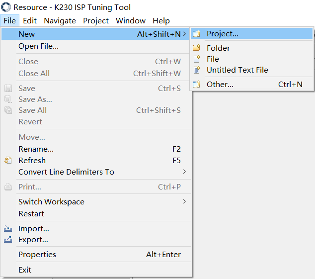
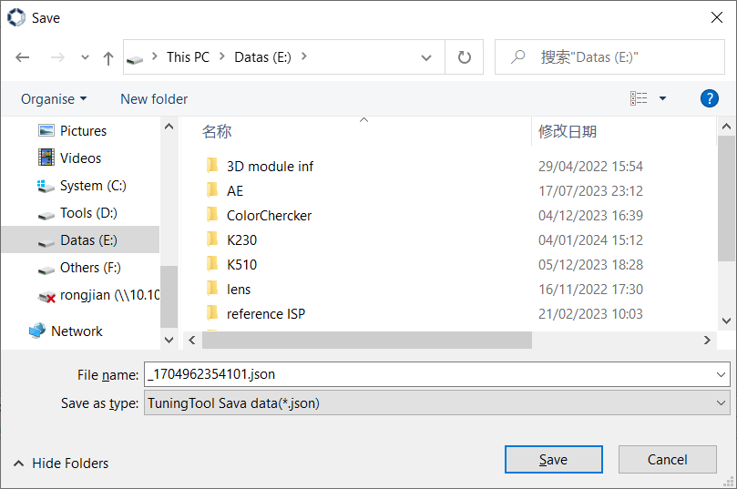

# K230 ISP Tuning Tool使用指南

## 1. 模块软件架构

图1-1

## 2. Tuning Tool的连接及启用

### 2.1 工具获取路径

| **文件名**                                       | **存放位置**                                                 | **功能**                        |
| ------------------------------------------------ | ------------------------------------------------------------ | ------------------------------- |
| PC tuning-tool软件包（K230 ISP Tuning Tool.exe） | relaese的源码包k230_sdk/tools/tuning-tool-client/K230_ISP_Tuning_Tool_20240129.7z | 用于图像dump，ISP调试等PC端工具 |
| t_server_c-6.1.0                                 | 小核文件系统 /mnt/                                           | tuning server可执行程序         |
| sample_sys_init.elf                              | 大核文件系统 /sdcard/app                                     | 大核服务端                      |

### 2.2 启动流程

1. 板端小核配置IP
2. 板端小核等待sharefs启动后，在大核启动 sample_sys_init.elf，运行 `/sharefs/app/sample_sys_init.elf` 即可
3. 板端小核启动tuning server，运行 `/mnt/t_server_c-6.1.0`，需要根据实际情况添加参数，使用 `-?` 参数查看帮助
4. PC端启动tuning tool，连接K230

## 3. Tuning Tool界面介绍

图3-1

如图3-1所示为tuning tool的基本操作UI全部展开后共六个区域：

(1) 菜单操作区域：文件操作、窗口管理等功能

(2) 工具栏区域：支持关键功能的操作

| 按钮                                                         | 描述                                         |
| ------------------------------------------------------------ | -------------------------------------------- |
|  | 将设置导出到文件                             |
|  | 从文件导入设置                               |
|  | 拍摄图像或视频                               |
|  | 将本地raw图像或视频发送到调试服务器由ISP处理 |
|  | 视频预览                                     |
|  | 配置寄存器                                   |
|  | 配置连接调试服务器                           |
|  | 修改首选项                                   |
|  | 在一个批次中调整多个参数                     |
|  | 提供对额外组件的访问                         |

(3) 工程管理区域：选择和管理不同工程

(4) 功能区域：用于ISP各模块UI的切换

(5) 调试区域：用于调试某一个模块的参数

(6) 回显区域：用于打印部分参数下发和接收的日志

### 3.1 连接板端tuning-server

#### 3.1.1 使用HTTP方式连接板端tuning-server

SDK默认支持HTTP方式连接，点击工具栏中的配置连接调试服务器按钮，将弹出图3-2。

图3-2

选择HTTP模式，保证PC与板端连接的网络处于同一网段，在“Host”输入框中输入板端的IP，在“Port”输入框中请输入固定端口34567，配置完成后点击“OK”按钮，如果板端tuning-server已经启动，则会自动完成连接。任意切换图3-1中④区域的模块，则会看到tuning-server端的函数打印。

### 3.2 创建/选择工程

若所需调试的工程已在图3-1中③区域，则点击选中该工程即可开始ISP调试。 若还没有创建所需调试的工程，则需先创建该工程。

#### 3.2.1 创建调试工程

如图3-3，依次点击File->New->Project…，弹出工程创建向导窗口，如图3-4。 

图3-3

图3-4

点击“ISP”目录，显示出“ISP Project Wizard”, 单击“ISP Project Wizard”后，再点击“Next”按钮，弹出创建工程窗口，如图3-5。 

图3-5

输入工程名称，指定工程地址后，点击“Finish”按钮即可完成工程创建，该工程将显示在图3-1中的区域③。点击该工程即可开始ISP调试。

### 3.3 在线调试界面及功能描述

本节只是简单介绍一些tuning tool界面上调试模块的主要功能，具体的调试策略及步骤在图像调优文档中进行详细的描述。

ISP功能模块如图3-6所示。

图3-6

#### 3.3.1 Bypass Settings

所有ISP功能模块的使能控制。

#### 3.3.2 Auto Focus Control (Focus Control)

聚焦控制调试模块。

当选择auto mode时（Auto Mode View)，界面列表中显示为自动聚焦控制(Auto Focus Control); 当选择manual mode时（Manual Mode View），界面列表中显示为聚焦控制（Focus Control）。

#### 3.3.3 Auto Exposure Control (Exposure Control)

曝光控制调试模块。

当选择auto mode时（Auto Mode View)，界面列表中显示为自动曝光控制(Auto Exposure Control); 当选择manual mode时（Manual Mode View），界面列表中显示为曝光控制（Exposure Control）。

自动曝光控制参数，控制图像亮度和AE调节时的收敛速度等。

支持设置ROI窗口。开启ROI模式需要，需要semMode中选择FIX模式并enable AE才能开启ROI模式。

#### 3.3.4 Auto White Balance (White Balance)

白平衡控制调试模块。

当选择auto mode时（Auto Mode View)，界面列表中显示为自动曝光控制(Auto White Balance); 当选择manual mode时（Manual Mode View），界面列表中显示为曝光控制（White Balance）。

#### 3.3.5 Exposure Statics

暂未支持。

#### 3.3.6 Auto Focus Measurement

暂未支持。

#### 3.3.7 High Dynamic Range

多曝光宽动态，可调节各曝光间的曝光量比例系数、融合取值范围。

#### 3.3.8 Compand

数据拉伸、压缩模块，可设置作用曲线。

#### 3.3.9 Black Level Subtraction

提供与Sensor相关的黑电平校正，可对R、Gr、Gb、B四通道进行设置。

#### 3.3.10 RGB Infrared Radiation

暂未支持。

#### 3.3.11 Lens Shading Correction

提供镜头阴影校正，校准系数由标定工具生成。

#### 3.3.12 Digital Gain

用于对ISP Digital Gain使能控制及调节大小。

#### 3.3.13 Wide Dynamic Range

提供对图像全局和局部对比度的调整。

#### 3.3.14 Green Equilibrate

校准Gr与Gb两通道的不平衡，可设置不同的绿平衡强度。

#### 3.3.15 Defect Pixel Cluster Correction

提供对像素坏点的检测及校准的功能，通过选择set可设置不同的校准方法。

#### 3.3.16 DeNoising Prefilter

双边滤波降噪模块。

#### 3.3.17 3D Noise Reduction

通过调整参数配置，对图像降噪强度的调节。

#### 3.3.18 Demosaic

通过插值将Bayer格式的Raw图转为RGB图，并提供去摩尔纹、去紫边、锐化及降噪处理功能。

该模块中还包含了CAC子模块，用于校准主要由镜头引入的色差，由标定工具生成校准参数。

#### 3.3.19 Color Correction Matrix

色彩还原矩阵。通过调节3x3 CCM矩阵及偏移量可完成颜色偏差的校准。

#### 3.3.20 Gamma Correction

支持客户自定义gamma，该模式下可更改gamma指数。

#### 3.3.21 Edge Enhance

用于提升图像的清晰度。通过设置合适的参数，提升图像清晰度的同时，也可抑制噪声的增强。

该模块中还包含了CA和DCI两个子模块。

CA模块用于调节图像的饱和度。根据图像亮度或者原饱和度的变化来调整饱和度，达到局部调整饱和度的目的，让亮区域的颜色更鲜艳以及消除暗区域或低饱和度区域的彩噪。

DCI模块实现对图像的动态对比度调整。

#### 3.3.22 Color Processing

颜色处理模块，可调节图像的对比度、亮度、饱和度及色调，设置不同的颜色喜好或风格。

### 3.4 拍摄图像

#### 3.4.1 设置图像格式和大小

点击工具栏中的预览按钮，将弹出图3-7。

图3-7

勾选“Stream Enable”。在“Output Format”栏中选择需拍摄的图像格式： 若需拍摄YUV图像，当前仅支持8bit yuvNV12格式数据，请选择“YUV420 Semi_Planar”； 若需拍摄raw data图像，请根据ISP接入的raw data位宽选择相应位宽选项。

如下图3-8，在“Output Size”栏中正确设置图像大小。 

图3-8

点击“OK”按钮完成设置。

#### 3.4.2 采集图像

点击工具栏中的拍摄按钮，将弹出图3-9。

图3-9

在“Save Path”栏中选择图像文件保存的地址。 若拍摄单帧图像，直接点击“Capture”按钮即可； 若拍摄多帧图像，请在“Snapshot Num”选项中设置所需拍摄的帧数，并根据所希望输出的文件数量设置“Output as One File”选项（勾选或不勾选），完成上述配置后，点击“Capture”按钮开始拍摄。

### 3.5 参数的导入与导出

#### 3.5.1 参数导入

工具默认支持导入的参数文件为标准xml和json格式，分为标定参数和tuning参数两部分，支持PC本地导入。

点击工具栏中的导入按钮，将弹出图3-10。

图3-10

在图3-10所示窗口中选择需要导入的xml或json参数文件，点击“Open”按钮即可开始导入。

#### 3.5.2 参数导出

工具默认导出方式会将在线调试参数汇总为一个json文件存放。

点击工具栏中的导出按钮，将弹出图3-11。

图3-11

在图3-11所示窗口中选择需要导出的json参数文件，点击“Save”按钮即可开始导出。