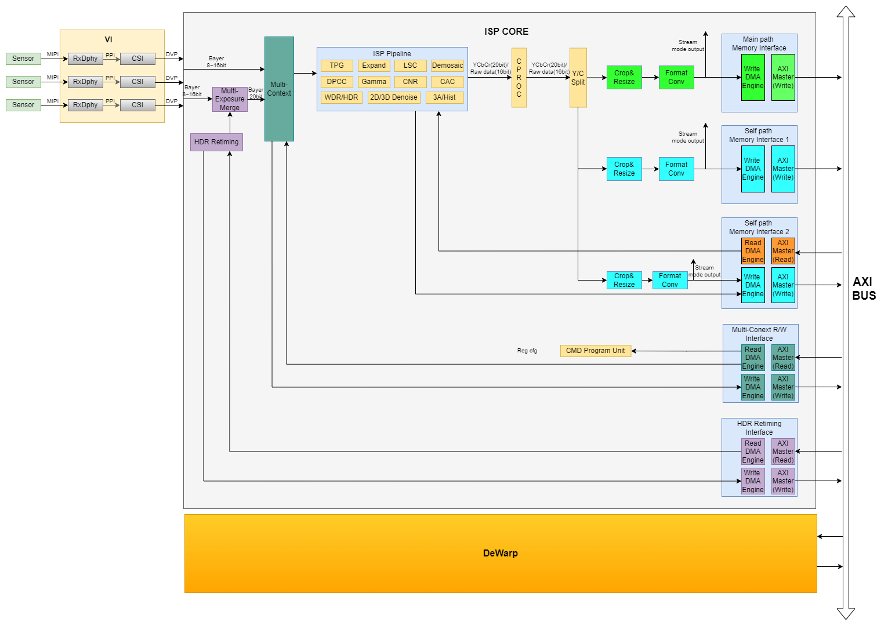
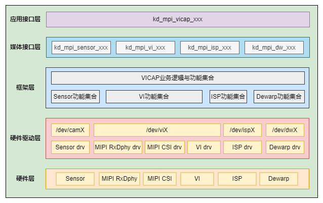
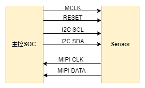
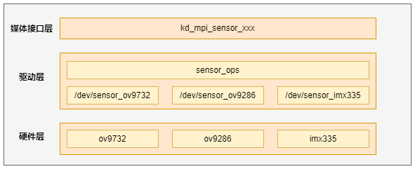
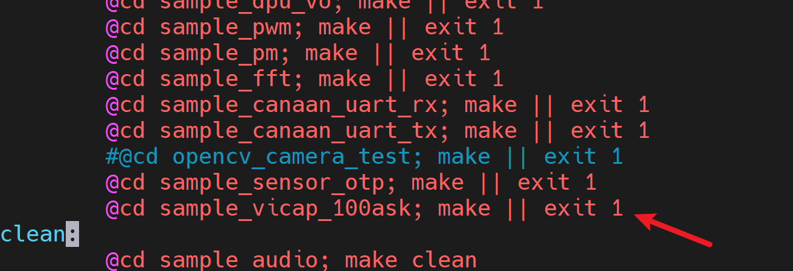
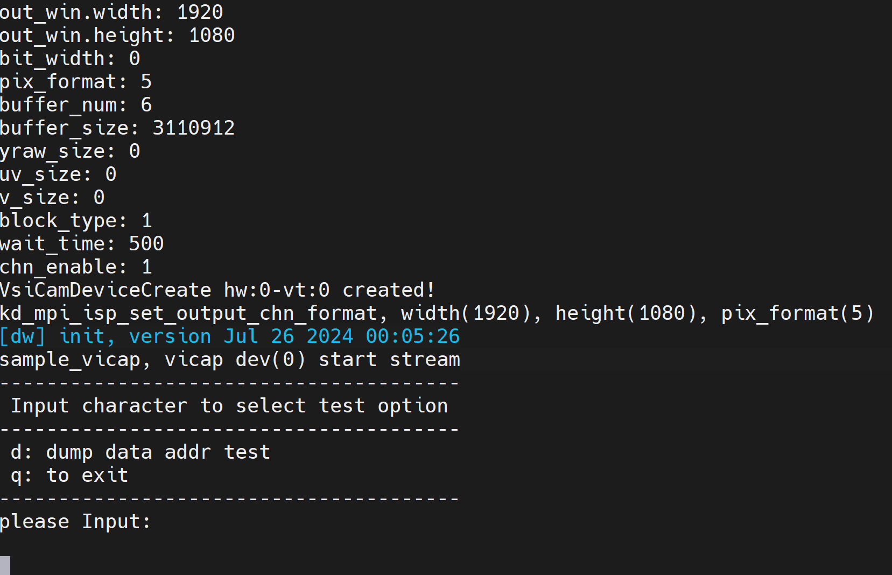
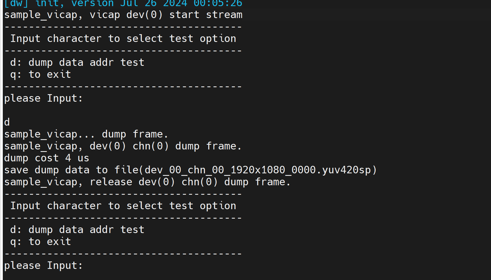
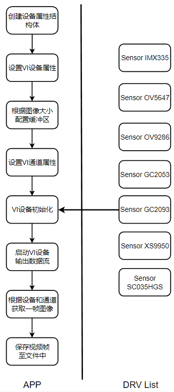

# 摄像头实验-捕获一张图像

硬件要求：

- DshanPI-CanMV开发板
- GC2093摄像头
- Type-C数据线 x2

开发环境：

- Ubuntu20.04

配套源码：https://pan.baidu.com/s/1VBd0n3FKO0bj8yHOWk4HEw?pwd=ov5d 提取码：ov5d

具体位置： `12_多媒体应用示例源码\01_sample_vi` 

注意：在学习前请按照[《K230 SDK环境搭建》](https://eai.100ask.net/CanaanK230/part2/DshanPICanMVK230SDKEnvironmentConstruction)搭建好K230的开发环境或者直接获取资料光盘中搭建好环境的Ubuntu虚拟机。


## 1.摄像头架构

### 1.1 VICAP模块架构

VICAP模块是对整个图像采集处理单元的抽象描述。

VICAP硬件由Sensor，VI，ISP，Dewarp四大模块组成（如下图1-1所示）。最多支持3路sensor同时接入，ISP内部通过的MCM模块实现多路sensor的时分复用管理，多路sensor输出数据通过MCM的Memory Interface的Write接口写入DDR，再通过Read接口读入并装载到ISP Pipeline进行处理。



<center>VICAP硬件架构图</center>

VICAP软件架构如下图所示，从上到下依次是：应用接口层，媒体接口层，系统框架层，驱动层和硬件层。

- 应用层接口： 提供kd_mapi_vicap_xxx形式的API接口及使用说明。它是对媒体接口层各个子模块提供的功能接口的进一步封装，简化应用开发流程。
- 媒体接口层：该层由VICAP各个子模块组成，每个子模块提供各自的媒体接口API封装。
- 框架层：负责VICAP整个系统软件功能与业务逻辑的控制与管理。通过将各个子模块提供的接口与功能整合统一形成一套完整的VICAP系统控制逻辑和流程。
- 驱动层：VICAP各个硬件模块的内核驱动功能的集合。

硬件层：VICAP各个具体硬件模块的集合，包括sensor。



### 1.2 Sensor架构

Sensor模块是VICAP捕获图像的数据源之一，负责配置图像感光单元的运行参数及工作模式。

K230平台支持多种接口类型的sensor，我们以当前最常用的MIPI CSI接口Sensor为例进行说明。Sensor与主控平台的硬件连接示意图如下：



主控通过I2C接口下发配置寄存器控制sensor的工作方式，sensor通过MIPI CSI接口将图像数据发送至主控SOC。

Sensor模块系统架构如下图所示：



从上到下依次是：媒体接口层，硬件驱动层以及硬件层

- 媒体接口层：提供kd_mpi_sensor_xxx接口给外部模块操作和访问sensor设备。
- 驱动层：该层主要包两部分，分别是：sensor_dev，sensor_drv。
- sensor_dev：负责设备驱动文件的注册，提供文件操作接口的实现流程。通过注册设备文件节点/dev/sensorxx供用户空间的程序访问内核驱动。
- sensor_drv：具体sensor的硬件驱动，并将针对sensor的操作封装为统一的接口。
- 硬件层：sensor模组硬件，当前系统中最多同时支持三路硬件sensor。

## 2.应用程序编译

### 2.1 新增程序

#### 2.1.1 新建工程文件夹

在k230_sdk/src/big/mpp/userapps/sample目录下新建工程

```
mkdir sample_vicap_100ask
```


#### 2.1.2 修改Makefile

修改k230_sdk/src/big/mpp/userapps/sample目录下的Makefile文件，新增sample_vicap_100ask工程的编译规则

```
@cd sample_vicap_100ask; make || exit 1
```



```
@cd sample_vicap_100ask; make clean
```


#### 2.1.3 进入工程目录

```
cd sample_vicap_100ask/
```


#### 2.1.4 新建源码文件

```
vi sample_vicap_100ask.c
```

填入源码。


#### 2.1.5 新建Makefile文件

```
vi Makefiel
```

填入一下内容：

```
include $(MPP_SRC_DIR)/userapps/sample/mpp.mk
include $(MPP_SRC_DIR)/userapps/sample/rt-smart.mk

CURRECT_DIR_NAME=$(shell basename `pwd`)
LOCAL_SRC_DIR = $(shell pwd)
BIN = $(MPP_SRC_DIR)/userapps/sample/elf/$(CURRECT_DIR_NAME).elf
LIBPATH = $(MPP_LIB_PATH)
LIBS = $(MPP_LIBS)

LOCAL_CFLAGS = -I$(LOCAL_SRC_DIR) \
                           -I$(LOCAL_SRC_DIR)/../sample_vo

SRCS = $(wildcard $(LOCAL_SRC_DIR)/*.c) \
           $(LOCAL_SRC_DIR)/../sample_vo/vo_test_case.c \
           $(LOCAL_SRC_DIR)/../sample_vo/vo_bind_test.c

OBJS = $(patsubst %.c,%.o,$(SRCS))

all: $(BIN)
        @-rm -f $(OBJS)
        @echo "${PWD}/Makefile all"

$(OBJS): %.o : %.c
        @echo CC $@
        @$(CC) $(CC_CFLAGS) $(LOCAL_CFLAGS) $(BSP_CFLGAS) $(RTSMART_CFLAGS) $(MPP_USER_CFLGAS) -c $< -o $@

$(BIN): $(OBJS)
        @echo LD $@
        @$(CC) -o $(BIN) $(LINKFLAG) -Wl,--whole-archive -Wl,--no-whole-archive -n --static $(OBJS) -L$(LIBPATH) -Wl,--start-group $(LIBS) -Wl,--end-group

clean:
        echo "${PWD}/Makefile clean"
        -rm -rf $(BIN)
        -rm -f $(OBJS)

.PHONY: all clean
~
```


### 2.2 程序编译

1.进入K230SDK目录

```
cd ~/k230_sdk
```

2.下载toolchain和准备源码

```
source tools/get_download_url.sh && make prepare_sourcecode
```

3.挂载工具链目录

```
sudo mount --bind $(pwd)/toolchain /opt/toolchain
```

4.配置板级型号

```
make CONF=k230_canmv_dongshanpi_defconfig prepare_memory	
```

5.编译程序

```
make mpp-apps
```

等待编译完成，编译完成后，可执行程序`sample_vicap_100ask.elf`会生成在`k230_sdk/src/big/mpp/userapps/sample/elf`目录下。

使用ADB将可执行程序传输至开发板中

```
adb push src/big/mpp/userapps/sample/elf/sample_vicap_100ask.elf /sharefs/app
```


### 2.2 程序运行

使用串口软件访问开发板的大核串口终端。

> 如果没有关闭开机自启程序，可按下q+回车键可退出开机自启程序。

1.进入可执行文件目录

```
cd /sharefs/app
```

2.运行程序

```
./sample_vicap_100ask.elf -dev 0
```

执行完成后效果如下所示：



3.输入`d`并按下回车即可保存视频帧，文件会保存在当前路径，文件名称为：`dev_00_chn_00_1920x1080_0000.yuv420sp`



4.输入`q`并按下回车即可退出程序。


## 3. 程序解析

代码流程图如下所示：




### 3.1 指定sensor配置信息

```
ret = kd_mpi_vicap_get_sensor_info(device_obj[dev_num].sensor_type, &device_obj[dev_num].sensor_info);
    if (ret) {
        printf("sample_vicap, the sensor type not supported!\n");
        return ret;
    }
    memcpy(&dev_attr.sensor_info, &device_obj[dev_num].sensor_info, sizeof(k_vicap_sensor_info));

    device_obj[dev_num].in_width = device_obj[dev_num].sensor_info.width; //1920
    device_obj[dev_num].in_height = device_obj[dev_num].sensor_info.height; //1080

    printf("sample_vicap, dev[%d] in size[%dx%d]\n", \
        dev_num, device_obj[dev_num].in_width, device_obj[dev_num].in_height);

    //vicap device attr set
    dev_attr.acq_win.h_start = 0; //采集窗口的水平起始位置
    dev_attr.acq_win.v_start = 0; //采集窗口的垂直起始位置
    dev_attr.acq_win.width = device_obj[dev_num].in_width; //采集窗口的宽度
    dev_attr.acq_win.height = device_obj[dev_num].in_height; //采集窗口的高度
    dev_attr.mode = VICAP_WORK_ONLINE_MODE; //设备工作模式为在线模式

    dev_attr.pipe_ctrl.data = pipe_ctrl; //设置ISP相关控制数据
    dev_attr.pipe_ctrl.bits.af_enable = 0; //禁用自动对焦
    dev_attr.pipe_ctrl.bits.ae_enable = device_obj[dev_num].ae_enable;
    dev_attr.pipe_ctrl.bits.awb_enable = device_obj[dev_num].awb_enable;
    dev_attr.pipe_ctrl.bits.dnr3_enable = device_obj[dev_num].dnr3_enable;
    dev_attr.pipe_ctrl.bits.ahdr_enable = device_obj[dev_num].hdr_enable;

    dev_attr.cpature_frame = 0; //捕获帧数
    dev_attr.dw_enable = device_obj[dev_num].dw_enable;

    dev_attr.mirror = device_obj[cur_dev].sensor_mirror; //设置镜像模式为设备对象中的传感器镜像模式
```

### 3.2 设置VICAP设备属性

```
ret = kd_mpi_vicap_set_dev_attr(dev_num, dev_attr);//设置VICAP设备属性
```


### 3.3 配置图像缓冲区

```
    int chn_num = 0;
    //set default value
    if (!device_obj[dev_num].out_format[chn_num]) {
        device_obj[dev_num].out_format[chn_num] = PIXEL_FORMAT_YUV_SEMIPLANAR_420; //捕获图像格式为YUV420
    }

    if (!device_obj[dev_num].out_win[chn_num].width) {
        device_obj[dev_num].out_win[chn_num].width = device_obj[dev_num].in_width; //捕获图像宽度
    }

    if (!device_obj[dev_num].out_win[chn_num].height) {
        device_obj[dev_num].out_win[chn_num].height = device_obj[dev_num].in_height; //捕获图像高度
    }

    if ( device_obj[dev_num].out_win[chn_num].h_start || device_obj[dev_num].out_win[chn_num].v_start) {
        device_obj[dev_num].crop_enable[chn_num] = K_TRUE;
    }

    printf("sample_vicap, dev_num(%d), chn_num(%d), in_size[%dx%d], out_offset[%d:%d], out_size[%dx%d]\n", \
        dev_num, chn_num, device_obj[dev_num].in_width, device_obj[dev_num].in_height, \
        device_obj[dev_num].out_win[chn_num].h_start, device_obj[dev_num].out_win[chn_num].v_start, \
        device_obj[dev_num].out_win[chn_num].width, device_obj[dev_num].out_win[chn_num].height);

    ret = sample_vicap_vb_init(device_obj);//配置缓冲区
```


### 3.4 设置VI通道配置

```

    chn_attr.out_win.width = device_obj[dev_num].out_win[chn_num].width; //设置输出图像宽度
    chn_attr.out_win.height = device_obj[dev_num].out_win[chn_num].height; //设置输出图像高度

    if (device_obj[dev_num].crop_enable[chn_num]) { //如果设置裁剪参数
        chn_attr.crop_win.width = device_obj[dev_num].crop_win[chn_num].width;  //chn_attr.out_win;1166;// 
        chn_attr.crop_win.height = device_obj[dev_num].crop_win[chn_num].height; //1944;//
        chn_attr.crop_win.h_start =device_obj[dev_num].out_win[chn_num].h_start;  //713;
        chn_attr.crop_win.v_start =device_obj[dev_num].out_win[chn_num].v_start;  //0;//
    } else {
        chn_attr.crop_win.width = device_obj[dev_num].in_width;
        chn_attr.crop_win.height = device_obj[dev_num].in_height;
    }

    chn_attr.scale_win = chn_attr.out_win;
    chn_attr.crop_enable = device_obj[dev_num].crop_enable[chn_num];
    chn_attr.scale_enable = K_FALSE; //缩放关闭
    chn_attr.chn_enable = K_TRUE; //通道使能

    chn_attr.pix_format = device_obj[dev_num].out_format[chn_num];//图像格式
    chn_attr.buffer_num = VICAP_OUTPUT_BUF_NUM;//缓冲区数量
    chn_attr.buffer_size = device_obj[dev_num].buf_size[chn_num];//缓冲区大小

    printf("sample_vicap, set dev(%d) chn(%d) attr, buffer_size(%d), out size[%dx%d]\n", \
        dev_num, chn_num, chn_attr.buffer_size, chn_attr.out_win.width, chn_attr.out_win.height);

    printf("sample_vicap out_win h_start is %d ,v_start is %d \n", chn_attr.out_win.h_start, chn_attr.out_win.v_start);

    ret = kd_mpi_vicap_set_chn_attr(dev_num, chn_num, chn_attr);//设置VICAP设备通道属性
```


### 3.5 VI设备初始化

```
 ret = kd_mpi_vicap_init(dev_num);//VICAP设备初始化
```


### 3.6 启动VI设备输出数据视频流

```
ret = kd_mpi_vicap_start_stream(dev_num);//启动VICAP设备输出数据流
```


### 3.7 从VI通道获取一帧数据

```
printf("sample_vicap... dump frame.\n");
            int dev_num = 0;
            int chn_num = 0;
            printf("sample_vicap, dev(%d) chn(%d) dump frame.\n", dev_num, chn_num);

            memset(&dump_info, 0 , sizeof(k_video_frame_info));
            uint64_t start = get_ticks(); //获取当前时间戳
            //根据指定的设备和输出通道dump vicap数据
            ret = kd_mpi_vicap_dump_frame(dev_num, chn_num, VICAP_DUMP_YUV, &dump_info, 1000);
            if (ret) {
                printf("sample_vicap, dev(%d) chn(%d) dump frame failed.\n", dev_num, chn_num);
                continue;
            }
            uint64_t end = get_ticks();//获取结束时间
            printf("dump cost %lu us\n", (end - start) / 27);
```


### 3.8 保存一帧数据

```
virt_addr = kd_mpi_sys_mmap(dump_info.v_frame.phys_addr[0], data_size);//memory 存储映射接口，将物理地址映射到虚拟地址
            if (virt_addr) {
                memset(filename, 0 , sizeof(filename));

                snprintf(filename, sizeof(filename), "dev_%02d_chn_%02d_%dx%d_%04d.%s", \
                    dev_num, chn_num, dump_info.v_frame.width, dump_info.v_frame.height, dump_count, suffix);//生成文件名

                printf("save dump data to file(%s)\n", filename);
                FILE *file = fopen(filename, "wb+");
                if (file) {
                    if (device_obj[dev_num].dalign && lbit) {
                        for (k_u32 index = 0; index < data_size; index += 2) {
                            k_u16 raw_data = (virt_addr[index + 1] << 8 ) | virt_addr[index];
                            raw_data = raw_data << lbit;
                            fwrite(&raw_data, sizeof(raw_data), 1, file);//保存文件
                        }
                    } else {
                        fwrite(virt_addr, 1, data_size, file);
                    }
                    fclose(file);//关闭文件
                } else {
                    printf("sample_vicap, open dump file failed(%s)\n", strerror(errno));
                }

```

