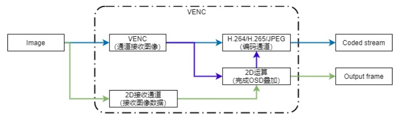
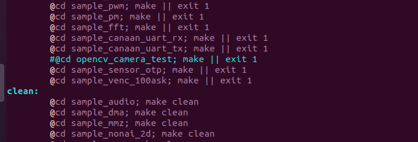
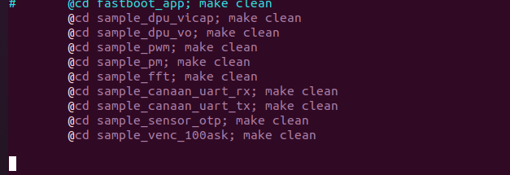
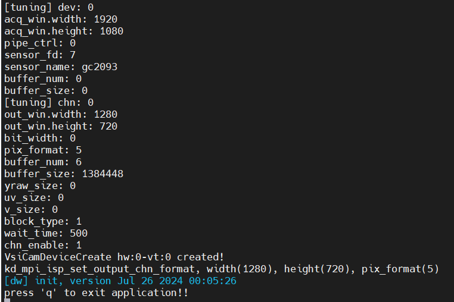
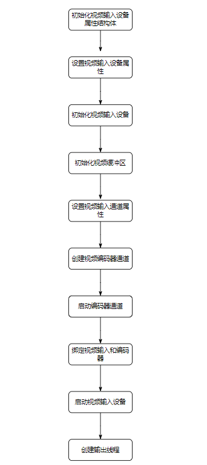

# 摄像头实验-编码视频流

硬件要求：

- DshanPI-CanMV开发板
- Type-C数据线 x2
- GC2093摄像头

开发环境：

- Ubuntu20.04


注意：在学习前请按照[《K230 SDK环境搭建》](https://eai.100ask.net/CanaanK230/part2/DshanPICanMVK230SDKEnvironmentConstruction)搭建好K230的开发环境或者直接获取资料光盘中搭建好环境的Ubuntu虚拟机。

配套源码：https://pan.baidu.com/s/1VBd0n3FKO0bj8yHOWk4HEw?pwd=ov5d 提取码：ov5d

具体位置： `12_多媒体应用示例源码\06_sample_venc_100ask` 

## 1.视频编码架构



典型的编码流程包括了输入图像的接收、图像内容的遮挡和覆盖、图像的编码、以及码流的输出等过程。

编码模块由VENC接收通道、编码通道、2D接收通道、2D运算模块组成。编码能力和2D运算能力见下表。

编码数据流程图中的绿色箭头所示路径，为单独做2D运算的流程。蓝色箭头所示路径为单独做编码运算的流程。紫色箭头所示路径为先做2D运算再进行编码的流程。

表 1-1 编码能力

|              | H264                                                         | HEVC                                                    | JPEG                                                   |
| ------------ | ------------------------------------------------------------ | ------------------------------------------------------- | ------------------------------------------------------ |
| 输入格式     | YUV420 NV12 8bit, ARGB8888, BGRA8888                         | YUV420 NV12 8bit, ARGB8888, BGRA8888                    | YUV420 NV12 8bit, YUV422 UYVY 8bit, ARGB8888, BGRA8888 |
| 输出格式     | YUV420 H.264 Baseline Profile(BP) ; H.264 Main Profile(MP) ; H.264 High Profile(HP); H.264 High 10 Profile(HP) | YUV420 HEVC (H.265) Main ; HEVC (H.265) Main 10 Profile | YUV420 and YUV422 JPEG baseline sequential             |
| 最大分辨率   | 3840x2160                                                    | 3840x2160                                               | 8192x8192                                              |
| 码率控制模式 | CBR/VBR/FIXQP                                                | CBR/VBR/FIXQP                                           | FIXQP                                                  |
| GOP          | I/P帧                                                        | I/P帧                                                   | -                                                      |
| 编码通道     | 4路                                                          | 4路                                                     | 4路                                                    |

注意：H264/HEVC/JPEG共用4路。

表1-2 2D运算能力

| video输入格式               | video输出格式 | 叠加数据格式               | 最大分辨率 |
| --------------------------- | ------------- | -------------------------- | ---------- |
| I420/NV12/ARGB8888/BGRA8888 | 同输入格式    | ARGB8888/ARGB4444/ARGB1555 | 3840x2160  |

### 1.1 编码通道

编码通道作为基本容器，保存编码通道的多种用户设置和管理编码通道的多种内部资源。编码通道完成图像叠加和编码的功能。2D模块实现图像叠加运算，编码器模块实现图像编码，两者既可以单独使用，也可以协同使用。

![encode channel](data:image/jpeg;base64,/9j/4AAQSkZJRgABAQAAAQABAAD/2wBDAAMCAgICAgMCAgIDAwMDBAYEBAQEBAgGBgUGCQgKCgkICQkKDA8MCgsOCwkJDRENDg8QEBEQCgwSExIQEw8QEBD/2wBDAQMDAwQDBAgEBAgQCwkLEBAQEBAQEBAQEBAQEBAQEBAQEBAQEBAQEBAQEBAQEBAQEBAQEBAQEBAQEBAQEBAQEBD/wAARCABYAggDASIAAhEBAxEB/8QAHQABAQACAwEBAQAAAAAAAAAAAAcGCAQFCQMCAf/EAD8QAAAFAwEEBwcBCAAHAQAAAAABAgMEBQYHEQgSWNUTFBcYIZWXFiIxVleW03cVIzc4QVG1tgklMjRCUmJh/8QAFAEBAAAAAAAAAAAAAAAAAAAAAP/EABQRAQAAAAAAAAAAAAAAAAAAAAD/2gAMAwEAAhEDEQA/APVMAAAAAAAAAAAAAAAAAAAAAAAAAAAAAAAAAAAAAAAAAAAAAAAAAE+z1VK7R8U1ybb1CcrMncaadgNsS3lyI63UpeQlERh98zNs1l7jSjL4+HxLzwu/L8NvJ0ypVvJtWhVhFRlRmHmKhOpsiLHN8jNqNDl3fCU22fRo3Wv2duGaEoNDy0K19Pbktuj3bR36BX4ypMCVoT7HSrQh5JHqaHCSZb7atNFNq1QtJmlRKSZkc1ibL+NqTZK7EtpyqUOButtsrgrZJcdpLDTC20JW0pskuIa0VqgzI1rNBoPd3Qj7j0u6ryv9mk4/zZUnjqzJxYkfIkyntzILDrCZi4KDrMfqzm+8aiSomGzb3Nzf8Un9Yd33TQbCkU122L0oS6LNuKNMbuC+5EuoxnOoOTYrC1tyJPWWVR9w+lKa06ytJdGaSNRlX6jsvYer1x1m5Lst9VzqrhKN6n3CpNUpsdwybJLkeHJSthhZdEn3kII1ama989NOpp+ydZ9MtWDbEO97tYOmOyJEOVFOnxENOuspj6nBjxG6e4hMdJspaciqaJK1GaDWe+A1K2Vsl3RcGVJtsxsjyruck0mdCahyshSHSWaIvTE+So9z1ZTKjWomzeREUlBII0uIc3m1ZHlDIOdpFwvyrUv/ACr+yJFApsqexA6w8ltTkVEhKGH6faM1phRG4rfWt5LjmpapbbJBDaOBs+1SPWGaxVc+ZBqxsqfdJl6Hb8ZCnXYxxzdUuJTGXDWTR6JPf8N1P9iGEXJsHYvuac1LqF0VV9uLHahQmqlbVr1l2LFaTutMFLqdJkzHUILwI3n3Ff8A0AvFiuy5FlUGTOqk2pSH6bHedlzeh6w8pTaVGpzoGmmt49fHcbQn+ySLwHejg0KlnRKLBoxz35vUY7cfrD7bLbjpISRbyksobaSZ6fBCEpL+iSLwHOAAAAAAAAAAAAAAAAAAAAAAAAAAAAAAAAAAAAAAAAAAAAAAAAAAAAAAAAAAAAAAAAAAAAAAAAAAAAABh98YbxDk2VGn5JxXZ92SYTZsxnq5Q4s9bCDPU0oU8hRpIz8dC8NRjXdO2WOGnFX2bTvwiqgAlXdO2WOGnFX2bTvwh3TtljhpxV9m078I7XaFumu2NgLJd62tO6lWrfs+s1SnSeiQ50EpiE6405uLJSFbq0JPRRGk9NDIy8B1XY3kXixyr5bavJgDunbLHDTir7Np34Q7p2yxw04q+zad+EOxvIvFjlXy21eTB2N5F4scq+W2ryYA7p2yxw04q+zad+EO6dsscNOKvs2nfhDsbyLxY5V8ttXkwdjeReLHKvltq8mAO6dsscNOKvs2nfhDunbLHDTir7Np34Q7G8i8WOVfLbV5MHY3kXixyr5bavJgDunbLHDTir7Np34Q7p2yxw04q+zad+EOxvIvFjlXy21eTB2N5F4scq+W2ryYA7p2yxw04q+zad+EO6dsscNOKvs2nfhGFZvtDLWNcL39kahbVOSn6latr1Wtw2pdLtdTDj8aI482lxKaQlRoNSCIyJST010MviNigEq7p2yxw04q+zad+EO6dsscNOKvs2nfhFVABKu6dsscNOKvs2nfhDunbLHDTir7Np34QzpULv8A2tjC0rSvuq2l7W3g9S6jUaXGhPSuqt0OqzSbQU2O+0nV6GxqfRmrdIyIy1DsbyLxY5V8ttXkwB3TtljhpxV9m078Id07ZY4acVfZtO/CHY3kXixyr5bavJg7G8i8WOVfLbV5MAd07ZY4acVfZtO/CHdO2WOGnFX2bTvwh2N5F4scq+W2ryYOxvIvFjlXy21eTAHdO2WOGnFX2bTvwh3TtljhpxV9m078IdjeReLHKvltq8mDsbyLxY5V8ttXkwB3TtljhpxV9m078Id07ZY4acVfZtO/CHY3kXixyr5bavJg7G8i8WOVfLbV5MAd07ZY4acVfZtO/CHdO2WOGnFX2bTvwjH6tSck41yTixl7Pt63VTbquiXRKlTa3T6ElhxhNCqkxKkqh06O8laXoTJkZOaabxGR6i6gJV3TtljhpxV9m078Id07ZY4acVfZtO/CKqADGbHxljbGUWTBxtj22rTjTXCeks0Okx4CH1kWhKWllCSUZF4an46DJgAAAAAAAAAAAAAAAAAAAAAAAAAAAAAAAAGumVtrOrYvuu9KGvENUnQbXp8J1mqza9Q6PTXZL5q3SdmTag30bajUygi6I3CVvapMjRrsWNPs/bOuXbxyJdF42NSk06LNiwiQuDdVWffqjrbqFKX1VNQpzEFxCWiR+7dX0iVEfSt++hYXXDmRb8vekyUXtYn7DqjLDcyMo58BTUyO7vdCs24kyWbJHuK0PfcSpJEolamppvJrEviDfNvu1eM201Kgy5NNqMVuQTxRZsdw23mt8iLeIlJ1JWhGaTSZpSZ6FGsY2Nlqx2K1S6Tar8OZUo9MpbdVqD8Tq8Y0ofckS0NtSHHHUNm6SEJUTa3HC8SQ3q6KFBseo4zm0v2ApTtSosiOxS6xDVJSUhJoLdbqKVOGROuFqZPJNRKWjdUnVTZNuBCl7ct5uXJIt2m4ptWoKixoUmQ9T7guCpIgnMVpHjy1wLekNxpCiNBm2tehb6dFKGcXrtQ1m0rUptRfs5lVwvtT+u0impnVgmHGphQWVJVHjE+plUlaVKc6uSujQskoNZpScCq2Ns3yq1aNbpezPk2v0+nsRmn2ZV20GnPQTJom35ECRMlS5sM1p8UtwjpSkbpbxms95FAvXCd4X1jklUvGFSZlXDGq9KrlLqqYz0t2G9V0uNxZTip7Jkno+lWb7EhxSfFaOmNRJWFU2cdoarZganUW9bQXb1xU9SyQTNNrTMKpMtdGh+QwupU+Iad19am1M++tBp94/EjO3jVfYz2bK5hSNGrlQs6l2ymVSDpblKVApCKnFJt7eaVJmwWDVPcUkySpxUgi/cpX0e+6om9qAAAHGmVOm05cVqoVCNFXOfKNFS86lBvvGlSibQRn7yt1Cz3S1PRJn/QwHJAAAAAAAAAAAAASrax/lYzJ+n9w/wCOfFVEq2sf5WMyfp/cP+OfFVAAAT3NDNWZthyux8xVTHtNpLLsiVMpcCDIkSHDIktN6zWH2901GZdGhrpFrNskrT4pWFCAa40OVm3JV7Q7YruUrjx3Nh2HSKxPg0Gn0h0jqUl6Sh43OvQ5KiIuhTohCkkXiWp/EcinZHvu8KJQmEUZ2VWp8St0eZKRWDpVCnvw33GHC6dlxyZBePoDeQ83HcJKTWg17xpUkNhgGqeFqRfc25qe+u0pluFU6c/Jbfl5zumvSUQVmppMyPAqUI4b6tejWknFEpBONqWlJqJJ6i165YsSo3FbDmZHIUJi4pziKfJvqMRxXWZKybUlMi+4rrbiXkFI3jjML6Uz1SSNGyD1mATPZtipZwhZ8w6rVak/UqXHnyJVSrMqpvPPONpNaumkyH17pn4klLqkJ10SegpgCVbWP8rGZP0/uH/HPiqiVbWP8rGZP0/uH/HPiqgAAACVZk/iLgn9QJn+q14VUSrMn8RcE/qBM/1WvCqgAANdtqHN0vHNaptr0qqt0usS7fq9YpLztbhxG3pTDO4SDYcWp2SpCXDWhlLDiFrJJqNJNmYDYkBoHiXNGTpGTKVHuzMN1u0OqS1uVlFSKe7FeY6moiTHc9j6e3H1/crStua0gzPeLfUv3sotGpWjUbZp9QrNA2hotLmVlcqSabquyrzSgPR33IK2U0moSJDbSiShJlISgyUSt9CVGgwG6gDQfL2SynY1x9b9pXhkKnVdxmppVS36vNjVx1/pCLoOrTK/R6rNfaVqhvwlJX8N1SjSZ/zEuVL/AGdqWCxkh667aKrvEmNblw3XGZmLU60pok/s964jbcjEaEuIdjU1Ti176SP3FKWG/IAACVZk/iLgn9QJn+q14VUSrMn8RcE/qBM/1WvCqgAAAAAAAAAAAm+dcsVTENs0yuUixqvdD9RrMOmdWpvVd9tDi/fWZSJDBf8AQlZJMlHoo0moiQSjKkCO7UOMrnyrYUS3rRpEaVUWqmxIblu3JPpK6cRGaVSWyhmhcpSUqVqwp5glEZ6OpUSQGKWHtP3zft9VGJAxETNrUmpJos95F127MkwpSlJQXTnFqjnRPdKo2+qG3vaJNZOmsyYOw03IMOrzqBHgU57oK6U/dceUSFtHFUST1SWpHvHrp7xaERf30LWLHOA8v2xc3W7jotUqHSXXFkNyUykrYYhpldYceV1uqyXUNESd1KGUp1Wv/t0ESnV86qbMNwVG541eqmyPs1V95h6c5Nmzaj0D9ZW8vVMiQ2mgLSlzwNRlvOe8pXvH8TCyVbLt6SapbJWLZNvVGj3BSn6s9Iq9yPU+XCZZIt9So7UKQlSdVtp16Uj3laaaFqONbGXclTk1D2osKzIS2oFOn04qZeUiSU3rjqktsmqXTopNPKSgzbQeu8o0pUbeu8UyrWBsg1iu45uVGI7CZrNGgtwpc6Q80+1baWppKabgR0NNk8z0JqQskKiGpr46qPoy49n4Guyy7ruI6ThKwqbu0lyjt1W1bMpVAg1ZuU/EM1dVVUJa3+gQ2+o+skyRme6lC941AKMe0hcyrsm0NnZ0vh2lwpyaSdWKtW4ht2epw0ky2lypp3/dIj0JRukZ7qmkqHb5E2krExpXo9Ar8Ssm65UWYDz0elyZTbRKZJ5xZnGbdMiaStk1mskJLpU6KPRWkmuXZ7jtyWr+a2U8e1yqypb9Ul01u27eVNNx2UZtIckPJbSp1CFJW6tLp6mlzcW4e7vZHeWz7e90UCmS5FTgN3BIqVTkVY4sbpmktTNCI0Et1ozNplllok73xMj1MknvBlNE2o7BujNr+E7SXCuKZGa35FQpNyUd5ERaSc6Zp+KqWmZvNqbJKuiYdJJuJ3t3Q9LKIBjO0cwQbqok667UKFbcWU5Jp7RVdp+fC6WPIJaZsZP7hn33zI1RpMreMmy3SI1LTfwAB8J06FTIUipVKYxEiRGlvyJD7hNtstpIzUtaj0JKSIjMzPwIiH0adafaQ+w4lxtxJLQtBkaVJMtSMjL4kA/YAADj1BqY/Aks06WiLLcZWlh9bXSpacNJklZo1LeIj0Pd1LXTTUviJl7H7Sf10sz0/d5mKqACVex+0n9dLM9P3eZh7H7Sf10sz0/d5mKqACVex+0n9dLM9P3eZh7H7Sf10sz0/d5mKqACVex+0n9dLM9P3eZj8ps3aUSWh52s5XiZ6qsB3XxP4eFSLwL4F/8Anx1PxFXABKvY/aT+ulmen7vMw9j9pP66WZ6fu8zFVABKvY/aT+ulmen7vMxrZt/Yv2hLuwIVpqrtOyBWKrXYDNCp1CsR+PKjziUpfWutFOdTFShlL+rqkbuit0zTvbxb0AA1g2G8W7W+M7LXD2m8qxbhbWwhNNo6y65Npx6kZ9NP1/eaFqnc/eEXgZOFpujZ8AAAAAAAAAAAASrax/lYzJ+n9w/458VUSrax/lYzJ+n9w/458VUAE+yfiFWS6pb1ZZyNdFrSraedkwzo7VNebU8tO70q258SSjpEp3iQtKUqSS16H7xiggAk9YwPVKjX2brpmd8hUOtnRI9Dnz4DFEUupNMrcWh11L9OcQh3eecMzZS0nx8EloQ4V27O71SodJt2yb+mW5S6DTZUGJTnIvWo8xyShbch2c6Tjcx01JWZkbEmOvfUpSlr1IisoANeLG2Y7qtm56fcNbuXHlRfjMOw5NXi2nWGbkkRVtqQbP7akVyRK3S3i0Jw3CTup3SSaUKT96Nsg0OmWxUaU5lHJKKnLN5UWTAv+5Y0SnqUR7vQxjqazURH76ukdWalqWeqUmSE7AAAx2wrDt7GttR7StY6p+zopmbSajV5lSdRr/4k9Ldcc3S/one3S/oRDIgABKtrH+VjMn6f3D/jnxVRKtrH+VjMn6f3D/jnxVQAAABKsyfxFwT+oEz/AFWvCqiVZk/iLgn9QJn+q14VUAGAZVxFGywxCg1W77hp8CLJjyHIFPnORo8km3SWtLxMmhTyXEatqbdUtndPXo98iWWfgA1yt/YnxzaN8WhflqU61qfVKFJKXVZibWYKbUHSaSjeZkNrQqOalpNThqJ41k44Xgat4dnD2TLYVb1Up16u23kWouNNpoki97Qg1KPRlIQpKUNsNk0a2S1L3TcJ0yLRTyvAyvQANbLu2LaLkKyaPad3XbAS5THKrKUunWhS1w+sTVpUXQRKi1MRGabJO6kkH0pF8Hk+OvfWtsoW9a+ZEZraubp6wb6lus+z9Lb32jhJjEjraI5Tj03SXouStv8AoTZaJNN1AAAAASrMn8RcE/qBM/1WvCqiVZk/iLgn9QJn+q14VUAAAAAAAAAABN65a2e5VXmSbezDa1PprrylRYsmynJTrLZn4IU6U9slmX/tuJ1/sOF7H7Sf10sz0/d5mKqACVex+0n9dLM9P3eZh7H7Sf10sz0/d5mKqACVex+0n9dLM9P3eZh7H7Sf10sz0/d5mKqACUFZu0oSjV27WcepEW77AO6F8fEv+Za6nr/f+hfDx1/XsftJ/XSzPT93mYqoAJV7H7Sf10sz0/d5mHsftJ/XSzPT93mYqoAIPke1s6Rse3PIurLFp1qit0eaqpU1jGz8lybF6FfSsJaTUtXDWjeSSS8T10Gqf/Dl2etuzHUqBWL5vdyzscKX0yrPrSTmynmj8d1phR6wddTIzNSVkZFq2oh6SAAAAAAAAAAAAAAAAAAAAAAAAAAAAAAAAAAAAAADH8hWVSslWBcuOa7IlsU26qPNokx2ItKX22JLK2XFNqUlSSWSVmZGaVFrpqR/AYV2N5F4scq+W2ryYVUAEq7G8i8WOVfLbV5MHY3kXixyr5bavJhVQASrsbyLxY5V8ttXkwdjeReLHKvltq8mFVABKuxvIvFjlXy21eTB2N5F4scq+W2ryYVUAEq7G8i8WOVfLbV5MHY3kXixyr5bavJhVQARS7NnK6L5tWs2VdO1HlWbRbgp8il1GN1K2G+nivtqbdb30UdK07yFqLVJkotdSMj8RawAAAAAYVk7GLeSm7ceZvS4LVqVq1g63TalREwlPtvqhSoakqTMjyGVIUzNeIyNvXXdMjLQY/2N5F4scq+W2ryYVUAEq7G8i8WOVfLbV5MHY3kXixyr5bavJhVQASrsbyLxY5V8ttXkwdjeReLHKvltq8mFVABKuxvIvFjlXy21eTB2N5F4scq+W2ryYVUAEq7G8i8WOVfLbV5MHY3kXixyr5bavJhVQASqn4Lq3tfbF23bnbIF2+yVQeqlOp1Uj0NmL1pyFJhG4s4VOYdVozMf0LpCTvGRmR6CqgAAAAAAAAAAAAAAAAAAAAAAAAAAAAAAAAAAAAAAAAAAAAAAAAAAAAAAAAAAAAAAAAAw++MqWxj6VGh16l3hKcltm62dDs2r1pCSI9DJa4EZ5LZ//KzIzLxItBjXeWx18uZV9J7q5cAAHeWx18uZV9J7q5cHeWx18uZV9J7q5cAAHeWx18uZV9J7q5cHeWx18uZV9J7q5cAAHeWx18uZV9J7q5cHeWx18uZV9J7q5cAAHeWx18uZV9J7q5cHeWx18uZV9J7q5cAAHeWx18uZV9J7q5cHeWx18uZV9J7q5cAAHeWx18uZV9J7q5cHeWx18uZV9J7q5cAAHeWx18uZV9J7q5cHeWx18uZV9J7q5cAAHeWx18uZV9J7q5cHeWx18uZV9J7q5cAAHeWx18uZV9J7q5cHeWx18uZV9J7q5cAAHeWx18uZV9J7q5cHeWx18uZV9J7q5cAAHeWx18uZV9J7q5cHeWx18uZV9J7q5cAAHeWx18uZV9J7q5cHeWx18uZV9J7q5cAAHeWx18uZV9J7q5cHeWx18uZV9J7q5cAAHeWx18uZV9J7q5cHeWx18uZV9J7q5cAAMvsfIVByDFkzKDAuWK3EcJpwq5bFSoq1GZakaET2GVOF/dSCMiPwM9RkwAAAAAAAAAAAAAAAAAAAAAAAAAAAAD//2Q==)


## 2.应用层程序编译与解析

### 2.1 新增程序

#### 2.1.1 新建工程文件夹

在k230_sdk/src/big/mpp/userapps/sample目录下新建工程

```
mkdir sample_venc_100ask
```

#### 2.1.2 修改Makefile

修改k230_sdk/src/big/mpp/userapps/sample目录下的Makefile文件，新增sample_venc_100ask工程的编译规则

```
@cd sample_venc_100ask; make || exit 1
```



```
@cd sample_venc_100ask; make clean
```



#### 2.1.3 进入工程目录

```
cd sample_venc_100ask/
```

#### 2.1.4 新建源码文件

```
vi sample_venc_100ask.c
```

填入源码。

#### 2.1.5 新建Makefile文件

```
vi Makefile
```

填入一下内容：

```
include $(MPP_SRC_DIR)/userapps/sample/mpp.mk
include $(MPP_SRC_DIR)/userapps/sample/rt-smart.mk

CURRECT_DIR_NAME=$(shell basename `pwd`)
LOCAL_SRC_DIR = $(shell pwd)
BIN = $(MPP_SRC_DIR)/userapps/sample/elf/$(CURRECT_DIR_NAME).elf
LIBPATH = $(MPP_LIB_PATH)
LIBS = $(MPP_LIBS)

LOCAL_CFLAGS = -I$(LOCAL_SRC_DIR)

SRCS = $(wildcard $(LOCAL_SRC_DIR)/*.c)

OBJS = $(patsubst %.c,%.o,$(SRCS))

all: $(BIN)
        @-rm -f $(OBJS)
        echo "${PWD}/Makefile all"

$(OBJS): %.o : %.c
        @$(CC) $(CC_CFLAGS) $(LOCAL_CFLAGS) $(BSP_CFLGAS) $(RTSMART_CFLAGS) $(MPP_USER_CFLGAS) -c $< -o $@

$(BIN): $(OBJS)
        $(CC) -o $(BIN) $(LINKFLAG) -Wl,--whole-archive -Wl,--no-whole-archive -n --static $(OBJS) -L$(LIBPATH) -Wl,--start-group $(LIBS) -Wl,--end-group

clean:
        echo "${PWD}/Makefile clean"
        -rm -rf $(BIN)
        -rm -f $(OBJS)

.PHONY: all clean
```

### 2.2 程序编译

1.进入K230SDK目录

```
cd ~/k230_sdk
```

2.下载toolchain和准备源码

```
source tools/get_download_url.sh && make prepare_sourcecode
```

3.挂载工具链目录

```
sudo mount --bind $(pwd)/toolchain /opt/toolchain
```

4.配置板级型号

```
make CONF=k230_canmv_dongshanpi_defconfig prepare_memory	
```

5.编译程序

```
make mpp-apps
```

等待编译完成，编译完成后，可执行程序`sample_venc_100ask.elf`会生成在`k230_sdk/src/big/mpp/userapps/sample/elf`目录下。

使用ADB将可执行程序传输至开发板中

```
adb push src/big/mpp/userapps/sample/elf/sample_venc_100ask.elf /sharefs/app
```

### 2.3 程序运行

使用串口软件访问开发板的大核串口终端。

> 如果没有关闭开机自启程序，可按下q+回车键可退出开机自启程序。

1.进入可执行文件目录

```
cd /sharefs/app
```

2.运行程序

```
./sample_venc_100ask.elf
```

执行完成后效果如下所示：



3.输入`q`并按下回车即可退出程序。

### 2.4 程序解析

代码流程图如下所示：



#### 2.4.1 初始化视频输入设备

```
// 初始化视频输入设备属性结构体
memset(&dev_attr, 0, sizeof(k_vicap_dev_attr));
// 初始化视频输入通道属性结构体
memset(&chn_attr, 0, sizeof(k_vicap_chn_attr));
// 初始化传感器信息结构体
memset(&sensor_info, 0, sizeof(k_vicap_sensor_info));
// 设置传感器类型
sensor_info.sensor_type = GC2093_MIPI_CSI2_1920X1080_30FPS_10BIT_LINEAR;
ret = kd_mpi_vicap_get_sensor_info(sensor_info.sensor_type, &sensor_info);
```

#### 2.4.2 设置视频输入设备属性

```
dev_attr.acq_win.width = sensor_info.width;   // 480
dev_attr.acq_win.height = sensor_info.height; // 800
dev_attr.mode = VICAP_WORK_ONLINE_MODE;
```

#### 2.4.3 初始化视频输入设备

```
ret = kd_mpi_vicap_init(vicap_dev);
```

#### 2.4.4 初始化视频缓冲区

```
sample_vb_init(K_FALSE); 
```

#### 2.4.5 设置视频输入通道属性

```
attr.venc_attr.pic_width = width;  // 宽
attr.venc_attr.pic_height = height; // 高
attr.venc_attr.stream_buf_size = STREAM_BUF_SIZE; // 流缓冲区大小
attr.venc_attr.stream_buf_cnt = OUTPUT_BUF_CNT;  // 流缓冲区数量

attr.rc_attr.rc_mode = rc_mode;  
attr.rc_attr.cbr.src_frame_rate = 30;
attr.rc_attr.cbr.dst_frame_rate = 30;
attr.rc_attr.cbr.bit_rate = bitrate;

attr.venc_attr.type = type;   // 编码类型
attr.venc_attr.profile = profile;
```

#### 2.4.6 创建视频编码器通道

```
ret = kd_mpi_venc_create_chn(ch, &attr);
```

#### 2.4.7 启动编码器通道

```
ret = kd_mpi_venc_start_chn(ch);
```

#### 2.4.8 绑定视频输入和编码器

```
static void sample_vi_bind_venc(k_u32 chn_id)
{
    k_mpp_chn venc_mpp_chn;
    k_mpp_chn vi_mpp_chn;
    k_s32 ret;

#ifdef ENABLE_VDSS
    vi_mpp_chn.mod_id = K_ID_VICAP;
#else
    vi_mpp_chn.mod_id = K_ID_VI;
#endif

    venc_mpp_chn.mod_id = K_ID_VENC;  // 视频编码器通道模块ID
    venc_mpp_chn.dev_id = 0;	      // 视频编码器通道设备ID
    venc_mpp_chn.chn_id = chn_id;     // 视频编码器通道ID

    vi_mpp_chn.dev_id = chn_id;
    vi_mpp_chn.chn_id = chn_id;
    ret = kd_mpi_sys_bind(&vi_mpp_chn, &venc_mpp_chn);
    if (ret)
    {
        printf("kd_mpi_sys_bind failed:0x%x\n", ret);
    }

    return;
}
```

#### 2.4.9 启动视频输入设备

```
void sample_vicap_start(k_u32 ch)
{
#ifdef ENABLE_VDSS
    k_s32 ret;
    ret = kd_mpi_vdss_start_pipe(0, ch);
    CHECK_RET(ret, __func__, __LINE__);
#else
    k_s32 ret;

    ret = kd_mpi_vicap_start_stream(VICAP_DEV_ID_0);
    CHECK_RET(ret, __func__, __LINE__);
#endif
}
```

#### 2.4.10 创建输出线程

```
pthread_create(&g_venc_conf.output_tid, NULL, output_thread, &info);
```

