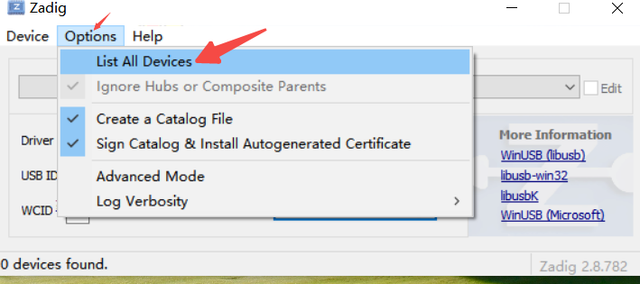

# K230 场景实战-dpu深度相机POC

## 1.K230 dpu深度相机

将k230设备模拟成一台深度相机，将内部dpu模块处理的深度图实时传输到pc机电脑，支持多种数据传输格式，支持多K230设备，支持stream/snap功能，stream性能达720p@10fps。

### 1.1 硬件环境

- K230-USIP-LP3-EVB-V1.0/K230-USIP-LP3-EVB-V1.1/CanMV-k230-V1.0/CanMV-k230-V1.1 * 1个
- 指定的sensor模组一个
- 一台windows系统pc电脑
- typeC线两根

## 2.概述

dpu深度相机POC支持如下功能:

- PC端支持多种格式图像捕获：如彩色图，深度图,散斑图，红外图等。
- 支持stream/snap捕获方式：可捕获实时数据流或某一帧图像。
- PC端可连接多个k230设备，支持多k230设备图像同时捕获。
- 传输性能:stream模式每台k320设备性能达720p@10fps。
- 帧率控制:可设置每秒传输帧数。

## 3.使用说明

1. 编译烧录镜像：编译命令为`make CONF=k230_evb_dpu_depth_camera_defconfig`，生成的镜像在`output/k230_evb_dpu_depth_camera_defconfig/images/sysimage-sdcard.img`，烧录该镜像，启动后自动运行dpu深度相机程序。
2. 在PC电脑上更新k230设备uvc驱动为”WinUSB”驱动：参考后面章节介绍。
3. PC端执行：先将k230_sdk/src/common/cdk/user/thirdparty/windows_uvc/lib_uvc/bin/x64/release目录文件下载到pc电脑，后执行该文件夹下run.bat文件，可通过修改批处理文件内容，来执行不同功能。 run.bat文件使用test_uvc.exe命令来执行不同功能，test_uvc.exe执行命令如下

```
Usage: grab stream frame Usage: %s -s 0 -m 0 -f ./bin/0702/H1280W720.bin -t 0 -a 19 -b 20 -n "0701".
       snap frame  Usage: %s -s 1 -m 1 -f ./bin/0702/H1280W720.bin -t 0.
       transfer file Usage: % s -m 2 -i ./bin/H1280W720_conf.bin -o /sharefs/H1280W720_conf.bin.
          -s <local filepathname>: save frame data to local file
          -m <work mode>: work mode. 0:grab data,  1:snap data, 2:tranfer file
          -i <local filepathname>: transfer local filename.
          -o <remote filepathname>: k230 receive filename.
          -f <ref/cfg filepathname>: k230 update ref/cfg file.
          -t <dpu image mode>: dpu image mode.
          -r <fps>: set fps.
          -a <sensor type0>:sensor type0,default is 20,see vicap doc.
          -b <sensor type1>:sensor type1,default is 19,see vicap doc.
          -n <init serialnumber>:init seialnumber,default is 0701.
          -d <gdma rotate>:0: Rotate 0, 1: Rotate 90, 2: Rotate 180, 3:Rotate 270. evb Rotate 90 and canmv Rotate 270.
```

## 4.更新驱动

将k230_sdk/src/common/cdk/user/thirdparty/windows_uvc/lib_uvc/bin/x64/release目录文件下载到pc电脑后，请先更新windows下的uvc驱动后再运行批处理脚本。

- 确保k230大小核正常启动，并将其模拟成usb device 设备。使用typeC线将k230 otg口与电脑usb口相连接。
- 双击release目录下的zadig-2.8.exe软件，打开后点击菜单栏：Options->List All Devices,选中该项。  
- 从下拉列表中选择K230 uvc设备,名称为“UVC Camera（interface 0）”. 
- 如果未更新该设备的windows驱动，windows会默认安装“usbvideo”驱动，此时需将其替换成“WinUSB”驱动。点击按钮”Replace Driver”替换驱动。   
- 如上图所示，表示成功安装“WinUSB”驱动。此时再从下拉列表中选择K230 uvc设备,名称为“UVC Camera（interface 0）”，会显示出当前安装的驱动为“WinUSB”驱动。 

## 5.功能演示

- 获取k230设备深度图和彩色图 将run.bat修改成如下命令,请将H1280W720.bin替换成sensor模组相匹配的文件。会在./data文件夹下实时生成深度图和彩色图图片。

  ```
  test_uvc.exe -m 0 -s 1 -a 36 -b 35 -f "./bin/canmv/05/H1280W720.bin" -t 0 -n "2405-05"
  ```

- 每秒抓取一张k230设备深度图和彩色图，请将H1280W720.bin替换成sensor模组相匹配的文件。会在./data文件夹下每个一秒生成深度图和彩色图图片。

  ```
  test_uvc.exe -m 1 -s 1 -a 36 -b 35 -f "./bin/canmv/05/H1280W720.bin" -t 0 -n "2405-05"
  ```

- 帧率控制，设置每秒传输2帧。

  ```
  test_uvc.exe -m 1 -s 1 -a 36 -b 35 -f "./bin/canmv/05/H1280W720.bin" -t 0 -n "2405-05" -r 2
  ```
