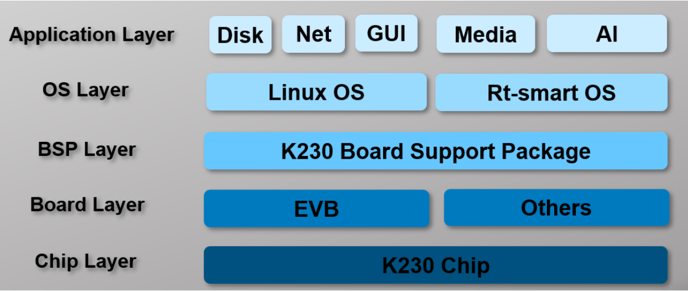
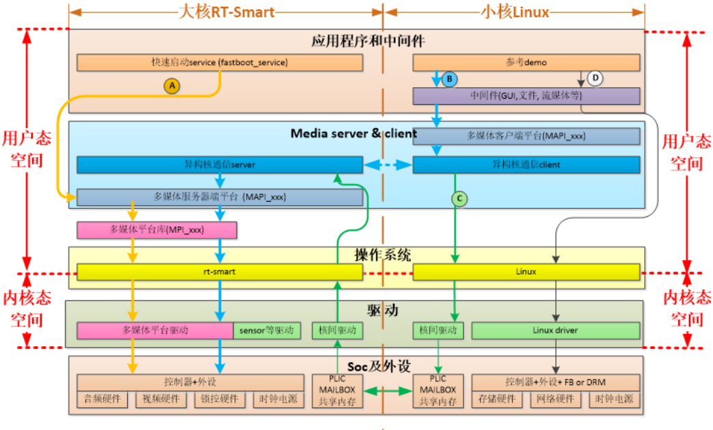

# 2 开发基础

本章帮助用户熟悉K230软件开发的基础底层工具，对K230_SDK和nncase进行简单介绍，帮助用户熟悉SDK环境搭建、镜像编译烧录、kmodel转换的过程。

## 2.1 K230 SDK

### 2.1.1. K230 SDK 简介

K230 SDK 是面向K230 开发板的软件开发包，包含了基于Linux&RT-smart 双核异构系统开发需要用到的源代码，工具链和其他相关资源。源码地址：[kendryte/k230_sdk: (github.com)](https://github.com/kendryte/k230_sdk) 或 [kendryte/k230_sdk: (gitee.com)](https://gitee.com/kendryte/k230_sdk)。

K230 SDK软件架构层次如图所示：

## 2.2. nncase简介

### 2.2.1. nncase介绍

`nncase`是面向 AI 加速器的神经网络编译器，用于为 `Kendryte`系列芯片生成推理所需要的模型文件 `.kmodel`，并提供模型推理所需要的 `runtime lib`。

本教程主要包括以下内容：

1. 使用 `nncase`完成模型编译，生成 `kmodel`。
2. 在PC和开发板上执行 `kmodel`推理。

#### 2.2.1.1. 原始模型说明

`nncase`目前支持 `tflite`、`onnx`格式的模型，更多格式的支持还在进行中。

> Tips：
>
> 1. 对于TensorFlow的`pb`模型,请参考官方文档将其转换为`tflite`格式。注意不要设置量化选项,直接输出浮点模型即可。如果模型中存在quantize和dequantize算子,则属于量化模型，目前不支持。
> 2. 对于PyTorch的`pth`等格式模型,需使用`torch.export.onnx`接口导出`onnx`格式。

#### 2.2.1.2. 编译参数说明

进行模型编译前,您需要了解以下关键信息:

1. `KPU`推理使用定点运算。因此在编译模型时,必须配置量化相关参数,用于将模型从浮点转换为定点。详见 `nncase`文档中的PTQTensorOptions说明。
2. `nncase`支持将前处理层集成到模型中，这可以减少推理时的前处理开销。相关参数和示意图见 `nncase`文档的CompileOptions部分。

#### 2.2.1.3. 编译脚本说明

本[Jupyter notebook：(github.com)](https://github.com/kendryte/nncase/blob/master/examples/user_guide/k230_simulate-ZH.ipynb)或[Jupyter notebook：(gitee.com)](https://gitee.com/kendryte/nncase/blob/master/examples/user_guide/k230_simulate-ZH.ipynb)分步骤详细描述了使用nncase编译、推理kmodel的流程，notebook内容涵盖:

- 参数配置:介绍如何正确配置编译参数,以满足实际部署需求；

- 获取模型信息:说明从原始模型中获取网络结构、层信息等关键数据的方法；

- 设置校正集数据:阐述如何准备好校正集样本数据，包括单输入和多输入模型两种情况，以用于量化校准过程；

- 设置推理数据格式:讲解推理部署时如何配置输入数据，支持不同需求场景；

- 配置多输入模型:介绍处理多输入模型时,如何正确设置每个输入的形状、数据格式等信息；

- PC模拟器推理:说明如何在PC上利用模拟器推理`kmodel`，这是验证编译效果的关键步骤；

- 比较推理结果:通过与不同框架(TensorFlow、PyTorch等)的推理结果比较,验证kmodel的正确性；

  以上步骤系统地介绍了模型编译的全流程,既适合初学者从零开始学习,也可作为经验丰富用户的参考指南。