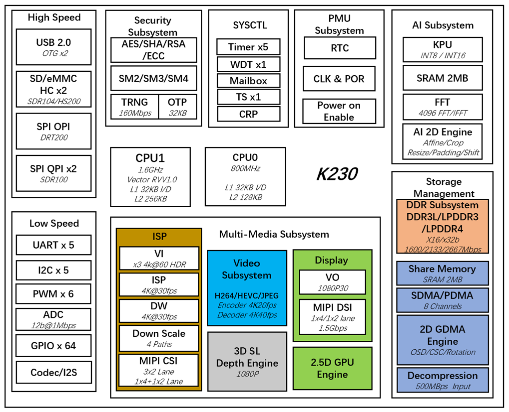
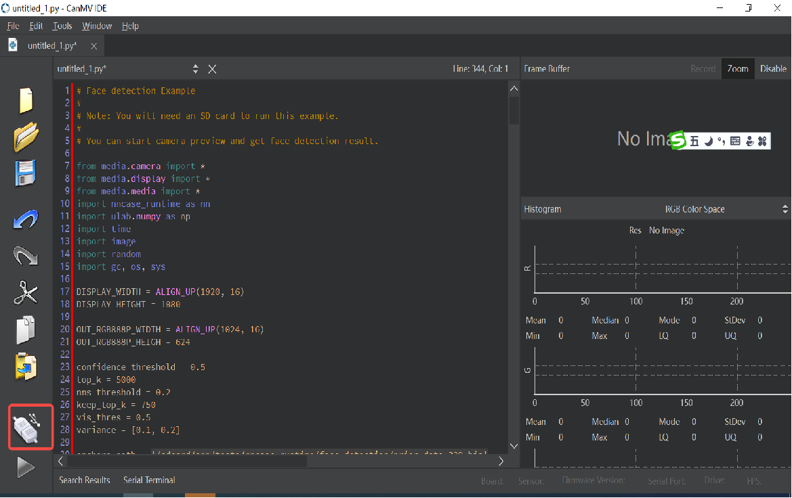
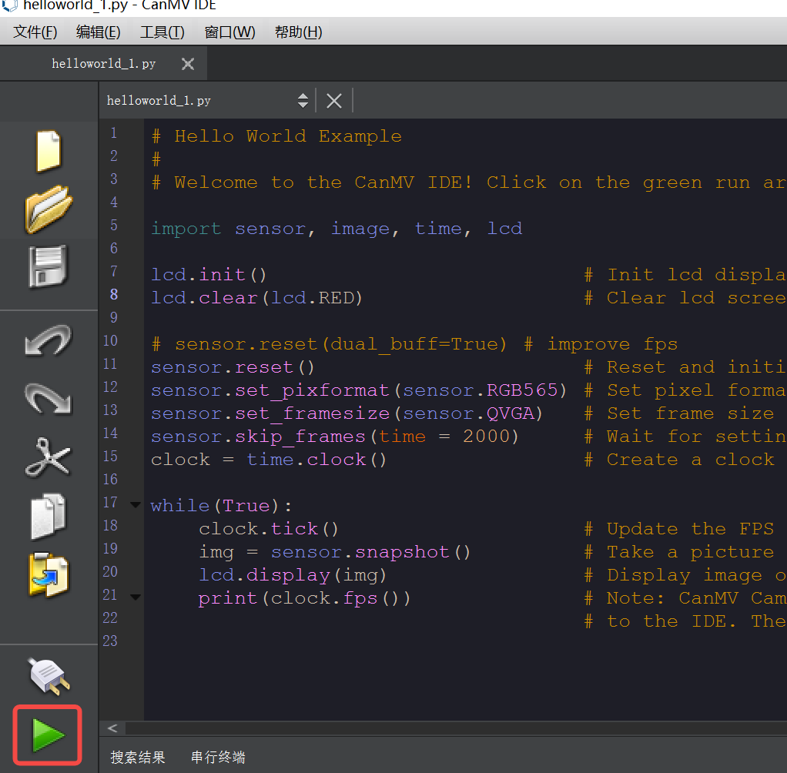
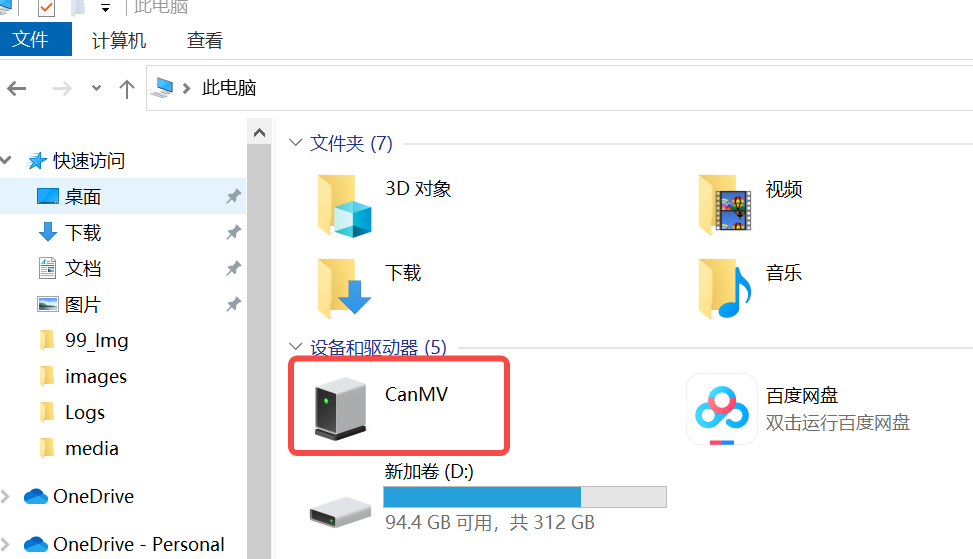

# CanMV-K230 快速入门指南

## 1. 开发板概况

CanMV-K230开发板采用的是嘉楠科技Kendryte®系列AIoT芯片中的最新一代SoC芯片K230。该芯片采用全新的多异构单元加速计算架构，集成了2个RISC-V高能效计算核心，内置新一代KPU（Knowledge Process Unit）智能计算单元，具备多精度AI算力，广泛支持通用的AI计算框架，部分典型网络的利用率超过了70%。

该芯片同时具备丰富多样的外设接口，以及2D、2.5D等多个标量、向量、图形等专用硬件加速单元，可以对多种图像、视频、音频、AI等多样化计算任务进行全流程计算加速，具备低延迟、高性能、低功耗、快速启动、高安全性等多项特性。



## 2. CanMV-K230默认套件

CanMV-K230开发板默认套件包含以下物品：

1、CanMV-K230主板 x 1

2、GC2093摄像头 x 1

3、Type-C数据线 x 1 (micropython需要2根Type-C数据线，请用户自行准备1根)

另外，需要用户准备以下配件：

1、TF卡， 用于烧写固件，启动系统（必须）

2、带HDMI接口的显示器及HDMI连接线，显示器要求支持1080P30，否则无法显示

4、Type-C数据线

## 3. 固件获取及烧录

### 3.1 固件获取

CanMV-K230 固件下载地址： https://pan.baidu.com/s/1VBd0n3FKO0bj8yHOWk4HEw?pwd=ov5d 提取码：ov5d

> 注意：请烧录10_Micropython系统固件目录中的固件，请选择您对应内存固件版本进行烧录。

CanMV源码下载地址如下：

```
https://github.com/canmv-k230/superproject_k230_rtsmart/
```


### 3.2 固件烧录

将固件通过电脑烧写至TF卡中。

#### 3.2.1 Linux下烧录

在TF卡插到宿主机之前，输入：

```
ls -l /dev/sd\*
```

查看当前的存储设备。

将TF卡插入宿主机后，再次输入：

```
ls -l /dev/sd\*
```

查看此时的存储设备，新增加的就是TF卡设备节点。

假设/dev/sdc就是TF卡设备节点，执行如下命令烧录TF卡：

```
sudo dd if=sysimage-sdcard.img of=/dev/sdc bs=1M oflag=sync
```

#### 3.2.2 Windows下烧录

Windows下可通过rufus工具对TF卡进行烧录（rufus工具下载地址 `http://rufus.ie/downloads/`）。

1）将TF卡插入PC，然后启动rufus工具，点击工具界面的”选择”按钮，选择待烧写的固件。


2）点击“开始”按钮开始烧写，烧写过程有进度条展示，烧写结束后会提示“准备就绪”。

   

## 4. USB连接

使用两条Type-C线连接CanMV-K230的位置，线另一端连接至电脑。这时请注意把第3步烧录好的TF卡插到板子上。


### 4.1 Windows

查看设备管理器


- `USB-Enhanced-SERIAL-A CH342（COM80）`为小核linux调试串口
- `USB-Enhanced-SERIAL-B CH342（COM81）`为大核rt-smart调试串口
- `USB串行设备（COM75）`为micropython REPL串口 是CanMV-IDE需要连接的串口。如果没有这个设备，请确定两个USB口都与电脑连接，TF卡烧录的固件是否为“CanMV-K230_micropython”开头的固件。

### 4.2 linux

Linux串口显示如下：

- `/dev/ttyACM0`为小核linux调试串口
- `/dev/ttyACM1`为大核rt-smart调试串口
- `/dev/ttyACM2`为micropython REPL串口 是CanMV-IDE需要连接的串口。如果没有这个设备，请确定两个USB口都与电脑连接，TF卡烧录的固件是否为“CanMV-K230_micropython”开头的固件。

## 5. CanMV-IDE下载

下载地址 : https://www.kendryte.com/resource 下载最新的CanMV IDE

## 6. 启动系统

将烧好固件的TF卡插入CanMV-K230 TF卡插槽，Type-C线连接电脑和板端的POWER口，板子即上电，系统开始启动。(**注意：这里两个USB口都要连接电脑，否则板子无法与IDE联通**) 

### 6.1 连接开发板

打开CanMV-IDE，连接开发板如下图所示 

点击左下角红框按钮。



左下角图标变为绿色三角，即为连接成功。

### 6.2 运行python

在 [kendryte/k230_canmv](https://github.com/kendryte/k230_canmv/tree/main/tests) 下载测试程序，通过IDE加载。(**V0.5版本之前，0.5版本后建议使用虚拟U盘**)


点击打开按钮，选择下载的文件，打开。 点击左下角的绿色按钮运行，等待一会儿，显示器会显示sensor采集的图像，该程序为人脸检测程序，可以看到人脸被框出。

(**V0.5版本之后已经支持虚拟U盘功能，可以直接打开TF卡中的示例**)

查看“我的电脑”或“此电脑”，在设备和驱动器中会出现“CanMV”设备。 

建议使用虚拟U盘里面的示例。  

