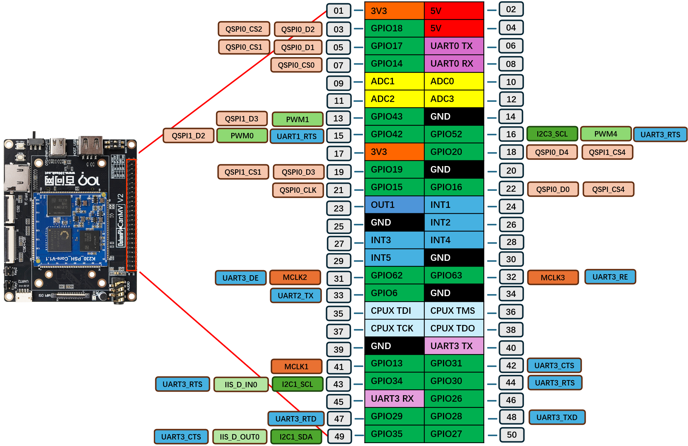

#  GPIO 与 FPIOA 详解

GPIO 与 FPIOA 的区别:

|              | GPIO             | FPIOA                           |
| ------------ | ---------------- | ------------------------------- |
| 功能         | 直接控制高低电平 | 动态映射引脚到功能              |
| 使用芯片     | 所有 MCU 通用    | 主要用于 K210                   |
| 作用         | 输入输出信号     | 映射 UART、PWM、SPI、I2C 等功能 |
| 是否固定功能 | 固定             | 可配置                          |

## 1.GPIO

**GPIO 全称：General Purpose Input/Output**
 翻译：通用输入输出引脚

它是**微控制器对外通信最常用的接口之一**，能用来接收外部输入信号（如按钮）、或者输出信号（控制LED、蜂鸣器等设备）。

🔹 GPIO 特点：

- 可以**设置为输入或输出**
- 输入模式：读取电平（高/低）
- 输出模式：设置电平（高/低）
- 可控制外设、检测开关、实现通信

## 2. FPIOA

**FPIOA 全称：Field Programmable IO Array**
 翻译：现场可编程 IO 阵列

这是 K210 芯片（如 MAIXDUINO、Sipeed）特有的功能，其他一般 MCU 没有。

FPIOA 就像一个**多功能路由器**，你可以把一个固定的 **物理引脚** 映射（绑定）成不同的功能，例如：

- UART（串口）
- SPI（总线）
- GPIO
- PWM（脉宽调制）
- I2C
- 麦克风、摄像头等功能接口

🔹 FPIOA 的意义是：

> 一个 K230 的引脚不是固定功能，而是由你“动态配置”的！

## 3.开发板的拓展引脚

排针处的GPIO电平都是3.3V，这些还可复用为IIC，SPI，PWM，PDM，IIS等功能。