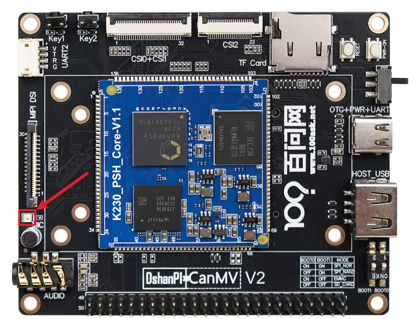
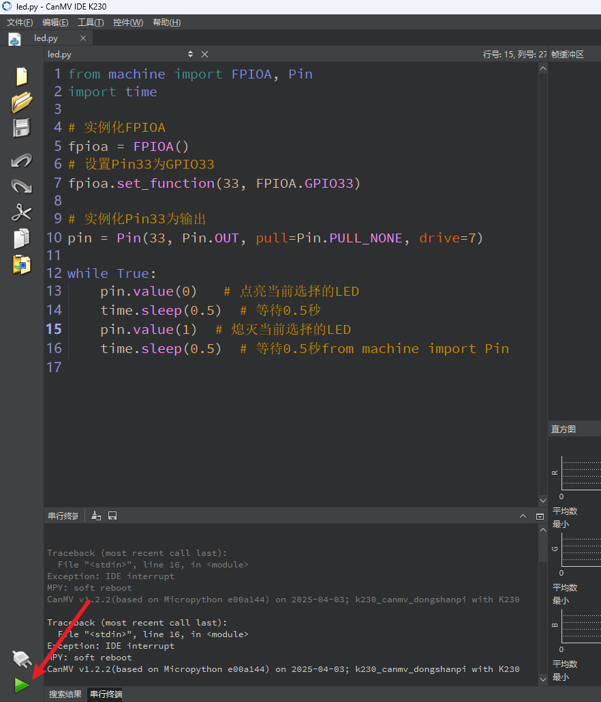
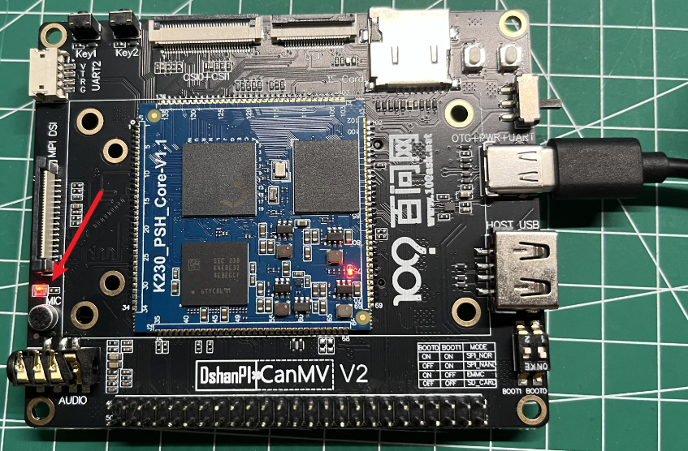

# 点亮一个GPIO灯

在这篇文章中，我们将通过一个简单的示例来学习如何用 MicroPython 控制 GPIO 引脚点亮一个 LED 灯。


## 1.硬件电路

1.  LED 的正极（长脚）连接到开发板的一个 GPIO 引脚（如 GPIO33）
2. LED 的负极（短脚）通过电阻接地（GND）

我们可以通过查看开发板原理图，可知：


慢闪LED灯在开发板中的位置：


当GPIO33为高电平时，慢闪灯会被点亮。

## 2.实验解析

​	FPIOA 是 K230 的一项功能，它允许你将某个物理引脚动态配置为 UART、I2C、SPI、PWM、GPIO 等多种功能之一。每个引脚同一时刻只能映射为一个功能，但用户可以自由选择映射方式。

这意味着你可以：

- 把 UART 的 TX/RX 映射到你希望的任意引脚；
- 把 PWM 输出映射到靠近电机的引脚；
- 或者，像我们这篇文章的例子一样，把一个 GPIO 功能映射到指定引脚，来点亮一个灯。

### 导入模块

```
from machine import FPIOA, Pin
import time
```

### 构造函数

```
fpioa = FPIOA()
```

### 设置引脚功能

```
fpioa.set_function(33, FPIOA.GPIO33)
```

### 实例化Pin33用于控制LED

```
pin = Pin(33, Pin.OUT, pull=Pin.PULL_NONE, drive=7)
```

### 控制PIN

```
#输出低电平
pin.value(0)
#输出高电平
pin.value(1)
```

## 3.示例代码

```
'''
本程序遵循GPL V3协议, 请遵循协议
实验平台: DshanPI CanMV
开发板文档站点	: https://eai.100ask.net/
百问网学习平台   : https://www.100ask.net
百问网官方B站    : https://space.bilibili.com/275908810
百问网官方淘宝   : https://100ask.taobao.com
'''
from machine import FPIOA, Pin
import time

# 实例化FPIOA
fpioa = FPIOA()
# 设置Pin33为GPIO33
fpioa.set_function(33, FPIOA.GPIO33)

# 实例化Pin33为输出
pin = Pin(33, Pin.OUT, pull=Pin.PULL_NONE, drive=7)

while True:
    pin.value(0)   # 点亮当前选择的LED
    time.sleep(0.5)  # 等待0.5秒
    pin.value(1)  # 熄灭当前选择的LED
    time.sleep(0.5)  # 等待0.5秒from machine import Pin
```


## 4.运行结果

连接开发板后在CanMV IDE K230中运行示例代码：



运行成功后可以看到板载的慢闪灯亮起：

