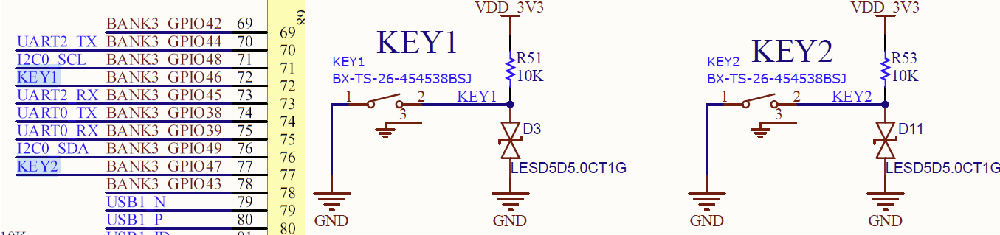
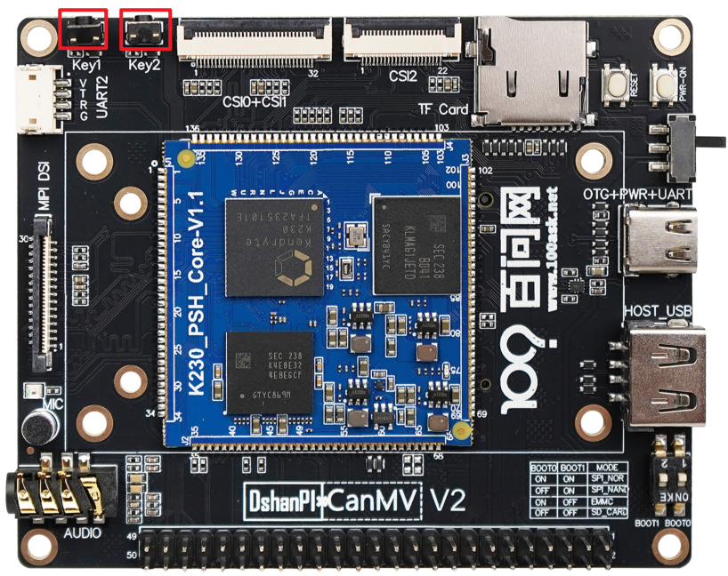
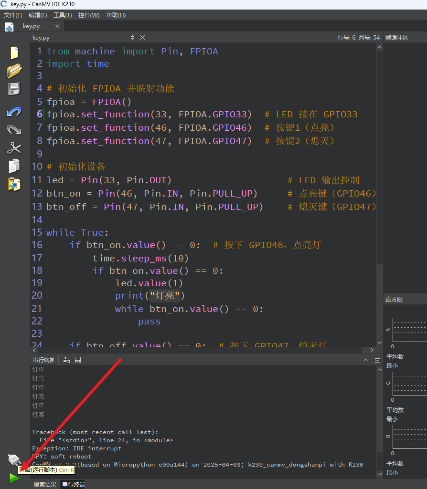

# Key 按键

## 1.实验目的

通过本实验，掌握以下技能：

- 理解 FPIOA 的作用和使用方法
- 掌握 GPIO 引脚输入与输出的配置方式
- 实现通过两个按键控制 LED 灯的点亮和熄灭


## 2.原理解析

K230 的引脚功能是通过 FPIOA（灵活外设输入输出阵列）模块进行配置的，用户可以将任意物理引脚映射为所需功能，例如 GPIO 输入/输出、UART、PWM 等。

本实验中：

- 使用 FPIOA 将引脚 52 设置为 GPIO 输出，连接 LED；
- 使用 FPIOA 将引脚 46 和 47 设置为 GPIO 输入，接入两个按键；
- 按下 GPIO46，点亮 LED；
- 按下 GPIO47，熄灭 LED。

我们可以通过查看原理图看到两个按键连接的GPIO。



按键在硬件上的位置：



## 3.代码解析

```
from machine import Pin, FPIOA
```

- 从 `machine` 模块中导入 `Pin` 和 `FPIOA` 类。

- `Pin` 用于操作 GPIO 引脚（设置输入、输出、读取电平等）
- `FPIOA` 用于将物理引脚映射到不同的功能（例如普通 GPIO、UART、PWM 等）


```
import time
```

导入 `time` 模块，用于延时（如防止按键抖动）


```
fpioa = FPIOA()
```

 创建一个 `FPIOA` 实例对象，用来配置引脚映射关系。


```
fpioa.set_function(33, FPIOA.GPIO33)
```

将物理引脚 **编号 33** 映射为 **GPIO33** 功能。这个引脚将作为输出，用于控制 LED。


```
fpioa.set_function(46, FPIOA.GPIO46)
```

将物理引脚 **编号 46** 映射为 **GPIO46**，我们作为“点亮按钮”输入使用。


```
fpioa.set_function(47, FPIOA.GPIO47)
```

将物理引脚 **编号 47** 映射为 **GPIO47**，我们作为“熄灭按钮”输入使用。


```
led = Pin(52, Pin.OUT)
```

创建 `led` 对象，绑定到 GPIO52，并设置为 **输出模式**。这个引脚连接到 LED，用来控制亮/灭。


```
btn_on = Pin(46, Pin.IN, Pin.PULL_UP)
```

 创建 `btn_on` 按钮对象，连接到 GPIO46，作为 **输入模式** 并开启 **上拉电阻**。按下按钮时，电平变为 `0`（低电平）


```
btn_off = Pin(47, Pin.IN, Pin.PULL_UP)
```

创建 `btn_off` 按钮对象，连接到 GPIO47，同样为输入并启用上拉。按下也是低电平，释放为高电平


进入一个无限循环，用于持续监测按钮状态。

```
while True:
	#判断：如果 点亮按钮被按下（读取到低电平）
    if btn_on.value() == 0:  # 按下 GPIO46，点亮灯
    	#延时 10ms，做一个**消抖处理**，防止误触发
        time.sleep_ms(10)
        #再次确认按键仍然是按下状态，确保不是抖动误判
        if btn_on.value() == 0:
            led.value(1) # 点亮 LED（将 GPIO52 设置为高电平）
            print("灯亮")
            while btn_on.value() == 0: # 等待用户松开按钮，避免一次按键触发多次
                pass

    if btn_off.value() == 0:  # 按下 GPIO47，熄灭灯
        time.sleep_ms(10)
        if btn_off.value() == 0:
            led.value(0)
            print("灯灭")
            while btn_off.value() == 0:
                pass
```

 

## 4.示例代码

```
'''
本程序遵循GPL V3协议, 请遵循协议
实验平台: DshanPI CanMV
开发板文档站点	: https://eai.100ask.net/
百问网学习平台   : https://www.100ask.net
百问网官方B站    : https://space.bilibili.com/275908810
百问网官方淘宝   : https://100ask.taobao.com
'''
from machine import Pin, FPIOA
import time

# 初始化 FPIOA 并映射功能
fpioa = FPIOA()
fpioa.set_function(33, FPIOA.GPIO33)  # LED 接在 GPIO33
fpioa.set_function(46, FPIOA.GPIO46)  # 按键1（点亮）
fpioa.set_function(47, FPIOA.GPIO47)  # 按键2（熄灭）

# 初始化设备
led = Pin(33, Pin.OUT)                    # LED 输出控制
btn_on = Pin(46, Pin.IN, Pin.PULL_UP)     # 点亮键（GPIO46）
btn_off = Pin(47, Pin.IN, Pin.PULL_UP)    # 熄灭键（GPIO47）

while True:
    if btn_on.value() == 0:  # 按下 GPIO46，点亮灯
        time.sleep_ms(10)
        if btn_on.value() == 0:
            led.value(1)
            print("灯亮")
            while btn_on.value() == 0:
                pass

    if btn_off.value() == 0:  # 按下 GPIO47，熄灭灯
        time.sleep_ms(10)
        if btn_off.value() == 0:
            led.value(0)
            print("灯灭")
            while btn_off.value() == 0:
                pass
```


## 4.实验结果

连接开发板后在CanMV IDE K230中运行示例代码：



运行完成后，按下Key1会使LED慢闪灯熄灭，按下Key2会使LED慢闪灯点亮。