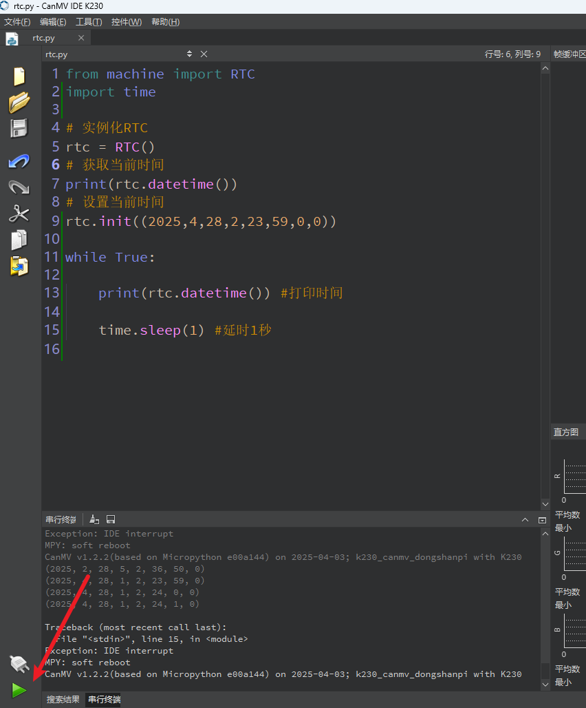
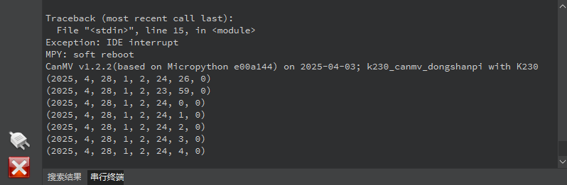

# RTC 实时时钟

## 1.实验目的

在嵌入式系统中，**实时时钟（RTC, Real-Time Clock）** 是一个非常实用的模块。它可以在系统断电后仍保持时间信息（若配备电池），也可以在系统运行时提供精准的时间信息。

本教程将教你如何使用 MicroPython 中的 `machine.RTC` 类来：

- 获取系统当前时间
- 设置自定义时间
- 实时打印当前时间

## 2.实验原理

RTC 模块内部配备了一个由晶振驱动的**高精度计时器电路**，通过周期性地计数来更新内部的时间数据（如：年、月、日、时、分、秒）。用户在需要时间信息时，只需读取 RTC 寄存器，即可获得当前时间。在 **K230** 中，RTC 使用的是与 ADC 共用的 **1.8V 电源网络**。这意味着**一旦开发板完全断电，RTC 就会停止运行，时间也会中断**。


## 3.代码解析

### 初始化

```
rtc = RTC()
print(rtc.datetime())
```

`RTC()`：创建一个 RTC 实例

`rtc.datetime()`：获取当前 RTC 的日期和时间，返回一个元组，格式为：

> (年, 月, 日, 星期, 时, 分, 秒, 毫秒)


### 设置当前时间

```
rtc.init((2025, 4, 28, 2, 23, 59, 0, 0))
```

设置时间为：2025年4月28日 星期二 23:59:00

注意：星期从 0 开始，`0=星期一`，`1=星期二`，以此类推。


### 实时打印当前时间

```
while True:
    print(rtc.datetime())
    time.sleep(1)
```

不断获取并打印当前 RTC 时间，每秒更新一次。


## 4.示例代码

```
'''
本程序遵循GPL V3协议, 请遵循协议
实验平台: DshanPI CanMV
开发板文档站点	: https://eai.100ask.net/
百问网学习平台   : https://www.100ask.net
百问网官方B站    : https://space.bilibili.com/275908810
百问网官方淘宝   : https://100ask.taobao.com
'''
from machine import RTC
import time

# 实例化RTC
rtc = RTC()
# 获取当前时间
print(rtc.datetime())
# 设置当前时间
rtc.init((2025,4,28,2,23,59,0,0))

while True:

    print(rtc.datetime()) #打印时间

    time.sleep(1) #延时1秒
```


## 5.实验结果

连接开发板后在CanMV IDE K230中运行示例代码：



实验结果会在串行终端会在打印RTC时间信息：



由于开发板不支持电池备份，则断电后时间会重置。