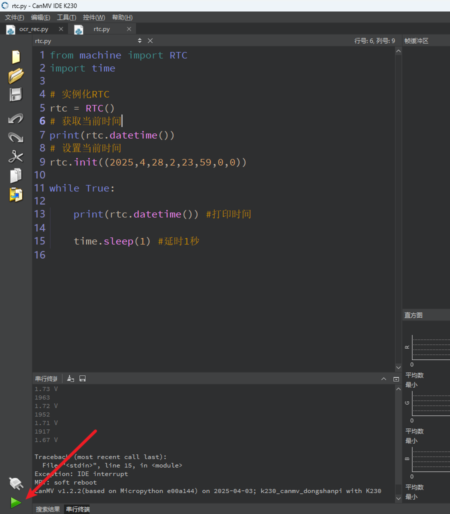
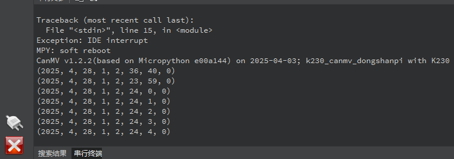

# ADC 数码转换器

## 1.实验目的

学习ADC的基础原理，并在开发板实现ADC读取。

## 2.实验原理

**ADC** 是 **Analog-to-Digital Converter** 的缩写，中文称为 **模数转换器**。

它的作用是将**模拟信号（Analog）\**转换为\**数字信号（Digital）**，让处理器（如 K230）能够识别和处理真实世界的模拟数据。


假设你用一个光敏电阻读取光照强度，它输出的是 0~1.8V 的模拟电压。但你的处理器只能处理数字信号，它无法理解“电压是多少伏”，这时就需要 ADC：

- ADC 读取电压，例如 0.9V
- 将其转换为一个数字值，比如在 12 位 ADC 下就是 2048（范围是 0~4095）
- 你就可以用这个数字在程序中判断“现在亮还是暗”

常见的 ADC 分辨率有：

- **8位**：0~255
- **10位**：0~1023
- **12位**：0~4095
- **16位**：0~65535

位数越高，精度越高，能分辨更细微的模拟信号变化。


K230 提供了多个 ADC 通道，不同通道的输入电压量程有所不同：

| 通道号 | 对应引脚 | 电压范围 |
| ------ | -------- | -------- |
| ADC0   | 排针10   | 0 ~ 3.6V |
| ADC1   | 排针9    | 0 ~ 3.6V |
| ADC2   | 排针11   | 0 ~ 1.8V |
| ADC3   | 排针12   | 0 ~ 1.8V |


## 3.代码解析

### 导入ADC类

```
from machine import ADC
import time
```

- `from machine import ADC`：从 `machine` 模块中导入 `ADC` 类，用于控制模数转换器（Analog-to-Digital Converter）。
- `import time`：导入时间模块，用于延时操作，例如 `time.sleep(1)`。

### 创建ADC 对象

```
adc = ADC(0) #通道0
```

创建一个 ADC 对象，代表通道 0（即接在排针32上）。

你现在可以通过这个对象读取电压数据。

### 获取ADC通道采样值

```
 print(adc.read_u16())
```

`adc.read_u16()`：读取 ADC 的原始采样值，是一个 16 位整数，范围 0~65535。

数值越大代表电压越高。

### 获取当前 ADC 通道的电压

```
    # 获取ADC通道电压值，保留2为小数。通道0、1实际量程为0-3.6V，返回值x2。
    print('%.2f'%(adc.read_uv()/1000000*2), "V")
```

`adc.read_uv()`：获取当前 ADC 通道的电压，单位为微伏（µV）。

`/1000000`：将微伏换算成伏特（V）。

`*2`：因为 ADC0 实际采样是 0~3.6V，所以这里要乘以 2 才能反映真实引脚电压。

`'%.2f' % ...`：格式化为保留两位小数的字符串。

最终效果是打印形如：`1.65 V`


## 4.示例代码

```
'''
本程序遵循GPL V3协议, 请遵循协议
实验平台: DshanPI CanMV
开发板文档站点	: https://eai.100ask.net/
百问网学习平台   : https://www.100ask.net
百问网官方B站    : https://space.bilibili.com/275908810
百问网官方淘宝   : https://100ask.taobao.com
'''
from machine import ADC
import time

# 创建 ADC0 通道的对象（连接到排针32）
adc = ADC(0)  # 表示 ADC 通道0

while True:
    # 读取原始采样值（16位，范围0~65535）
    print(adc.read_u16())

    # 读取转换后的电压值（单位为 V），保留两位小数
    # 注意：ADC0/ADC1 实际采样范围为 0~1.8V，但引脚电压范围是 0~3.6V，因此需要乘以2
    print('%.2f' % (adc.read_uv() / 1000000 * 2), "V")

    time.sleep(1)  # 每秒采样一次
```


## 5.实验结果

连接开发板后在CanMV IDE K230中运行示例代码：



运行完成后，会持续打印ADC获取的电压。

