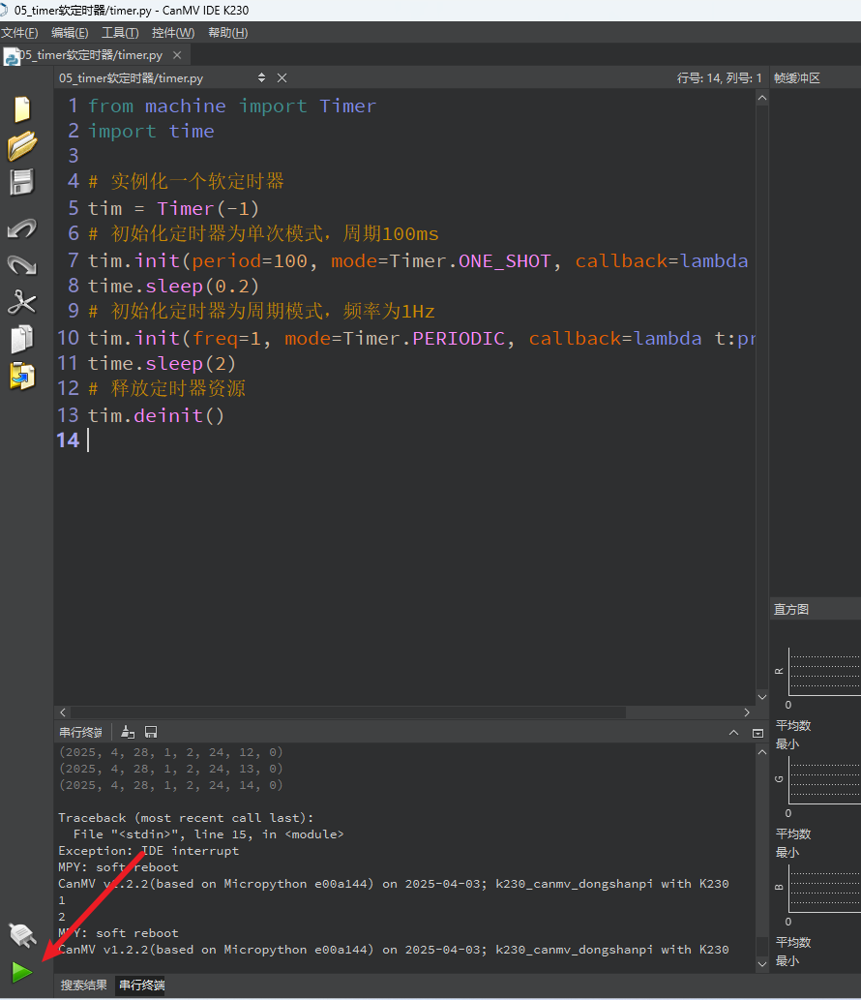

# Timer 定时器

​	在嵌入式开发中，**定时器（Timer）** 是非常常用的工具，常用于周期性任务、延时执行、硬件控制等功能。MicroPython 提供了 `machine.Timer` 类，允许我们通过软件方式快速实现定时控制逻辑。

本文将通过一个简单实例，逐步讲解如何使用 `Timer` 实现单次定时和周期定时任务。

## 1.实验目的

学习定时器的使用。

## 2.实验原理

**定时器（Timer）** 是微控制器内部的一个硬件模块，它通过时钟脉冲进行计数，能在指定的时间间隔内执行某些任务。定时器是实现**延时、周期性任务、中断触发**等功能的基础。

定时器不仅可以“数时间”，还可用于测量脉冲宽度、频率、捕捉外部事件等。

| 模式                     | 描述                                           |
| ------------------------ | ---------------------------------------------- |
| **单次模式（One-shot）** | 定时器只运行一次，到达时间后停止。             |
| **周期模式（Periodic）** | 定时器每到达设定时间就重新开始，持续触发事件。 |


## 3.代码解析

###  导入模块

```
from machine import Timer
import time
```

`Timer` 是定时器类，位于 `machine` 模块中。

`time` 模块用于阻塞延时。

### 创建定时器对象

```
tim = Timer(-1)
```

创建一个软件定时器。参数 `-1` 表示这是一个**软件定时器**，由 CPU 模拟实现。

如果使用硬件定时器（部分芯片支持），可以传入 0、1、2 等编号。

### 单次模式定时器

```
tim.init(period=100, mode=Timer.ONE_SHOT, callback=lambda t:print(1))
```

`period=100` 表示 100 毫秒后触发。

`mode=Timer.ONE_SHOT` 表示单次执行。

`callback=lambda t:print(1)` 是触发时调用的回调函数，这里打印数字 1。

```
time.sleep(0.2)
```

程序暂停 0.2 秒（200ms），保证我们能看到定时器打印结果。

### 周期模式定时器

```
tim.init(freq=1, mode=Timer.PERIODIC, callback=lambda t:print(2))
```

`freq=1` 表示每秒触发一次（1Hz）。

`mode=Timer.PERIODIC` 表示周期性执行。

回调函数打印数字 2。

```
time.sleep(2)
```

让程序运行 2 秒，以便观察定时器打印 2 的过程（会打印 2 次）。

### 停止并释放定时器

```
tim.deinit()
```

关闭定时器，释放资源，避免占用系统资源或出现意外触发。

## 4.示例代码

```
'''
本程序遵循GPL V3协议, 请遵循协议
实验平台: DshanPI CanMV
开发板文档站点	: https://eai.100ask.net/
百问网学习平台   : https://www.100ask.net
百问网官方B站    : https://space.bilibili.com/275908810
百问网官方淘宝   : https://100ask.taobao.com
'''
from machine import Timer
import time

# 实例化一个软定时器
tim = Timer(-1)
# 初始化定时器为单次模式，周期100ms
tim.init(period=100, mode=Timer.ONE_SHOT, callback=lambda t:print(1))
time.sleep(0.2)
# 初始化定时器为周期模式，频率为1Hz
tim.init(freq=1, mode=Timer.PERIODIC, callback=lambda t:print(2))
time.sleep(2)
# 释放定时器资源
tim.deinit()
```


## 5.实验结果

连接开发板后在CanMV IDE K230中运行示例代码：



运行完成后，会输出1和2。第一个 "1" 来自 100ms 后的单次定时器。


## 6.控制LED的定时器示例代码

```
'''
  Copyright (C) 2008-2023 深圳百问网科技有限公司
  All rights reserved

 免责声明: 百问网编写的程序, 用于商业用途请遵循GPL许可, 百问网不承担任何后果！
 
 本程序遵循GPL V3协议, 请遵循协议
 百问网学习平台   : https://www.100ask.net
 百问网交流社区   : https://forums.100ask.net
 百问网官方B站    : https://space.bilibili.com/275908810
 本程序所用开发板 : DshanPI-CanMV开发板
 开发板文档站点	： https://eai.100ask.net/
 百问网官方淘宝   : https://100ask.taobao.com
 联系我们(E-mail) : weidongshan@100ask.net
'''
from machine import Pin, Timer
import time

# 初始化 LED 引脚（GPIO33）为输出模式
led = Pin(33, Pin.OUT)

# 创建一个软件定时器
tim = Timer(-1)

# 设置初始状态为熄灭
led.value(0)

# 记录 LED 状态
state = False

# 单次定时器：100ms 后点亮 LED
def turn_on_led(t):
    led.value(1)
    print("LED 已点亮（单次定时器）")

tim.init(period=100, mode=Timer.ONE_SHOT, callback=turn_on_led)

# 等待一段时间让单次定时器完成
time.sleep(0.2)

# 定义周期函数：每秒切换 LED 状态
def toggle_led(t):
    global state
    state = not state
    led.value(state)
    print("LED 状态切换为：", "亮" if state else "灭")

# 初始化定时器为周期模式，每秒闪烁一次
tim.init(freq=1, mode=Timer.PERIODIC, callback=toggle_led)

# 主线程等待一段时间观察效果
time.sleep(10)

# 停止定时器
tim.deinit()
print("定时器停止，LED 保持最后状态")
```

