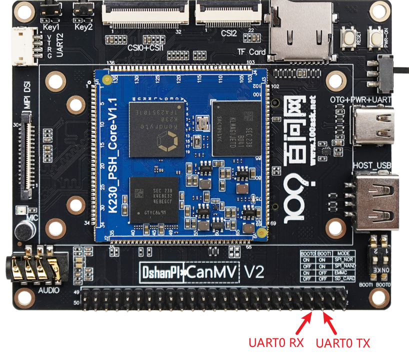
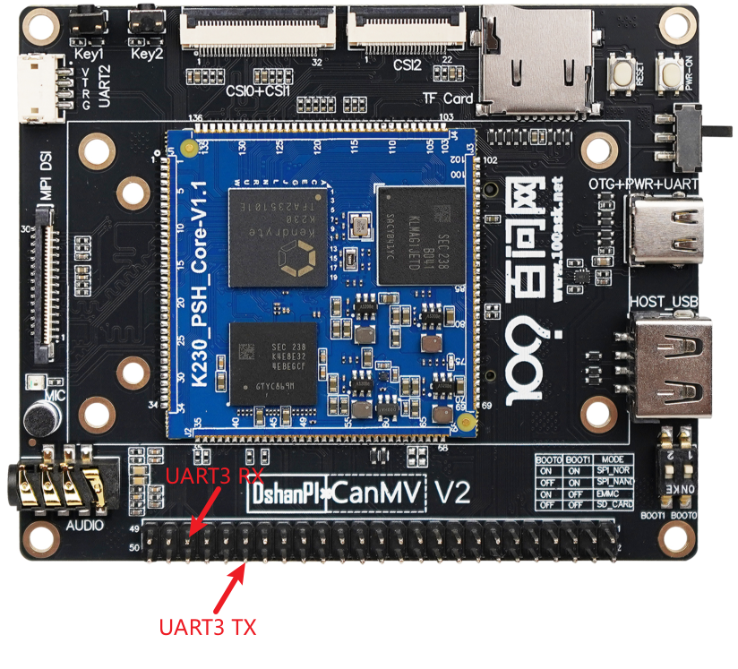
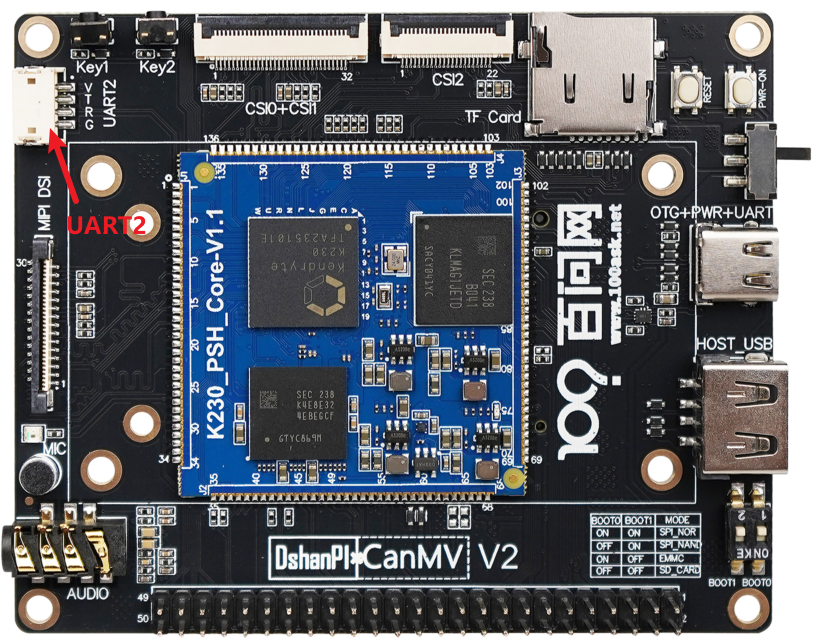
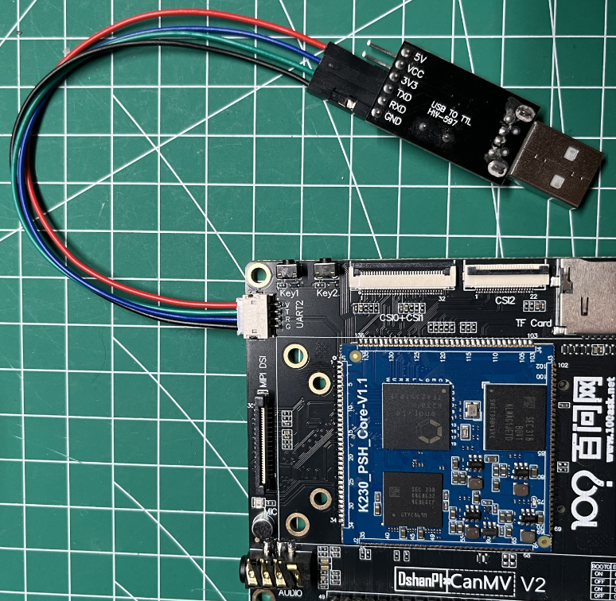
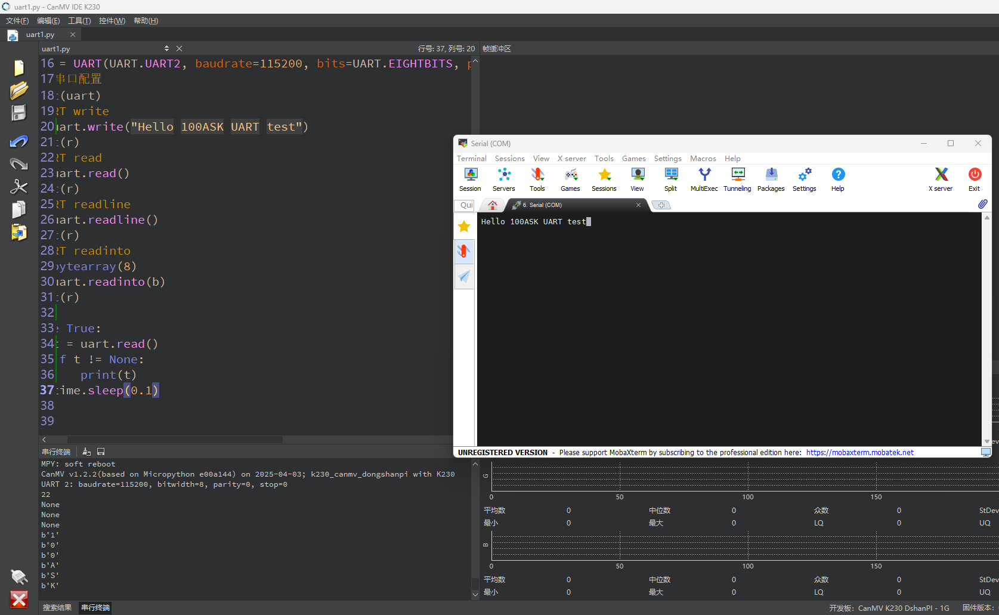

# UART 串口

## 1.实验目的

本实验通过 MicroPython 控制 K230 的 UART3 接口，实现串口的：

- 引脚映射（通过 FPIOA）
- 串口初始化
- 串口发送数据
- 串口接收数据（read / readline / readinto）

适合用于与外部串口设备（如传感器、PC、蓝牙模块等）进行通信。


## 2.实验原理

UART（Universal Asynchronous Receiver Transmitter，通用异步收发器）是一种常见的串行通信协议，用于点对点传输数据。在嵌入式系统中非常常见。

常见配置参数包括：

- **波特率**：数据传输速率（如 9600、115200）
- **数据位**：每帧数据的位数（如 8 位）
- **校验位**：用于检测错误（可无）
- **停止位**：帧末尾标志位（通常 1 位）


K230内部包含五个UART硬件模块，其中UART0系统的默认终端占用，剩余UART3，UART1，UART2，UART4。下面介绍默认提供的默认提供串口的位置：

UART0:



UART3:



UART2:



> UART2可用ZH1.5mm间距端子线连接！！！

## 3.代码解析

### 导入模块

```
from machine import UART
from machine import FPIOA
```

导入控制串口（UART）和引脚映射（FPIOA）的模块。

### 实例化 FPIOA

```
fpioa = FPIOA()
```

引脚功能重映射

### 复用引脚功能

```
fpioa.set_function(44, fpioa.UART2_TXD)
fpioa.set_function(45, fpioa.UART2_RXD)
```

将物理引脚 GPIO44 和 GPIO45 分别配置为 UART2 的 TX（发送）和 RX（接收）功能。

```
uart = UART(UART.UART2, baudrate=115200, bits=UART.EIGHTBITS, 
            parity=UART.PARITY_NONE, stop=UART.STOPBITS_ONE)
```

初始化 UART3，设置参数：

- 波特率：115200
- 数据位：8 位
- 校验位：无
- 停止位：1 位

### 发送字符串

```
r = uart.write("UART test")
print(r)
```

通过串口发送字符串 `"UART test"`，返回写入字节数。

### 接收数据

```
r = uart.read()
print(r)
```

读取接收到的数据（如果有），返回字节数据或 `None`。

### 按行读取串口数据

```
r = uart.readline()
print(r)
```

按行读取串口数据，遇到换行符（`\n`）结束。

### 保存数据

```
b = bytearray(8)
r = uart.readinto(b)
print(r)
```

将接收到的数据写入到 `bytearray` 中，可用于接收固定长度数据包。

### 无限循环中接收数据

```
while True:
    t = uart.read()
    if t != None:
        print(t)
    time.sleep(0.1)
```

## 4.示例代码

```
'''
本程序遵循GPL V3协议, 请遵循协议
实验平台: DshanPI CanMV
开发板文档站点	: https://eai.100ask.net/
百问网学习平台   : https://www.100ask.net
百问网官方B站    : https://space.bilibili.com/275908810
百问网官方淘宝   : https://100ask.taobao.com
'''
from machine import UART
from machine import FPIOA
import time

# 实例化FPIOA
from machine import FPIOA
fpioa = FPIOA()
#设置pin44为串口2发送管脚
fpioa.set_function(44, fpioa.UART2_TXD)
#设置pin45为串口2接收管脚
fpioa.set_function(45, fpioa.UART2_RXD)

#UART: baudrate 115200, 8bits, parity none, one stopbits
uart = UART(UART.UART2, baudrate=115200, bits=UART.EIGHTBITS, parity=UART.PARITY_NONE, stop=UART.STOPBITS_ONE)
#打印串口配置
print(uart)
# UART write
r = uart.write("Hello 100ASK UART test")
print(r)
# UART read
r = uart.read()
print(r)
# UART readline
r = uart.readline()
print(r)
# UART readinto
b = bytearray(8)
r = uart.readinto(b)
print(r)

while True:
    t = uart.read()
    if t != None:
        print(t)
    time.sleep(0.1)
```


## 5.实验结果

实验**ZH1.5mm间距端子线**连接开发板端的UART2口，另一端连接至串口模块。连接完成后将串口模块接入电脑的USB口。



> 注意：3.3V可不接！

连接完成后再CanMV IDE K230运行示例程序后可在USB串口模块上看到发送的数据，在串口终端输入的内容会打印在IDE的串行终端中。

