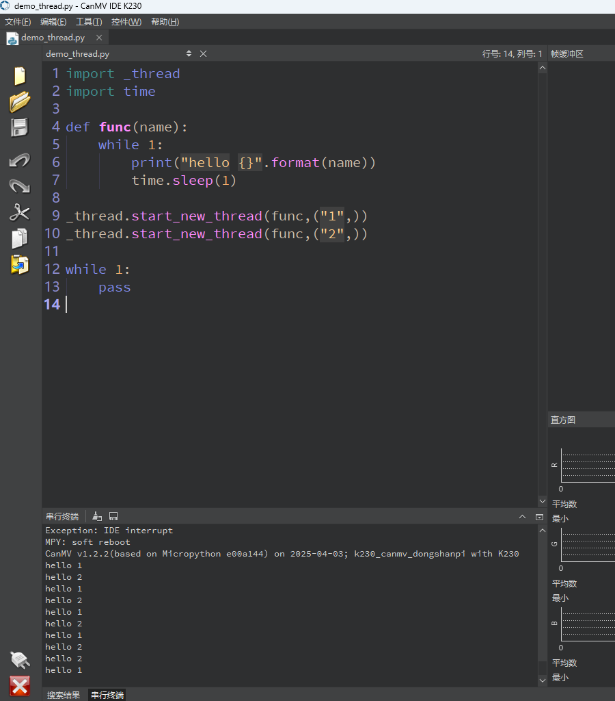

# thread 线程

## 1.实验目的

实现多线程运行任务


## 2.实验原理

多线程在 MicroPython 中的机制：

- 每个线程都被调度器分配时间片轮流执行（类似“协作式多任务调度”）。
- 是“**伪并发**”而非真正的多核并行（除非在多核平台）。
- `_thread` 是轻量级线程，适合执行简单的并发任务（如打印、轮询、灯闪烁等）。

## 3.参考代码

```
'''
本程序遵循GPL V3协议, 请遵循协议
实验平台: DshanPI CanMV
开发板文档站点	: https://eai.100ask.net/
百问网学习平台   : https://www.100ask.net
百问网官方B站    : https://space.bilibili.com/275908810
百问网官方淘宝   : https://100ask.taobao.com
'''
import _thread
import time

def func(name):
    while 1:
        print("hello {}".format(name))
        time.sleep(1)

_thread.start_new_thread(func,("1",))
_thread.start_new_thread(func,("2",))

while 1:
    pass
```


## 4.实验结果

在IDE中运行代码，可以看到串行终端打印重复执行2个线程。

