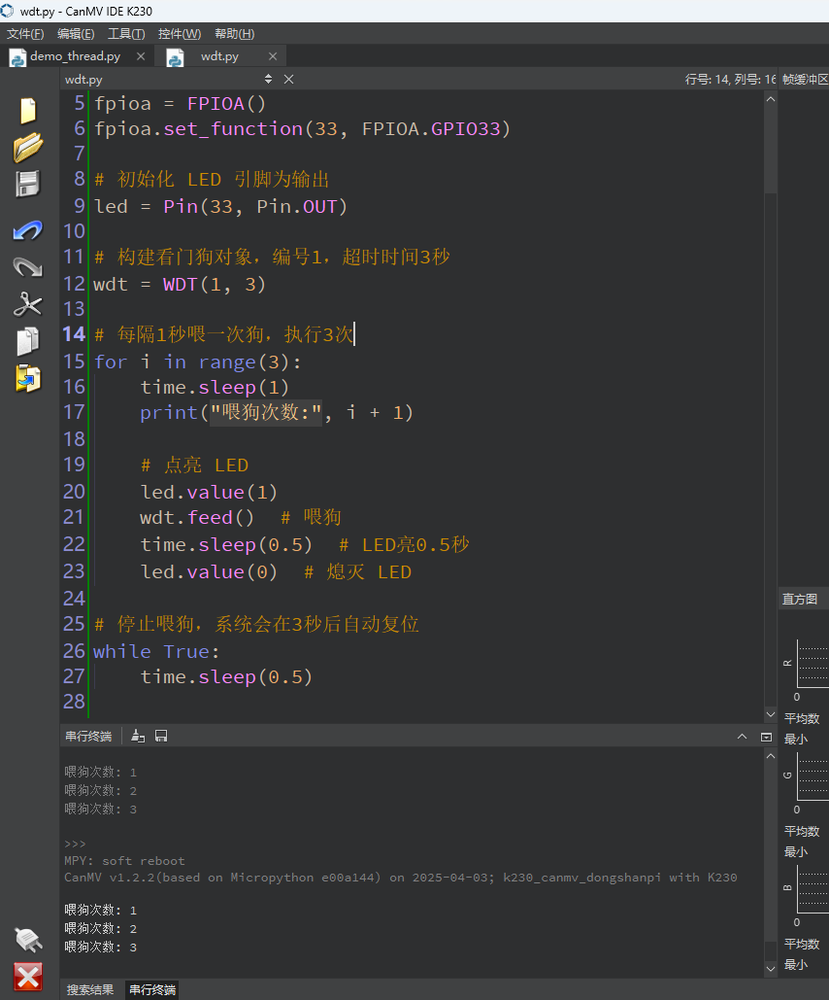

# WDT 看门狗

## 1.实验目的

学习看门狗的复位操作。

## 2.实验原理

​	看门狗（Watchdog Timer，简称 WDT）是一种**用于防止程序死锁或卡死**的硬件定时器。它的主要作用是**在系统出现异常时自动重启设备，从而恢复正常运行**，确保系统的稳定性和可靠性。

​	在嵌入式系统或单片机运行中，有时由于各种原因（如程序逻辑错误、电磁干扰、内存泄漏等），主程序会陷入死循环或卡死，不能继续执行。此时如果没有外部干预，系统将一直停在那里。

看门狗的作用就是**让系统在发生故障时自动恢复**！


## 3.代码解析

### 导入模块

```
from machine import WDT # 导入 WDT（看门狗定时器）模块
import time
from machine import Pin # 导入控制 GPIO 引脚的模块
```

`WDT`：用于看门狗定时器

`Pin`：用于控制 GPIO 引脚，比如点亮或熄灭 LED

`time`：用于延时控制


### 创建对象

```
wdt = WDT(1, 3) # 创建一个编号为1的看门狗对象，超时时间为3秒
```

创建一个 **看门狗定时器** 对象。

`1` 表示使用的是 WDT1（编号），`3` 是看门狗超时秒数。

如果超过 3 秒未喂狗，系统将会重启。

### 创建控制灯

```
led = Pin(33, Pin.OUT) # 创建一个控制 GPIO33 引脚的对象，设置为输出模式
```

### 喂狗操作

```
for i in range(3):
    time.sleep(1)         # 延时1秒
    led.value(1)          # 点亮LED灯
    print(i)              # 打印当前循环次数
    wdt.feed()            # 喂狗，重置看门狗计时器
    time.sleep(0.5)       # 等待0.5秒
    led.value(0)          # 熄灭LED灯
```

这个 `for` 循环模拟**正常运行时的喂狗操作**，一共进行 3 次：

- 每次循环：
  - 延时1秒后点亮LED
  - 喂狗一次（系统正常）
  - 等待0.5秒后熄灭LED

每喂一次狗，LED 灯亮一次再熄灭，表示一次“心跳”。

### 模拟程序异常

```
while True:
    time.sleep(0.01) # 主程序空转，不再喂狗
```

- 程序进入一个**无限循环**，模拟“程序卡死”或异常状态。
- 此时 **没有再喂狗**，看门狗计时器会在 3 秒后**超时触发系统重启**。


## 4.示例代码

```
'''
本程序遵循GPL V3协议, 请遵循协议
实验平台: DshanPI CanMV
开发板文档站点	: https://eai.100ask.net/
百问网学习平台   : https://www.100ask.net
百问网官方B站    : https://space.bilibili.com/275908810
百问网官方淘宝   : https://100ask.taobao.com
'''
from machine import WDT, Pin, FPIOA  # 导入模块
import time

# 映射 GPIO33 到普通 GPIO 功能
fpioa = FPIOA()
fpioa.set_function(33, FPIOA.GPIO33)

# 初始化 LED 引脚为输出
led = Pin(33, Pin.OUT)

# 构建看门狗对象，编号1，超时时间3秒
wdt = WDT(1, 3)

# 每隔1秒喂一次狗，执行3次
for i in range(3):
    time.sleep(1)
    print("喂狗次数:", i + 1)

    # 点亮 LED
    led.value(1)
    wdt.feed()  # 喂狗
    time.sleep(0.5)  # LED亮0.5秒
    led.value(0)  # 熄灭 LED

# 停止喂狗，系统会在3秒后自动复位
while True:
    time.sleep(0.5)
```

## 5.实验结果

在CanMV IDE中运行示例代码，每次喂狗都会控制灯闪烁，最后会模拟系统卡死，重启系统。



