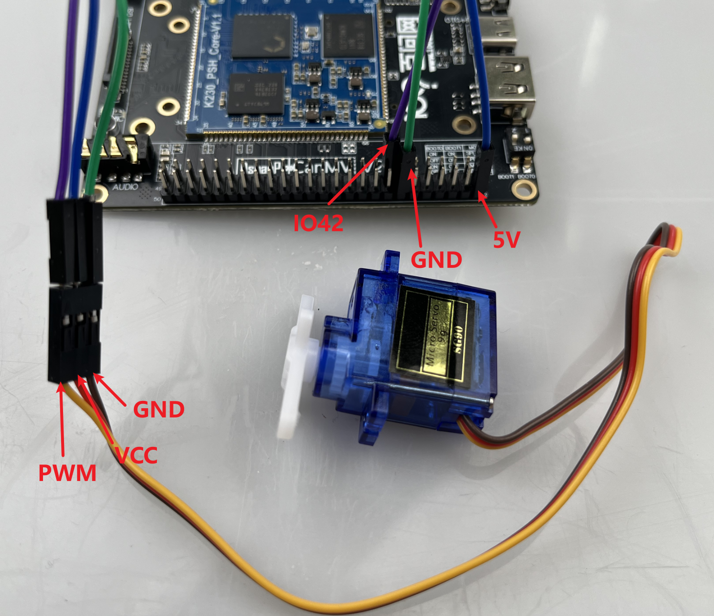
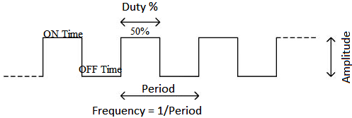
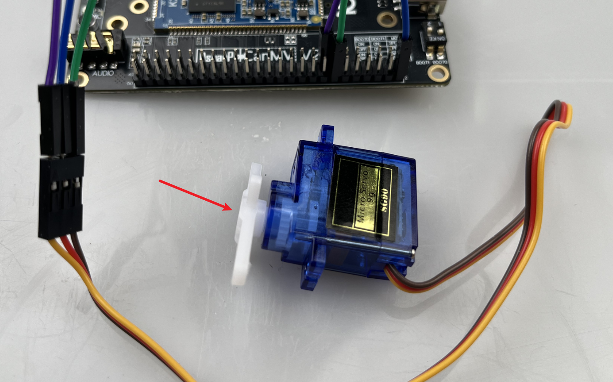

# PWM 舵机

## 1.实验目的

​	本示例程序通过使用 K230 开发板上的 PWM 功能，控制一个标准的 180 度舵机进行 **往复旋转**。舵机会先从 -90 度逐步转到 +90 度，再按相反顺序回到 -90 度，形成一个完整的“去→回”动作循环。

本小节实验SG90舵机进行实现，开始前请先了解接线说明，如下图所示，

- 将舵机的VCC接到开发板的拓展排针的5V；
- 将舵机的GND接到开发板的拓展排针的GND；
- 将舵机的PWM信号线接到开发板的拓展排针的IO42；



## 2.实验原理

**PWM 是一种用“开-关”脉冲信号，模拟“模拟信号”的技术。**

它的核心在于快速地开关电路，通过控制**高电平持续的时间**，实现对输出功率的调节。



**周期 (T)**：一整个高低电平变化的时间

**占空比 (Duty Cycle)**：高电平在整个周期中所占的比例

例如：

| 占空比 | 高电平持续时间 | 模拟输出效果（假设5V） |
| ------ | -------------- | ---------------------- |
| 0%     | 0ms            | 0V                     |
| 50%    | T/2            | 2.5V（平均电压）       |
| 100%   | T              | 5V                     |

**PWM 的作用和应用：**

1. **舵机控制**

- 标准舵机工作在 **50Hz（周期20ms）**
- PWM高电平宽度控制舵机角度：
  - 0.5ms（2.5%） → -90°
  - 1.5ms（7.5%） → 0°
  - 2.5ms（12.5%）→ +90°

2. **电机调速**：控制直流电机的转速，PWM 占空比越大，电机转得越快。

3. **LED 调光**：用于控制亮度：占空比高 → 更亮，占空比低 → 更暗

4. **音频输出**：可以用 PWM 生成简单的声音信号。

## 3.代码解析

### 导入模块

```
from machine import Pin, PWM
from machine import FPIOA
import time
```

### 引脚功能配置

```
fpioa = FPIOA()
fpioa.set_function(42, FPIOA.PWM0)
```

使用 `FPIOA` 将物理引脚 IO42 映射为 `PWM0` 功能，舵机的控制信号输出就是从这个引脚发出的。


### PWM 初始化

```
S1 = PWM(0, 50, duty=0, enable=True)
```

`PWM(0, 50)`：选择 PWM 通道 0，频率 50Hz（标准舵机的控制频率）。

`duty=0`：初始化占空比为 0（默认不发送有效信号）。

`enable=True`：启用该 PWM 通道。

### 舵机角度控制函数

```
def Servo(servo, angle):
    duty = (angle + 90) / 180 * 10 + 2.5
    servo.duty(duty)
```

舵机的控制信号是一个 PWM 脉冲，**不同的占空比**对应不同的角度。这个函数将输入角度（-90° ~ +90°）转换为占空比（约 2.5% 到 12.5%）：

- -90° → 2.5% 占空比
- 0° → 7.5% 占空比
- +90° → 12.5% 占空比


### 控制舵机往复旋转

```
angles_forward = [-90, -45, 0, 45, 90]
angles_backward = [45, 0, -45, -90]

while True:
    for angle in angles_forward:
        Servo(S1, angle)
        time.sleep(0.5)

    for angle in angles_backward:
        Servo(S1, angle)
        time.sleep(0.5)
```

- 第一段循环：舵机依次转动到 -90 → -45 → 0 → 45 → 90
- 第二段循环：舵机再从 45 回到 -90，形成“复位”

每步之间暂停 0.5 秒，使动作看起来平稳自然。


## 4.示例代码

```
'''
本程序遵循GPL V3协议, 请遵循协议
实验平台: DshanPI CanMV
开发板文档站点	: https://eai.100ask.net/
百问网学习平台   : https://www.100ask.net
百问网官方B站    : https://space.bilibili.com/275908810
百问网官方淘宝   : https://100ask.taobao.com
'''
from machine import Pin, PWM
from machine import FPIOA
import time

# 配置引脚42为PWM0功能
fpioa = FPIOA()
fpioa.set_function(42, FPIOA.PWM0)

# 初始化舵机PWM对象（PWM通道0，频率50Hz）
S1 = PWM(0, freq=50, duty=0)

def Servo(servo, angle):
    '''
    舵机角度控制函数
    角度范围：-90 到 90
    对应 PWM 占空比范围：2.5% ~ 12.5%
    '''
    duty =int((angle + 90) / 180 * 10 + 2.5)  # 将角度映射到 duty 占空比
    servo.duty(duty)

# 定义旋转角度顺序：先前进到 90，再逐步退回到 -90
angles_forward = [-90, -45, 0, 45, 90]
angles_backward = [45, 0, -45, -90]

while True:
    # 顺时针旋转
    for angle in angles_forward:
        Servo(S1, angle)
        time.sleep(0.5)

    # 逆时针回到初始位置
    for angle in angles_backward:
        Servo(S1, angle)
        time.sleep(0.5)
```


## 5.实验结果

控制一个标准的 180 度SG90舵机进行 **往复旋转**。

