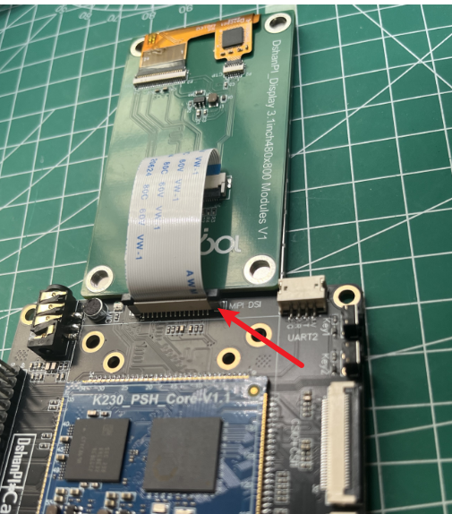
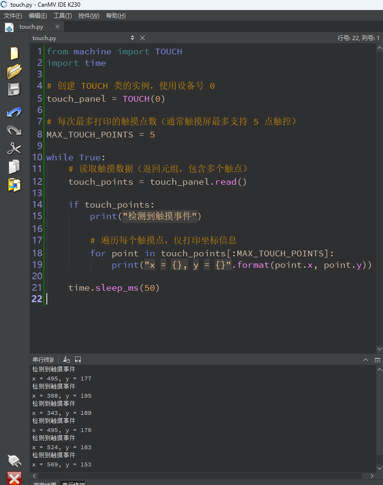

# 触摸实验

硬件需求：

- MIPI屏幕
- CanMV开发板

在开始前请确保将MIPI屏幕和CanMV开发板连接。



## 1.实验目的

学习读取电容触摸屏数据。


## 2.函数讲解

**构造函数**

```
# when index is 0
touch = TOUCH(index, type = TOUCH.TYPE_CST328, rotate = -1)

# when index is 1
touch = TOUCH(index, type = TOUCH.TYPE_CST328, rotate = -1, range_x = -1, range_y = -1, i2c : I2C = None, slave_addr = None, rst : Pin = None, int : Pin = None)
```

**参数**

- `index`: `TOUCH` 设备号，为 `0` 时，表示使用系统自带的触摸，为 `1` 时，表示使用 `CanMV` 专有的触摸驱动
- `type`: 触摸驱动类型，具体定义参考[触摸类型](https://developer.canaan-creative.com/k230_canmv/zh/main/zh/api/machine/K230_CanMV_TOUCH模块API手册.html#id6)
- `rotate`: 面板输出坐标与屏幕坐标的旋转，取值范围为 [0-3]，具体定义参考[坐标旋转](https://developer.canaan-creative.com/k230_canmv/zh/main/zh/api/machine/K230_CanMV_TOUCH模块API手册.html#id5)。
- `range_x`: `index=1` 时有效，触摸输出坐标的宽度最大值
- `range_y`: `index=1` 时有效，触摸输出坐标的高度最大值
- `i2c`: `index=1` 时有效，触摸使用 `I2C` 总线对象
- `slave_addr`: `index=1` 时有效，触摸芯片的从机地址，可选参数，不传入使用驱动默认值
- `rst`: `index=1` 时有效，触摸复位引脚对象
- `int`: `index=1` 时有效，触摸中断引脚对象，当前不支持

**`read` 方法**

```
TOUCH.read([count])
```

获取触摸数据。

**参数**

- `count`: 最多读取的触摸点数量，取值范围为 [0:10]，默认为 0，表示读取所有触摸点。

**返回值**

返回触摸点数据，类型为元组 `([tp[, tp...]])`，其中每个 `tp` 是一个 `touch_info` 类实例。

**`deinit` 方法**

```
TOUCH.deinit()
```

释放 TOUCH 资源。

**参数**

无

**返回值**

无

**3. TOUCH_INFO 类**

TOUCH_INFO 类用于存储触摸点的信息，用户可通过相关只读属性访问。

- `event`: 事件码，具体参考[触摸事件](https://developer.canaan-creative.com/k230_canmv/zh/main/zh/api/machine/K230_CanMV_TOUCH模块API手册.html#id4)。
- `track_id`: 触点 ID，用于多点触摸。
- `width`: 触点宽度。
- `x`: 触点的 x 坐标。
- `y`: 触点的 y 坐标。
- `timestamp`: 触点时间戳。

**触摸事件**

- `EVENT_NONE`: 无事件。
- `EVENT_UP`: 触摸按下后抬起。
- `EVENT_DOWN`: 触摸按下开始。
- `EVENT_MOVE`: 触摸按下后移动。

**坐标旋转**

- `ROTATE_0`: 坐标不旋转。
- `ROTATE_90`: 坐标旋转 90 度。
- `ROTATE_180`: 坐标旋转 180 度。
- `ROTATE_270`: 坐标旋转 270 度。

**触摸类型**

- `TYPE_CST328`: `CanMV` 专有触摸驱动
- `TYPE_CST226SE`: `CanMV` 专有触摸驱动
- `TYPE_GT911`: `CanMV` 专有触摸驱动


## 3.示例代码

```
'''
本程序遵循GPL V3协议, 请遵循协议
实验平台: DshanPI CanMV
开发板文档站点	: https://eai.100ask.net/
百问网学习平台   : https://www.100ask.net
百问网官方B站    : https://space.bilibili.com/275908810
百问网官方淘宝   : https://100ask.taobao.com
'''
from machine import TOUCH
import time

# 创建 TOUCH 类的实例，使用设备号 0
touch_panel = TOUCH(0)

# 每次最多打印的触摸点数（通常触摸屏最多支持 5 点触控）
MAX_TOUCH_POINTS = 5

while True:
    # 读取触摸数据（返回元组，包含多个触点）
    touch_points = touch_panel.read()

    if touch_points:
        print("检测到触摸事件")

        # 遍历每个触摸点，仅打印坐标信息
        for point in touch_points[:MAX_TOUCH_POINTS]:
            print("x = {}, y = {}".format(point.x, point.y))

    time.sleep_ms(50)
```

## 4.实验结果

运行程序后，用手点击触摸屏后，在终端可以看到打印的坐标信息。

