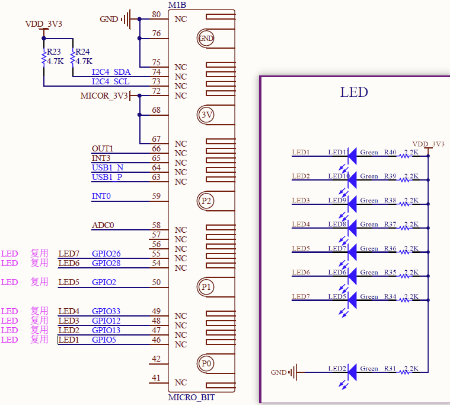
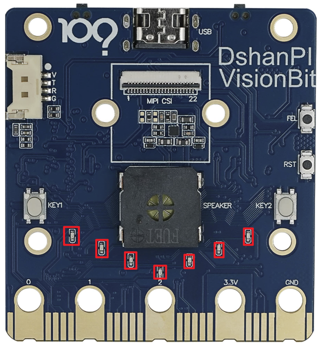
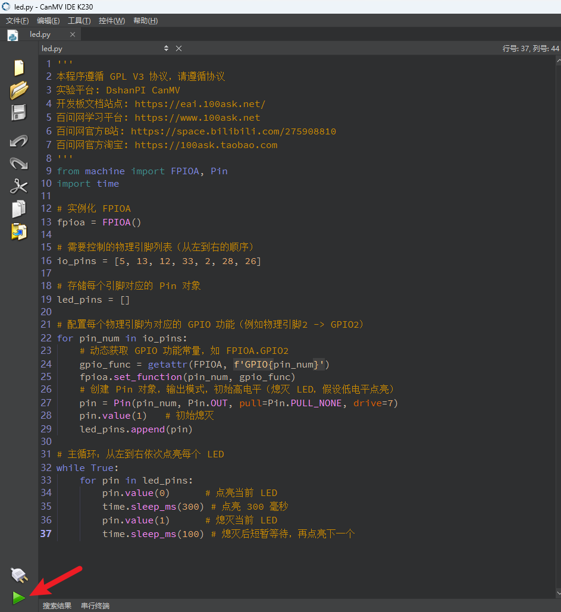

# 点亮一个GPIO灯

在这篇文章中，我们将通过一个简单的示例来学习如何用 MicroPython 控制 GPIO 引脚点亮一个 LED 灯。


## 1.硬件电路

1.  LED 的正极（长脚）连接到开发板的一个 GPIO 引脚（如 GPIO33）
2. LED 的负极（短脚）通过电阻接地（GND）

我们可以通过查看开发板原理图，可知：



LED灯在开发板中的位置：


当GPIO5、GPIO13、GPIO12、GPIO33、GPIO2、GPIO28、GPIO26为高电平时，上面红框中LED灯会被点亮。

## 2.实验解析

   FPIOA 是 K230 的一项功能，它允许你将某个物理引脚动态配置为 UART、I2C、SPI、PWM、GPIO 等多种功能之一。每个引脚同一时刻只能映射为一个功能，但用户可以自由选择映射方式。

这意味着你可以：

- 把 UART 的 TX/RX 映射到你希望的任意引脚；
- 把 PWM 输出映射到靠近电机的引脚；
- 或者，像我们这篇文章的例子一样，把一个 GPIO 功能映射到指定引脚，来点亮一个灯。

### 导入模块

```python
from machine import FPIOA, Pin
import time
```
- `FPIOA`：用于配置芯片引脚的功能映射，可将物理引脚映射为 GPIO、UART、I2C 等。
- `Pin`：用于控制具体 GPIO 引脚的方向、输出值、上拉/下拉等。
- `time`：提供延时函数（如 `sleep_ms()`）。

---

### 构造函数

```python
fpioa = FPIOA()
```
- 实例化一个 `FPIOA` 对象，后续使用该对象设置引脚功能。

---

### 设置引脚功能（多个引脚）

```python
io_pins = [2, 5, 12, 13, 26, 28, 33]
for pin_num in io_pins:
    gpio_func = getattr(FPIOA, f'GPIO{pin_num}')
    fpioa.set_function(pin_num, gpio_func)
```
- `io_pins`：定义要控制的物理引脚列表（按从左到右顺序）。
- `getattr(FPIOA, f'GPIO{pin_num}')`：动态获取 `FPIOA.GPIO2`、`FPIOA.GPIO5` 等常量。
- `fpioa.set_function(pin_num, gpio_func)`：将每个物理引脚映射到对应的 GPIO 功能。

---

### 实例化 Pin 对象用于控制 LED（多个）

```python
led_pins = []
for pin_num in io_pins:
    pin = Pin(pin_num, Pin.OUT, pull=Pin.PULL_NONE, drive=7)
    pin.value(1)      # 初始熄灭（低电平点亮假设）
    led_pins.append(pin)
```
- `Pin(pin_num, Pin.OUT, pull=Pin.PULL_NONE, drive=7)`：
  - 将已映射的引脚设置为输出模式。
  - `pull=Pin.PULL_NONE`：无内部上下拉。
  - `drive=7`：最大驱动电流。
- `pin.value(1)`：初始输出高电平，LED 熄灭（假设低电平点亮）。
- `led_pins.append(pin)`：保存每个引脚对象，便于后续循环控制。

---

### 控制 PIN（流水灯效果）

```python
while True:
    for pin in led_pins:
        pin.value(0)      # 输出低电平，点亮当前 LED
        time.sleep_ms(300)  # 保持点亮 300ms
        pin.value(1)      # 输出高电平，熄灭当前 LED
        time.sleep_ms(100)  # 熄灭后等待 100ms，再点亮下一个
```
- `pin.value(0)`：输出低电平 → 点亮 LED（假设低电平有效）。
- `pin.value(1)`：输出高电平 → 熄灭 LED。
- `time.sleep_ms(300)`：延时 300 毫秒。
- `time.sleep_ms(100)`：延时 100 毫秒，使相邻 LED 点亮之间有明显间隔。
- 无限循环实现从左到右依次点亮、熄灭，产生流水灯效果。

## 3.示例代码

```
'''
本程序遵循 GPL V3 协议，请遵循协议
实验平台: DshanPI CanMV
开发板文档站点: https://eai.100ask.net/
百问网学习平台: https://www.100ask.net
百问网官方B站: https://space.bilibili.com/275908810
百问网官方淘宝: https://100ask.taobao.com
'''
from machine import FPIOA, Pin
import time

# 实例化 FPIOA
fpioa = FPIOA()

# 需要控制的物理引脚列表（从左到右的顺序）
io_pins = [5, 13, 12, 33, 2, 28, 26]

# 存储每个引脚对应的 Pin 对象
led_pins = []

# 配置每个物理引脚为对应的 GPIO 功能（例如物理引脚2 -> GPIO2）
for pin_num in io_pins:
    # 动态获取 GPIO 功能常量，如 FPIOA.GPIO2
    gpio_func = getattr(FPIOA, f'GPIO{pin_num}')
    fpioa.set_function(pin_num, gpio_func)
    # 创建 Pin 对象，输出模式，初始高电平（熄灭 LED，假设低电平点亮）
    pin = Pin(pin_num, Pin.OUT, pull=Pin.PULL_NONE, drive=7)
    pin.value(1)   # 初始熄灭
    led_pins.append(pin)

# 主循环：从左到右依次点亮每个 LED
while True:
    for pin in led_pins:
        pin.value(0)      # 点亮当前 LED
        time.sleep_ms(300) # 点亮 300 毫秒
        pin.value(1)      # 熄灭当前 LED
        time.sleep_ms(100) # 熄灭后短暂等待，再点亮下一个
```


## 4.运行结果

连接开发板后在CanMV IDE K230中运行示例代码：



运行成功后可以看到板载的LED灯顺序亮起：


## 5.总结

- 通过 **FPIOA** 将物理引脚映射为 GPIO 功能。
- 使用 **Pin** 对象设置为输出模式。
- 在循环中按顺序输出低电平/高电平，配合延时实现 LED 依次点亮。