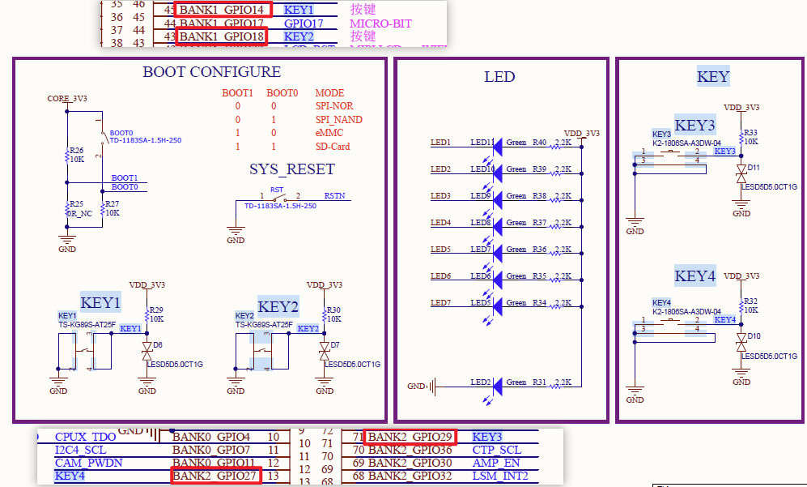
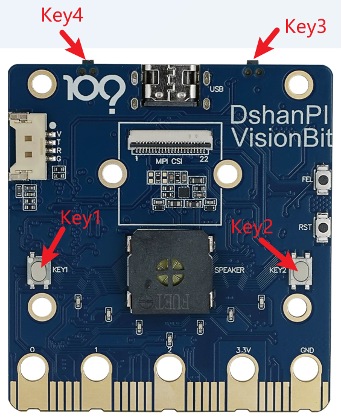
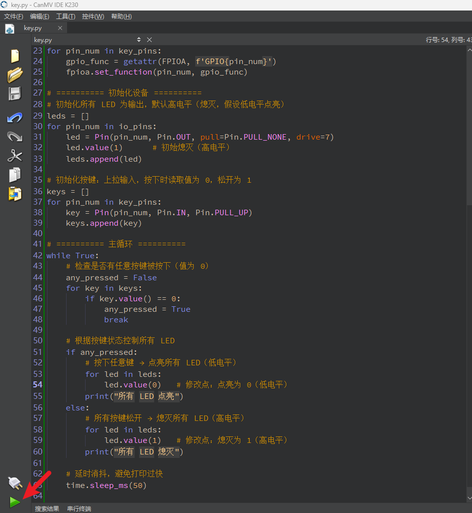

# Key 按键

## 1.实验目的

通过本实验，掌握以下技能：

- 理解 FPIOA 的作用和使用方法
- 掌握 GPIO 引脚输入与输出的配置方式
- 实现通过两个按键控制 LED 灯的点亮和熄灭


## 2.原理解析

K230 的引脚功能是通过 FPIOA（灵活外设输入输出阵列）模块进行配置的，用户可以将任意物理引脚映射为所需功能，例如 GPIO 输入/输出、UART、PWM 等。

本实验中：

- 使用 FPIOA 将引脚 52 设置为 GPIO 输出，连接 LED；
- 使用 FPIOA 将引脚 46 和 47 设置为 GPIO 输入，接入两个按键；
- 按下 GPIO46，点亮 LED；
- 按下 GPIO47，熄灭 LED。

我们可以通过查看原理图看到两个按键连接的GPIO。



按键在硬件上的位置：



## 3.代码解析

```python
from machine import Pin, FPIOA
```
- 从 `machine` 模块中导入 `Pin` 和 `FPIOA` 类。
- `Pin` 用于操作 GPIO 引脚（设置输入、输出、读取电平等）
- `FPIOA` 用于将物理引脚映射到不同的功能（例如普通 GPIO、UART、PWM 等）

```python
import time
```
- 导入 `time` 模块，用于延时（如消抖或避免主循环过快）

```python
fpioa = FPIOA()
```
- 创建一个 `FPIOA` 实例对象，用来配置引脚映射关系。

### 设置 LED 引脚功能（多个）
```python
io_pins = [5, 13, 12, 33, 2, 28, 26]
for pin_num in io_pins:
    gpio_func = getattr(FPIOA, f'GPIO{pin_num}')
    fpioa.set_function(pin_num, gpio_func)
```
- 定义 LED 使用的物理引脚列表 `io_pins`。
- 遍历每个引脚号，通过 `getattr` 动态获取对应的 GPIO 功能常量（例如 `FPIOA.GPIO5`）。
- 调用 `fpioa.set_function()` 将物理引脚映射为同号的 GPIO 功能。

### 设置按键引脚功能（多个）
```python
key_pins = [14, 18, 29, 27]
for pin_num in key_pins:
    gpio_func = getattr(FPIOA, f'GPIO{pin_num}')
    fpioa.set_function(pin_num, gpio_func)
```
- 定义按键使用的物理引脚列表 `key_pins`。
- 同样为每个按键引脚映射为对应的 GPIO 功能。

### 实例化 LED 对象（多个）
```python
leds = []
for pin_num in io_pins:
    led = Pin(pin_num, Pin.OUT, pull=Pin.PULL_NONE, drive=7)
    led.value(1)      # 初始熄灭（高电平熄灭，假设低电平点亮）
    leds.append(led)
```
- 创建空列表 `leds` 存储 LED 对象。
- 遍历 LED 引脚号：
  - 创建 `Pin` 对象，设置为 **输出模式**（`Pin.OUT`），无上下拉（`Pin.PULL_NONE`），驱动能力 `7`（最大）。
  - 初始输出高电平 `1`（熄灭），因为假设 LED 低电平点亮。
  - 将对象添加到 `leds` 列表。

### 实例化按键对象（多个）
```python
keys = []
for pin_num in key_pins:
    key = Pin(pin_num, Pin.IN, Pin.PULL_UP)
    keys.append(key)
```
- 创建空列表 `keys` 存储按键对象。
- 遍历按键引脚号：
  - 创建 `Pin` 对象，设置为 **输入模式**（`Pin.IN`），并开启 **上拉电阻**（`Pin.PULL_UP`）。
  - 未按下时读取值为 `1`，按下时读取值为 `0`（因为按键另一端接地）。
  - 将对象添加到 `keys` 列表。

### 主循环：持续监测按键并控制 LED
```python
while True:
    any_pressed = False
    for key in keys:
        if key.value() == 0:   # 检测到按下（低电平）
            any_pressed = True
            break

    if any_pressed:
        # 点亮所有 LED（输出低电平）
        for led in leds:
            led.value(0)
        print("所有 LED 点亮")
    else:
        # 熄灭所有 LED（输出高电平）
        for led in leds:
            led.value(1)
        print("所有 LED 熄灭")

    time.sleep_ms(50)   # 延时 50ms，消抖并避免打印过快
```
- **无限循环**，持续检测按键状态。
- 遍历所有按键对象，调用 `key.value()` 读取电平：
  - 如果任意按键读值为 `0`（按下），则设置 `any_pressed = True` 并跳出检测循环。
- 根据 `any_pressed` 决定 LED 行为：
  - **True**（有按键按下）：遍历 `leds`，将每个 LED 输出 **低电平 `0`**（点亮）。
  - **False**（所有按键松开）：遍历 `leds`，将每个 LED 输出 **高电平 `1`**（熄灭）。
- 打印状态信息（可选）。
- `time.sleep_ms(50)` 延时 50 毫秒，起到简单消抖作用，同时避免串口打印过快。

## 4.示例代码

```
'''
本程序遵循GPL V3协议, 请遵循协议
实验平台: DshanPI CanMV
开发板文档站点	: https://eai.100ask.net/
百问网学习平台   : https://www.100ask.net
百问网官方B站    : https://space.bilibili.com/275908810
百问网官方淘宝   : https://100ask.taobao.com
'''
from machine import Pin, FPIOA
import time

# ========== 初始化 FPIOA 并映射功能 ==========
fpioa = FPIOA()

# 需要控制的 LED 引脚列表（物理引脚号 -> 映射到同号 GPIO）
io_pins = [5, 13, 12, 33, 2, 28, 26]
for pin_num in io_pins:
    gpio_func = getattr(FPIOA, f'GPIO{pin_num}')
    fpioa.set_function(pin_num, gpio_func)

# 按键引脚映射（物理引脚 -> GPIO）
key_pins = [14, 18, 29, 27]
for pin_num in key_pins:
    gpio_func = getattr(FPIOA, f'GPIO{pin_num}')
    fpioa.set_function(pin_num, gpio_func)

# ========== 初始化设备 ==========
# 初始化所有 LED 为输出，默认高电平（熄灭，假设低电平点亮）
leds = []
for pin_num in io_pins:
    led = Pin(pin_num, Pin.OUT, pull=Pin.PULL_NONE, drive=7)
    led.value(1)      # 初始熄灭（高电平）
    leds.append(led)

# 初始化按键：上拉输入，按下时读取值为 0，松开为 1
keys = []
for pin_num in key_pins:
    key = Pin(pin_num, Pin.IN, Pin.PULL_UP)
    keys.append(key)

# ========== 主循环 ==========
while True:
    # 检查是否有任意按键被按下（值为 0）
    any_pressed = False
    for key in keys:
        if key.value() == 0:
            any_pressed = True
            break

    # 根据按键状态控制所有 LED
    if any_pressed:
        # 按下任意键 → 点亮所有 LED（低电平）
        for led in leds:
            led.value(0)   # 修改点：点亮为 0（低电平）
        print("所有 LED 点亮")
    else:
        # 所有按键松开 → 熄灭所有 LED（高电平）
        for led in leds:
            led.value(1)   # 修改点：熄灭为 1（高电平）
        print("所有 LED 熄灭")

    # 延时消抖，避免打印过快
    time.sleep_ms(50)
```


## 4.实验结果

连接开发板后在CanMV IDE K230中运行示例代码：



运行完成后，按下Key1/Key2/Key3/Key4会使LED灯点亮，松开任意键会使LED灯点亮。