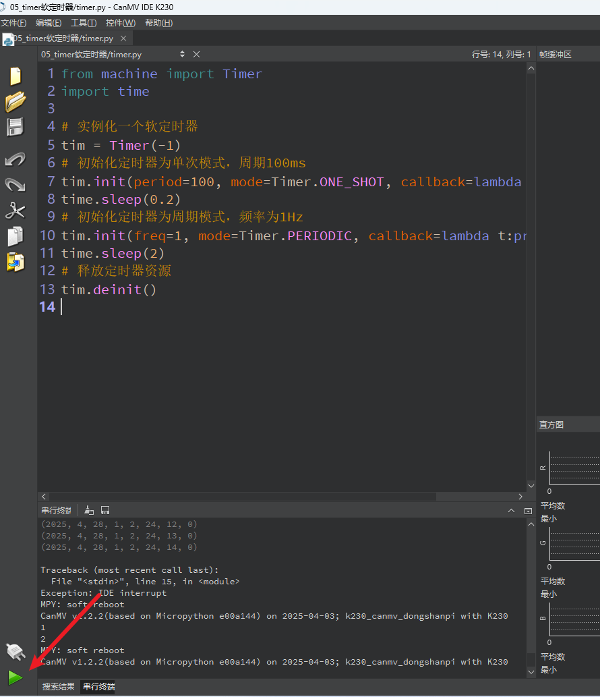

# Timer 定时器

​	在嵌入式开发中，**定时器（Timer）** 是非常常用的工具，常用于周期性任务、延时执行、硬件控制等功能。MicroPython 提供了 `machine.Timer` 类，允许我们通过软件方式快速实现定时控制逻辑。

本文将通过一个简单实例，逐步讲解如何使用 `Timer` 实现单次定时和周期定时任务。

## 1.实验目的

学习定时器的使用。

## 2.实验原理

**定时器（Timer）** 是微控制器内部的一个硬件模块，它通过时钟脉冲进行计数，能在指定的时间间隔内执行某些任务。定时器是实现**延时、周期性任务、中断触发**等功能的基础。

定时器不仅可以“数时间”，还可用于测量脉冲宽度、频率、捕捉外部事件等。

| 模式                     | 描述                                           |
| ------------------------ | ---------------------------------------------- |
| **单次模式（One-shot）** | 定时器只运行一次，到达时间后停止。             |
| **周期模式（Periodic）** | 定时器每到达设定时间就重新开始，持续触发事件。 |


## 3.代码解析

###  导入模块

```
from machine import Timer
import time
```

`Timer` 是定时器类，位于 `machine` 模块中。

`time` 模块用于阻塞延时。

### 创建定时器对象

```
tim = Timer(-1)
```

创建一个软件定时器。参数 `-1` 表示这是一个**软件定时器**，由 CPU 模拟实现。

如果使用硬件定时器（部分芯片支持），可以传入 0、1、2 等编号。

### 单次模式定时器

```
tim.init(period=100, mode=Timer.ONE_SHOT, callback=lambda t:print(1))
```

`period=100` 表示 100 毫秒后触发。

`mode=Timer.ONE_SHOT` 表示单次执行。

`callback=lambda t:print(1)` 是触发时调用的回调函数，这里打印数字 1。

```
time.sleep(0.2)
```

程序暂停 0.2 秒（200ms），保证我们能看到定时器打印结果。

### 周期模式定时器

```
tim.init(freq=1, mode=Timer.PERIODIC, callback=lambda t:print(2))
```

`freq=1` 表示每秒触发一次（1Hz）。

`mode=Timer.PERIODIC` 表示周期性执行。

回调函数打印数字 2。

```
time.sleep(2)
```

让程序运行 2 秒，以便观察定时器打印 2 的过程（会打印 2 次）。

### 停止并释放定时器

```
tim.deinit()
```

关闭定时器，释放资源，避免占用系统资源或出现意外触发。

## 4.示例代码

```
'''
本程序遵循GPL V3协议, 请遵循协议
实验平台: DshanPI CanMV
开发板文档站点	: https://eai.100ask.net/
百问网学习平台   : https://www.100ask.net
百问网官方B站    : https://space.bilibili.com/275908810
百问网官方淘宝   : https://100ask.taobao.com
'''
from machine import Timer
import time

# 实例化一个软定时器
tim = Timer(-1)
# 初始化定时器为单次模式，周期100ms
tim.init(period=100, mode=Timer.ONE_SHOT, callback=lambda t:print(1))
time.sleep(0.2)
# 初始化定时器为周期模式，频率为1Hz
tim.init(freq=1, mode=Timer.PERIODIC, callback=lambda t:print(2))
time.sleep(2)
# 释放定时器资源
tim.deinit()
```


## 5.实验结果

连接开发板后在CanMV IDE K230中运行示例代码：



运行完成后，会输出1和2。第一个 "1" 来自 100ms 后的单次定时器。


## 6.控制LED的定时器示例代码

```
'''
  Copyright (C) 2008-2023 深圳百问网科技有限公司
  All rights reserved

 免责声明: 百问网编写的程序, 用于商业用途请遵循GPL许可, 百问网不承担任何后果！

 本程序遵循GPL V3协议, 请遵循协议
 百问网学习平台   : https://www.100ask.net
 百问网交流社区   : https://forums.100ask.net
 百问网官方B站    : https://space.bilibili.com/275908810
 本程序所用开发板 : DshanPI-CanMV开发板
 开发板文档站点	： https://eai.100ask.net/
 百问网官方淘宝   : https://100ask.taobao.com
 联系我们(E-mail) : weidongshan@100ask.net
'''
from machine import Pin, FPIOA, Timer
import time

# ========== FPIOA 映射 ==========
fpioa = FPIOA()

# 需要控制的 LED 引脚列表（物理引脚号）
io_pins = [5, 13, 12, 33, 2, 28, 26]

# 将每个物理引脚映射到同号的 GPIO 功能
for pin_num in io_pins:
    gpio_func = getattr(FPIOA, f'GPIO{pin_num}')
    fpioa.set_function(pin_num, gpio_func)

# ========== 初始化 LED 引脚为输出模式 ==========
leds = []
for pin_num in io_pins:
    led = Pin(pin_num, Pin.OUT, pull=Pin.PULL_NONE, drive=7)
    led.value(0)      # 初始熄灭（假设低电平点亮，若高电平点亮请改为 0）
    leds.append(led)

# ========== 定时器回调函数：点亮所有 LED ==========
def turn_on_all_leds(t):
    for led in leds:
        led.value(1)      # 点亮 LED（根据实际电路，可能是 0 或 1，此处假设高电平点亮）
    print("所有 LED 已点亮（定时器触发）")

# ========== 创建定时器并设置为单次模式 ==========
tim = Timer(-1)               # 创建一个软件定时器
tim.init(period=1000, mode=Timer.ONE_SHOT, callback=turn_on_all_leds)   # 延时 1000ms 后点亮

print("定时器已启动，1 秒后将点亮所有 LED...")

# ========== 主线程：保持运行一段时间，然后停止定时器 ==========
time.sleep(2)                 # 等待定时器执行完毕
tim.deinit()                  # 停止定时器（可选）
print("定时器已释放，LED 保持点亮状态")

```

