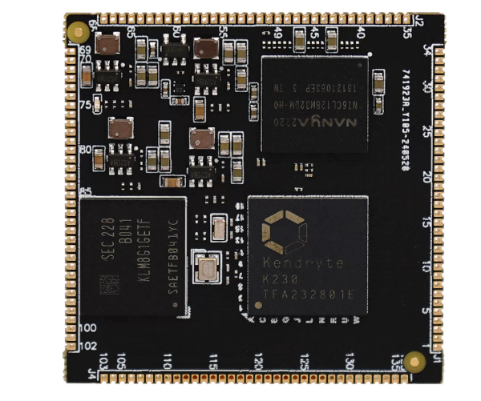

# K230 嵌入式 AI 全栈开发手册

本手册围绕 DshanPI-CanMV 与嘉楠 K230，系统介绍开发板上手、K230 SDK 环境、RT-Smart 应用与驱动开发，以及 AI 模型转换、验证和部署流程。内容依据原始 Word 手册完整整理，并按主题拆分以便在线阅读。

> 本文档根据《嘉楠K230开发手册》V1.0（2024-11-30）整理。正文、表格、示例代码与插图均来自原始手册。

## 阅读导航

1. [课程介绍](./course-introduction)
2. [资料下载](./materials-download)
3. [开发环境搭建指南](./development-environment)
4. [RT-Smart 基础](./rt-smart-basics)
5. [线程管理](./thread-management)
6. [同步互斥与通信](./synchronization-and-ipc)
7. [消息队列](./message-queue)
8. [邮箱](./mailbox)
9. [信号和信号量](./signals-and-semaphores)
10. [互斥量（Mutex）](./mutex)
11. [事件集](./event-set)
12. [RT-Smart 驱动程序开发](./driver-development)
13. [AI 应用开发](./ai-application-development)

## 适用硬件

嘉楠K230 LPDDR3配置。

深圳百问网科技有限公司

2024.11.30

> 手册属性

| 类别 | 嵌入式开发 |
| --- | --- |
| 文档名 | 嘉楠K230开发手册 |
| 当前版本 | 1.0 |
| 适用型号 | DshanPI-CanMV |
| 编辑 | 百问科技文档编辑团队 |
| 审核 | 韦东山 |

> 更新记录

| 更新日期 | 更新内容 | 更新版本 | 审核 |
| --- | --- | --- | --- |
| 2024/11/30 | 初始版本 | V1.0 |  |
