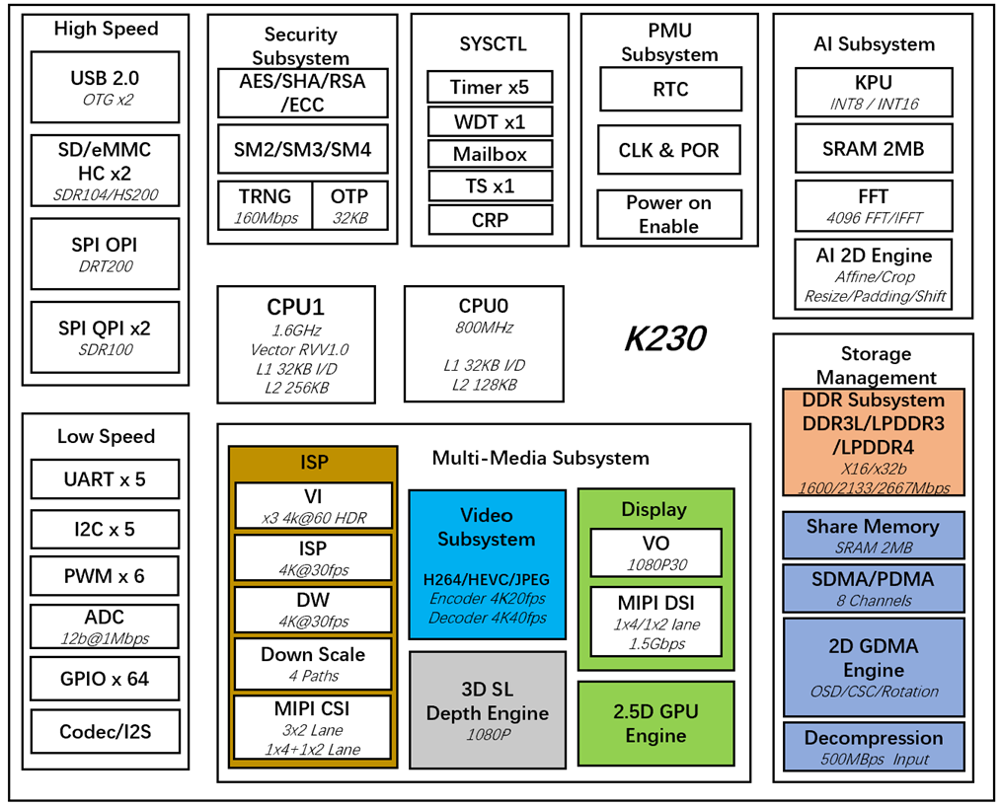
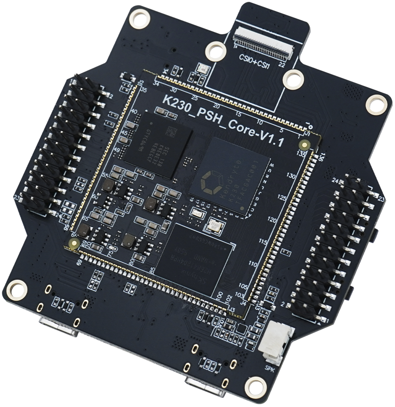

# 课程介绍

> 本文档根据《嘉楠K230开发手册》V1.0（2024-11-30）整理。正文、表格、示例代码与插图均来自原始手册。

## 课程内容

RT-Thread Smart 是基于 RT-Thread 操作系统上的混合操作系统，简称为 rt-smart，它把应用从内核中独立出来，形成独立的用户态应用程序，并具备独立的地址空间（32 位系统上是 4G 的独立地址空间）。

相比于常规的RTOS，比如FreeRTOS，rt-smart支持内核态、用户态隔离，用户程序之间相互隔离，是的整个系统更加健壮可靠：不会因为某个APP而导致整个系统崩溃。

相比于Linux，rt-smart代码更加精简，启动更快，在很多场景更加适合，比如需要快速启动的产品：车载摄像头、智能门锁等等。

作为优秀的国产操作系统，rt-smart的代码结构没有Linux那么臃肿复杂，特别适合高等院校用来开设操作系统课程。

本教程有如下内容：

① rt-smart里跟rt-thread类似的线程开发、线程间同步互斥等操作

② rt-smart的内核特性，比如微内核等特性

③ rt-samrt的APP开发：用户进程、线程开发

④ rt-smart驱动程序开发

## 硬件平台

**硬件资源简介：**

DshanPI-CanMV开发板是百问网针对AI应用开发设计出来的一个RSIC-V架构的AI开发板，主要用于学习使用嘉楠的K230芯片进行大小核项目开发和嵌入式AI应用开发等用途。DshanPI-CanMV开发板采用嘉楠科技Kendryte®系列AIoT芯片中的最新一代SoC芯片K230。该芯片采用全新的多异构单元加速计算架构，集成了2个RISC-V高能效计算核心，内置新一代KPU（Knowledge Process Unit）智能计算单元，具备多精度AI算力，广泛支持通用的AI计算框架，部分典型网络的利用率超过了70%。

该芯片同时具备丰富多样的外设接口，以及2D、2.5D等多个标量、向量、图形等专用硬件加速单元，可以对多种图像、视频、音频、AI等多样化计算任务进行全流程计算加速，具备低延迟、高性能、低功耗、快速启动、高安全性等多项特性。

**详细介绍：**

DshanPI-CanMV采用核心板+底板设计，扩展接口丰富，极大程度的发挥K230高性能的优势，可直接用于各种智能产品的开发，加速产品落地。

| 特征 | 描述 |
| --- | --- |
| 处理器 | 嘉楠 勘智K230 |
| 内存 | 512MB/1GB/2GB LPDDR3 |
| 存储 | 8GB/32GB EMMC |
| WIFI/蓝牙 | 天线：2.4GHz |
| 视频输出 | MIPI显示(MIPI DSI) |
| 视频输入 | 3路MIPI摄像头(MIPI CSI *3) |
| 音频输入 | MIC咪头 |
| 音频输出 | 耳机 |
| USB接口 | 3路USB-TypeA |
| 其他连接器 | ·TF卡槽 · · JTAG调试口 |

**适用开发板示意图：**

CANMV V2

.jpg)

CANMV V3

## 师资介绍

百问网成立于2012年，但是创始人韦东山在2008年已经从事嵌入式软件培训，至今已经15年。

本课程由百问网团队创作，主讲人是韦东山。

韦东山简介：

• 中国科学技术大学物理电子、计算机双学位

• 2003~2004年：珠海友通科技有限公司，硬件板卡开发、驱动开发

• 2004~2005年：深圳神通行科技有限公司，开发基于GSM模块的车载电话，先负责硬件开发，再负责软件开发，进而领导团队

• 2005~2007年：深圳中兴股份有限公司，从事Linux BSP开发。

• 2007~2008年：辞职写书《嵌入式Linux应用开发完全手册》，很畅销

• 2008~2011年：作为特聘讲师在各大培训机构讲课，没有入职这些公司，所以可以同时在各机构讲课

• 2011年至今：创立深圳百问网科技有限公司，从事嵌入式Linux培训。所录制的Linux视频在51CTO、CSDN等网站受众200万以上。

• 2020年：成为首批HarmonyOS系统课程开发者，获得开发原子开源基金会OpenHarmony项目组开发者贡献奖。

• 2021年：开发RTOS培训教程，可以在B站搜“FreeRTOS”、“RT-Thread”，处于前列。其中RT-Thread的课程被放到了官网：[https://www.rt-thread.org/video.html#video-neihe](https://www.rt-thread.org/video.html#video-neihe)

• 各大芯片厂家合作伙伴：嘉楠、全志、ST、瑞萨、平头哥

• 深圳职业技术大学外聘讲师

---

版权所有：深圳百问网科技有限公司
未经授权不得拷贝、复制、修改、传播本文档，否则将追究法律责任。
