# 开发环境搭建指南

> 本文档根据《嘉楠K230开发手册》V1.0（2024-11-30）整理。正文、表格、示例代码与插图均来自原始手册。

前提条件：Ubuntu20.04。可访问资料光盘中获取Ubuntu虚拟机

如果没有Ubuntu环境可以使用虚拟机，vmware下载链接：[https://www.vmware.com/products/desktop-hypervisor.html](https://www.vmware.com/products/desktop-hypervisor.html)

## 使用Vmware开启Ubuntu虚拟机

访问资料目录中的03\_Ubuntu虚拟机/


该目录中包含Vmware安装包和Ubuntu虚拟机。下面将演示如何安装Vmware并打开Ubuntu虚拟机。

-   双击打开VMware-workstation-full-17.5.2-23775571.exe文件

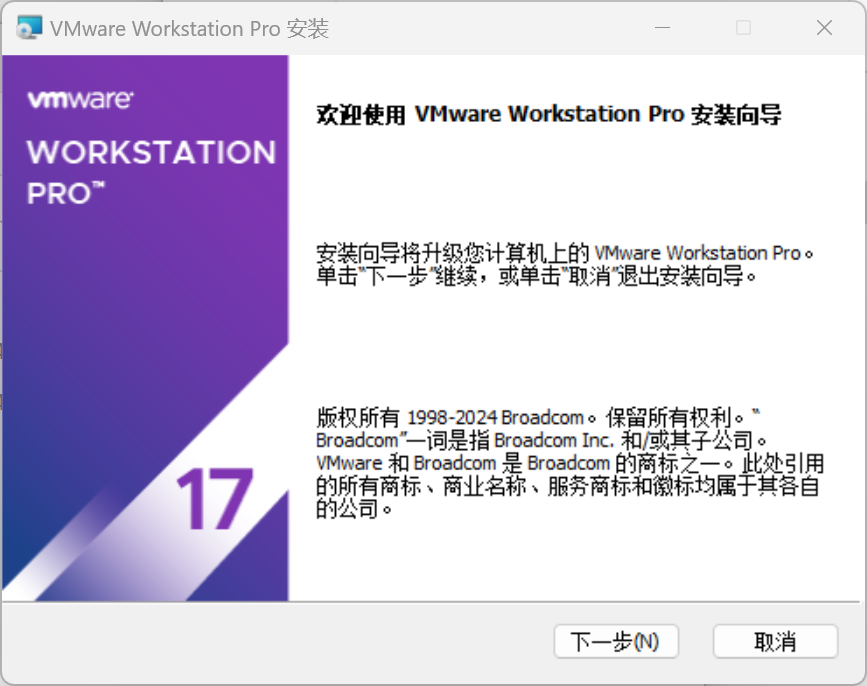

一直点击下一步即可安装VMware虚拟机软件。

-   解压Ubuntu虚拟机压缩包Ubuntu\_20.04.4\_VM.zip
-   使用VMware开启Ubuntu虚拟机：
-   打开Vmware软件
-   查看软件顶部的选项卡，点击**文件**，如下图所示：

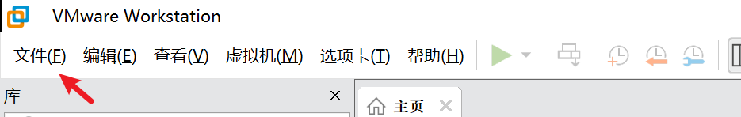

-   点击打开，弹出文件资源管理器，此我们我们需要跳转至解压后的Ubuntu虚拟机路径
-   选择Ubuntu\_20.04.4\_VM目录下的Ubuntu镜像文件Ubuntu\_20.04.4\_VM\_LinuxVMImages.COM.vmx，如下图所示：

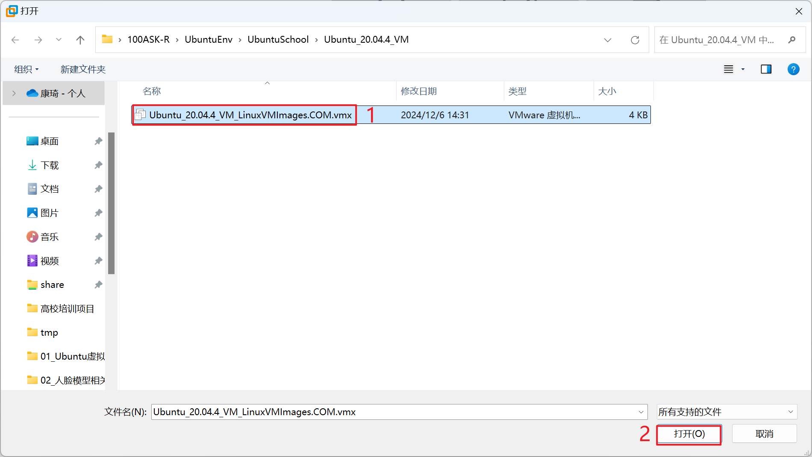

-   点击开启此虚拟机

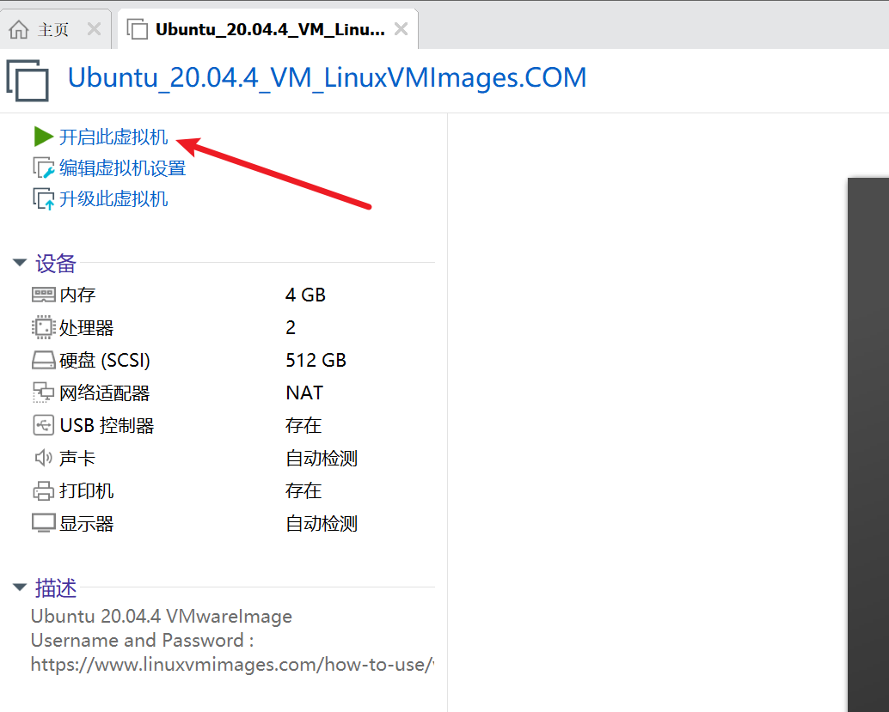

-   第一次打开会提示虚拟机已经复制的对话框，点击**我已复制虚拟机**


-   等待数秒，系统就会自动启动了，启动以后 鼠标点击 **Ubuntu** 字样，就可以进入登录对话框，输入 密码 ubuntu 即可登录进入ubuntu系统内。

## K230 SDK环境搭建

### 配置RT-Smart SDK环境

1.  **使用apt安装软件包**

更新apt软件源：

```text
sudo apt update
```

安装软件包：

```text
sudo apt-get install -y --fix-broken --fix-missing --no-install-recommends \
  sudo vim wget curl git git-lfs openssh-client net-tools sed tzdata expect mtd-utils inetutils-ping locales \
  sed make binutils build-essential diffutils gcc g++ bash patch gzip bzip2 perl tar cpio unzip rsync file bc findutils \
  dosfstools mtools bison flex autoconf automake \
  libc6-dev-i386 libncurses5:i386 libssl-dev \
  python3 python3-pip python-is-python3 \
  lib32z1 scons libncurses5-dev \
  kmod fakeroot pigz tree doxygen gawk pkg-config libyaml-dev libconfuse2 libconfuse-dev cmake
```

1.  **修改pip为清华源**

编辑“pip”的配置文件，设置全局的“pip”配置选项

```text
sudo vi /etc/pip.conf
```

修改内容为：

```text
[global]
timeout = 60
index-url = https://pypi.tuna.tsinghua.edu.cn/simple
extra-index-url = https://mirrors.aliyun.com/pypi/simple/ https://mirrors.cloud.tencent.com/pypi/simple
```

1.  **使用pip安装软件**

```text
python3 -m pip install -U pyyaml pycryptodome gmssl \
numpy==1.19.5 protobuf==3.17.3 Pillow onnx==1.9.0 onnx-simplifier==0.3.6 onnxoptimizer==0.2.6 onnxruntime==1.8.0 cmake
```

**注意：**如遇到ModuleNotFoundError: No module named 'setuptools.extern.six'报错可跳过，继续往下执行。

1.  **安装微软软件包**
2.  使用wget下载一个名为“packages-microsoft-prod.deb”的文件，并将其保存到当前目录。

```text
wget https://packages.microsoft.com/config/ubuntu/20.04/packages-microsoft-prod.deb -O packages-microsoft-prod.deb
```

1.  用“dpkg”工具安装软件包。

```text
sudo dpkg -i packages-microsoft-prod.deb && rm packages-microsoft-prod.deb
```

1.  更新软件源

```text
sudo apt-get update
```

1.  安装两个软件包.NET和 ICU（国际组件）的开发库

```text
sudo apt-get install -y dotnet-runtime-7.0 libicu-dev
```

1.  **安装磁盘镜像工具**
2.  创建临时文件夹

```text
mkdir tmp
```

1.  获取磁盘镜像工具安装包

```text
wget https://github.com/pengutronix/genimage/releases/download/v16/genimage-16.tar.xz -O ./tmp/genimage-16.tar.xz
```

1.  进入临时文件夹

```text
cd tmp/
```

1.  解压安装压缩包

```text
tar -xf genimage-16.tar.xz
```

1.  进入工具源码目录

```text
cd genimage-16
```

1.  编译源码

```text
./configure \
&& make -j \
```

1.  安装程序

```text
sudo make install && cd ../../
```

1.  **清理缓存**

```text
sudo rm -rf /var/lib/apt/lists/*
```

1.  **设置系统默认语言和字符编码**

```text
sudo localedef -i en_US -c -f UTF-8 -A /usr/share/locale/locale.alias en_US.UTF-8
```

1.  **创建工具链路径**

```text
sudo mkdir -p /opt/toolchain/
```

### 编译RT-Smart + Linux SDK

1.  **进入SDK根目录**

```text
cd k230_sdk
```

1.  **下载toolchain**

```text
source tools/get_download_url.sh && make prepare_sourcecode
```

1.  **进入docker环境**

```text
sudo docker run -u root -it -v $(pwd):$(pwd) -v $(pwd)/toolchain:/opt/toolchain -w $(pwd) ghcr.io/kendryte/k230_sdk /bin/bash
```

1.  **编译SDK**

```text
make CONF=k230_canmv_dongshanpi_defconfig
```

注意：sdk不支持多进程编译，不要增加类似-j32多进程编译参数。

如果要退出docker环境输入**exit**

编译完成后，在\`output/xx\_defconfig/images\`目录下可以看到编译输出产物。

```text
.
├── big
│   ├── mpp
│   └── rt-smart
├── common
│   ├── big-opensbi
│   ├── cdk
│   └── little-opensbi
├── images
│   ├── big-core
│   ├── k230_canmv_dongshanpi_sdcard_v1.6_nncase_v2.8.3.img.gz -> sysimage-sdcard.img.gz
│   ├── little-core
│   ├── sysimage-sdcard.img
│   └── sysimage-sdcard.img.gz
└── little
├── buildroot-ext
├── linux
└── uboot
```

“images”目录下镜像文件说明如下：

“sysimage-sdcard.img”——是sd和emmc的非安全启动镜像；

“sysimage-sdcard.img.gz”——是SD和emmc的非安全启动镜像压缩包(sysimage-sdcard.img文件的gzip压缩包)，烧录时需要先解压缩。

“sysimage-sdcard\_aes.img.gz”是SD和emmc的aes安全启动镜像压缩包，烧录时需要先解压缩。

“sysimage-sdcard\_sm.img.gz”是SD和emmc的sm安全启动镜像压缩包，烧录时需要先解压缩。

安全镜像默认不会产生，如果需要安全镜像请参考4.3.4使能安全镜像。

大核系统的编译产物放在“images/big-core”目录下。

小核系统的编译产物放在“images/little-core”目录下。

## K230\_SDK使用指南

### 概述

1.  **SDK软件架构概述**

K230 SDK 是面向K230 开发板的软件开发包，包含了基于Linux&RT-smart 双核异构系统开发需要用到的源代码，工具链和其他相关资源。

K230 SDK 软件架构层次如图 1-1 所示：

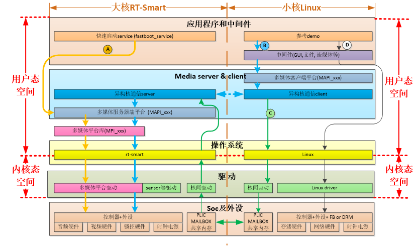

图1-1 K230 SDK 软件架构图

### SDK 编译

1.  **编译介绍**

K230 SDK支持一键编译大小核操作系统和公共组件，生成可以烧写的镜像文件，用于部署到开发板启动运行。设备上linux系统的用户名是root无密码；

1.  **SDK 配置**

K230 SDK采用Kconfig作为SDK配置接口，默认支持的板级配置放在configs目录下。

K230 SDK采用Kconfig作为SDK配置接口，默认支持的板级配置放在configs目录下。

2.1 **配置文件说明**

“k230\_evb\_defconfig”：基于K230 USIP LP3 EVB的默认SDK配置文件

“k230\_evb\_usiplpddr4\_defconfig”：基于K230 USIP LP4 EVB的默认SDK配置文件

“k230d\_defconfig”：基于K230-SIP-EVB的默认SDK配置文件

“k230\_evb\_nand\_defconfig”：基于K230 USIP LP3 EVB会生成nand镜像的默认SDK配置文件

“k230\_canmv\_defconfig”：基于K230-PI(canmv)的默认SDK配置文件

“k230\_canmv\_dongshanpi\_defconfig”：基于东山PI(canmv)的默认SDK配置文件

### SDK产物介绍

SDK的编译请参考《SDK环境搭建》章节。

1.  **编译输出产物**

编译完成后，在“output/xx\_defconfig/images”目录下可以看到编译输出产物。

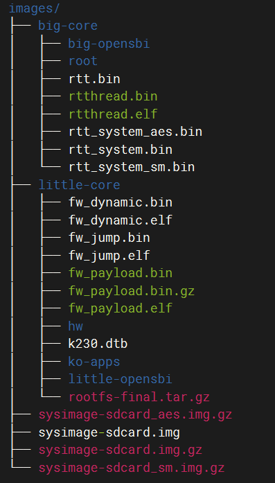

“images”目录下镜像文件说明如下：

“sysimage-sdcard.img”——是sd和emmc的非安全启动镜像；

“sysimage-sdcard.img.gz”——是SD和emmc的非安全启动镜像压缩包(sysimage-sdcard.img文件的gzip压缩包)，烧录时需要先解压缩。

“sysimage-sdcard\_aes.img.gz”是SD和emmc的aes安全启动镜像压缩包，烧录时需要先解压缩。

“sysimage-sdcard\_sm.img.gz”是SD和emmc的sm安全启动镜像压缩包，烧录时需要先解压缩。

安全镜像默认不会产生，如果需要安全镜像请参考4.3.4使能安全镜像。

大核系统的编译产物放在“images/big-core”目录下。

小核系统的编译产物放在“images/little-core”目录下。

1.  **非快起镜像**

sdk默认编译的是快起镜像(uboot直接启动系统，不会进入uboot命令行)，如果需要进入uboot命令行，请参考下面取消“CONFIG\_QUICK\_BOOT”配置：

在sdk主目录 执行“make menuconfig”，选择“board configuration”，取消“quick boot”配置选项。

非快起系统变快起系统方法：进入uboot命行执行“setenv quick\_boot true;saveenv;”

1.  **安全镜像**

sdk默认不产生安全镜像，如果需要安全镜像，请参考下面增加**CONFIG\_GEN\_SECURITY\_IMG**配置：

在sdk主目录 执行“make menuconfig”，选择“board configuration”，配上“create security image”选项。

1.  **debug镜像**

sdk默认产生release镜像，如果需要调试镜像，请参考下面增加**CONFIG\_BUILD\_DEBUG\_VER**配置：

在sdk主目录 执行“make menuconfig”，选择“build debug/release version”，配上“debug”选项。

### SDK内存配置

在k230\_sdk下运行\`make menuconfig->Memory configuration\`可以配置各个区域使用的内存空间，也可以直接编译configs/k230\_evb\_defconfig修改，各区域说明如下

```text
CONFIG_MEM_TOTAL_SIZE="0x20000000"      #内存总体容量          不支持配置
CONFIG_MEM_PARAM_BASE="0x00000000"      #参数分区起始地址       不支持配置
CONFIG_MEM_PARAM_SIZE="0x00100000"      #参数分区大小           不支持配置
CONFIG_MEM_IPCM_BASE="0x00100000"       #核间通讯起始地址       不支持配置
CONFIG_MEM_IPCM_SIZE="0x00100000"       #核间通讯共享内存大小    不支持配置
CONFIG_MEM_RTT_SYS_BASE="0x00200000"    #大核RTT起始地址        支持配置
CONFIG_MEM_RTT_SYS_SIZE="0x07E00000"    #大核RTT使用的地址范围   支持配置
CONFIG_MEM_AI_MODEL_BASE="0x1FC00000"   #AI模型加载起始地址      支持配置
CONFIG_MEM_AI_MODEL_SIZE="0x00400000"   #AI模型加载地址区域      支持配置
CONFIG_MEM_LINUX_SYS_BASE="0x08000000"  #小核linux起始地址       支持配置
CONFIG_MEM_LINUX_SYS_SIZE="0x08000000"  #小核linux地址区域       支持配置
CONFIG_MEM_MMZ_BASE="0x10000000"        #mmz共享内存其实地址     支持配置
CONFIG_MEM_MMZ_SIZE="0x0FC00000"        #mmz 共享内存区域       支持配置
CONFIG_MEM_BOUNDARY_RESERVED_SIZE="0x00001000"  #隔离区         不支持配置
```

## 常用命令

### 常用命令

1.  基础编译命令

| 命令 | 解释 |
| --- | --- |
| source tools/get_download_url.sh && make prepare_sourcecode | 下载toolchain和准备源码 |
| sudo mount --bind $(pwd)/toolchain /opt/toolchain | 挂载工具链目录 |
| make CONF=k230_canmv_dongshanpi_defconfig prepare_memory | 配置板级型号 |
| make CONF=k230_canmv_dongshanpi_defconfig | 编译SDK |

1.  所有命令解析

| 命令 | 解释 |
| --- | --- |
| make CONF=k230_canmv_dongshanpi_defconfig | 编译dshanpi-canmv开发板配置，会编译生成相应配置的固件 |
| make | 构建k230 SDK所有配置项 |
| make prepare_sourcecode | 下载并准备源码 |
| make little-core-opensbi | 构建k230小核心opensbi |
| make big-core-opensbi | 构建k230大核心opensbi |
| make mpp-apps | 构建mpp内核驱动程序用户api lib和k230的示例代码 |
| make rt-smart | 构建mpp rtsmart内核、userapps和opensbi |
| make rt-smart-kernel | 构建rtsmart内核 |
| make rt-smart-apps | 构建rtsmart用户应用程序 |
| make cdk-kernel | 构建CDK内核代码 |
| make cdk-kernel-install | 将CDK内核的编译产品安装到rt-smart和rootfs |
| make cdk-user | 构建CDK用户代码 |
| make cdk-user-install | 将CDK用户的编译产品安装到rt-smart和rootfs |
| make uboot | 用defconfig构建k230 uboot代码 |
| make uboot-menuconfig | uboot的Menufonig，选择保存将保存到 output/xxx_defconfig/little/uboot/.config |
| make uboot-savedefconfig | 将uboot配置保存到output/xxx_defconfig/little/uboot/defconfig |
| make uboot-rebuild | 重建k230 uboot |
| make uboot-clean | 在k230 uboot构建目录中执行clean，运行make uboo-reputation将构建所有源代码 |
| make linux | 用defconfig构建k230 Linux代码 |
| make linux-rebuild | 重建k230 Linux内核 |
| make linux-menuconfig | Linux内核的Menufonig，选择保存将保存到output/xxx_defconfig/little/linux/.config |
| make linux-savedefconfig | 将Linux内核配置保存到output/xxx_defconfig/little/linux/defconfig |
| make linux-clean | 在Linux内核构建目录中进行clean，运行make linux-restart将构建所有源代码 |
| make buildroot | 用defconfig构建k230 buildroot |
| make buildroot-rebuild | 重建k230 buildroot |
| make buildroot-menuconfig | k230 buildroot的Menufonig，选择保存将保存到output/xxx_defconfig/little/buildroot-ext/.config |
| make buildroot-savedefconfig | 将buildroot配置保存到src/little/buildroot-ext/configs/xxx_defconfig |
| make buildroot-clean | 清理k230 buildroot构建目录，清理后，运行make buildroot-reputation将失败，因为构建目录不存在。运行使buildroot来构建; |
| make build-image | 构建k230 rootfs镜像 |

## 开发板文件传输

**软件要求：**

1.  Ubuntu20.04

**硬件要求：**

1.  DshanPI-CanMV开发板
2.  天线 x1
3.  ADB
4.  SCP
5.  TFTP

您可以选择其中一种进行文件传输！！建议**ADB**进行文件传输！！

### 使用ADB进行文件传输

在使用ADB进行文件传输前，请确保上电前使用Type-C数据线将开发板的OTG口与电脑相连！连接后请连接debug&5V进行上电。上电后等待小核Linux启动后可以在电脑端找到ADB设备，如下所示：

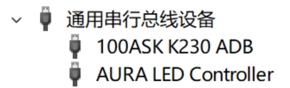

建议选择其中一种方式进行文件传输！！

1.  **Windows进行文件传输**

注意：如果您开启了虚拟机，新连接的设备可能会被Vmware拦截！！请选择ADB设备连接至Windos主机。

打开Windos电脑中的命令提示符（您可以通过搜索或者按下\`win+r\`输入\`cmd\`打开），打开后在终端输入\`adb devices\`，如下所示：

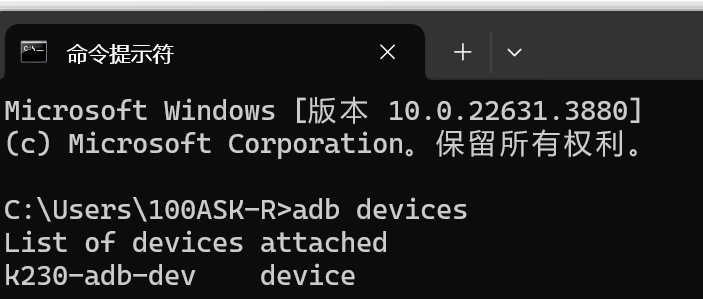

可以看到有“k230-adb-dev”设备，此时我们就可以使用adb进行文件传输。

假设你需要将Windos下的1.txt文件传输至开发板端的根目录下，可以输入“adb push &lt;文件路径&gt; &lt;开发板的路径&gt;”例如：

```text
C:\Users\100ASK-R>adb push 1.txt /
1.txt: 1 file pushed. 0.0 MB/s (14 bytes in 0.002s)
```

那么如何从开发板拉取对应的文件?

假设我需要将开发板的根目录下的2.txt拉取当Windows当前目录可以输入“adb pull &lt;开发板文件路径&gt; &lt;windows保存路径&gt;”，例如：

```text
C:\Users\100ASK-R>adb pull /2.txt ./
/2.txt: 1 file pulled. 0.0 MB/s (12 bytes in 0.001s)
```

如果您想使用adb 登录开发板终端，可以输入“adb shell”：

```text
C:\Users\100ASK-R>adb shell
/sys/kernel/config/usb_gadget/demo #
```

默认会进入adb的工作目录，可以通过命令\`cd /\`切换至根目录或者查看文件等

```text
/sys/kernel/config/usb_gadget/demo # cd /
/ # ls
1.txt        dev          lib64        media        root         sys
2.txt        etc          lib64xthead  mnt          run          tmp
app          init         linuxrc      opt          sbin         usr
bin          lib          lost+found   proc         sharefs      var
```

1.  **Ubuntu进行文件传输**

注意：如果您开启了虚拟机，新连接的设备可能会被Vmware拦截！！请选择ADB设备连接至Ubuntu虚拟机

如果您是第一次使用或者Ubuntu中没有安装adb，需要先安装adb才能正常使用，在终端执行：

```text
sudo apt install adb -y
```

打开Ubuntu的终端，打开后输入“adb device”,可能会由于系统的安全模式被禁用，如下所示：

```text
ubuntu@ubuntu2004:~$ adb devices
List of devices attached
k230-adb-dev	no permissions (user in plugdev group; are your udev rules wrong?); see [http://developer.android.com/tools/device.html]
```

**解决办法：**

1.查看adb目录

```text
ubuntu@ubuntu2004:~$ which adb
/usr/bin/adb
```

2.切换至adb目录下

```text
ubuntu@ubuntu2004:~$ cd /usr/bin/
ubuntu@ubuntu2004:/usr/bin$
```

3.修改所属用户和用户组

```text
ubuntu@ubuntu2004:/usr/bin$ sudo chown root:root ./adb
```

4.修改权限

```text
ubuntu@ubuntu2004:/usr/bin$ sudo chmod 4777 ./adb
```

5.重启Ubuntu

```text
ubuntu@ubuntu2004:/usr/bin$ reboot
```

重启Ubuntu后，请重新启动开发板连接ADB,此时将Ubuntu可以正常使用ADB功能，在终端输入“adb device”:

```text
ubuntu@ubuntu2004:~$ adb devices
List of devices attached
* daemon not running; starting now at tcp:5037
* daemon started successfully
k230-adb-dev	device
```

后续我们就可以正常使用ADB进行文件传输了。

假设你需要将Ubuntu下的1.txt文件传输至开发板端的根目录下，可以输入“adb push &lt;文件路径&gt; &lt;开发板的路径&gt;”例如：

```text
ubuntu@ubuntu2004:~$ adb push 1.txt /
1.txt: 1 file pushed. 0.0 MB/s (15 bytes in 0.008s)
```

那么如何从开发板拉取对应的文件?

假设我需要将开发板的根目录下的2.txt拉取当Ubuntu当前目录可以输入“adb pull &lt;开发板文件路径&gt; &lt;windows保存路径&gt;”，例如：

```text
C:\Users\100ASK-R>adb pull /2.txt ./
/2.txt: 1 file pulled. 0.0 MB/s (12 bytes in 0.001s)
```

如果您想使用adb 登录开发板终端，可以输入“adb shell”：

```text
ubuntu@ubuntu2004:~$ adb shell
/sys/kernel/config/usb_gadget/demo # 
```

默认会进入adb的工作目录，可以通过命令“cd /”切换至根目录或者查看文件等

```text
/sys/kernel/config/usb_gadget/demo # cd /
/ # ls
1.txt        dev          lib64        media        root         sys
2.txt        etc          lib64xthead  mnt          run          tmp
app          init         linuxrc      opt          sbin         usr
bin          lib          lost+found   proc         sharefs      var
/ # 
```

1.  **FAQ**

注意：请不要手动切换ADB连接主机/虚拟机

1.如果手动切换ADB连接平台，导致电脑识别不到设备。

**解决办法：**

1. 重新启动开发板。

2. 重新选择连接平台

建议保存连接规则，如果需要切换连接平台，可点击Vmware软件中“虚拟机”->“可移动设备”->“100ASK K230 ADB”->“忘记连接规则”。选择后再次重新启动开发板，选择需要切换的平台！

### 设置Ubuntu虚拟机为桥接模式

在开始前请确保您的CanMV开发板已经成功连接至互联网。使用SCP和TFTP方式进行文件传输需要先修改Ubuntu虚拟机的网络连接模式！！

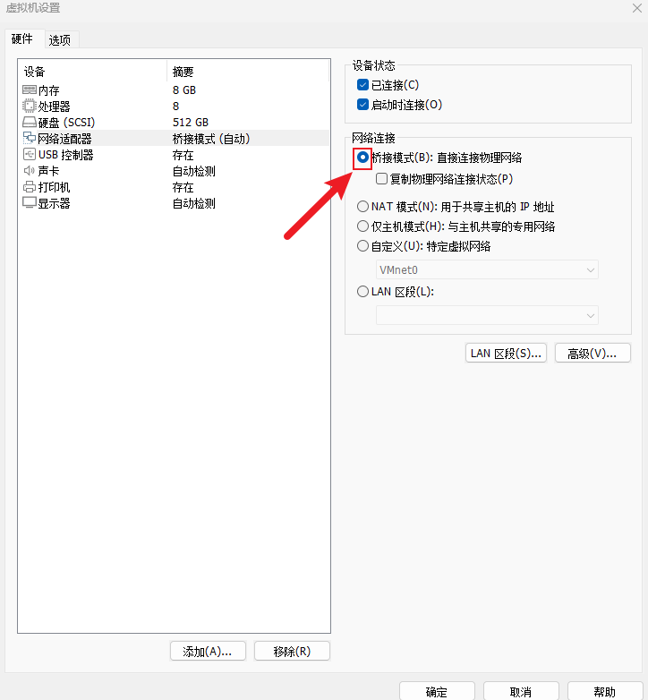

1.  **使用SCP进行文件传输**

在Ubuntu中，SCP（Secure Copy Protocol）是一种用于在本地和远程计算机之间安全复制文件的命令行工具。它基于SSH（Secure Shell）协议进行加密传输，确保数据在传输过程中不会被窃取或篡改。

-   1.  **确认开发板IP地址**

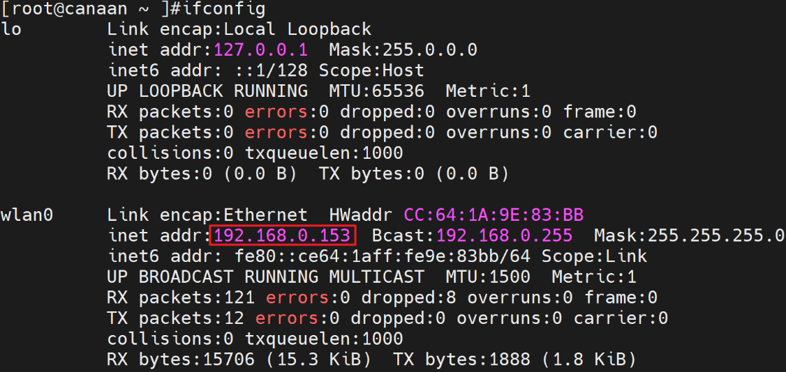

这里我确认我的开发板的IP地址为：192.168.0.153，您需要在开发板端自行查看自己的开发板IP地址。

-   1.  **\#### 2.1.2 开发板通过SCP传输文件**

注意：以下命令都需要在Ubuntu端执行！！

Ubuntu上传文件到开发板：

```text
scp local_filename root@remote_ip:remote_folder
```

“remote\_ip”填写开发板ip地址，“remote\_ip”填写开发板的目录，例如根目录/home

Ubuntu从开发板下载文件：

```text
scp root@remote_ip:remote_file_path local_path
```

“remote\_ip”填写开发板ip地址，“remote\_file\_path”填写所要下载的文件的路径，“local\_path”填写Linux本地路径。

例如我需要将Ubuntu的home目录下的1.txt传输到开发板端的sharefs目录中：

```text
ubuntu@ubuntu2004:~$ ls /home/ubuntu/
1.txt
buntu@ubuntu2004:~$ scp 1.txt root@192.168.0.153:/sharefs/
The authenticity of host '192.168.0.153 (192.168.0.153)' can't be established.
ECDSA key fingerprint is SHA256:iPcPuMuciiH7ckU+HvpWGIxmxGxLYE1wBgIrC+J2btI.
Are you sure you want to continue connecting (yes/no/[fingerprint])? yes
Warning: Permanently added '192.168.0.153' (ECDSA) to the list of known hosts.
1.txt                                                                   100%   15     0.5KB/s   00:00
```

注意：第一次传输时请输入yes，表示同意连接！！

如何从开发板下载文件到Ubuntu？比如我们现在开发板共享文件目录下有2.txt 的文本文件，传输命令为：

```text
buntu2004:~$ scp root@192.168.0.153:/sharefs/2.txt ./
2.txt                                                                   100%   14     2.4KB/s   00:00 
ubuntu@ubuntu2004:~$ cat 2.txt 
100ask canaan
```

-   1.  **FAQ**

1.主机密钥验证问题，报错信息为：

```text
Please contact your system administrator.
Add correct host key in /home/ubuntu/.ssh/known_hosts to get rid of this message.
Offending ECDSA key in /home/ubuntu/.ssh/known_hosts:1
remove with:
ssh-keygen -f "/home/ubuntu/.ssh/known_hosts" -R "192.168.0.153"
ECDSA host key for 192.168.0.153 has changed and you have requested strict checking.
Host key verification failed.
lost connectio
```

**解决办法：**

```text
ssh-keygen -f "/home/ubuntu/.ssh/known_hosts" -R "192.168.0.153"
```

1.  **使用TFTP进行文件传输**

**2.1在Ubuntu下安装TFTP**

在Ubuntu中执行以下命令安装TFTP服务：

```text
sudo apt-get install tftp-hpa tftpd-hpa
```

然后，创建TFTP服务工作目录，并打开TFTP服务配置文件，如下:

```text
mkdir -p /home/ubuntu/tftpboot
chmod 777 /home/ubuntu/tftpboot
sudo gedit /etc/default/tftpd-hpa
```

在配置文件/etc/default/tftpd-hpa中，将原来的内容删除，修改为：

```text
TFTP_USERNAME="tftp"
TFTP_ADDRESS=":69"
TFTP_DIRECTORY="/home/ubuntu/tftpboot"
TFTP_OPTIONS="-l -c -s"
```

最后，重启TFTP服务

```text
sudo service tftpd-hpa restart
```

查看tftp服务是否在运行,运行如下命令，即可查看是否在后台运行。

```text
ubuntu@ubuntu2004:~/Desktop$ ps -aux | grep “tftp”
ubuntu 4555 0.0 0.0 9040 652 pts/0 S+ 02:33 0:00 grep --color=auto “tftp”
```

**2.2 开发板通过tftp传输文件**

首先确保Ubuntu或Windows的tftp服务目录内，有需要下载到板子上的文件，比如：

```text
ubuntu@ubuntu2004:~$ ls /home/ubuntu/tftpboot/
1.txt
```

确认Ubuntu的网络IP，例如

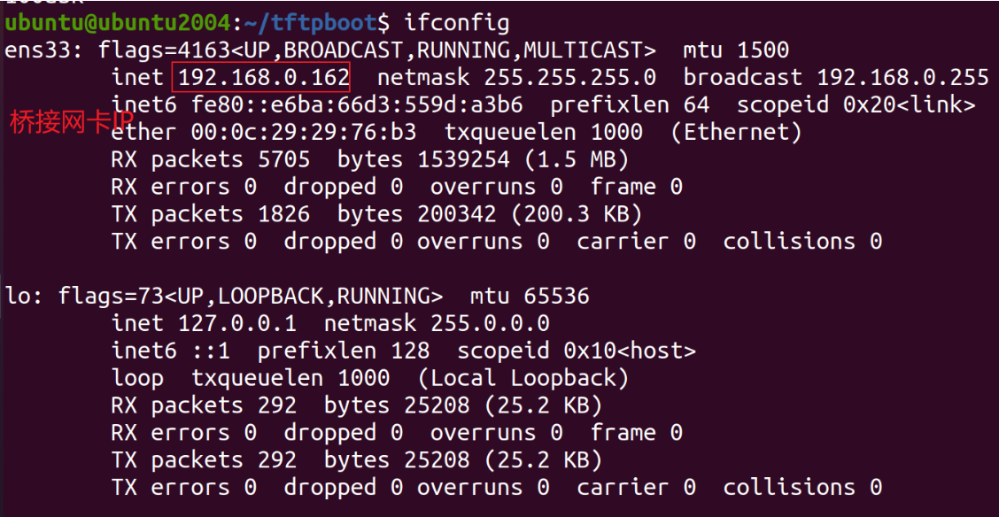

比如下载Ubuntu服务器下的1.txt 文件，则在开发板上执行如下命令(Ubuntu的桥接网卡IP是 192.168.0.162)：

```text
[root@canaan ~ ]$ tftp -g -r 1.txt 192.168.0.162
```

如何从开发板上传文件到Ubuntu？比如我们现在开发板家目录下创建一个2.txt 的文本文件，传输命令为：

```text
tftp -p -l 2.txt 192.168.0.162
```

注意：TFTP中的上传/下载命令都需要在开发板中执行

---

版权所有：深圳百问网科技有限公司
未经授权不得拷贝、复制、修改、传播本文档，否则将追究法律责任。
