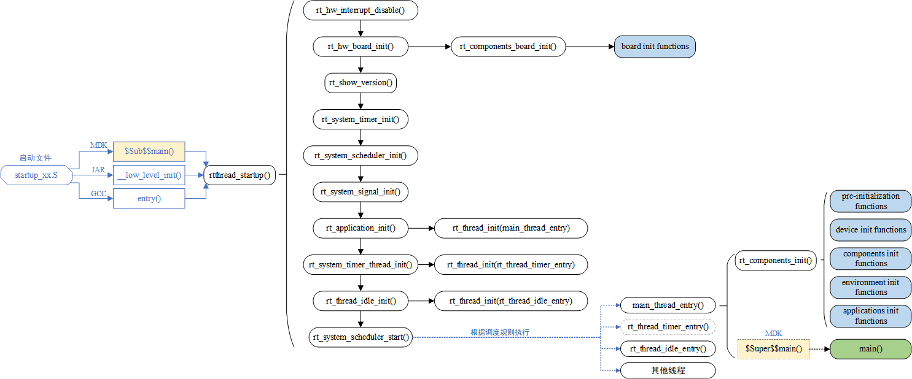
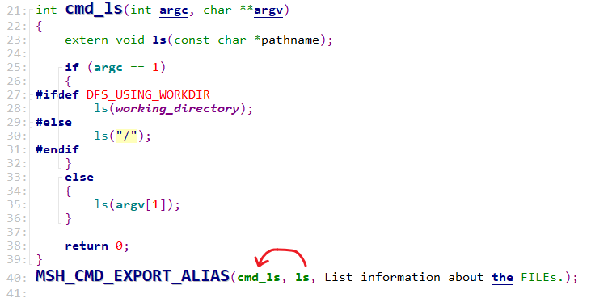
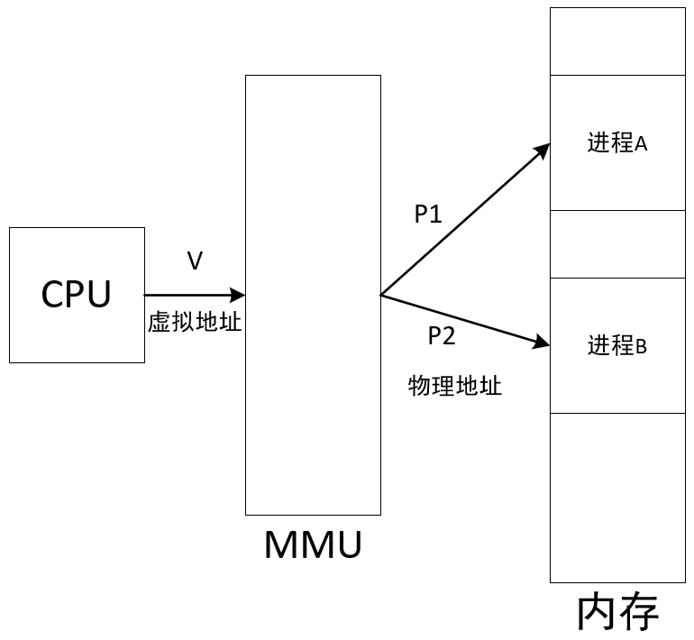
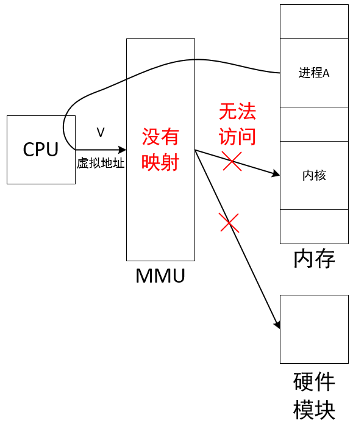
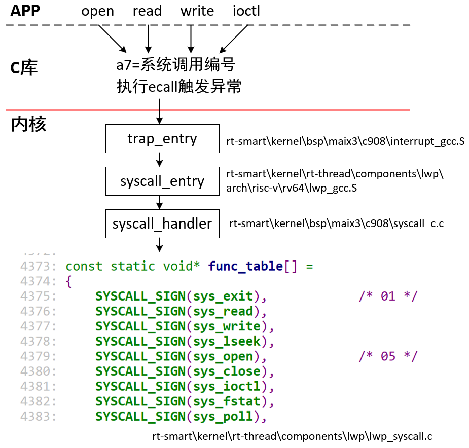
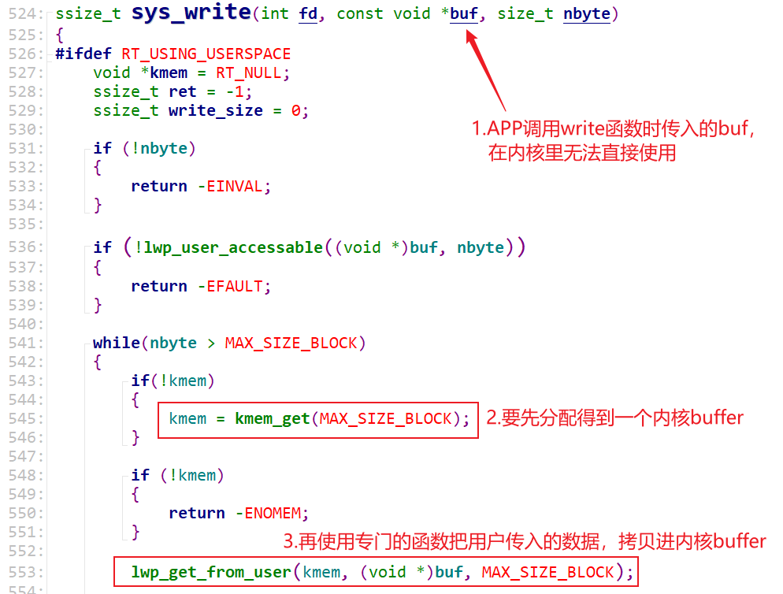
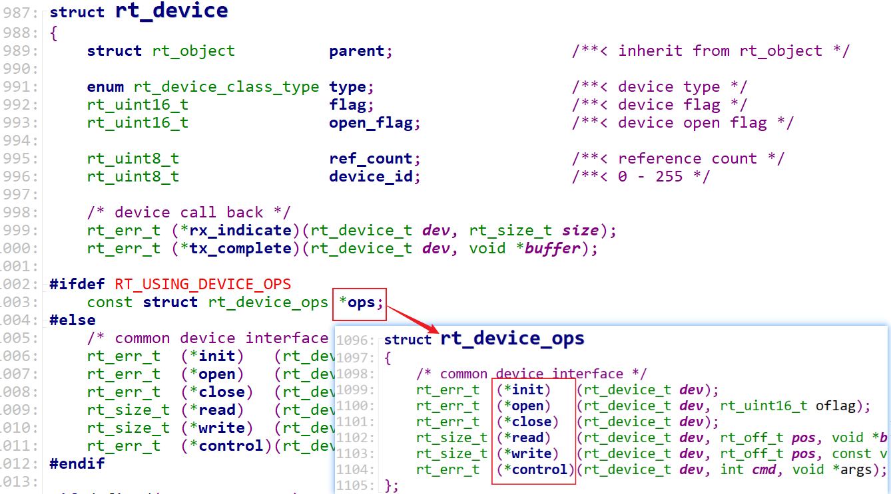
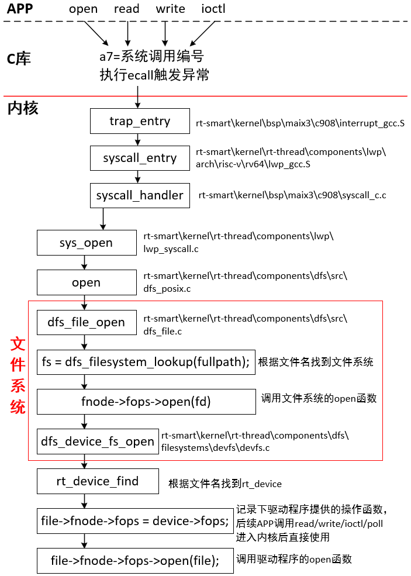

# RT-Smart 基础

> 本文档根据《嘉楠K230开发手册》V1.0（2024-11-30）整理。正文、表格、示例代码与插图均来自原始手册。

## 第1个Hello程序

本文将讲解如果在pc端使用交叉编译工具编译一个hello world的基础程序，并在大核rt-smart或小核linux上运行。

### **工具链**

k230\_sdk中提供了工具链，分别在如下路径：

1.  大核rt-samrt工具链

```text
k230_sdk/toolchain/riscv64-linux-musleabi_for_x86_64-pc-linux-gnu
```

1.  小核linux工具链

```text
k230_sdk/toolchain/Xuantie-900-gcc-linux-5.10.4-glibc-x86_64-V2.6.0
```

也可通过以下链接下载工具链：

```text
wget https://download.rt-thread.org/rt-smart/riscv64/riscv64-unknown-linux-musl-rv64imafdcv-lp64d-20230222.tar.bz2
wget https://occ-oss-prod.oss-cn-hangzhou.aliyuncs.com/resource//1659325511536/Xuantie-900-gcc-linux-5.10.4-glibc-x86_64-V2.6.0-20220715.tar.gz
```

### **编写代码**

在ubuntu上创建一个C文件hello.c并加入如下代码：

```text
#include <stdio.h>
int main (void)
{
printf("hello world\n");
return 0;
}
```

将hello.c放到与k230\_sdk同一级目录下：

```text
canaan@develop:~/work$ ls
hello.c   k230_sdk
```

### 编译程序

1.  **编译适用于小核linux的可执行程序**

```text
k230_sdk/toolchain/Xuantie-900-gcc-linux-5.10.4-glibc-x86_64-V2.6.0/bin/riscv64-unknown-linux-gnu-gcc hello.c -o hello
```

1.  **编译适用于大核rt-smart的可执行程序**

```text
k230_sdk/toolchain/riscv64-linux-musleabi_for_x86_64-pc-linux-gnu/bin/riscv64-unknown-linux-musl-gcc -o hello.o -c -mcmodel=medany -march=rv64imafdcv -mabi=lp64d hello.c
k230_sdk/toolchain/riscv64-linux-musleabi_for_x86_64-pc-linux-gnu/bin/riscv64-unknown-linux-musl-gcc -o hello.elf -mcmodel=medany -march=rv64imafdcv -mabi=lp64d -T k230_sdk/src/big/mpp/userapps/sample/linker_scripts/riscv64/link.lds  -Lk230_sdk/src/big/rt-smart/userapps/sdk/rt-thread/lib -Wl,--whole-archive -lrtthread -Wl,--no-whole-archive -n --static hello.o -Lk230_sdk/src/big/rt-smart/userapps/sdk/lib/risc-v/rv64 -Lk230_sdk/src/big/rt-smart/userapps/sdk/rt-thread/lib/risc-v/rv64 -Wl,--start-group -lrtthread -Wl,--end-group
```

### **运行程序**

将编译好的hello以及hello.elf拷贝到sd卡的vfat分区内(sd卡烧写完镜像后可以在pc端看到一个可用的盘符)，或通过其他方式(参考sdk使用说明文档)将可执行程序拷贝到小核的/sharefs目录下。

1.  开发板启动后，在小核端运行测试程序,小核启动后输入“root”进入控制台

```text
Welcome to Buildroot
canaan login: root
[root@canaan ~ ]#cd /sharefs
[root@canaan /sharefs ]#./hello
hello world
```

1.  在大核端运行测试程序

```text
msh /sharefs>hello.elf
hello world
```

### **大核程序编译进阶**

大核如果用musl-gcc直接编译的话，编译参数是比较多的，对于初学者来说很不方便，也不太好理解，当前sdk中提供了两种用于编译大核程序的方式，分别是scons和Makefile,这里我们介绍scons的编译方式，Makefile的编译构建较为复杂，不是rt-smart官方提供的编译方式，感兴趣的读者可参考\`src/big/mpp/userapps/sample\`中的Makefile结构来编译。

到“k230\_sdk/src/big/rt-smart/userapps”目录下创建一个文件夹，命名为hello

```text
cd k230_sdk/src/big/rt-smart/userapps
mkdir hello
cd hello
```

创建以下三个文件

1.  hello.c
2.  SConscript

```text
# RT-Thread building script for component
from building import *
cwd = GetCurrentDir()
src = Glob('*.c')
CPPPATH = [cwd]
CPPDEFINES = [
'HAVE_CCONFIG_H',
]
group = DefineGroup('hello', src, depend=[''], CPPPATH=CPPPATH, CPPDEFINES=CPPDEFINES)
Return('group')
```

1.  SConstruct

```text
import os
import sys
# add building.py path
sys.path = sys.path + [os.path.join('..','..','tools')]
from building import *
BuildApplication('hello', 'SConscript', usr_root = '../')
```

之后回到“k230\_sdk/src/big/rt-smart/”目录，配置环境变量

```text
canaan@develop:~/k230_sdk/src/big/rt-smart$ source smart-env.sh riscv64
Arch         => riscv64
CC           => gcc
PREFIX       => riscv64-unknown-linux-musl-
EXEC_PATH    => /home/canaan/k230_sdk/src/big/rt-smart/../../../toolchain/riscv64-linux-musleabi_for_x86_64-pc-linux-gnu/bin
```

进入“k230\_sdk/src/big/rt-smart/userapps”目录，编译程序

```text
canaan@develop:~/k230_sdk/src/big/rt-smart/userapps$ scons --directory=hello
scons: Entering directory `/home/canaan/k230_sdk/src/big/rt-smart/userapps/hello'
scons: Reading SConscript files ...
scons: done reading SConscript files.
scons: Building targets ...
scons: building associated VariantDir targets: build/hello
CC build/hello/hello.o
LINK hello.elf
/home/canaan/k230_sdk/toolchain/riscv64-linux-musleabi_for_x86_64-pc-linux-gnu/bin/../lib/gcc/riscv64-unknown-linux-musl/12.0.1/../../../../riscv64-unknown-linux-musl/bin/ld: warning: hello.elf has a LOAD segment with RWX permissions
scons: done building targets.
```

编译好的程序在hello文件夹下

```text
canaan@develop:~/k230_sdk/src/big/rt-smart/userapps$ ls hello/
build  cconfig.h  hello.c  hello.elf  SConscript  SConstruct
```

之后即可使用ADB将hello.elf push到小核linux上，然后大核rt-smart通过/sharefs即可运行该程序

注意：使用ADB的前提时提前安装ADB,详情请见**“3.4开发板文件传输”**章节！

## 系统启动流程

### **系统启动流程**

rt-smart是一个小而美的操作系统，我们有能力从上电第一条指令开始理解它的启动过程。这对于理解操作系统、解决日常技术问题很有用处。

rt-smart官网有如下启动流程图：



启动流程里涉及的文件及功能如下：

1.  系统启动的第1条指令

源码：src\\big\\rt-smart\\kernel\\bsp\\maix3\\c908\\startup\_gcc.S

作用：使能浮点单元、设置物理内存保护（Physical Memory Protection，PMP）、设置cache、中断控制器等。

然后调用“primary\_cpu\_entry”函数。

1.  系统启动的第1个C函数

源码：src\\big\\rt-smart\\kernel\\bsp\\maix3\\board\\board.c

函数为“primary\_cpu\_entry”，代码如下：

```text
//BSP的C入口
void primary_cpu_entry(void)
{
extern void entry(void);
//初始化BSS
init_bss();
//关中断
rt_hw_interrupt_disable();
rt_assert_set_hook(__rt_assert_handler);
//启动RT-Thread Smart内核
entry();
}
```

功能如下：初始化BSS、关闭中断，然后调用entry函数进一步处理。

1.  系统入口函数

源码：src\\big\\rt-smart\\kernel\\rt-thread\\src\\components.c

函数为“entry”，代码如下：

```text
int entry(void)
{
rtthread_startup();
return 0;
}
```

“rtthread\_startup”函数里，调用的各个函数如下：

```text
rtthread_startup
rt_hw_interrupt_disable
    rt_hw_mmu_map_init
    rt_page_init
    rt_hw_mmu_kernel_map_init
    rt_hw_mmu_switch
    rt_system_heap_init
    rt_components_board_init  // 调用使用“INIT_BOARD_EXPORT”描述的函数
rt_hw_board_init
rt_show_version
rt_system_timer_init
rt_system_scheduler_init
rt_system_signal_init
rt_application_init
rt_system_timer_thread_init
rt_thread_idle_init
rt_system_scheduler_start
```

1.  启动main线程

源码：src\\big\\rt-smart\\kernel\\rt-thread\\src\\components.c

函数为“rt\_application\_init”，代码如下：

```text
void rt_application_init(void)
{
rt_thread_t tid;
#ifdef RT_USING_HEAP
tid = rt_thread_create("main", main_thread_entry, RT_NULL,
                           RT_MAIN_THREAD_STACK_SIZE, RT_MAIN_THREAD_PRIORITY, 20);
RT_ASSERT(tid != RT_NULL);
#else
rt_err_t result;
tid = &main_thread;
result = rt_thread_init(tid, "main", main_thread_entry, RT_NULL,
                            main_stack, sizeof(main_stack), RT_MAIN_THREAD_PRIORITY, 20);
RT_ASSERT(result == RT_EOK);
/* if not define RT_USING_HEAP, using to eliminate the warning */
(void)result;
#endif
rt_thread_startup(tid);
}
```

它创建了“main线程”，当rt-smart启动后就会在“main线程”里运行“main函数”：

```text
/* the system main thread */
void main_thread_entry(void *parameter)
{
extern int main(void);
extern int $Super$$main(void);
#ifdef RT_USING_COMPONENTS_INIT
/* RT-Thread components initialization */
rt_components_init();
#endif
#ifdef RT_USING_SMP
rt_hw_secondary_cpu_up();
#endif
/* invoke system main function */
#if defined(__CC_ARM) || defined(__CLANG_ARM)
$Super$$main(); /* for ARMCC. */
#elif defined(__ICCARM__) || defined(__GNUC__)
main();
#endif
}
```

1.  main线程

main线程的入口函数为“main\_thread\_entry”，它不仅仅是调用main函数。函数调用关系如下：

```text
main_thread_entry
rt_components_init // 调用各类驱动程序（使用INIT_DEVICE_EXPORT描述的函数）
// 调用各类APP（使用INIT_APP_EXPORT描述的函数）
main
```

1.  main函数

源码： src\\big\\rt-smart\\kernel\\bsp\\maix3\\applications\\main.c

作用：启动第1个进程“/bin/init.sh”，这也意味着我们可以修改“/bin/init.sh”，在里面添加需要自动运行的程序。

代码如下：

```text
#ifndef RT_SHELL_PATH
#define RT_SHELL_PATH "/bin/init.sh"
#endif
int main(void)
{
int result;
struct statfs buffer;
printf("RT-SMART Hello RISC-V.\n");
char path[64];
strcpy(path, RT_SHELL_PATH);
strrchr(path, '/')[0] = 0;
if(!strcmp(path, "/sdcard") || !strcmp(path, "/sharefs"))
{
    while(dfs_statfs(path, &buffer) != 0)
    {
        rt_thread_delay(RT_TICK_PER_SECOND);
    }
}
msh_exec(RT_SHELL_PATH, strlen(RT_SHELL_PATH)+1);
return 0;
}
```

### **tshell线程的启动**

在rt-smart里，会有各类使用“INIT\_APP\_EXPORT”描述的函数，比如“src\\big\\rt-smart\\kernel\\rt-thread\\components\\finsh\\shell.c”里面的如下代码：

```text
INIT_APP_EXPORT(finsh_system_init);
```

在main线程里调用“rt\_components\_init”是，它会调用“INIT\_APP\_EXPORT描述的函数”，比如调用“finsh\_system\_init”。

在“finsh\_system\_init”函数里，它创建了一个线程：tshell线程。

在tshell线程里，我们可以输入、执行各类命令。

### **在tshell线程里启动APP**

当我们在命令行输入命令，处理流程是：

① tshell线程根据这个命令（它是字符串），尝试找到内嵌的命令，然后调用命令对应的函数。

比如“ls”命令，它是一个内嵌的命令，代码在src\\big\\rt-smart\\kernel\\rt-thread\\components\\finsh\\msh\_file.c中，如下：



当执行ls命令时，tshell线程就直接调用“cmd\_ls”函数。

② 如果不是内嵌的命令，就在文件系统里找到程序，创建进程来启动它：

具体代码在“src\\big\\rt-smart\\kernel\\rt-thread\\components\\finsh\\msh.c”的“\_msh\_exec\_lwp”函数里。

“\_msh\_exec\_lwp”函数尝试在如下目录找到可执行程序：

a. 工作目录

b. /bin目录

c. PATH环境变量指定的目录

如果找到了，就使用exec接口创建、运行进程。

## 进程与内存管理单元

### **rt-smart跟一般RTOS的不同**

在嵌入式系统中，MCU（Microcontroller Unit，微控制器单元）和MPU（Microprocessor Unit，微处理器单元）是两种常见的计算单元，它们在功能、设计和应用场景上有所不同。

简单地说，MCU就是单片机，一个芯片里集成了处理器、内存、Flash、GPIO模块等外设备。相比于MPU，MCU功能弱，开发简单。在MCU上，通常运行裸机程序，也可以运行操作系统，比如FreeRTOS、RT-Thread。

MPU性能更强大，一般能外接更大的内存、更大的Flash。当然有些MPU也把内存、Flash集成在一个芯片里。在软件开发的角度，MPU和MCU的最主要差别在于：MPU里面有MMU(Memory Management Unit)，MCU里没有MMU。

MMU是用于内存管理的硬件，它允许操作系统将物理内存扩展到更大的地址空间，实现虚拟内存、虚拟地址到物理地址的转换以及内存保护等功能。MPU通过MMU支持多任务处理，允许多个程序同时运行，每个程序都拥有自己的内存空间和执行环境。

有了MMU之后，我们才能实现多进程，进程间隔离，进程和内核隔离等操作。rt-smart就是一个能发挥MMU作用的RTOS，相比与传统的RTOS，它支持：进程、内存隔离、内存权限管理。使得程序更健壮：在传统RTOS里，一个任务出错了整个系统就会崩溃；在rt-smart里，进程崩溃了不会影响到其他进程，也不会影响到整个系统。

所谓进程，术语上称之为“资源的管理者”。简单地说，我们运行一个程序时，就要把程序读入内存——分配内存，它运行时会打开磁盘文件、打开驱动程序，这些都是“资源”。这个程序运行时，一般至少有一个循环——它就是一个线程。线程被称为“调度的基本单位”，可以简单认为就是一个执行流程、一个循环。一个程序里可以创建多个线程，就是可以有多个执行流程、多个循环。所以：我们可以在一个进程里创建多个线程，这些线程共享进程的资源。比如进程A里定义了全局变量g\_val，并且创建了线程t1、线程t2，那么线程t1、t2都可以访问g\_val——它是属于进程A的（进程是资源的管理者），不是独属于某个线程的。线程t1、t2可以同时运行、可以你运行我不运行——线程是调度的最小单元。

### **进程隔离**

如下程序，让它在后台启动2次，就是创建了2个进程，假设为进程A、B：

```text
#include <stdio.h>
int main(int argc, char **argv)
{
int a = 0 ;
    
while (1)
{
    printf("a's address = 0x%x, a' value = %d\n", &a, a++);
    sleep(1);
}
    
return 0;
}
```

输出信息如下：100ASK。

这2个进程打印的变量a的地址相同，但是运行一段时间后变量a的值不同了。地址相同，值不同：怎么解释这个现象？

① 值不同，那么必定在内存里不同的位置：物理地址不同，假设物理地址分别为P1、P2

② 地址相同：这是虚拟地址，假设为V。运行进程A时，这个虚拟地址V对应物理地址P1；运行进程B时，这个虚拟地址V对应物理地址P2。



这就是进程隔离的概念：进程A、B分别有自己的物理内存，进程A无法访问、破坏进程B的数据。

### **进程和内核隔离**

在传统的RTOS里，用户程序和内核（包括驱动）之间没有严格的界限：用户程序也可以直接读写硬件寄存器。如果编写用户程序的人对硬件的理解不到位，错误的操作可能导致大问题。所以，具备MMU的硬件上运行的操作系统，通常支持用户态、内核态隔离，就是进程和内核隔离：用户程序无法直接读写硬件寄存器，用户程序无法读写内核的变量，用户程序无法直接运行内核的函数。



### **进程和内核的交互**

进程无法直接调用内核的函数，它通过“系统调用”触发异常，导致内核的异常处理函数被执行，异常处理函数再去调用其他内核函数。



忽略复杂的调用过程，可以简单地认为APP调用open/read/write/ioctl/poll等系统调用接口时，会导致内核里sys\_open/sys\_read/sys\_write/sys\_ioctl/sys\_poll等函数被调用。

要注意的是，APP传入内核的缓冲区地址，在内核里无法直接使用，比如：



### **进程如何调用驱动程序**

可以认为驱动程序时内核的一部分，所以进程访问驱动的方法也是通过系统调用：open/read/write/ioctl/poll等。驱动程序也提供了对应的open/read/write/ioctl/poll函数，这些函数存在一个rt\_device结构体里：



所以，APP能调用驱动程序的前提是找到指定驱动的rt\_device结构体。这在APP调用open函数进而间接调用sys\_open时实现。流程如下：


