# 线程管理

> 本文档根据《嘉楠K230开发手册》V1.0（2024-11-30）整理。正文、表格、示例代码与插图均来自原始手册。

在本章中，会涉及如下内容：

① RT-Thread如何给每个线程分配CPU时间

② 如何选择某个线程来运行

③ 线程优先级如何起作用

④ 线程有哪些状态

⑤ 如何实现线程

⑥ 如何使用线程参数

⑦ 怎么修改线程优先级

⑧ 怎么删除线程

⑨ 怎么实现周期性的线程

⑩ 如何使用空闲线程

## 基本概念

在操作系统概念中，进程是资源分配的实体，而线程是执行的实体。同一个进程的所有线程共享相同的资源，而每个进程至少需要拥有一个线程，线程在进程的地址空间运行，完成内核或用户规定的任务。

RT-Thread Smart 的线程可以分为两类：

① 内核线程：运行于内核地址空间，没有对应的用户态进程，因此不能访问用户地址空间。它们用来完成特定于内核的任务，或者兼容所有原 RT-Thread 的应用代码。

② 用户线程：所有的用户线程都属于某一个用户进程，它们共享进程拥有的资源，比如进程的用户态和内核态地址空间。不同进程间的线程不能直接相互访问。

内核线程和用户线程如下图所示：

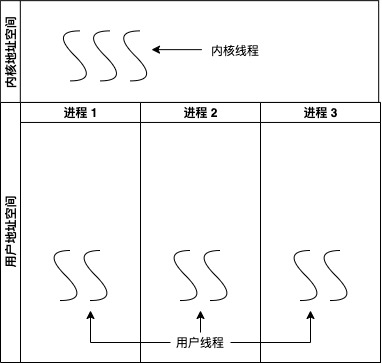

所有的进程都只能在用户态创建，通过系统调用访问内核的资源，下文如无特别说明，所述进程都是指用户态进程。而内核线程只运行在内核地址空间，一般不会访问用户地址空间的数据。

无论是用户线程、内核线程，它们都可以使用同一套接口函数来创建。

## 线程创建与删除

### 线程的组成

在RT-Thread中，线程是 RT-Thread 中最基本的调度单位，使用rt\_thread结构体表示线程。

rt\_thread描述了一个线程执行的运行环境，也描述了这个线程所处的优先等级。

系统中总共存在两类线程，分别是系统线程和用户线程

① 系统线程由RT-Thread内核创建

② 用户线程由用户应用程序创建

这两类线程都会从内核对象容器中分配线程对象，如下图所示。

每个线程由三部分组成：线程控制块(rt\_thread结构体)、线程栈和入口函数。

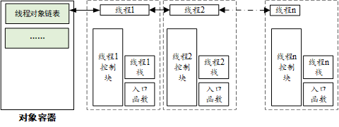

1.  **线程控制块**

线程控制块由结构体“_struct rt\_thread_”表示，线程控制块是操作系统用于管理线程的一个数据结构。

它存放线程的一些信息，例如优先级、线程名称、线程状态等，也包含线程与线程之间连接用的链表结构，线程等待事件集合等。

它在_rtdef.h_中定义如下：

```text
/**
* Thread structure
*/
struct rt_thread
{
/* rt 对象 */
char        name[RT_NAME_MAX];                      /* 线程名字 */
rt_uint8_t  type;                                   /* 对象类型 */
rt_uint8_t  flags;                                  /* 标注位 */
rt_list_t   list;                                   /* 对象列表 */
rt_list_t   tlist;                                  /* 线程列表 */
/* 栈指针和入口指针 */
void       *sp;                                     /* 栈指针 */
void       *entry;                                  /* 入口函数指针*/
void       *parameter;                              /* 参数 */
void       *stack_addr;                             /* 栈地址指针 */
rt_uint32_t stack_size;                             /* 栈大小*/
/* 错误代码 */
rt_err_t    error;                                  /* 线程错误代码 */
rt_uint8_t  stat;                                   /* 线程状态 */
/* 优先级 */
rt_uint8_t  current_priority;                       /* 当前优先级 */
rt_uint8_t  init_priority;                          /* 初始优先级 */
…………
rt_ubase_t  init_tick;                              /* 线程初始化计数值 */
rt_ubase_t  remaining_tick;                         /* 线程剩余计数值 */
struct rt_timer thread_timer;                       /* 内置线程定时器 */
void (*cleanup)(struct rt_thread *tid);             /* 线程退出清理函数 */
rt_uint32_t user_data;                             /* 用户私有数据*/
};
typedef struct rt_thread *rt_thread_t;
```

1.  **线程栈**

在裸机系统中， 涉及局部变量、子函数调用或中断发生，就需要用到栈。

在RTOS系统中，每个线程运行时，也是普通的函数调用，也涉及局部变量、子函数调用、中断，也要用到栈。

但不同于裸机系统，RTOS存在多个线程，每个线程是独立互不干扰的，因此需要为每个线程都分配独立的栈空间，这就是线程栈。

可以使用两种方法提供线程栈：静态分配、动态分配。栈的大小通常由用户定义，如下使用全局数组提供了一个静态栈，大小为512字节：

```text
rt_uint32_t test_stack[512];
```

对于资源比较大的MCU，可以适当设置较大的线程栈。

也可以在初始化时设置为较大的栈，比如1K或2K，在进入系统后，通过终端的list\_thread命令查看当前线程栈的最大使用率。如果使用率超过70%，将线程栈再设置大一点；如果远低于70%，将线程栈设置小一点。

1.  **入口函数**

入口函数是线程要运行函数，由用户自行设计。

可分为无限循环模式和顺序执行模式。

无限循环模式示例代码：

```text
void thread_entry(void* paramenter){    while (1)    {    /* 等待事件的发生 */    /* 对事件进行服务、进行处理 */    }}
```

使用这种模式时，需要注意，一个实时系统，不应该让一个线程一直处于最高优先级占用CPU，让其它线程得不到执行。

因此，在这种模式中，需要调用延时函数或者主动挂起。

这种无限循环模式设计的目的是让这个线程一直循环调度运行，而不结束。

顺序执行模式示例代码：

```text
static void thread_entry(void* parameter){    /* 处理事务 #1 */    …    /* 处理事务 #2 */    …    /* 处理事务 #3 */}
```

使用这种模式时，线程不会一直循环，最后一定会执行完毕。

执行完毕后，线程将被系统自动删除。

### 创建、启动线程

RT-Thread提供两种线程的创建方式：

① 静态线程：使用rt\_thread\_init()初始化

② 动态线程：使用rt\_thread\_create()创建

区别：动态线程是系统自动从动态内存堆上分配栈空间与线程句柄，静态线程是由用户分配栈空间与线程句柄

静态线程初始化函数如下：

```text
rt_err_t rt_thread_init(struct rt_thread* thread,          //线程句柄                     const char* name,                  //线程名字                    void (*entry)(void* parameter),    //入口函数                    void* parameter,                   //入口函数参数                    void* stack_start,                 //线程栈起始地址                    rt_uint32_t stack_size,            //栈大小                    rt_uint8_t priority,               //线程优先级                    rt_uint32_t tick);                 //线程时间片大小
```

参数说明：

| 参数 | 描述 |
| --- | --- |
| thread | 线程句柄，指向线程控制块内存地址，由用户传入 |
| name | 线程名字，由rtconfig.h中定义的RT_NAME_MAX宏指定最大长度 |
| entry | 线程入口函数 |
| parameter | 线程入口函数参数 |
| stack_start | 线程栈起始地址 |
| stack_size | 线程栈大小，单位是字节 |
| priority | 线程优先级，由rtconfig.h中定义的RT_THREAD_PRIORITY_MAX宏指定优先级范围假设支持的是256级优先级，那么范围是从0～255，数值越小优先级越高，0代表最高优先级 |
| tick | 线程的时间片大小，时间片(Tick)是操作系统的时钟节拍当系统中存在相同优先级的线程时，时间片大小指定线程一次调度能够运行的最大时间长度当在时间片运行结束后，运行另外的同优先级线程 |
| 返回值 | 成功：RT_EOK；失败：RT_ERROR |

动态线程创建函数如下：

```text
rt_thread_t rt_thread_create(const char* name,              //线程名字                        void (*entry)(void* parameter), //入口函数                        void* parameter,                //入口函数参数                        rt_uint32_t stack_size,         //栈大小                        rt_uint8_t priority,            //线程优先级                        rt_uint32_t tick);              //线程时间片大小
```

参数说明：

| 参数 | 描述 |
| --- | --- |
| name | 线程名字，由rtconfig.h中定义的RT_NAME_MAX宏指定最大长度 |
| entry | 线程入口函数 |
| parameter | 线程入口函数参数 |
| stack_size | 线程栈大小，单位是字节 |
| priority | 线程优先级，由rtconfig.h中定义的RT_THREAD_PRIORITY_MAX宏指定优先级范围假设支持的是256级优先级，那么范围是从0～255，数值越小优先级越高，0代表最高优先级 |
| tick | 线程的时间片大小，时间片(Tick)是操作系统的时钟节拍当系统中存在相同优先级的线程时，时间片大小指定线程一次调度能够运行的最大时间长度当期线程的时间片运行结束后，运行另外的同优先级线程 |
| 返回值 | 成功：thread，线程句柄；失败：RT_NULL |

创建线程后，还需要启动线程，才能让线程运行起来。

启动线程函数如下：

```text
rt_err_t rt_thread_startup(rt_thread_t thread);
```

参数说明：

| 参数 | 描述 |
| --- | --- |
| thread | 线程句柄 |
| 返回值 | 成功：RT_EOK；失败：-RT_ERROR |

### \_示例\_创建线程

代码为：_create\_task_

使用两种方式分别创建两个线程。

线程1的代码：

```text
/* 线程1的入口函数 */static void thread1_entry(void *parameter){	const char *thread_name = "Thread1 run\r\n";		/* 线程1 */	while(1)	{		/* 打印线程1的信息 */		rt_kprintf(thread_name);				/* 延迟一会，让出CPU */
		rt_thread_mdelay(100);
	}}
```

线程2的代码：

```text
/* 线程2入口函数 */static void thread2_entry(void *param){	const char *thread_name = "Thread2 run\r\n";	/* 线程2 */	while(1)	{		/* 打印线程2的信息 */		rt_kprintf(thread_name);				/* 延迟一会，让出CPU */
		rt_thread_mdelay(100);
	}}
```

main函数：

```text
int main(void){	/* 初始化静态线程1，名称是Thread1，入口是thread1_entry */    rt_thread_init(&thread1,               //线程句柄                    "thread1",              //线程名字                   thread1_entry,          //入口函数                   RT_NULL,                //入口函数参数                   &thread1_stack[0],      //线程栈起始地址                   sizeof(thread1_stack),  //栈大小                   THREAD_PRIORITY,        //线程优先级				   THREAD_TIMESLICE);      //线程时间片大小     	/* 启动线程1 */    rt_thread_startup(&thread1);           			/* 创建动态线程2，名称是thread2，入口是thread2_entry*/    thread2 = rt_thread_create("thread2",          //线程名字                            thread2_entry,     //入口函数							RT_NULL,           //入口函数参数                            THREAD_STACK_SIZE, //栈大小                            THREAD_PRIORITY,   //线程优先级				            THREAD_TIMESLICE); //线程时间片大小    /* 判断创建结果,再启动线程2 */    if (thread2 != RT_NULL)        rt_thread_startup(thread2);
				   	while (1)
    {
    	rt_thread_mdelay(100);
}		
		       return 0;}
```

把**create\_task**目录上传到Ubuntud的k230\_sdk/src/big/rt-smart/userapps下，使用以下命令编译：

首先进入到“k230\_sdk/src/big/rt-smart/”目录，配置环境变量：

```text
ubuntu@ubuntu2004:~/k230_sdk/src/big/rt-smart$ source smart-env.sh riscv64
Arch         => riscv64CC           => gccPREFIX       => riscv64-unknown-linux-musl-EXEC_PATH    => /home/canaan/k230_sdk/src/big/rt-smart/../../../toolchain/riscv64-linux-musleabi_for_x86_64-pc-linux-gnu/bin
```

之后进入“k230\_sdk/src/big/rt-smart/userapps”目录，编译程序

```text
canaan@develop:~/k230_sdk/src/big/rt-smart/userapps$ scons --directory=create_task
scons: Entering directory `/home/canaan/k230_sdk/src/big/rt-smart/userapps/test'
scons: Reading SConscript files ...
scons: done reading SConscript files.
scons: Building targets ...
scons: building associated VariantDir targets: build/create_task
CC build/test/test.o
LINK test.elf
/home/canaan/k230_sdk/toolchain/riscv64-linux-musleabi_for_x86_64-pc-linux-gnu/bin/../lib/gcc/riscv64-unknown-linux-musl/12.0.1/../../../../riscv64-unknown-linux-musl/bin/ld: warning: hello.elf has a LOAD segment with RWX permissions
scons: done building targets.
```

编译好的程序在**create\_task**文件夹下：

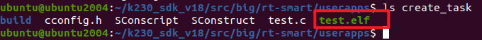

我们可以看到名为“test.elf”的可执行程序；

之后即可将test.elf使用ADB push到小核linux的sharefs目录下，然后大核rt-smart的sharefs下也会出现该程序：

```text
sudo abd push test.elf /sharefs 
```

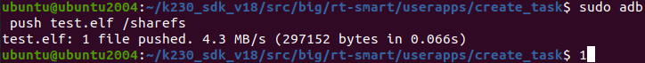

之后我们查看大核rt-smart下的sharefs目录下是否有test.elf，小核的内容是共享给大核的，如果有则执行以下命令运行程序：

```text
msh />cd sharefs
msh /sharefs>ls
Directory /sharefs:
.                                       <DIR>
..                                      <DIR>
app                                     <DIR>
test.elf                                297152
msh /sharefs>test.elf
```

运行结果如下：
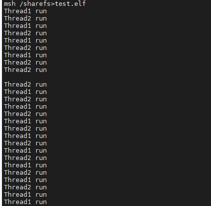

注意：

① 线程1是静态初始化，线程2是动态初始化

② 它们的优先级，时间片大小都设置一样

由于用户不支持静态创建线程，所以creat\_task我们都使用动态创建线程；如果想实现上面情况，可以进入到“k230\_sdk\\src\\big\\rt-smart\\kernel\\bsp\\maix3\\applications”文件下，将main.c文件替换为以上源码。

### \_示例\_使用线程参数

代码为：create\_task\_use\_params

多个线程可以使用同一个函数，怎么体现它们的差别？

1.  栈不同
2.  创建线程时可以传入不同的参数

我们创建2个线程，使用同一个函数，代码如下：

```text
/* 线程的入口函数 */static void thread1_entry(void *parameter){	const char *thread_name = parameter;		/* 线程 */	while(1)	{		/* 打印线程的信息 */		rt_kprintf(thread_name);				/* 延迟一会，让出CPU */
		rt_thread_mdelay(100);	
}}
```

上述代码中的thread\_name来自参数parameter，parameter来自哪里？创建线程时传入的。

代码如下：

1.  使用rt\_thread\_init和rt\_thread\_create分别创建线程时，传入不同的函数参数
2.  不同的线程，parameter不一样

```text
static const char *thread1_name = "Thread1 run\r\n";static const char *thread2_name = "Thread2 run\r\n";int main(void){	/* 初始化静态线程1，名称是Thread1，入口是thread1_entry */    rt_thread_init(&thread1,               //线程句柄                    "thread1",              //线程名字                   thread1_entry,          //入口函数                   (void *)thread1_name,   //入口函数参数                   &thread1_stack[0],      //线程栈起始地址                   sizeof(thread1_stack),  //栈大小                   THREAD_PRIORITY,        //线程优先级				   THREAD_TIMESLICE);      //线程时间片大小     	/* 启动线程1 */    rt_thread_startup(&thread1);           			/* 创建动态线程2，名称是thread2，入口也是thread1_entry*/    thread2 = rt_thread_create("thread2",          //线程名字                            thread1_entry,         //入口函数							(void *)thread2_name,  //入口函数参数                            THREAD_STACK_SIZE,     //栈大小                            THREAD_PRIORITY,       //线程优先级				            THREAD_TIMESLICE);     //线程时间片大小    /* 判断创建结果,再启动线程2 */    if (thread2 != RT_NULL)        rt_thread_startup(thread2);		
		   	while (1)
    {
    	rt_thread_mdelay(100);
}
			       return 0;}
```

把create\_task\_use\_params目录上传到Ubuntud的“k230\_sdk/src/big/rt-smart/userapps”下，使用以下命令编译：

首先进入到“k230\_sdk/src/big/rt-smart/”目录，配置环境变量：

```text
ubuntu@ubuntu2004:~/k230_sdk/src/big/rt-smart$ source smart-env.sh riscv64
Arch         => riscv64CC           => gccPREFIX       => riscv64-unknown-linux-musl-EXEC_PATH    => /home/canaan/k230_sdk/src/big/rt-smart/../../../toolchain/riscv64-linux-musleabi_for_x86_64-pc-linux-gnu/bin
```

之后进入“k230\_sdk/src/big/rt-smart/userapps”目录，编译程序

```text
canaan@develop:~/k230_sdk/src/big/rt-smart/userapps$ scons --directory=create_task_use_params
scons: Entering directory `/home/canaan/k230_sdk/src/big/rt-smart/userapps/test'
scons: Reading SConscript files ...
scons: done reading SConscript files.
scons: Building targets ...
scons: building associated VariantDir targets: build/create_task
CC build/test/test.o
LINK test.elf
/home/canaan/k230_sdk/toolchain/riscv64-linux-musleabi_for_x86_64-pc-linux-gnu/bin/../lib/gcc/riscv64-unknown-linux-musl/12.0.1/../../../../riscv64-unknown-linux-musl/bin/ld: warning: hello.elf has a LOAD segment with RWX permissions
scons: done building targets.
```

编译好的程序在create\_task\_use\_params文件夹下：

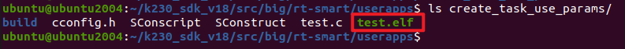

我们可以看到名为“test.elf”的可执行程序；

之后即可将test.elf使用ADB push到小核linux的sharefs目录下，然后大核rt-smart的sharefs下也会出现该程序：

```text
sudo abd push test.elf /sharefs 
```

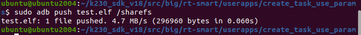

之后我们查看大核rt-smart下的sharefs目录下是否有test.elf，小核的内容是共享给大核的，如果有则执行以下命令运行程序：

```text
msh />cd sharefs
msh /sharefs>ls
Directory /sharefs:
.                                       <DIR>
..                                      <DIR>
app                                     <DIR>
test.elf                                297152
msh /sharefs>test.elf
```

运行结果如下：

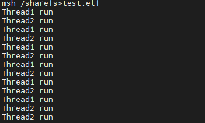

**注意:**

由于用户不支持静态创建线程，所以creat\_task\_use\_params我们都使用动态创建线程；如果想实现上面情况，可以进入到

“k230\_sdk\\src\\big\\rt-smart\\kernel\\bsp\\maix3\\applications”

文件下，将main.c文件替换为以上源码。

### 线程的删除

创建线程时有2种方式，删除线程时也有对应的函数：

```text
rt_err_t rt_thread_detach (rt_thread_t thread);   // 删除使用rt_thread_init()创建的线程 rt_err_t rt_thread_delete(rt_thread_t thread);    // 删除使用rt_thread_create()创建的线程
```

参数说明：

| 参数 | 描述 |
| --- | --- |
| thread | 线程句柄 |
| 返回值 | 成功：RT_EOK；失败：-RT_ERROR |

### \_示例\_删除线程

代码为：delete\_task

1.  先分别使用两种方式创建线程
2.  然后再分别删除线程

线程创建代码如下：

```text
/* 初始化静态线程1，名称是Thread1，入口是thread1_entry */rt_thread_init(&thread1,               //线程句柄                "thread1",              //线程名字               thread1_entry,          //入口函数               (void *)thread1_name,   //入口函数参数               &thread1_stack[0],      //线程栈起始地址               sizeof(thread1_stack),  //栈大小               THREAD_PRIORITY,        //线程优先级				THREAD_TIMESLICE);      //线程时间片大小     /* 启动线程1 */rt_thread_startup(&thread1);           		/* 创建动态线程2，名称是thread2，入口也是thread1_entry*/thread2 = rt_thread_create("thread2",          //线程名字                        thread1_entry,         //入口函数						(void *)thread2_name,  //入口函数参数                        THREAD_STACK_SIZE,     //栈大小                        THREAD_PRIORITY,       //线程优先级				        THREAD_TIMESLICE);     //线程时间片大小/* 判断创建结果,再启动线程2 */if (thread2 != RT_NULL)    rt_thread_startup(thread2);	
线程删除代码如下：
/* 删除线程1 */result =  rt_thread_detach(&thread1); if(result == RT_EOK)	rt_kprintf("Thread1 exit\r\n");	/* 删除线程2 */result =  rt_thread_delete(thread2); if(result == RT_EOK)	rt_kprintf("Thread2 exit\r\n");
```

把**delete\_task**目录上传到Ubuntud的k230\_sdk/src/big/rt-smart/userapps下，使用以下命令编译：

首先进入到“k230\_sdk/src/big/rt-smart/”目录，配置环境变量：

```text
ubuntu@ubuntu2004:~/k230_sdk/src/big/rt-smart$ source smart-env.sh riscv64
Arch         => riscv64CC           => gccPREFIX       => riscv64-unknown-linux-musl-EXEC_PATH    => /home/canaan/k230_sdk/src/big/rt-smart/../../../toolchain/riscv64-linux-musleabi_for_x86_64-pc-linux-gnu/bin
```

之后进入“k230\_sdk/src/big/rt-smart/userapps”目录，编译程序

```text
canaan@develop:~/k230_sdk/src/big/rt-smart/userapps$ scons --directory=delete_task
scons: Entering directory `/home/canaan/k230_sdk/src/big/rt-smart/userapps/test'
scons: Reading SConscript files ...
scons: done reading SConscript files.
scons: Building targets ...
scons: building associated VariantDir targets: build/create_task
CC build/test/test.o
LINK test.elf
/home/canaan/k230_sdk/toolchain/riscv64-linux-musleabi_for_x86_64-pc-linux-gnu/bin/../lib/gcc/riscv64-unknown-linux-musl/12.0.1/../../../../riscv64-unknown-linux-musl/bin/ld: warning: hello.elf has a LOAD segment with RWX permissions
scons: done building targets.
```

编译好的程序在delete\_task文件夹下：

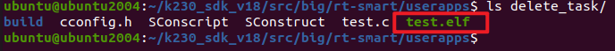

我们可以看到名为“test.elf”的可执行程序；

之后即可将test.elf使用ADB push到小核linux的sharefs目录下，然后大核rt-smart的sharefs下也会出现该程序：

```text
sudo abd push test.elf /sharefs 
```

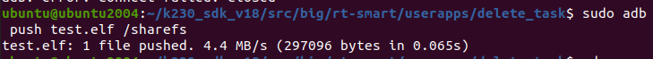

之后我们查看大核rt-smart下的sharefs目录下是否有test.elf，小核的内容是共享给大核的，如果有则执行以下命令运行程序：

```text
msh />cd sharefs
msh /sharefs>ls
Directory /sharefs:
.                                       <DIR>
..                                      <DIR>
app                                     <DIR>
test.elf                                297152
msh /sharefs>test.elf
```

运行结果如下：

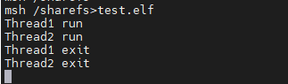

：线程运行图：

1.  rt\_thread\_delete并不是真正的删除线程，只是把线程状态状态改为RT\_THREAD\_CLOSE。
2.  真正的删除(释放线程控制块和线程栈)，在下一次执行空闲线程时，由空闲线程删除
3.  线程本身不应调用rt\_thread\_detach脱离线程

**注意：
**由于用户不支持静态创建线程，所以delete\_task我们都使用动态创建线程；如果想实现上面情况，可以进入到“k230\_sdk\\src\\big\\rt-smart\\kernel\\bsp\\maix3\\applications”文件下，将main.c文件替换为以上源码。

## 线程优先级和Tick

### 线程优先级

RT-Thread的线程优先级是指线程被调度的优先程度。

每个线程都具有优先级，线程的重要性越高，优先级应该设置更高，被调度的可能才会更大。

由**rtconfig.h**中定义的**RT\_THREAD\_PRIORITY\_MAX**宏指定优先级范围。

RT-Thread 最大支持 256 个线程优先级 (0~255)，数值越小的优先级越高，0 为最高优先级。

在一些资源比较紧张的系统中，可以根据实际情况设置优先级，比如ARM Cortex-M系列，通常采用32个优先级；

最低优先级默认分配给空闲线程使用，用户一般不使用。

在学习调度方法之前，只要初略地知道：

RT-Thread会确保最高优先级的、可运行的线程，马上就能执行

对于相同优先级的、可运行的线程，轮流执行

这无需记忆，就像我们举的例子：

厨房着火了，当然优先灭火

喂饭、回复信息同样重要，轮流做

### 时间片

对于同优先级的线程，它们“轮流”执行。怎么轮流？你执行一会，我执行一会。

"一会"怎么定义？

人有心跳，心跳间隔基本恒定。

RT-Thread中也有心跳，它使用定时器产生固定间隔的中断。这叫Tick、滴答，比如每1ms发生一次时钟中断。

如下图：

1.  假设t1、t2、t3发生时钟中断
2.  两次中断之间的时间被称为时间片(time slice、tick period)
3.  时间片的大小在**rtconfig.h**中定义，默认为**#define RT\_TICK\_PER\_SECOND 1000**，即1ms

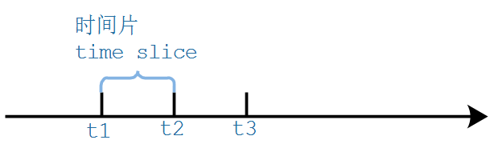

假设有2个优先级相同的就绪态线程A与B。

A线程的时间片设置为10，B线程的时间片设置为5。

且当系统中不存在比A、B优先级高的就绪态线程时，系统会在A、B线程间来回切换执行。

在t1至t1+5这5个时间片，线程B运行

在t1+5至t1+15这10个时间片，线程A运行

如此反复，如下图:

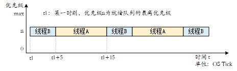

### \_示例\_优先级实验

代码为：task\_priority

本程序会创建3个线程：

1.  线程1、线程2：优先级相同，都是15
2.  线程3：优先级最高，是15-1=14

创建线程时使用同一个入口函数，但是通过传入不同的参数、不同的优先级生成不同的线程：

1.  thread1、thread2的优先级相同，都是THREAD\_PRIORITY
2.  thread3的优先级最高，是THREAD\_PRIORITY-1

代码如下：

```text
/* 线程的入口函数 */static void thread_entry(void *parameter){	const char *thread_name = parameter;	volatile rt_uint32_t cnt = 0;		/* 线程 */	while(1)	{		/* 打印线程的信息 */		rt_kprintf(thread_name);				rt_thread_mdelay(100);	}}
```

main函数代码如下：

```text
static const char *thread1_name = "Thread1 run \r\n";static const char *thread2_name = "Thread2 run \r\n";static const char *thread3_name = "Thread3 run \r\n";int main(void){	/* 创建动态线程thread1，优先级为 THREAD_PRIORIT = 15 */    thread1 = rt_thread_create("thread1",          //线程名字                            thread_entry,          //入口函数							(void *)thread1_name,  //入口函数参数                            THREAD_STACK_SIZE,     //栈大小                            THREAD_PRIORITY,       //线程优先级				            THREAD_TIMESLICE);     //线程时间片大小    /* 判断创建结果,再启动线程1 */    if (thread1 != RT_NULL)        rt_thread_startup(thread1);				   	/* 创建动态线程thread2，优先级为 THREAD_PRIORIT = 15 */    thread2 = rt_thread_create("thread2",          //线程名字                            thread_entry,          //入口函数							(void *)thread2_name,  //入口函数参数                            THREAD_STACK_SIZE,     //栈大小                            THREAD_PRIORITY,       //线程优先级				            THREAD_TIMESLICE);     //线程时间片大小    /* 判断创建结果,再启动线程2 */    if (thread2 != RT_NULL)        rt_thread_startup(thread2);					/* 创建动态线程thread3，优先级为 THREAD_PRIORIT-1 = 14 */    thread3 = rt_thread_create("thread3",          //线程名字                            thread_entry,          //入口函数							(void *)thread3_name,  //入口函数参数                            THREAD_STACK_SIZE,     //栈大小                            THREAD_PRIORITY-1,     //线程优先级				            THREAD_TIMESLICE);     //线程时间片大小    /* 判断创建结果,再启动线程3 */    if (thread3 != RT_NULL)        rt_thread_startup(thread3);	
while (1)
{
	 rt_thread_mdelay(100);
}		    return 0;}
```

把**task\_priority**目录上传到Ubuntud的k230\_sdk/src/big/rt-smart/userapps下，使用以下命令编译：

首先进入到“k230\_sdk/src/big/rt-smart/”目录，配置环境变量：

```text
ubuntu@ubuntu2004:~/k230_sdk/src/big/rt-smart$ source smart-env.sh riscv64
Arch         => riscv64CC           => gccPREFIX       => riscv64-unknown-linux-musl-EXEC_PATH    => /home/canaan/k230_sdk/src/big/rt-smart/../../../toolchain/riscv64-linux-musleabi_for_x86_64-pc-linux-gnu/bin
```

之后进入“k230\_sdk/src/big/rt-smart/userapps”目录，编译程序

```text
canaan@develop:~/k230_sdk/src/big/rt-smart/userapps$ scons --directory=task_priority
scons: Entering directory `/home/canaan/k230_sdk/src/big/rt-smart/userapps/test'
scons: Reading SConscript files ...
scons: done reading SConscript files.
scons: Building targets ...
scons: building associated VariantDir targets: build/create_task
CC build/test/test.o
LINK test.elf
/home/canaan/k230_sdk/toolchain/riscv64-linux-musleabi_for_x86_64-pc-linux-gnu/bin/../lib/gcc/riscv64-unknown-linux-musl/12.0.1/../../../../riscv64-unknown-linux-musl/bin/ld: warning: hello.elf has a LOAD segment with RWX permissions
scons: done building targets.
```

编译好的程序在**task\_priority**文件夹下：

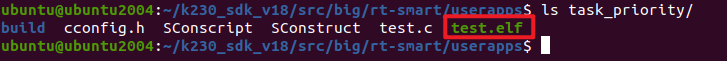

我们可以看到名为“test.elf”的可执行程序；

之后即可将test.elf使用ADB push到小核linux的sharefs目录下，然后大核rt-smart的sharefs下也会出现该程序：

```text
sudo abd push test.elf /sharefs 
```

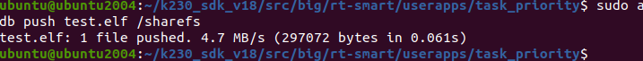

之后我们查看大核rt-smart下的sharefs目录下是否有test.elf，小核的内容是共享给大核的，如果有则执行以下命令运行程序：

```text
msh />cd sharefs
msh /sharefs>ls
Directory /sharefs:
.                                       <DIR>
..                                      <DIR>
app                                     <DIR>
test.elf                                297152
msh /sharefs>test.elf
```

运行情况如下图所示：

1.  线程3优先执行，直到它调用rt\_thread\_delay延时，放弃CPU占用
2.  线程1、线程2：轮流执行

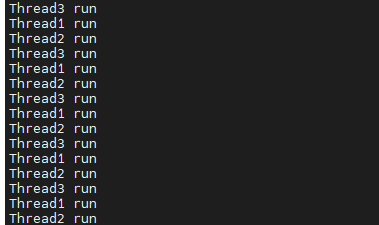

调度情况如下图所示：

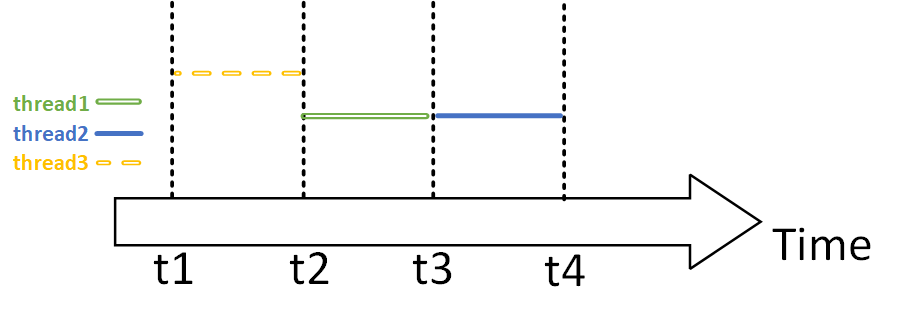

## 线程状态

以前我们很简单地把线程的状态分为2种：运行(Runing)、非运行(Not Running)。

对于非运行的状态，还可以继续细分，比如前面的RT-Thread\_04\_task\_priority中：

-   Task3执行rt\_thread\_delay后：处于非运行状态，要等延时结束才能再次运行
-   Task3运行期间，Task1、Task2也处于非运行状态，但是它们随时可以运行
-   这两种"非运行"状态就不一样，可以细分为：
-   挂起状态，也称阻塞态：等待某些资源
-   就绪状态：随时可以运行
-   还有其他状态：
-   初始状态：线程刚被创建时处于初始状态
-   关闭状态：线程退出

### 初始状态

当线程刚开始创建还没开始运行时就处于初始状态：

-   使用rt\_thread\_init()创建，但是未调用rt\_thread\_startup使它就绪
-   使用rt\_thread\_create()创建，但是未调用rt\_thread\_startup使它就绪

### 就绪状态

这个线程完全准备好了，随时可以运行：只是还轮不到它：这时它就处于就绪态(Ready)。

在下面几种情况下，线程都处于就绪状态：

-   我们创建线程后，使用rt\_thread\_startup()函数使它进入就绪态。
-   它在运行过程中，被更高优先级的线程抢占了，这时它处于就绪状态。
-   它在运行过程中，轮到同优先级的线程运行了，这时它处于就绪状态。
-   它因为等待某些资源而没有运行，别的线程或者中断函数把它唤醒了，这时它处于就绪状态。

### 运行状态

当处于就绪状态的线程运行时，它就处于运行状态。

### 挂起状态

在日常生活的例子中，母亲在电脑前跟同事沟通时，如果同事一直没回复，那么母亲的工作就被卡住了、被堵住了、处于挂起状态。

重点在于：母亲在等待。

在RT-Thread\_04\_task\_priority实验中，如果把线程3中的rt\_thread\_delay调用注释掉，那么线程1、线程2根本没有执行的机会

在实际产品中，我们不会让一个线程一直运行，而是使用"事件驱动"的方法让它运行：

-   线程要等待某个事件，事件发生后它才能运行
-   在等待事件过程中，它不消耗CPU资源
-   在等待事件的过程中，这个线程就处于挂起状态

在挂起状态的线程，它可以等待两种类型的事件：

-   时间相关的事件
-   可以等待一段时间：我等2分钟
-   也可以一直等待，直到某个绝对时间：我等到下午3点
-   同步事件：这事件由别的线程，或者是中断程序产生
-   例子1：线程A等待线程B给它发送数据
-   例子2：线程A等待用户按下按键
-   同步事件的来源有很多(这些概念在后面会细讲)：
-   信号量(semaphores)
-   互斥量(mutexe)
-   事件集(event)

在等待一个同步事件时，可以加上超时时间。比如等待队里数据，超时时间设为10ms：

-   10ms之内有数据到来：成功返回
-   10ms到了，还是没有数据：超时返回

### 关闭状态

当线程运行结束时，将处于关闭状态：

-   可由运行状态正常退出，进入关闭状态
-   或者通过线程删除函数进入关闭状态
-   rt\_err\_t rt\_thread\_detach()，用来删除使用rt\_thread\_init()创建的线程
-   rt\_err\_t rt\_thread\_delete()，用来删除使用rt\_thread\_create()创建的线程

在进入关闭状态时，线程所占据的资源(比如栈)不会立即释放，需等到空闲进程运行时才能清理。

### 完整的状态转换图

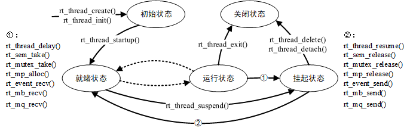

## Delay函数

### 两个Delay函数

有3个Delay函数：

-   rt\_thread\_delay()：以系统时钟节拍为单位，当前线程会阻塞让出CPU资源
-   rt\_thread\_mdelay()：以ms为单位，当前线程会阻塞让出CPU资源
-   rt\_hw\_us\_delay()：以us为单位，当前线程不会阻塞，这个函数是"死等指定时间

这3个函数原型如下：

```text
rt_err_t rt_thread_delay(rt_tick_t tick);rt_err_t rt_thread_mdelay(rt_int32_t ms);void rt_hw_us_delay(rt_uint32_t us);
```

系统时钟节拍是RT-Thread定时器的最小精度

1 OS Tick = 1/RT\_TICK\_PER\_SECOND秒，RT\_TICK\_PER\_SECOND 值在rtconfig.h文件中定义

**rt\_thread\_mdela**y也是只能是时钟节拍的整数倍，使用**rt\_thread\_mdelay**可移植性更好

在实际应用中，可以通过前2个延时函数挂起当前线程，让出CPU。

### \_示例\_Delay

本节代码为：**taskdelay**。

本程序会创建2个线程：

-   Task1：
-   高优先级
-   设置变量flag为1，然后调用**rt\_thread\_mdelay()**或**rt\_hw\_us\_delay()**;
-   rt\_thread\_mdelay()会让出CPU
-   rt\_hw\_us\_delay()不会让出CPU
-   Task2：
-   低优先级
-   设置变量flag为0

main函数代码如下：

```text
int main(void){	/* 创建动态线程thread1，优先级为 THREAD_PRIORIT-1 = 14 */    thread1 = rt_thread_create("thread1",          //线程名字                            thread1_entry,         //入口函数							(void *)thread1_name,  //入口函数参数                            THREAD_STACK_SIZE,     //栈大小                            THREAD_PRIORITY-1,     //线程优先级				            THREAD_TIMESLICE);     //线程时间片大小    /* 判断创建结果,再启动线程1 */    if (thread1 != RT_NULL)        rt_thread_startup(thread1);				   	/* 创建动态线程thread2，优先级为 THREAD_PRIORIT = 15 */    thread2 = rt_thread_create("thread2",          //线程名字                            thread2_entry,         //入口函数							(void *)thread2_name,  //入口函数参数                            THREAD_STACK_SIZE,     //栈大小                            THREAD_PRIORITY,       //线程优先级				            THREAD_TIMESLICE);     //线程时间片大小    /* 判断创建结果,再启动线程2 */    if (thread2 != RT_NULL)        rt_thread_startup(thread2);	
		while (1)
    {
    	rt_thread_mdelay(100);
}	
    return 0;}
```

Thread1的代码中使用条件开关来选择延时函数，把**#if 1** 改为**#if 0** 就可以使用rt\_hw\_us\_delay，
代码如下：

```text
/* 线程1的入口函数 */static void thread1_entry(void *parameter){	const char *thread_name = parameter;		/* 线程1 */	while(1)	{		/* 打印线程的信息 */		rt_kprintf(thread_name);				flag = 1;##if 1				rt_thread_mdelay(50);##else				/* 使用忙等待模拟延时，不直接让出CPU */
		rt_uint32_t delay = 50000;
		 while(delay--);##endif		}}
Thread2的代码如下：
/* 线程2的入口函数 */static void thread2_entry(void *parameter){	const char *thread_name = parameter;		/* 线程1 */	while(1)	{		/* 打印线程的信息 */		rt_kprintf(thread_name);				flag = 0;
rt_thread_mdelay(50);	}}
```

把**taskdelay**目录上传到Ubuntud的k230\_sdk/src/big/rt-smart/userapps下，使用以下命令编译：

首先进入到“k230\_sdk/src/big/rt-smart/”目录，配置环境变量：

```text
ubuntu@ubuntu2004:~/k230_sdk/src/big/rt-smart$ source smart-env.sh riscv64
Arch         => riscv64CC           => gccPREFIX       => riscv64-unknown-linux-musl-EXEC_PATH    => /home/canaan/k230_sdk/src/big/rt-smart/../../../toolchain/riscv64-linux-musleabi_for_x86_64-pc-linux-gnu/bin
```

之后进入“k230\_sdk/src/big/rt-smart/userapps”目录，编译程序

```text
canaan@develop:~/k230_sdk/src/big/rt-smart/userapps$ scons --directory=taskdelay
scons: Entering directory `/home/canaan/k230_sdk/src/big/rt-smart/userapps/test'
scons: Reading SConscript files ...
scons: done reading SConscript files.
scons: Building targets ...
scons: building associated VariantDir targets: build/create_task
CC build/test/test.o
LINK test.elf
/home/canaan/k230_sdk/toolchain/riscv64-linux-musleabi_for_x86_64-pc-linux-gnu/bin/../lib/gcc/riscv64-unknown-linux-musl/12.0.1/../../../../riscv64-unknown-linux-musl/bin/ld: warning: hello.elf has a LOAD segment with RWX permissions
scons: done building targets.
```

编译好的程序在**taskdelay**文件夹下：

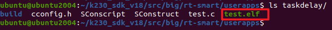

我们可以看到名为“test.elf”的可执行程序；

之后即可将test.elf使用ADB push到小核linux的sharefs目录下，然后大核rt-smart的sharefs下也会出现该程序：

```text
sudo abd push test.elf /sharefs 
```

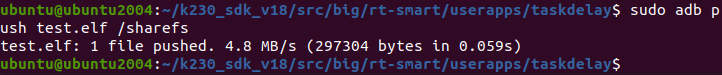

之后我们查看大核rt-smart下的sharefs目录下是否有test.elf，小核的内容是共享给大核的，如果有则执行以下命令运行程序：

```text
msh />cd sharefs
msh /sharefs>ls
Directory /sharefs:
.                                       <DIR>
..                                      <DIR>
app                                     <DIR>
test.elf                                297152
msh /sharefs>test.elf
```

运行情况如下图所示：

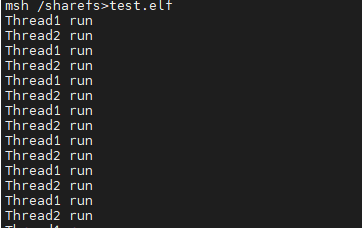
使用**rt\_thread\_mdelay()**时，才会出现电平变化；

使用**delay**时，线程1会一直占用CPU，线程2无法执行，不会出现电平变化。

---

版权所有：深圳百问网科技有限公司
未经授权不得拷贝、复制、修改、传播本文档，否则将追究法律责任。
