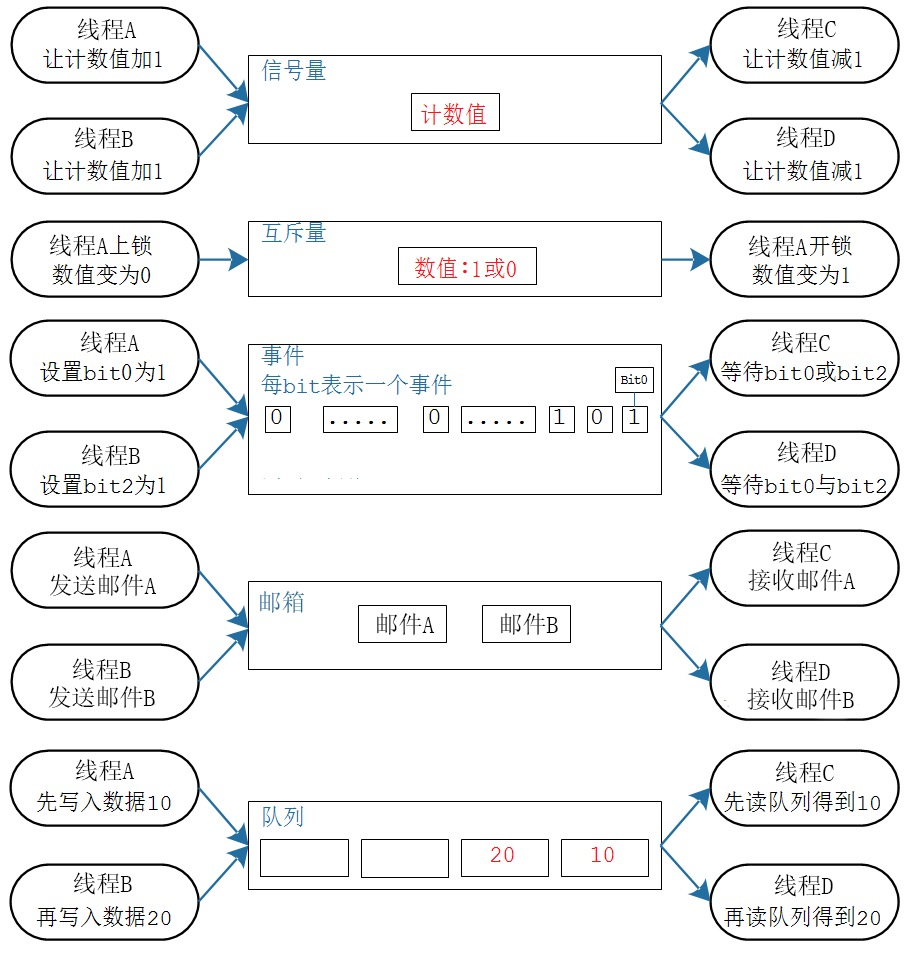

# 同步互斥与通信

> 本文档根据《嘉楠K230开发手册》V1.0（2024-11-30）整理。正文、表格、示例代码与插图均来自原始手册。

本章是概述性的内容。可以把多任务系统当做一个团队，里面的每一个任务就相当于团队里的一个人。团队成员之间要协调工作进度(同步)、争用会议室(互斥)、沟通(通信)。多任务系统中所涉及的概念，都可以在现实生活中找到例子。

各类RTOS都会涉及这些概念：队列、事件、信号量、互斥量等。我们先站在更高角度来讲解这些概念。

## 同步与互斥的概念

一句话理解同步与互斥：我等你用完厕所，我再用厕所。

什么叫同步？就是：哎哎哎，我正在用厕所，你等会。

什么叫互斥？就是：哎哎哎，我正在用厕所，你不能进来。

同步与互斥经常放在一起讲，是因为它们之的关系很大，“互斥”操作可以使用“同步”来实现。我“等”你用完厕所，我再用厕所。这不就是用“同步”来实现“互斥”吗？

再举一个例子。在团队活动里，同事A先写完报表，经理B才能拿去向领导汇报。经理B必须等同事A完成报表，AB之间有依赖，B必须放慢脚步，被称为同步。在团队活动中，同事A已经使用会议室了，经理B也想使用，即使经理B是领导，他也得等着，这就叫互斥。经理B跟同事A说：你用完会议室就提醒我。这就是使用"同步"来实现"互斥"。

有时候看代码更容易理解，伪代码如下：

```text
01 void  抢厕所(void)02 {03    if (有人在用) 我眯一会;04    用厕所;05    喂，醒醒，有人要用厕所吗;06 }
```

假设有A、B两人早起抢厕所，A先行一步占用了；B慢了一步，于是就眯一会；当A用完后叫醒B，B也就愉快地上厕所了。

在这个过程中，A、B是互斥地访问“厕所”，“厕所”被称之为临界资源。我们使用了“休眠-唤醒”的同步机制实现了“临界资源”的“互斥访问”。

同一时间只能有一个人使用的资源，被称为临界资源。

比如线程A、B都要使用串口来打印，串口就是临界资源。如果A、B同时使用串口，那么打印出来的信息就是A、B混杂，无法分辨。所以使用串口时，应该是这样：A用完，B再用；B用完，A再用。

## 同步与互斥并不简单

## 各类方法的对比

能实现同步、互斥的内核方法有：信号量、互斥量、事件、邮箱、消息队列。

它们都有类似的操作方法：获取/释放、阻塞/唤醒、超时。比如：

1.  A获取资源，用完后A释放资源
2.  A获取不到资源则阻塞，B释放资源并把A唤醒
3.  A获取不到资源则阻塞，并定个闹钟；A要么超时返回，要么在这段时间内因为B释放资源而被唤醒。

这些内核对象五花八门，记不住怎么办？我也记不住，通过对比的方法来区分它们。

1.  能否传信息？只能传递状态？
2.  为众生？只为你？
3.  我生产，你们消费？
4.  我上锁，只能由我开锁

| 内核对象 | 消费者 | 生产者 | 数据/状态 | 说明 |
| --- | --- | --- | --- | --- |
| 信号量 | ALL | ALL | 数量：0~n谁都可以增加一个数量，谁都可消耗一个数量 | 用来维持资源的个数，生产者、消费者无限制，1个资源只能唤醒1个接收者 |
| 互斥量 | A上锁 | 只能A开锁 | 位：0、1我上锁：1变为0，只能由我开锁：0变为1 | 就像一个空厕所，谁使用谁上锁，也只能由他开锁 |
| 事件 | ALL | ALL | 多个位：或、与谁都可以设置(生产)多个位，谁都可以等待某个位、若干个位 | 用来传递事件，可以是N个事件，发送者、接受者无限制，可以唤醒多个接收者：像广播 |
| 邮箱 | ALL | ALL | 每封邮件为固定4字节使用邮箱时，可以发给所有线程发邮件，也可以指定线程 | 即指针大小：发送者无限制，接收者可以是多个或1个 |
| 消息队列 | ALL | ALL | 数据：若干个数据谁都可以往队列里扔数据，谁都可以从队列里读数据 | 用来传递数据，发送者、接收者无限制，一个数据只能唤醒一个接收者 |

使用图形对比如下：

-   信号量：
-   核心是"计数值"
-   线程、ISR释放信号量时，让计数值加1
-   线程、ISR获得信号量时，让计数值减1
-   互斥量：
-   数值只有0或1
-   谁获得互斥量，就必须由谁释放同一个互斥量
-   事件：
-   一个事件用一bit表示，1表示事件发生了，0表示事件没发生
-   可以用来表示事件、事件的组合发生了，不能传递数据
-   有广播效果：事件或事件的组合发生了，等待它的多个线程都会被唤醒
-   邮箱：
-   邮件为固定4字节，即指针大小
-   可以发给所有线程，也可以是指定线程
-   接收者可以是多个或1个
-   消息队列：
-   里面可以放任意数据，可以放多个数据
-   线程、ISR都可以放入数据；线程、ISR都可以从中读出数据


