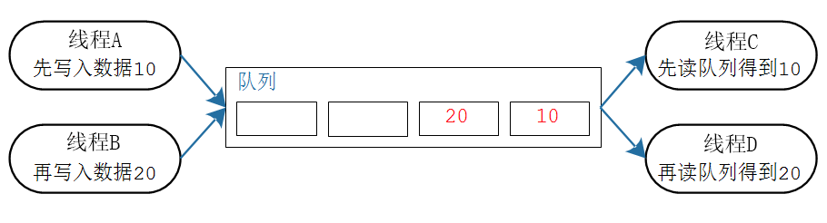
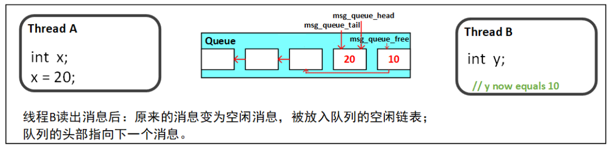
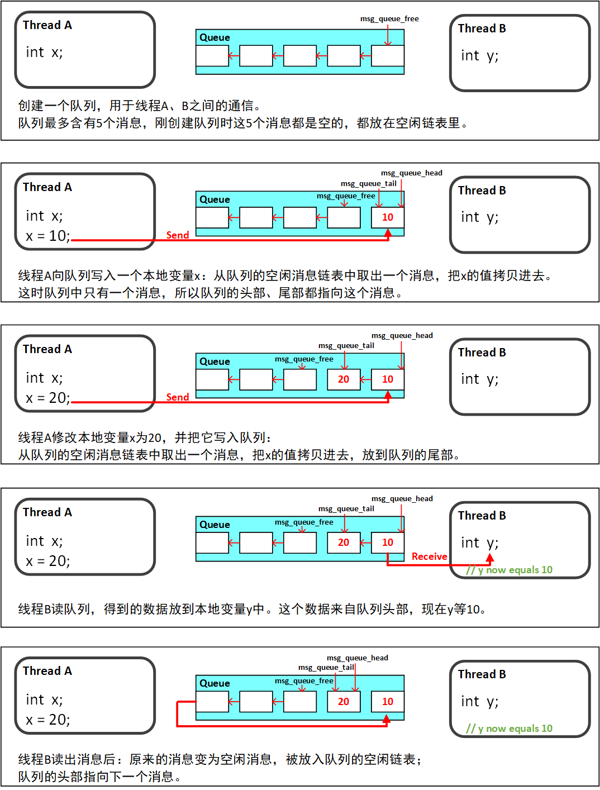
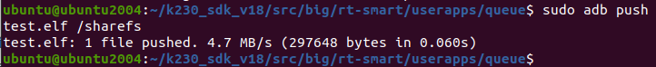
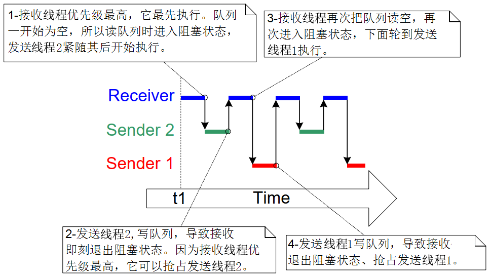
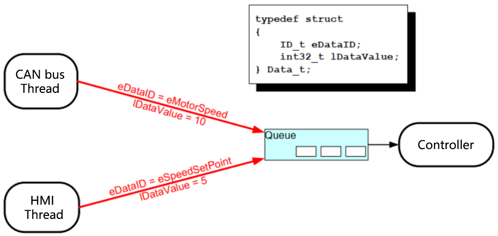
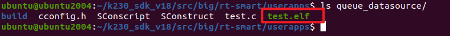
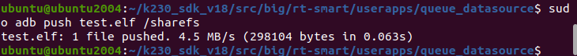
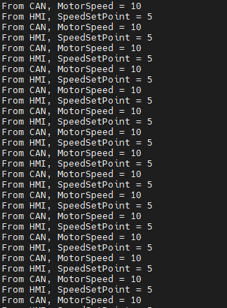
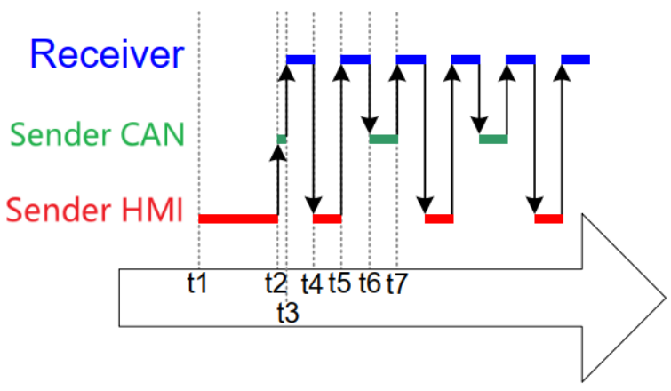

# 消息队列

> 本文档根据《嘉楠K230开发手册》V1.0（2024-11-30）整理。正文、表格、示例代码与插图均来自原始手册。

消息队列可以用于"线程到线程"、"线程到中断"、"中断到线程"直接传输信息。

本章涉及如下内容：

1.  怎么创建、删除消息队列
2.  消息队列中消息如何保存
3.  怎么向消息队列发送数据、怎么从消息队列读取数据
4.  在消息队列上阻塞是什么意思

## 消息队列的特性

### 常规操作

消息队列是一种常用的线程间通讯方式，用来传输数据。

可以应用在多种场合：线程间的消息交换、中断服务程序给线程发送数据。

消息队列的简化操如入下图所示，从此图可知：

1.  消息队列可以包含若干个消息
2.  每个消息可以容纳的数据大小是一样的
3.  创建消息队列时就要指定长度(消息个数)、消息的数据大小
4.  数据的操作采用先进先出的方法(FIFO，First In First Out)：写数据时放到尾部，读数据时从头部读
5.  也可以把紧急的数据写到消息队列的头部



更详细的操作如下图所示：



### 传输数据的两种方法

使用消息队列传输数据时有两种方法：

1.  拷贝：把数据、把变量的值复制进消息队列里
2.  引用：把数据、把变量的地址复制进消息队列里

RT-Thread使用拷贝值的方法，这更简单：

1.  局部变量的值可以发送到消息队列中，后续即使函数退出、局部变量被回收，也不会影响消息队列中的数据
2.  无需分配buffer来保存数据，消息队列中有buffer
3.  局部变量可以马上再次使用
4.  发送线程、接收线程解耦：接收线程不需要知道这数据是谁的、也不需要发送线程来释放数据
5.  如果数据实在太大，你还是可以使用消息队列传输它的地址
6.  消息队列的空间有RT-Thread内核分配，无需线程操心

### 消息队列的阻塞访问

只要知道消息队列的句柄，谁都可以读、写该消息队列。

线程、ISR都可读、写消息队列。可以多个线程读写消息队列。

线程读写消息队列时，如果读写不成功，可以即刻返回错误，也可以阻塞。阻塞时可以指定超时时间。口语化地说，就是可以定个闹钟：如果能读写了就马上进入就绪态，否则就阻塞直到超时。

比如某个线程读消息队列时：

-   如果消息队列中有可用的消息，即刻得到消息并返回
-   如果消息队列中没有可用的消息，线程有两种选择：即刻放回一个错误值，或者阻塞一段时间
-   如果线程阻塞，它何时被唤醒？
-   在指定的时间内，别的线程或者中断服务程序写了队列，会把它唤醒
-   否则，指定的时间到达后超时返回错误。

既然读写消息队列的线程个数没有限制：

-   多个线程都想写队列，但是队列已经满了，这些线程可以进入阻塞状态：它们都在等待队列有空间
-   那么：队列有空间时，把那个线程唤醒？
-   多个线程都想读队列，但是队列已经空了，这些线程可以进入阻塞状态：它们都在等待队列有数据
-   那么：队列有数据时，把那个线程唤醒？
-   唤醒谁？有两种方法。创建队列时，可以指定一个参数flag
-   RT\_IPC\_FLAG\_PRIO：表示唤醒优先级最高的等待线程
-   RT\_IPC\_FLAG\_FIFO：表示唤醒等待时间最长的等待线程

## 消息队列函数

使用消息队列的流程：创建/初始化消息队列、发送消息队列、接收消息队列、删除/脱离消息队列。

### 创建/初始化

消息队列的创建有两种方法：动态分配内存、静态分配内存，

1.  动态分配内存：rt\_mq\_create，消息队列的内存在函数内部动态分配
2.  静态分配内存：rt\_mq\_init，消息队列的内存要事先分配好

**rt\_mq\_create()**函数原型如下：

```text
rt_mq_t rt_mq_create(const char* name, rt_size_t msg_size,        rt_size_t max_msgs, rt_uint8_t flag);
```

| 参数 | 说明 |
| --- | --- |
| name | 消息队列的名字 |
| msg_size | 消息队列每个消息的大小：以字节为单位 |
| max_msgs | 消息队列最多能存放多少个消息 |
| flag | 消息队列采用的等待方式： RT_IPC_FLAG_FIFO 或 RT_IPC_FLAG_PRIO |
| 返回值 | 消息队列对象的句柄：成功，返回句柄，以后使用句柄来操作消息队列RT_NULL：失败 |

**rt\_mq\_init()**函数原型如下：

```text
rt_err_t rt_mq_init(rt_mq_t mq, const char* name,                    void *msgpool, rt_size_t msg_size,                    rt_size_t pool_size, rt_uint8_t flag);
```

| 参数 | 说明 |
| --- | --- |
| mq | 消息队列对象的句柄 |
| name | 消息队列的名字 |
| msgpool | 指向存放消息的缓冲区的指针 |
| msg_size | 消息队列每个消息的大小：以字节为单位 |
| pool_size | 存放消息的缓冲区大小 |
| flag | 消息队列采用的等待方式： RT_IPC_FLAG_FIFO 或 RT_IPC_FLAG_PRIO |
| 返回值 | 非0：成功，返回句柄，以后使用句柄来操作消息队列NULL：失败，因为pxQueueBuffer为NULL |

### 删除/脱离

不再使用一个消息队列时：

1.  删除它：**rt\_mq\_delete()**，只能删除使用**rt\_mq\_create()**创建的队列
2.  脱离它：**rt\_mq\_detach()**，只能脱离使用r**t\_mq\_init()**初始化的队列

删除消息队列的函数为**rt\_mq\_delete()**，它会释放内存。原型如下：

```text
rt_err_t rt_mq_delete(rt_mq_t mq);
```

删除消息队列时，如果有线程在等待该队列，则内核会先唤醒这些线程（线程返回值是 - RT\_ERROR），然后再释放消息队列使用的内存，最后删除消息队列对象。

脱离消息队列，就是将消息队列对象被从内核对象管理器中脱离。原型如下：

```text
rt_err_t rt_mq_detach(rt_mq_t mq);
```

脱离消息队列时，如果有线程在等待该队列，则内核会先唤醒这些线程（线程返回值是 - RT\_ERROR）。

### 发消息

RT-Thread有三个发送消息的函数：

1.  rt\_mq\_send() 发送消息
2.  rt\_mq\_send\_wait() 等待方式发送消息
3.  rt\_mq\_urgent() 发送紧急消息

线程或者中断服务程序都可以往消息队列写入消息。

发送消息时，从空闲消息链表取一个空闲消息块，把消息复制到该消息块，然后把消息块挂到消息队列尾部。

使用**rt\_mq\_send()**发送消息时，队列中有空闲消息块时，才能成功发送消息，否则返回错误码(-RT\_EFULL)。

使用**rt\_mq\_send\_wait()**发送消息时，如果队列中没有可用的空闲消息块，会根据timeout参数等待，超时后才返回错误。

使用**rt\_mq\_urgent()**发送消息时，也要先得到空闲消息块，它会把消息块放在消息队列的头部，以便这个消息能被第1时间读取。

发送消息的函数原型如下：

```text
rt_err_t rt_mq_send (rt_mq_t mq, void* buffer, rt_size_t size);
```

参数说明如下：

| 参数 | 说明 |
| --- | --- |
| mq | 消息队列对象的句柄 |
| buffer | 消息内容 |
| size | 消息大小 |
| 返回值 | RT_EOK：发送成功-RT_EFULL：消息队列满-RT_ERROR：发送消息长度大于队列中消息的最大长度 |

等待方式发送消息的函数原型如下：

```text
rt_err_t rt_mq_send_wait(rt_mq_t     mq,                     const void *buffer,                     rt_size_t   size,                     rt_int32_t  timeout);
```

参数说明如下：

| 参数 | 说明 |
| --- | --- |
| mq | 消息队列对象的句柄 |
| buffer | 消息内容 |
| size | 消息大小 |
| timeout | 超时时间 |
| 返回值 | RT_EOK：发送成功-RT_EFULL：消息队列满-RT_ERROR：发送消息长度大于队列中消息的最大长度 |

发送紧急消息的函数原型如下：

```text
rt_err_t rt_mq_urgent(rt_mq_t mq, void* buffer, rt_size_t size);
```

参数说明如下：

| 参数 | 说明 |
| --- | --- |
| mq | 消息队列对象的句柄 |
| buffer | 消息内容 |
| size | 消息大小 |
| 返回值 | RT_EOK：发送成功-RT_EFULL：消息队列满-RT_ERROR：发送消息长度大于队列中消息的最大长度 |

### 收消息

当队列有消息时，使用收消息函数，可以从队列接收消息。

如果没有消息，根据指定的timeout参数等待，直到超时结束。

函数原型如下：

```text
rt_err_t rt_mq_recv (rt_mq_t mq, void* buffer,                rt_size_t size, rt_int32_t timeout);
```

参数说明如下：

| 参数 | 说明 |
| --- | --- |
| mq | 消息队列对象的句柄 |
| buffer | 消息内容 |
| size | 消息大小 |
| timeout | 超时时间 |
| 返回值 | RT_EOK：接收成功-RT_ETIMEOUT：接收超时-RT_ERROR：失败，返回错误 |

## \_示例\_消息队列的基本使用

本节代码为：queue。

本程序会创建一个消息队列，然后创建2个发送线程、1个接收线程：

1.  发送线程优先级为15，分别往消息队列中写入100、200
2.  接收线程优先级为15+1，读消息队列、打印数值

main函数中创建的消息队列、创建了发送线程、接收线程，代码如下：

```text
int main(void){	rt_err_t result;    /* 初始化消息队列 */    result = rt_mq_init(&mq,                        //消息队列对象的句柄                        "mqt",                      //消息队列的名字                        &msg_pool[0],               //内存池指向msg_pool                         1,                         //每个消息的大小是1字节                          sizeof(msg_pool),           //内存池的大小是msg_pool的大小                          RT_IPC_FLAG_FIFO);          //如果有多个线程等待，按照先来先得到的方法分配消息     if (result != RT_EOK)    {        rt_kprintf("rt_mq_init ERR\n");        return -1;    }		/* 创建动态线程thread1，优先级为 THREAD_PRIORIT = 15 */    thread1 = rt_thread_create("thread1",          //线程名字                            thread1_entry,         //入口函数						(void *)&(int){100},           //入口函数参数                            THREAD_STACK_SIZE,     //栈大小                            THREAD_PRIORITY,       //线程优先级				            THREAD_TIMESLICE);     //线程时间片大小    /* 判断创建结果,再启动线程1 */    if (thread1 != RT_NULL)        rt_thread_startup(thread1);				   	/* 创建动态线程thread2，优先级为 THREAD_PRIORIT = 15 */    thread2 = rt_thread_create("thread2",          //线程名字                            thread1_entry,         //入口函数						(void *)&(int){200},           //入口函数参数                            THREAD_STACK_SIZE,     //栈大小                            THREAD_PRIORITY,       //线程优先级				            THREAD_TIMESLICE);     //线程时间片大小    /* 判断创建结果,再启动线程2 */    if (thread2 != RT_NULL)        rt_thread_startup(thread2);				/* 创建动态线程thread3，优先级为 THREAD_PRIORIT+1 = 16 */    thread3 = rt_thread_create("thread3",          //线程名字                            thread2_entry,         //入口函数							NULL,                  //入口函数参数                            THREAD_STACK_SIZE,     //栈大小                            THREAD_PRIORITY + 1,   //线程优先级				            THREAD_TIMESLICE);     //线程时间片大小    /* 判断创建结果,再启动线程3 */    if (thread3 != RT_NULL)        rt_thread_startup(thread3);
			while (1)
    {
    	rt_thread_mdelay(100);
}	
    return 0;}
```

发送线程的函数中，不断往消息队列中写入数值，代码如下：

```text
/* 线程1的入口函数 */ static void thread1_entry(void *parameter) { 	int result; 	int *buf = parameter; 	 	/* 线程1 */ 	while(1) 	{ 		/* 发送消息 */ 		result = rt_mq_send(&mq, &buf, sizeof(int)); 		if (result != RT_EOK) 		{ 			rt_kprintf("rt_mq_send ERR\n"); 		} 		rt_kprintf("rt_mq_send:%d\n\r", buf);	 		 		rt_thread_mdelay(10); 	} }
```

接收线程的函数中，读取消息队列、判断返回值、打印，代码如下：

```text
/* 线程2的入口函数 */static void thread2_entry(void *parameter){	int buf = 0;		/* 线程1 */	while(1)	{        /* 接收消息 */        if (rt_mq_recv(&mq, &buf, sizeof(buf), RT_WAITING_FOREVER) == RT_EOK)        {            rt_kprintf("rt_mq_recv:%d\n\r", buf);        }		rt_thread_mdelay(10);	}}
```

把**queue**目录上传到Ubuntud的k230\_sdk/src/big/rt-smart/userapps下，使用以下命令编译：

首先进入到“k230\_sdk/src/big/rt-smart/”目录，配置环境变量：

```text
ubuntu@ubuntu2004:~/k230_sdk/src/big/rt-smart$ source smart-env.sh riscv64
Arch         => riscv64CC           => gccPREFIX       => riscv64-unknown-linux-musl-EXEC_PATH    => /home/canaan/k230_sdk/src/big/rt-smart/../../../toolchain/riscv64-linux-musleabi_for_x86_64-pc-linux-gnu/bin
```

之后进入“k230\_sdk/src/big/rt-smart/userapps”目录，编译程序

```text
canaan@develop:~/k230_sdk/src/big/rt-smart/userapps$ scons --directory=queue
scons: Entering directory `/home/canaan/k230_sdk/src/big/rt-smart/userapps/test'
scons: Reading SConscript files ...
scons: done reading SConscript files.
scons: Building targets ...
scons: building associated VariantDir targets: build/create_task
CC build/test/test.o
LINK test.elf
/home/canaan/k230_sdk/toolchain/riscv64-linux-musleabi_for_x86_64-pc-linux-gnu/bin/../lib/gcc/riscv64-unknown-linux-musl/12.0.1/../../../../riscv64-unknown-linux-musl/bin/ld: warning: hello.elf has a LOAD segment with RWX permissions
scons: done building targets.
```

编译好的程序在**queue**文件夹下：


我们可以看到名为“test.elf”的可执行程序；

之后即可将test.elf使用ADB push到小核linux的sharefs目录下，然后大核rt-smart的sharefs下也会出现该程序：

```text
sudo abd push test.elf /sharefs 
```



之后我们查看大核rt-smart下的sharefs目录下是否有test.elf，小核的内容是共享给大核的，如果有则执行以下命令运行程序：

```text
msh />cd sharefs
msh /sharefs>ls
Directory /sharefs:
.                                       <DIR>
..                                      <DIR>
app                                     <DIR>
test.elf                                297152
msh /sharefs>test.elf
```

程序运行结果如下：


 -
线程调度情况如下图所示：



## \_data\_示例\_分辨数据源

本节代码为：queue\_datasource。

当有多个发送线程，通过同一个消息队列发出数据，接收线程如何分辨数据来源？数据本身带有"来源"信息，比如写入消息队列的数据是一个结构体，结构体中的lDataSouceID用来表示数据来源：

```text
typedef struct {	ID_t eDataID;	int32_t lDataValue;}Data_t;
```

不同的发送线程，先构造好结构体，填入自己的eDataID，再写消息队列；接收线程读出数据后，根据eDataID就可以知道数据来源了，如下图所示：

1.  CAN线程发送的数据：eDataID=eMotorSpeed
2.  HMI线程发送的数据：eDataID=eSpeedSetPoint



queue\_datasource程序会创建一个消息队列，然后创建2个发送线程、1个接收线程：

1.  创建的消息队列，用来发送结构体：数据大小是结构体的大小
2.  发送线程优先级为15，分别往消息队列中写入自己的结构体，结构体中会标明数据来源
3.  接收线程优先级为14，读消息队列、根据数据来源打印信息

main函数中创建了消息队列、创建了发送线程、接收线程，代码如下：

```text
/* 定义2种数据来源(ID) */ typedef enum { 	eMotorSpeed, 	eSpeedSetPoint } ID_t;  /* 定义在消息队列中传输的数据的格式 */ typedef struct {     ID_t eDataID;     int32_t lDataValue; }Data_t;  /* 定义2个结构体 */ static const Data_t send_data[2] = { 	{eMotorSpeed,    10}, /* CAN线程发送的数据 */ 	{eSpeedSetPoint, 5}   /* HMI线程发送的数据 */ };  /* 创建消息队列时，增加容量 */
static rt_uint8_t msg_pool[10 * sizeof(Data_t)];  // 增加队列的容量
int main(void) { 	rt_err_t result;      /* 初始化消息队列 */     result = rt_mq_init(&mq,                        //消息队列对象的句柄                         "mqt",                      //消息队列的名字                         &msg_pool[0],               //内存池指向msg_pool                          2,                          //每个消息的大小是1字节                           sizeof(msg_pool),           //内存池的大小是msg_pool的大小                           RT_IPC_FLAG_FIFO);          //如果有多个线程等待，按照先来先得到的方法分配消息       if (result != RT_EOK)     {         rt_kprintf("rt_mq_init ERR\n");         return -1;     } 	 	/* 创建动态线程thread1，优先级为 THREAD_PRIORIT = 15 */     thread1 = rt_thread_create("thread1",          //线程名字                             thread1_entry,         //入口函数 							(void *)&send_data[0],           //入口函数参数                             THREAD_STACK_SIZE,     //栈大小                             THREAD_PRIORITY,       //线程优先级 				            THREAD_TIMESLICE);     //线程时间片大小      /* 判断创建结果,再启动线程1 */     if (thread1 != RT_NULL)         rt_thread_startup(thread1);				     	/* 创建动态线程thread2，优先级为 THREAD_PRIORIT = 15 */     thread2 = rt_thread_create("thread2",          //线程名字                             thread1_entry,         //入口函数 							(void *)&send_data[1],           //入口函数参数                             THREAD_STACK_SIZE,     //栈大小                             THREAD_PRIORITY,       //线程优先级 				            THREAD_TIMESLICE);     //线程时间片大小      /* 判断创建结果,再启动线程2 */     if (thread2 != RT_NULL)         rt_thread_startup(thread2);		 	 	/* 创建动态线程thread3，优先级为 THREAD_PRIORIT+1 = 16 */     thread3 = rt_thread_create("thread3",          //线程名字                             thread2_entry,         //入口函数 							NULL,                  //入口函数参数                             THREAD_STACK_SIZE,     //栈大小                             THREAD_PRIORITY + 1,   //线程优先级 				            THREAD_TIMESLICE);     //线程时间片大小      /* 判断创建结果,再启动线程3 */     if (thread3 != RT_NULL)         rt_thread_startup(thread3);		 		while (1)
    {
    	rt_thread_mdelay(100);
}		
     return 0; }
```

发送线程的函数中，不断往消息队列中写入数值，代码如下：

```text
/* 线程1的入口函数 */static void thread1_entry(void *parameter){	int result;	Data_t *buf = parameter;			/* 线程1 */	while(1)	{		/* 发送消息 */		result = rt_mq_send(&mq, buf, sizeof(buf));		if (result != RT_EOK)		{			rt_kprintf("rt_mq_send ERR\n");		}			rt_thread_mdelay(10);	}}
```

接收线程的函数中，读取消息队列、判断返回值、打印，代码如下：

```text
/* 线程2的入口函数 */static void thread2_entry(void *parameter){	Data_t buf;		/* 线程2 */	while(1)	{        /* 接收消息 */        if (rt_mq_recv(&mq, &buf, sizeof(buf), RT_WAITING_FOREVER) == RT_EOK)        {						if(buf.eDataID == eMotorSpeed)			{				rt_kprintf("From CAN, MotorSpeed = %d\r\n", buf.lDataValue);			}			else if(buf.eDataID == eSpeedSetPoint)			{				rt_kprintf("From HMI, SpeedSetPoint = %d\r\n", buf.lDataValue);			}        }		rt_thread_mdelay(10);	}}
```

把**queue\_datasource**目录上传到Ubuntud的k230\_sdk/src/big/rt-smart/userapps下，使用以下命令编译：

首先进入到“k230\_sdk/src/big/rt-smart/”目录，配置环境变量：

```text
ubuntu@ubuntu2004:~/k230_sdk/src/big/rt-smart$ source smart-env.sh riscv64
Arch         => riscv64CC           => gccPREFIX       => riscv64-unknown-linux-musl-EXEC_PATH    => /home/canaan/k230_sdk/src/big/rt-smart/../../../toolchain/riscv64-linux-musleabi_for_x86_64-pc-linux-gnu/bin
```

之后进入“k230\_sdk/src/big/rt-smart/userapps”目录，编译程序

```text
canaan@develop:~/k230_sdk/src/big/rt-smart/userapps$ scons --directory=queue_datasource
scons: Entering directory `/home/canaan/k230_sdk/src/big/rt-smart/userapps/test'
scons: Reading SConscript files ...
scons: done reading SConscript files.
scons: Building targets ...
scons: building associated VariantDir targets: build/create_task
CC build/test/test.o
LINK test.elf
/home/canaan/k230_sdk/toolchain/riscv64-linux-musleabi_for_x86_64-pc-linux-gnu/bin/../lib/gcc/riscv64-unknown-linux-musl/12.0.1/../../../../riscv64-unknown-linux-musl/bin/ld: warning: hello.elf has a LOAD segment with RWX permissions
scons: done building targets.
```

编译好的程序在**queue\_datasource**文件夹下：



我们可以看到名为“test.elf”的可执行程序；

之后即可将test.elf使用ADB push到小核linux的sharefs目录下，然后大核rt-smart的sharefs下也会出现该程序：

```text
sudo abd push test.elf /sharefs 
```



之后我们查看大核rt-smart下的sharefs目录下是否有test.elf，小核的内容是共享给大核的，如果有则执行以下命令运行程序：

```text
msh />cd sharefs
msh /sharefs>ls
Directory /sharefs:
.                                       <DIR>
..                                      <DIR>
app                                     <DIR>
test.elf                                297152
msh /sharefs>test.elf
```

运行结果如下：



线程调度情况如下图所示：

1.  t1：HMI是最后创建的最高优先级线程，它先执行，一下子向消息队列写入5个数据，把消息队列都写满了
2.  t2：消息队列已经满了，HMI线程再发起第6次写操作时，进入阻塞状态。这时CAN线程是最高优先级的就绪态线程，它开始执行
3.  t3：CAN线程发现消息队列已经满了，进入阻塞状态；接收线程变为最高优先级的就绪态线程，它开始运行
4.  t4：现在，HMI线程、CAN线程的优先级都比接收线程高，它们都在等待消息队列有空闲的空间；一旦接收线程读出1个数据，会马上被抢占。被谁抢占？谁等待最久？HMI线程！所以在t4时刻，切换到HMI线程。
5.  t5：HMI线程向消息队列写入第6个数据，然后再次阻塞，这是CAN线程已经阻塞很久了。接收线程变为最高优先级的就绪态线程，开始执行。
6.  t6：现在，HMI线程、CAN线程的优先级都比接收线程高，它们都在等待消息队列有空闲的空间；一旦接收线程读出1个数据，会马上被抢占。被谁抢占？谁等待最久？CAN线程！所以在t6时刻，切换到CAN线程。
7.  t7：CAN线程向消息队列写入数据，因为仅仅有一个空间供写入，所以它马上再次进入阻塞状态。这时HMI线程、CAN线程都在等待空闲空间，只有接收线程可以继续执行。



---

版权所有：深圳百问网科技有限公司
未经授权不得拷贝、复制、修改、传播本文档，否则将追究法律责任。
