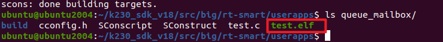
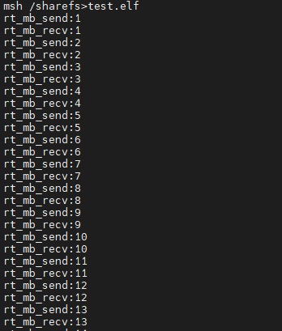

# 邮箱

> 本文档根据《嘉楠K230开发手册》V1.0（2024-11-30）整理。正文、表格、示例代码与插图均来自原始手册。

消息队列的本质是链表：

1.  空闲消息块链表：往队列里写入消息时，先从空闲链表中得到消息块；从队列读出消息后，把消息块放入空闲链表
2.  消息块头部链表：消息写入消息块后，该消息块被放到尾部；从队列里读消息时，从头部读。

使用消息队列可以传递各类大小的消息，它使用memcpy的方式写入消息、读出消息。

如果我们只是传递很小的数据，比如一些数值，可以使用邮箱：它的效率更高。

本章涉及如下内容：

1.  怎么创建、删除邮箱
2.  邮箱中数据如何保存
3.  怎么向邮箱写入数据、怎么从邮箱读取数据
4.  在邮箱上阻塞是什么意思

## 邮箱的特性

邮箱的本质是环形缓冲区：


-   邮箱中的每一封邮件，只能容纳4字节内容（对于32位系统，指针大小刚好为4字节）；
-   邮件的发送通常是非阻塞的，线程、中断都可以发送邮件；也可使用阻塞方式发送；
-   邮件的接收通常是阻塞的，取决于邮箱中是否有邮件；
-   当一个线程向邮箱发送邮件时：
-   如果邮箱没满，就把数值写入邮箱中
-   如果邮箱满了：
-   发送线程可以直接返回-RT\_EFULL
-   也可以挂起一段时间，在挂起的期间，别的线程或中断服务程序读了邮箱，会唤醒挂起的线程。
-   当一个线程从邮箱接收邮件时：
-   如果邮箱不为空，就读取邮箱中的数值
-   如果邮箱为空：
-   接收线可以直接返回-RT\_ETIMOUT
-   也可以挂起一段时间，在挂起的期间，别的线程或中断服务程序写了邮箱，会唤醒挂起的线程。

## 邮箱操作函数

邮箱由邮箱控制块管理，由结构体**rt\_mailbox**表示。

使用邮箱的流程：创建/初始化邮箱、发送邮件、接收邮件、删除/脱离邮箱。

### 创建/初始化

邮箱的创建有两种方法：

1.  动态分配内存：**rt\_mb\_create()** ，邮箱的内存在函数内部动态分配，分配的内存大小为邮件大小乘以邮箱容量
2.  静态分配内存：**rt\_mb\_init()**，邮箱的内存事先分配好，比如可以是数组。

**rt\_mb\_create()**函数原型如下：

```text
rt_mailbox_t rt_mb_create (const char* name, rt_size_t size, rt_uint8_t flag);
```

| 参数 | 说明 |
| --- | --- |
| name | 邮箱名称 |
| size | 邮箱容量 |
| flag | 邮箱采用的等待方式： RT_IPC_FLAG_FIFO 或 RT_IPC_FLAG_PRIO |
| 返回值 | 邮箱对象的句柄：成功，返回句柄，以后使用句柄来操作邮箱RT_NULL：失败 |

**rt\_mb\_init()**函数原型如下：

```text
rt_err_t rt_mb_init(rt_mailbox_t mb,                const char* name,                void* msgpool,                rt_size_t size,                rt_uint8_t flag)
```

| 参数 | 说明 |
| --- | --- |
| mb | 邮箱对象的句柄 |
| name | 邮箱的名字 |
| msgpool | 缓冲区指针 |
| size | 邮箱容量 |
| flag | 邮箱采用的等待方式： RT_IPC_FLAG_FIFO 或 RT_IPC_FLAG_PRIO |
| 返回值 | RT_EOK：成功 |

### 删除/脱离

不再使用一个邮箱时：

1.  删除它：**rt\_mb\_delete()**，只能删除使用**rt\_mb\_create()**创建的邮箱
2.  脱离它：**rt\_mb\_detach()**，只能脱离使用**rt\_mb\_init()**初始化的邮箱

删除邮箱的函数为**rt\_mb\_delete()**，它会释放内存。原型如下：

```text
rt_err_t rt_mb_delete (rt_mailbox_t mb);
```

删除邮箱时，如果有线程在等待该邮箱，则内核先唤醒这些线程（线程返回值是 - RT\_ERROR），然后再释放邮箱使用的内存，最后删除邮箱对象。

脱离邮箱将使邮箱对象被从内核对象管理器中脱离。原型如下：

```text
rt_err_t rt_mb_detach(rt_mailbox_t mb);
```

脱离消息邮箱时，如果有线程在等待该邮箱，则内核会先唤醒这些线程（线程返回值是 - RT\_ERROR）。

### 发邮件

RT-Thread有三个发送邮件的函数：

1.  rt\_mb\_send() 发送邮件
2.  rt\_mb\_send\_wait() 等待方式发送邮件
3.  rt\_mb\_urgent() 发送紧急邮件

线程或者中断服务程序都可以通过往邮箱里写入邮件。

发送的邮件，可以是32位的任意格式数据，可以是一个整型值或者一个指向某块内存的指针。

使用**rt\_mq\_send()**发送消息时，只有在邮箱有可用的空闲空间时，才能成功发送消息，否则返回错误码(-RT\_EFULL)。

使用**rt\_mq\_send\_wait()**发送消息时，如果邮箱没有可用的空闲空间，会根据timeout参数等待，超时后才返回错误。

使用**rt\_mq\_urgent()**发送消息时，只有在邮箱有可用的空闲空间，它才会把邮件插在邮件队首，以便这个邮件能被第1时间读取。

发送邮件的函数原型如下：

```text
rt_err_t rt_mb_send (rt_mailbox_t mb, rt_uint32_t value)
```

参数说明如下：

| 参数 | 说明 |
| --- | --- |
| mb | 邮箱对象的句柄 |
| value | 邮件内容 |
| 返回值 | RT_EOK：发送成功-RT_EFULL：邮箱满了 |

等待方式发送邮件的函数原型如下：

```text
rt_err_t rt_mb_send_wait (rt_mailbox_t mb,                  rt_uint32_t value,                  rt_int32_t timeout);
```

参数说明如下：

| 参数 | 说明 |
| --- | --- |
| mb | 邮箱对象的句柄 |
| value | 邮件内容 |
| timeout | 超时时间 |
| 返回值 | RT_EOK：发送成功-RT_ETIMEOUT：发送超时-RT_ERROR：发送失败 |

发送紧急邮件的函数原型如下：

```text
rt_err_t rt_mb_urgent (rt_mailbox_t mb, rt_ubase_t value);
```

参数说明如下：

| 参数 | 说明 |
| --- | --- |
| mb | 邮箱对象的句柄 |
| value | 邮件内容 |
| 返回值 | RT_EOK：发送成功-RT_EFULL：邮箱满了 |

### 收邮件

当邮箱有邮件时，使用收邮件函数，可以从邮箱接收邮件。

如果没有邮件，根据指定的timeout参数等待，直到超时结束。

函数原型如下：

```text
rt_err_t rt_mb_recv (rt_mailbox_t mb, rt_uint32_t* value, rt_int32_t timeout);
```

参数说明如下：

| 参数 | 说明 |
| --- | --- |
| mb | 邮箱对象的句柄 |
| value | 邮件内容 |
| timeout | 超时时间 |
| 返回值 | RT_EOK：接收成功-RT_ETIMEOUT：接收超时-RT_ERROR：失败，返回错误 |

## \_示例\_邮箱的基本使用

本节代码为：queue\_mailbox。

main函数中创建了邮箱、创建了发送线程、接收线程：

代码如下：

```text
int main(void){	rt_err_t result;    /* 初始化邮箱 */    result = rt_mb_init(&mb,                       //邮箱对象的句柄                        "mbt",                     //邮箱的名字                        &mb_pool[0],               //内存池指向mb_pool                        sizeof(mb_pool) / 4,       //邮箱中能容纳的邮件数量,每封邮件占四字节                          RT_IPC_FLAG_FIFO);         //如果有多个线程等待，按照先来先得到的方法分配邮件     if (result != RT_EOK)    {        rt_kprintf("rt_mb_init ERR\n");        return -1;    }		/* 创建动态线程thread1，优先级为 THREAD_PRIORIT-1 = 14 */    thread1 = rt_thread_create("thread1",          //线程名字                            thread1_entry,         //入口函数							(void *)mb_str,        //入口函数参数                            THREAD_STACK_SIZE,     //栈大小                            THREAD_PRIORITY - 1,   //线程优先级				            THREAD_TIMESLICE);     //线程时间片大小    /* 判断创建结果,再启动线程1 */    if (thread1 != RT_NULL)        rt_thread_startup(thread1);				   	/* 创建动态线程thread2，优先级为 THREAD_PRIORIT = 15 */    thread2 = rt_thread_create("thread2",          //线程名字                            thread2_entry,         //入口函数							RT_NULL,               //入口函数参数                            THREAD_STACK_SIZE,     //栈大小                            THREAD_PRIORITY,       //线程优先级				            THREAD_TIMESLICE);     //线程时间片大小    /* 判断创建结果,再启动线程2 */    if (thread2 != RT_NULL)        rt_thread_startup(thread2);	
		while (1)
    {
    	rt_thread_mdelay(100);
}		
    return 0;}
```

发送线程的函数中，不断往邮箱发送邮件，代码如下：

```text
/* 线程1的入口函数 */static void thread1_entry(void *parameter){	rt_err_t result;	int count = 0;		/* 线程1 */	while(1)	{		/* 发送邮箱 */		count++;		result = rt_mb_send(&mb, (rt_ubase_t)count);		if (result != RT_EOK)		{			rt_kprintf("rt_mb_send ERR\n");		}		rt_kprintf("rt_mb_send:%d\n\r", count);					rt_thread_mdelay(10);	}}
```

接收线程的函数中，读邮件、打印，代码如下：

```text
/* 线程2的入口函数 */static void thread2_entry(void *parameter){	int val;		/* 线程2 */	while(1)	{        /* 接收消息 */        if (rt_mb_recv(&mb, (rt_ubase_t *)&val, RT_WAITING_FOREVER) == RT_EOK)        {            rt_kprintf("rt_mb_recv:%d\n\r", val);        }		rt_thread_mdelay(5);	}}
```

把**queue\_mailbox**目录上传到Ubuntud的k230\_sdk/src/big/rt-smart/userapps下，使用以下命令编译：

首先进入到“k230\_sdk/src/big/rt-smart/”目录，配置环境变量：

```text
ubuntu@ubuntu2004:~/k230_sdk/src/big/rt-smart$ source smart-env.sh riscv64
Arch         => riscv64CC           => gccPREFIX       => riscv64-unknown-linux-musl-EXEC_PATH    => /home/canaan/k230_sdk/src/big/rt-smart/../../../toolchain/riscv64-linux-musleabi_for_x86_64-pc-linux-gnu/bin
```

之后进入“k230\_sdk/src/big/rt-smart/userapps”目录，编译程序

```text
canaan@develop:~/k230_sdk/src/big/rt-smart/userapps$ scons --directory=queue_mailbox
scons: Entering directory `/home/canaan/k230_sdk/src/big/rt-smart/userapps/test'
scons: Reading SConscript files ...
scons: done reading SConscript files.
scons: Building targets ...
scons: building associated VariantDir targets: build/create_task
CC build/test/test.o
LINK test.elf
/home/canaan/k230_sdk/toolchain/riscv64-linux-musleabi_for_x86_64-pc-linux-gnu/bin/../lib/gcc/riscv64-unknown-linux-musl/12.0.1/../../../../riscv64-unknown-linux-musl/bin/ld: warning: hello.elf has a LOAD segment with RWX permissions
scons: done building targets.
```

编译好的程序在**queue\_mailbox**文件夹下：



我们可以看到名为“test.elf”的可执行程序；

之后即可将test.elf使用ADB push到小核linux的sharefs目录下，然后大核rt-smart的sharefs下也会出现该程序：

```text
sudo abd push test.elf /sharefs 
```


之后我们查看大核rt-smart下的sharefs目录下是否有test.elf，小核的内容是共享给大核的，如果有则执行以下命令运行程序：

```text
msh />cd sharefs
msh /sharefs>ls
Directory /sharefs:
.                                       <DIR>
..                                      <DIR>
app                                     <DIR>
test.elf                                297152
msh /sharefs>test.elf
```

运行结果如下图所示：


