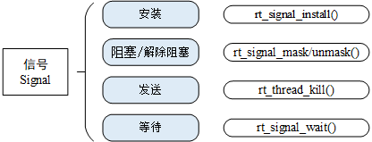
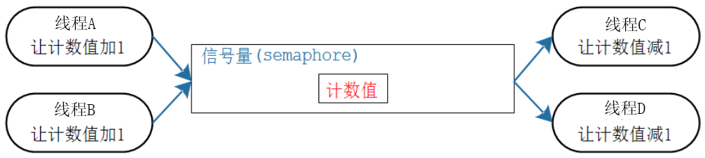
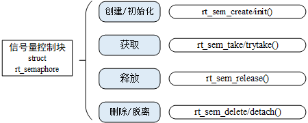
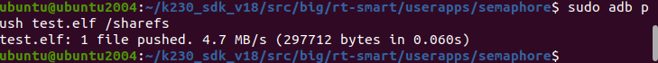
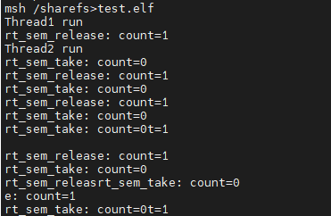

# 信号和信号量

> 本文档根据《嘉楠K230开发手册》V1.0（2024-11-30）整理。正文、表格、示例代码与插图均来自原始手册。

信号和信号量，没有任何关系。之所以把它们放在同一章里，完全是因为很多人会混淆，那么我们干脆同时讲解它们。

信号的本质是软中断，是线程层面对中断机制的一种模拟：

1.  线程平时执行自己的函数
2.  别的线程或者中断服务程序给线程发信号
3.  线程当前的执行被打断，线程转而去执行信号处理函数，执行完信号处理函数后再继续运行之前的代码

如果想要使用信号，需要在**rtconfig.h**中定义**#define RT\_USING\_SIGNALS**。

而信号量就像队列、邮箱一样，是用来传递信息的：

1.  队列：传递各类大小的数据
2.  邮箱：传递多个32位的数据
3.  信号量：传递1个数值

消息队列、邮箱用于传输多个数据，但是有时候我们只需要传递状态，这个状态值需要用一个数值表示，比如：

1.  卖家：做好了1个包子，包子数量加1
2.  买家：买了1个包子，包子数量减1
3.  这个停车位我占了，停车位减1
4.  我开车走了，停车位加1

在这种情况下我们只需要维护一个数值，使用信号量效率更高、更节省内存

本章涉及如下内容：

1.  信号的工作机制
2.  怎么使用信号
3.  信号量的工作机制
4.  怎么使用信号量

## 信号的特性

### 信号的工作机制

信号的发送者、接收者都是线程：线程发信号给线程，尚不支持中断发信号给线程。

线程对收到的信号，有三类处理方式：

1.  第一类：类似中断处理程序，对于需要处理的信号，线程可以指定处理函数，由该函数处理
2.  第二类：忽略某个信号，对该信号不处理
3.  第三类：对该信号的处理，使用系统的默认方式
4.  怎么使用这些处理方式？就是给信号安装处理函数：

```text
rt_signal_install(SIGUSR1, my_signal_handler);  /* 给信号SIGUSR1安装我们自己的处理函数*/rt_signal_install(SIGUSR1, SIG_IGN);            /* 不处理信号SIGUSR1 */rt_signal_install(SIGUSR1, SIG_DFL);            /* 给信号SIGUSR1安装默认的处理函数,只是打印 */
```

RT-Thread根据POSIX标准定义信号集，大部分信号被系统所用，用户程序只能使用SIGUSR1(10)和 SIGUSR2(12)。

假设有两个线程，线程1接收信号，线程2发送信号，用法如下：

1.  线程1先安装信号并设置对信号的处理方式，然后解除阻塞

```text
/* 安装信号,自定义处理函数 */rt_signal_install(SIGUSR1, my_signal_handler);	/* 解除阻塞 */rt_signal_unmask(SIGUSR1);
```

1.  线程2发送信号，触发线程1进行处理

```text
rt_thread_kill(thread1, SIGUSR1); //向线程1发送信号SIGUSR1
```

-   线程1如果在挂起状态收到信号
-   线程1被唤醒
-   线程1先调用信号处理函数
-   再继续运行之前的代码
-   线程1如果在就绪状态收到信号
-   线程1再次运行时，先调用信号处理函数
-   再继续运行之前的代码
-   线程2给自己发信号：rt\_thread\_kill(thread2, SIGUSR1)
-   在rt\_thread\_kill()函数内部直接调用信号处理函数

## 信号函数

使用信号时，需要先安装、屏蔽/使能、发送和等待。



### 安装

如果线程需要处理某一个信号，就需要现在线程中安装该信号。

安装信号的函数原型如下：

```text
/* 安装一个信号，返回安装结果。 * 此函数有两个参数，分别为信号值和信号值的处理方法 * signo：信号值(SIGUSR1 或 SIGUSR2) * handler：处理方式(SIG_IGN、SIG_DFL、自定义处理函数) * 返回值: 成功返回handler值，错误返回SIG_ERR */rt_sighandler_t rt_signal_install(int signo, rt_sighandler_t handler);
```

第2个参数可以传入我们提供的函数，也可以：

1.  传入**SIG\_DFL**，即使用系统的默认方式，系统会调用默认的处理函数**\_signal\_default\_handler()**，它只是打印
2.  传入**SIG\_IGN**，就是忽略：接收到信号后不做任何处理

### 屏蔽/使能

如果屏蔽该信号，就该信号不会传达给安装该信号的线程。

屏蔽信号的函数原型如下：

```text
void rt_signal_mask(int signo);
```

线程中可以安装好几个信号，根据需求选择使能部分信号，则这部分信号才能传达给该线程。

接触屏蔽，即使能信号的函数原型如下：

```text
void rt_signal_unmask(int signo);
```

### 发送信号

当需要某线程进行异常处理时，如果该线程安装了某信号，则使用rt\_thread\_kill()发送信号：

发送信号的函数原型如下：

```text
/* 发送信号。 * tid：接收信号的线程 * sig：信号值 * 返回值: 成功返回RT_EOK，错误返回-RT_EINVAL */int rt_thread_kill(rt_thread_t tid, int sig);
```

### 等待信号

一个线程可以等待别的线程给它发信号，函数原型如下：

```text
int rt_signal_wait(const rt_sigset_t *set, rt_siginfo_t *si, rt_int32_t timeout);
```

| 参数 | 描述 |
| --- | --- |
| set | 输入参数：想等待哪个信号，注意它是一个指针，*set等于信号的编号 |
| si | 输出参数：用来保存等到的信号的信息 |
| timeout | 指定的等待时间 |
| 返回 | —— |
| RT_EOK | 等到信号 |
| -RT_ETIMEOUT | 超时 |
| -RT_EINVAL | 参数错误 |

## 信号量的特性

### 信号量的常规操作

**注意**：信号、信号量完全没有关系。

信号量这个名字很恰当：

1.  信号：起通知作用
2.  量：用来表示资源的数量
3.  支持的动作："give"给出资源，计数值加1；"take"获得资源，计数值减1

信号量的典型场景是：

1.  计数：生产者"give"信号量，让计数值加1；消费者先"take"信号量，就是获得信号量，让计数值减1。
2.  资源管理：要想访问资源需要先"take"信号量，让计数值减1；用完资源后"give"信号量，让计数值加1。

信号量的"give"、"take"双方并不需要相同，可以用于生产者-消费者场合：

-   生产者为线程A、B，消费者为线程C、D
-   一开始信号量的计数值为0，如果线程C、D想获得信号量，会有两种结果：
-   阻塞：买不到东西咱就等等吧，可以定个闹钟(超时时间)
-   即刻返回失败：不等
-   线程A、B可以生产资源，就是让信号量的计数值增加1，并且把等待这个资源的顾客唤醒
-   唤醒谁？有两种方法。创建信号量时，可以指定一个参数flag
-   RT\_IPC\_FLAG\_PRIO：表示唤醒优先级最高的等待线程
-   RT\_IPC\_FLAG\_FIFO：表示唤醒等待时间最长的等待线程



### 信号量跟队列的对比

差异列表如下：

| 队列 | 信号量 |
| --- | --- |
| 可以容纳多个数据，创建队列时有2部分内存: 队列结构体、存储数据的空间 | 只有计数值，无法容纳其他数据。创建信号量时，只需要分配信号量结构体 |
| 生产者：没有空间存入数据时可以阻塞 | 生产者：不阻塞，只要计数值没超过0xffff都会成功 |
| 消费者：没有数据时可以阻塞 | 消费者：没有资源时可以阻塞 |

## 信号量函数

在RT-Thread中，使用结构体**struct rt\_semaphore**来管理信号量：

```text
struct rt_semaphore{    struct rt_ipc_object parent;                        /**< inherit from ipc_object */    rt_uint16_t          value;                         /**< value of semaphore. */    rt_uint16_t          reserved;                      /**< reserved field */};
```

里面成员**rt\_uint16\_t value**表示信号量的值，最大为65535。

使用信号量时，先创建/初始化、然后去获取资源、释放资源。使用句柄**rt\_sem\_t**来表示一个信号量。



### 创建/初始化

使用信号量之前，要先创建，得到一个句柄；使用信号量时，要使用句柄来表明使用哪个信号量。

信号量的创建有两种方法：动态分配内存、静态分配内存，

1.  动态分配内存：**rt\_sem\_create()**，从对象管理器中分配一个 **semaphore** 对象，并初始化这个对象
2.  静态分配内存：**rt\_sem\_init()**，信号量结构体要事先分配好

**rt\_sem\_create()**函数原型如下：

```text
rt_sem_t rt_sem_create(const char *name,                rt_uint32_t value,                rt_uint8_t flag);
```

| 参数 | 说明 |
| --- | --- |
| name | 信号量名称 |
| value | 信号量初始值 |
| flag | 信号量标志，可以取： RT_IPC_FLAG_FIFO 或 RT_IPC_FLAG_PRIO |
| 返回值 | 信号量句柄：成功，返回句柄，以后使用句柄来操作信号量RT_NULL：失败 |

**rt\_sem\_init()**函数原型如下：

```text
rt_err_t rt_sem_init(rt_sem_t       sem,                const char     *name,                rt_uint32_t    value,                rt_uint8_t     flag)
```

| 参数 | 说明 |
| --- | --- |
| sem | 信号量对象的句柄 |
| name | 信号量的名字 |
| value | 信号量的初始值 |
| flag | 信号量标志： RT_IPC_FLAG_FIFO 或 RT_IPC_FLAG_PRIO |
| 返回值 | RT_EOK：成功 |

### 删除/脱离

不再使用一个信号量时：

1.  删除它：**rt\_sem\_delete()**，只能删除使用**rt\_sem\_create()**创建的信号量
2.  脱离它：**rt\_sem\_detach()**，只能脱离使用**rt\_sem\_init()**初始化的信号量

删除消息队列的函数为**rt\_sem\_delete()**，它会释放内存。原型如下：

```text
rt_err_t rt_sem_delete(rt_sem_t sem);
```

删除信号量时，如果有线程正在等待该信号量，则内核会先唤醒这些线程（线程返回值是 - RT\_ERROR），然后再释放信号量使用的内存，最后删除信号量对象。

脱离信号量，就是将信号量对象被从内核对象管理器中脱离。原型如下：

```text
rt_err_t rt_sem_detach(rt_sem_t sem);
```

脱离信号量时，如果有线程在等待该信号量，则内核会先唤醒这些线程（线程返回值是 - RT\_ERROR）。

### 获取/释放

RT-Thread有两个获取信号量的函数,一个释放信号量函数：

1.  rt\_sem\_take() 获取信号量
2.  rt\_sem\_trytake() 无等待、尝试获取信号量
3.  rt\_sem\_release() 释放信号量

使用**rt\_sem\_take()**获取信号量时，信号量的值大于0，线程将获得信号量，信号量值减1；当信号量的值等于0时，线程会根据timeout参数等待，超时后才返回错误( - RT\_ETIMEOUT)。

使用**rt\_sem\_trytake()**获取信号量时，信号量的值大于0，线程将获得信号量，信号量值减1；当信号量的值等于0时，线程会直接返回，和**rt\_sem\_take(sem, RT\_WAITING\_NO)**作用相同，即不会等待。

使用**rt\_sem\_release()**将释放信号量：

-   如果有线程在等待这个信号量，此函数不会累加信号量的值，而是直接唤醒等待的线程
-   有多个线程在等待同一个信号量时，谁被唤醒？
-   创建信号量时指定参数为RT\_IPC\_FLAG\_PRIO：表示唤醒优先级最高的等待线程
-   创建信号量时指定参数为RT\_IPC\_FLAG\_FIFO：表示唤醒等待时间最长的等待线程
-   如果没有线程在等待这个信号量，此函数会累加信号量的值

获取信号量的函数原型如下：

```text
rt_err_t rt_sem_take (rt_sem_t sem, rt_int32_t time);
```

参数说明如下：

| 参数 | 说明 |
| --- | --- |
| sem | 信号量对象的句柄 |
| time | 超时时间，单位为系统时钟节拍（OS Tick） |
| 返回值 | RT_EOK：获取信号量成功-RT_ETIMEOUT：获取信号量超时-RT_ERROR：获取信号量错误 |

无等待获取信号量的函数原型如下：

```text
rt_err_t rt_sem_trytake(rt_sem_t sem);
```

参数说明如下：

| 参数 | 说明 |
| --- | --- |
| sem | 信号量的句柄 |
| 返回值 | RT_EOK：获取信号量成功-RT_ETIMEOUT：获取信号量超时 |

释放信号量的函数原型如下：

```text
rt_err_t rt_sem_release(rt_sem_t sem);
```

参数说明如下：

| 参数 | 说明 |
| --- | --- |
| sem | 信号量的句柄 |
| 返回值 | RT_TRUE：释放信号量成功，并唤醒了一个等待的线程RT_EOK：释放信号量成功-RT_EFULL：信号量的值已经到达极限0xffff |

## \_示例\_信号量的基本使用

本节代码为：**semaphore**。

本程序会创建一个信号量，初始值计数值为0；

然后创建2个线程：一个用于释放信号量，另一个用于获取信号量。

在主函数，动态创建了信号量：

```text
/* 创建一个动态信号量，初始值是0 */dynamic_sem = rt_sem_create("dsem", 0, RT_IPC_FLAG_FIFO);if(dynamic_sem == RT_NULL){    rt_kprintf("rt_sem_create error.\n");    return -1;}
```

线程1间隔一段时间释放信号量：

```text
/* 线程1的入口函数 */static void thread1_entry(void *parameter){	const char *thread_name = parameter;		/* 打印线程的信息 */	rt_kprintf(thread_name);		while(1)	{			if(rt_sem_release(dynamic_sem) == RT_EOK) //释放信号量		{
count++;  // 释放信号量时计数增加			rt_kprintf("rt_sem_release: count=%d\n", count);				}		rt_thread_mdelay(500);	}}
```

线程2不断获取信号量，信号量为0时，将挂起等待，直到有信号量资源时再打印：

```text
/* 线程2的入口函数 */static void thread2_entry(void *parameter){	const char *thread_name = parameter;		/* 打印线程的信息 */	rt_kprintf(thread_name);		while(1)	{				if(rt_sem_take(dynamic_sem, RT_WAITING_FOREVER) == RT_EOK) //获取信号量(不超时退出)		{			rt_kprintf("rt_sem_take: count=%d\n", count);		}		else		{			rt_kprintf("rt_sem_take: errot\n");			rt_sem_delete(dynamic_sem);			return;		}		rt_thread_mdelay(100);	}}
```

把**semaphore**目录上传到Ubuntud的k230\_sdk/src/big/rt-smart/userapps下，使用以下命令编译：

首先进入到“k230\_sdk/src/big/rt-smart/”目录，配置环境变量：

```text
ubuntu@ubuntu2004:~/k230_sdk/src/big/rt-smart$ source smart-env.sh riscv64
Arch         => riscv64CC           => gccPREFIX       => riscv64-unknown-linux-musl-EXEC_PATH    => /home/canaan/k230_sdk/src/big/rt-smart/../../../toolchain/riscv64-linux-musleabi_for_x86_64-pc-linux-gnu/bin
```

之后进入“k230\_sdk/src/big/rt-smart/userapps”目录，编译程序

```text
canaan@develop:~/k230_sdk/src/big/rt-smart/userapps$ scons --directory=semaphore
scons: Entering directory `/home/canaan/k230_sdk/src/big/rt-smart/userapps/test'
scons: Reading SConscript files ...
scons: done reading SConscript files.
scons: Building targets ...
scons: building associated VariantDir targets: build/create_task
CC build/test/test.o
LINK test.elf
/home/canaan/k230_sdk/toolchain/riscv64-linux-musleabi_for_x86_64-pc-linux-gnu/bin/../lib/gcc/riscv64-unknown-linux-musl/12.0.1/../../../../riscv64-unknown-linux-musl/bin/ld: warning: hello.elf has a LOAD segment with RWX permissions
scons: done building targets.
```

编译好的程序在**semaphore**文件夹下：


我们可以看到名为“test.elf”的可执行程序；

之后即可将test.elf使用ADB push到小核linux的sharefs目录下，然后大核rt-smart的sharefs下也会出现该程序：

```text
sudo abd push test.elf /sharefs 
```



之后我们查看大核rt-smart下的sharefs目录下是否有test.elf，小核的内容是共享给大核的，如果有则执行以下命令运行程序：

```text
msh />cd sharefs
msh /sharefs>ls
Directory /sharefs:
.                                       <DIR>
..                                      <DIR>
app                                     <DIR>
test.elf                                297152
msh /sharefs>test.elf
```

运行结果如下图所示：



首先线程1释放信号量，信号量值为1，随后线程2获取信号量，信号量值为0。

线程2再次获取信号量时，将被挂起，一旦线程1释放信号量，线程2将立即被唤醒，此时信号量值保持为0。
