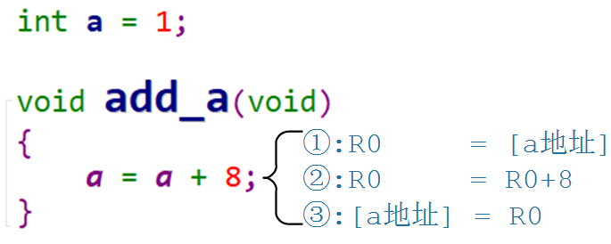
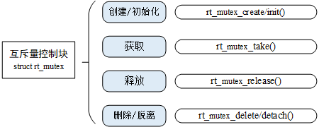
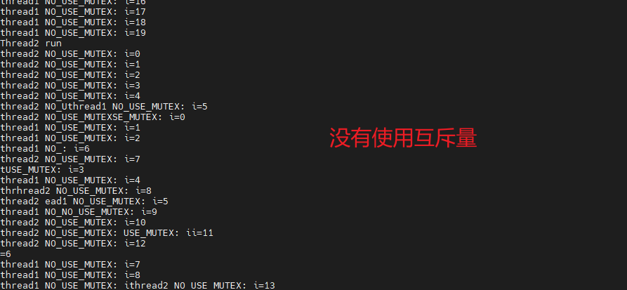
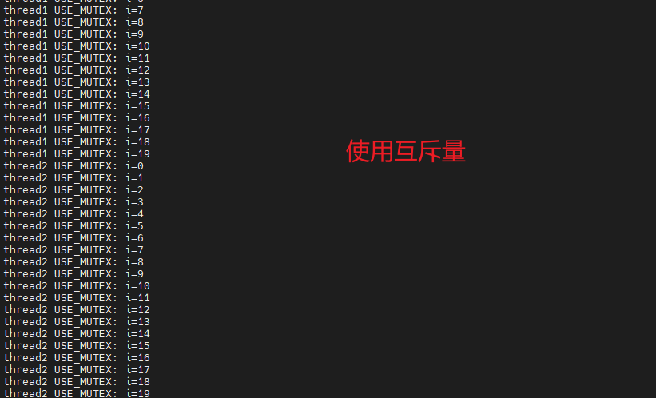
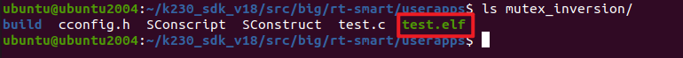
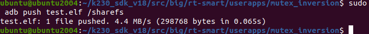
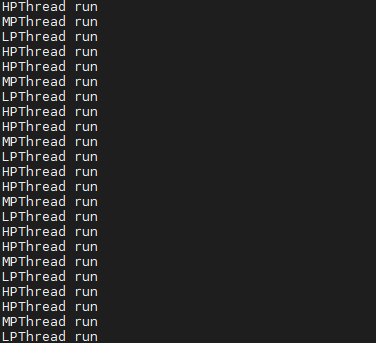
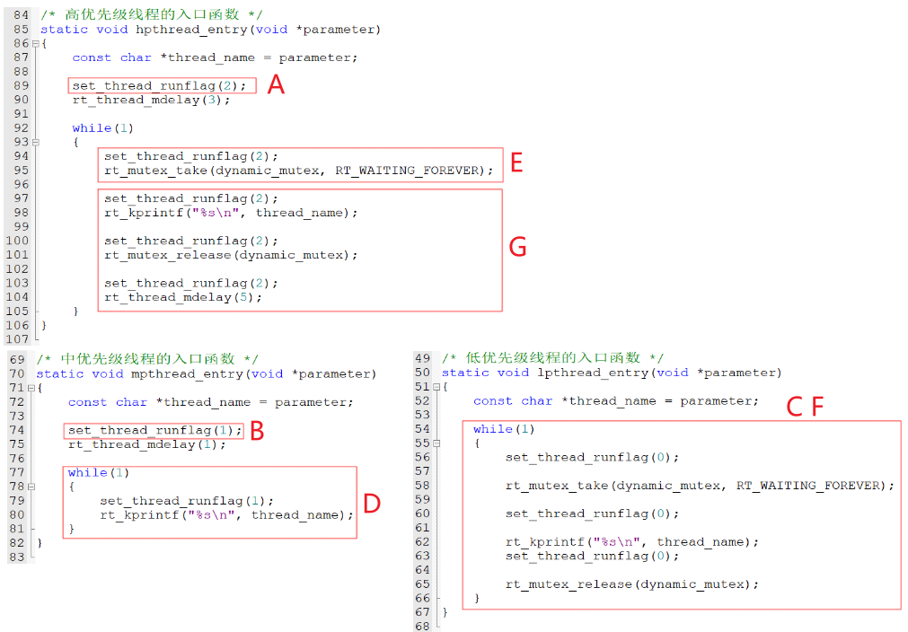
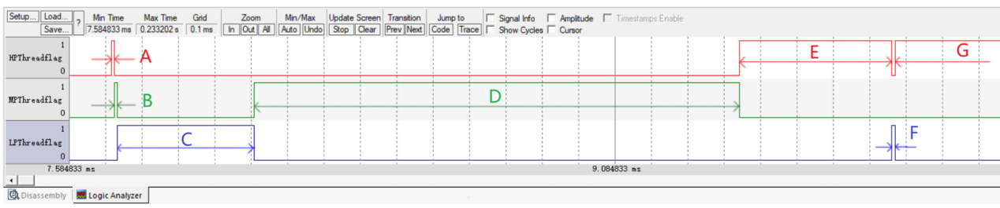

# 互斥量（Mutex）

> 本文档根据《嘉楠K230开发手册》V1.0（2024-11-30）整理。正文、表格、示例代码与插图均来自原始手册。

怎么独享厕所？自己开门上锁，完事了自己开锁。

你当然可以进去后，让别人帮你把门：但是，命运就掌握在别人手上了。

使用队列、信号量，都可以实现互斥访问，以信号量为例：

1.  信号量初始值为1
2.  任务A想上厕所，"take"信号量成功，它进入厕所
3.  任务B也想上厕所，"take"信号量不成功，等待
4.  任务A用完厕所，"give"信号量；轮到任务B使用

这需要有2个前提：

1.  任务B很老实，不撬门(一开始不"give"信号量)
2.  没有坏人：别的任务不会"give"信号量

可以看到，使用信号量确实也可以实现互斥访问，但是不完美。

使用互斥量可以解决这个问题，互斥量的名字取得很好：

1.  量：值为0、1
2.  互斥：用来实现互斥访问

它的核心在于：谁上锁，就只能由谁开锁。

本章涉及如下内容：

1.  为什么要实现互斥操作
2.  怎么使用互斥量
3.  互斥量导致的优先级反转、优先级继承

## 互斥量的使用场合

在多线程系统中，线程A正在使用某个资源，还没用完的情况下线程B也来使用的话，就可能导致问题。

比如对于串口，线程A正使用它来打印，在打印过程中线程B也来打印，客户看到的结果就是A、B的信息混杂在一起。

这种现象很常见：

1.  访问外设：刚举的串口例子
2.  读、修改、写操作导致的问题

 -
对于同一个变量，比如int a，如果有两个线程同时写它就有可能导致问题。
对于变量的修改，C代码只有一条语句，比如：a=a+8;，它的内部实现分为3步：读出原值、修改、写入。

 -
我们想让线程A、B都执行add\_a函数，a的最终结果是1+8+8=17。
假设线程A运行完代码①，在执行代码②之前被线程B抢占了：现在线程A的R0等于1。
线程B执行完add\_a函数，a等于9。
线程A继续运行，在代码②处R0仍然是被抢占前的数值1，执行完②③的代码，a等于9，这跟预期的17不符合。

1.  对变量的非原子化访问

修改变量、设置结构体、在16位的机器上写32位的变量，这些操作都是非原子的。也就是它们的操作过程都可能被打断，如果被打断的过程有其他线程来操作这些变量，就可能导致冲突。

1.  函数重入

"可重入的函数"是指：多个线程同时调用它、线程和中断同时调用它，函数的运行也是安全的。可重入的函数也被称为"线程安全"(thread safe)。
每个线程都维持自己的栈、自己的CPU寄存器，如果一个函数只使用局部变量，那么它就是线程安全的。
函数中一旦使用了全局变量、静态变量、其他外设，它就不是"可重入的"，如果该函数正在被调用，就必须阻止其他线程、中断再次调用它。

上述问题的解决方法是：线程A访问这些全局变量、函数代码时，独占它，就是上个锁。这些全局变量、函数代码必须被独占地使用，它们被称为临界资源。

互斥量也被称为互斥锁，使用过程如下：

1.  互斥量初始值为1
2.  线程A想访问临界资源，先获得并占有互斥量，然后开始访问
3.  线程B也想访问临界资源，也要先获得互斥量：如果互斥量被别人占有了，线程B就会阻塞
4.  线程A使用完毕，释放互斥量；线程B被唤醒、得到并占有互斥量，然后开始访问临界资源
5.  线程B使用完毕，释放互斥量

**注意：**在线程A占有互斥量的过程中，线程B、线程C等等，都无法释放互斥量。只能由线程A也就是信号量的占有者释放。

## 互斥量函数

互斥量是一种特殊的二值信号量。

使用互斥量时，先创建、然后去获得、释放它。使用句柄来表示一个互斥量。



### 创建/初始化

互斥量的创建有两种方法：动态分配内存、静态分配内存，

1.  动态分配内存：rt\_mutex\_create，从对象管理器中分配一个 mutex对象，并初始化这个对象
2.  静态分配内存：rt\_mutex\_init，互斥量的内存要事先分配好

**rt\_mutex\_create()**函数原型如下：

```text
rt_mutex_t rt_mutex_create (const char* name, rt_uint8_t flag);
```

| 参数 | 说明 |
| --- | --- |
| name | 互斥量名称 |
| flag | 互斥量标志，已废除，均按RT_IPC_FLAG_PRIO 处理 |
| 返回值 | 互斥量句柄：成功，返回句柄，以后使用句柄来操作互斥量RT_NULL：失败 |

**rt\_mutex\_init()**函数原型如下：

```text
rt_err_t rt_mutex_init (rt_mutex_t mutex, const char* name, rt_uint8_t flag);
```

| 参数 | 说明 |
| --- | --- |
| mutex | 互斥量对象的句柄 |
| name | 互斥量的名字 |
| flag | 互斥量标志，已废除，均按RT_IPC_FLAG_PRIO 处理 |
| 返回值 | RT_EOK：成功 |

### 删除/脱离

不再使用一个互斥量时：

1.  删除它：**rt\_mutex\_delete()**，只能删除使用**rt\_mutex\_create()**创建的互斥量
2.  脱离它：**rt\_mutex\_detach()**，只能脱离使用**rt\_mutex\_init()**初始化的互斥量

删除互斥量的函数为rt\_mutex\_delete()，它会释放内存。原型如下：

```text
rt_err_t rt_mutex_delete (rt_mutex_t mutex);
```

删除互斥量时，如果有线程在等待该互斥量，则内核会先唤醒这些线程（线程返回值是 - RT\_ERROR），然后再释放互斥量使用的内存，最后删除互斥量对象。

脱离互斥量，就是将互斥量对象被从内核对象管理器中脱离。原型如下：

```text
rt_err_t rt_mutex_detach (rt_mutex_t mutex);
```

脱离互斥量时，如果有线程在等待该互斥量，则内核会先唤醒这些线程（线程返回值是 - RT\_ERROR）。

### 获取/释放

互斥量某一时刻只能被一个线程持有。

RT-Thread有两个获取互斥量的函数,一个释放互斥量函数：

1.  rt\_mutex\_take() 获取互斥量
2.  rt\_mutex\_trytake() 无等待、尝试获取互斥量
3.  rt\_mutex\_release() 释放互斥量

如果互斥量没有被其他线程持有，使用**rt\_sem\_take()**即可获取互斥量。

如果互斥量已被其他线程持有，使用**rt\_sem\_take()**获取互斥量则挂起等待，直到其他线程释放或等待时间超时。

如果互斥量没有被其他线程持有，使用**rt\_mutex\_trytake()**即可获取互斥量。

如果互斥量已被其他线程持有，使用**rt\_mutex\_trytake()**直接返回失败，不会等待。

当线程完成资源的互斥访问后，应尽快使用**rt\_sem\_release()**释放互斥量，使其他线程能及时获取互斥量。

**注意**：拥有互斥量控制权的线程才能释放它，其他线程无法释放互斥量。

获取互斥量的函数原型如下：

```text
rt_err_t rt_mutex_take (rt_mutex_t mutex, rt_int32_t time);
```

参数说明如下：

| 参数 | 说明 |
| --- | --- |
| sem | 互斥量对象的句柄 |
| time | 超时时间，单位为系统时钟节拍（OS Tick） |
| 返回值 | RT_EOK：获取互斥量成功-RT_ETIMEOUT：获取互斥量超时-RT_ERROR：获取互斥量错误 |

无等待、尝试获取互斥量的函数原型如下：

```text
rt_err_t rt_mutex_trytake(rt_mutex_t mutex);
```

参数说明如下：

| 参数 | 说明 |
| --- | --- |
| sem | 互斥量的句柄 |
| 返回值 | RT_EOK：获取互斥量成功-RT_ETIMEOUT：获取互斥量超时 |

释放互斥量的函数原型如下：

```text
rt_err_t rt_mutex_release(rt_mutex_t mutex);
```

参数说明如下：

| 参数 | 说明 |
| --- | --- |
| sem | 互斥量的句柄 |
| 返回值 | RT_EOK：释放互斥量成功 |

## \_示例\_互斥量基本使用

本节代码为： **mutex** 。

使用互斥量时有如下特点：

1.  在ISR中不能使用互斥量
2.  本程序创建2个发送线程：故意发送大量的字符。可以做2个实验：
3.  使用互斥量：可以看到线程1、线程2打印的字符串没有混杂刚创建的互斥量可以被成功"take"
4.  "take"互斥量成功的线程，是互斥量的拥有者，只能由它"release"互斥量；别的线程"release"不成功
5.  在一起
6.  不使用互斥量：线程1、线程2打印的字符串混杂在一起

main函数中互斥量创建代码如下：

```text
/* 创建一个动态互斥量 */dynamic_mutex = rt_mutex_create("dmutex", RT_IPC_FLAG_FIFO);if (dynamic_mutex == RT_NULL){    rt_kprintf("rt_mutex_create error.\n");    return -1;}
```

发送线程的函数如下：

```text
/* 线程1的入口函数 */static void thread1_entry(void *parameter){	static rt_uint32_t i = 0;	const char *thread_name = parameter;		/* 打印线程的信息 */	rt_kprintf(thread_name);		while(1)	{			##ifdef USE_MUTEX	rt_mutex_take(dynamic_mutex, RT_WAITING_FOREVER);			for(i=0;i<20;i++)		rt_kprintf("thread1 USE_MUTEX: i=%d\n", i);		rt_thread_mdelay(10);
	rt_mutex_release(dynamic_mutex);	##else	for(i=0;i<20;i++)		rt_kprintf("thread1 NO_USE_MUTEX: i=%d\n", i);		
rt_thread_mdelay(10);	##endif	}}
```

可以做两个实验：通过是否定义宏**USE\_MUTEX**切换是否使用互斥量

1.  不使用：实验现象如下图上边所示，线程1、线程2的打印信息没有混在一起，线程1打印0~4，还未到19，就被线程2打断；
2.  使用：实验现象如下图下边所示，线程1和线程2，依次打印0~19，中途不会相互打断；

把**mutex**目录上传到Ubuntud的k230\_sdk/src/big/rt-smart/userapps下，使用以下命令编译：

首先进入到“k230\_sdk/src/big/rt-smart/”目录，配置环境变量：

```text
ubuntu@ubuntu2004:~/k230_sdk/src/big/rt-smart$ source smart-env.sh riscv64
Arch         => riscv64CC           => gccPREFIX       => riscv64-unknown-linux-musl-EXEC_PATH    => /home/canaan/k230_sdk/src/big/rt-smart/../../../toolchain/riscv64-linux-musleabi_for_x86_64-pc-linux-gnu/bin
```

之后进入“k230\_sdk/src/big/rt-smart/userapps”目录，编译程序

```text
canaan@develop:~/k230_sdk/src/big/rt-smart/userapps$ scons --directory=mutex
scons: Entering directory `/home/canaan/k230_sdk/src/big/rt-smart/userapps/test'
scons: Reading SConscript files ...
scons: done reading SConscript files.
scons: Building targets ...
scons: building associated VariantDir targets: build/create_task
CC build/test/test.o
LINK test.elf
/home/canaan/k230_sdk/toolchain/riscv64-linux-musleabi_for_x86_64-pc-linux-gnu/bin/../lib/gcc/riscv64-unknown-linux-musl/12.0.1/../../../../riscv64-unknown-linux-musl/bin/ld: warning: hello.elf has a LOAD segment with RWX permissions
scons: done building targets.
```

编译好的程序在**mutex**文件夹下：


我们可以看到名为“test.elf”的可执行程序；

之后即可将test.elf使用ADB push到小核linux的sharefs目录下，然后大核rt-smart的sharefs下也会出现该程序：

```text
sudo abd push test.elf /sharefs 
```


之后我们查看大核rt-smart下的sharefs目录下是否有test.elf，小核的内容是共享给大核的，如果有则执行以下命令运行程序：

```text
msh />cd sharefs
msh /sharefs>ls
Directory /sharefs:
.                                       <DIR>
..                                      <DIR>
app                                     <DIR>
test.elf                                297152
msh /sharefs>test.elf
```

程序运行结果如下图所示：




## \_示例\_优先级反转和继承

本节程序演示防止优先级反转特性，本节代码为：mutex\_inversion 。

假设线程A、B都想使用串口，A优先级比较低：

1.  线程A获得了串口的互斥量
2.  线程B也想使用串口，它将会阻塞、等待A释放互斥量
3.  高优先级的线程B，被低优先级的线程A延迟，这被称为"优先级反转"(priority inversion)

如果涉及3个线程，LPThread/MPThread/HPThread(低/中/高优先级线程)，可以让"优先级反转"的后果更加恶劣，比如：

1.  LPThread先获得互斥量
2.  MPThread不需要互斥资源，优先级比LPThread高，MPThread运行时LPThread无法运行
3.  HPThread优先级最高，它运行时想获得互斥量，被挂起
4.  MPThread导致了LPThread无法运行、无法释放互斥量，使得优先级最高的HPThread无法运行

RT-Thread 中，通过"优先级继承"，可以很大程度解决"优先级反转"的问题。

-   LPThread先获得互斥量
-   MPThread不需要互斥资源，优先级比LPThread高，MPThread运行时LPThread无法运行
-   HPThread也需要该互斥资源
-   但无法获取互斥量，被挂起
-   它还会提高LPThread的优先级，即LPThread继承了HPThread的优先级
-   LPThread是优先级最高的线程，它运行
-   当LPThread执行完后，释放互斥量，同时恢复原本优先级，唤醒HPThread
-   HPThread获取互斥量继续执行

main函数创建了3个线程：LPThread/MPThread/HPThread(低/中/高优先级线程)，代码如下：

```text
int main(void){	/* 创建一个动态互斥量 */    dynamic_mutex = rt_mutex_create("dmutex", RT_IPC_FLAG_FIFO);    if (dynamic_mutex == RT_NULL)    {        rt_kprintf("rt_mutex_create error.\n");        return -1;    }		/* 创建动态线程LPThread，优先级为 THREAD_PRIORIT = 15 */    LPThread = rt_thread_create("LPThread",         //线程名字                            lpthread_entry,          //入口函数							(void *)lpthread_name,  //入口函数参数                            THREAD_STACK_SIZE,      //栈大小                            THREAD_PRIORITY,        //线程优先级				            THREAD_TIMESLICE);      //线程时间片大小    /* 判断创建结果,再启动线程1 */    if (LPThread != RT_NULL)        rt_thread_startup(LPThread);			/* 创建动态线程MPThread，优先级为 THREAD_PRIORIT-1 = 14 */    MPThread = rt_thread_create("MPThread",         //线程名字                            mpthread_entry,         //入口函数							(void *)mpthread_name,  //入口函数参数                            THREAD_STACK_SIZE,     //栈大小                            THREAD_PRIORITY-1,     //线程优先级				            THREAD_TIMESLICE);     //线程时间片大小    /* 判断创建结果,再启动线程2 */    if (MPThread != RT_NULL)        rt_thread_startup(MPThread);				/* 创建动态线程HPThread，优先级为 THREAD_PRIORIT-2 = 13 */    HPThread = rt_thread_create("HPThread",         //线程名字                            hpthread_entry,         //入口函数							(void *)hpthread_name,  //入口函数参数                            THREAD_STACK_SIZE,     //栈大小                            THREAD_PRIORITY-2,     //线程优先级				            THREAD_TIMESLICE);     //线程时间片大小									/* 判断创建结果,再启动线程3 */    if (HPThread != RT_NULL)        rt_thread_startup(HPThread);		    return 0;}
```

把**mutex\_inversion**目录上传到Ubuntud的k230\_sdk/src/big/rt-smart/userapps下，使用以下命令编译：

首先进入到“k230\_sdk/src/big/rt-smart/”目录，配置环境变量：

```text
ubuntu@ubuntu2004:~/k230_sdk/src/big/rt-smart$ source smart-env.sh riscv64
Arch         => riscv64CC           => gccPREFIX       => riscv64-unknown-linux-musl-EXEC_PATH    => /home/canaan/k230_sdk/src/big/rt-smart/../../../toolchain/riscv64-linux-musleabi_for_x86_64-pc-linux-gnu/bin
```

之后进入“k230\_sdk/src/big/rt-smart/userapps”目录，编译程序

```text
canaan@develop:~/k230_sdk/src/big/rt-smart/userapps$ scons --directory=mutex_inverison
scons: Entering directory `/home/canaan/k230_sdk/src/big/rt-smart/userapps/test'
scons: Reading SConscript files ...
scons: done reading SConscript files.
scons: Building targets ...
scons: building associated VariantDir targets: build/create_task
CC build/test/test.o
LINK test.elf
/home/canaan/k230_sdk/toolchain/riscv64-linux-musleabi_for_x86_64-pc-linux-gnu/bin/../lib/gcc/riscv64-unknown-linux-musl/12.0.1/../../../../riscv64-unknown-linux-musl/bin/ld: warning: hello.elf has a LOAD segment with RWX permissions
scons: done building targets.
```

编译好的程序在**mutex\_inversion**文件夹下：



我们可以看到名为“test.elf”的可执行程序；

之后即可将test.elf使用ADB push到小核linux的sharefs目录下，然后大核rt-smart的sharefs下也会出现该程序：

```text
sudo abd push test.elf /sharefs 
```



之后我们查看大核rt-smart下的sharefs目录下是否有test.elf，小核的内容是共享给大核的，如果有则执行以下命令运行程序：

```text
msh />cd sharefs
msh /sharefs>ls
Directory /sharefs:
.                                       <DIR>
..                                      <DIR>
app                                     <DIR>
test.elf                                297152
msh /sharefs>test.elf
```

程序运行结果如下图所示：



这3个线程的代码如下图所示：



代码运行过程如下图所示：

-   A：最高优先级的线程HPThread先运行，它设置HPThreadflag后就调用**rt\_thread\_mdelay(3)**休眠了
-   B：MPThread变成了最高优先级的就绪态线程，它设置MPThreadflag后就调用**rt\_thread\_mdelay(1)**休眠了
-   C：LPThread变成了最高优先级的就绪态线程，它设置LPThreadflag、获得互斥量、打印
-   D：MPThread休眠1ms的时间到了，它变成最高优先级的就绪态线程，它一直运行：LPThread被抢占，无法运行
-   E：HPThread休眠2ms的时间到了，它变成最高优先级的就绪态线程，它设置HPThreadflag，然后：
-   想获得互斥量，失败
-   把互斥量持有者LPThread的优先级提升
-   F：LPThread变成了最高优先级的就绪态线程，它得以继续运行，它释放互斥量时：
-   唤醒HPThread线程
-   自己的优先级下降为原来的值
-   G：HPThread变成了最高优先级的就绪态线程，它成功获得互斥量、运行



---

版权所有：深圳百问网科技有限公司
未经授权不得拷贝、复制、修改、传播本文档，否则将追究法律责任。
