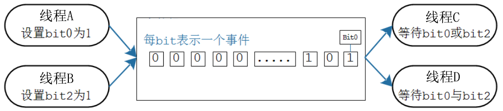
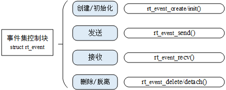
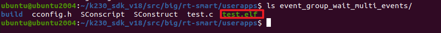
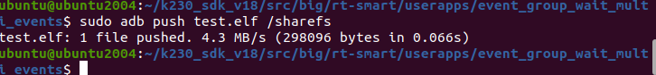
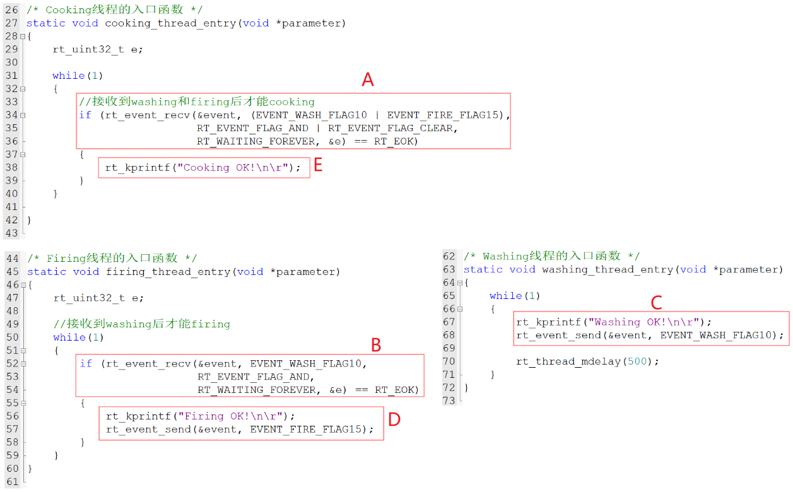
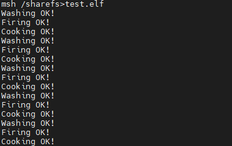

# 事件集

> 本文档根据《嘉楠K230开发手册》V1.0（2024-11-30）整理。正文、表格、示例代码与插图均来自原始手册。

学校组织秋游，组长在等待：

1.  张三：我到了
2.  李四：我到了
3.  王五：我到了
4.  组长说：好，大家都到齐了，出发！

秋游回来第二天就要提交一篇心得报告，组长在焦急等待：张三、李四、王五谁先写好就交谁的。

在这个日常生活场景中：

1.  出发：要等待这3个人都到齐，他们是"与"的关系
2.  交报告：只需等待这3人中的任何一个，他们是"或"的关系

在RT-Thread中，可以使用事件集(event group)来解决这些问题。

本章涉及如下内容：

1.  事件集的概念与操作函数
2.  事件集的优缺点
3.  怎么设置、等待、清除事件集中的位
4.  使用事件集来同步多个任务

## 事件集概念与操作

### 事件集的概念

事件集可以简单地认为就是一个整数：

1.  每一位表示一个事件
2.  每一位事件的含义由程序员决定，比如：Bit0表示用来串口是否就绪，Bit1表示按键是否被按下
3.  这些位，值为1表示事件发生了，值为0表示事件没发生
4.  一个或多个线程、ISR都可以去写这些位；一个或多个线程、ISR都可以去读这些位
5.  可以等待某些位中的任意一个，也可以等待多位



线程可以等待事件集：

1.  某些事件中的任意一个发生了
2.  某些事件中的所有事件都发生了

一个线程，怎么表达它的需求？

每个线程都有一个**rt\_thread**结构体，它里面有如下2个成员：

```text
struct rt_thread{    ......##if defined(RT_USING_EVENT)    /* thread event */    rt_uint32_t event_set;    rt_uint8_t  event_info;##endif    ......}
```

这两个成员的作用如下：

-   event\_set：想等待哪些事件？
-   可以设置对应的位，比如设置为 `(1 << 30) | (1 << 0)`，表示等待事件 0、事件 30
-   那么，它想等待事件0、事件30都发生呢，还是只要事件0、事件30任意一个发生即可？
-   需要使用**event\_info**进一步描述
-   event\_info：有3种取值
-   RT\_EVENT\_FLAG\_AND：逻辑与，比如事件0、事件30都发生时，才满足它的期待
-   RT\_EVENT\_FLAG\_OR：逻辑或，比如事件0、事件30发生了任何一个，都满足它的期待
-   RT\_EVENT\_FLAG\_CLEAR：等到期待的事件后，是否清除事件

### 事件集的操作

事件集和队列、信号量等不太一样，主要集中在2个地方：

-   唤醒谁？
-   队列、信号量：事件发生时，只会唤醒一个线程
-   事件集：事件发生时，会唤醒所有符号条件的线程，简单地说它有"广播"的作用
-   队列、信号量：是消耗型的资源，队列的数据被读走就没了；信号量被获取后就减少了
-   事件集：被唤醒的线程有两个选择，可以让事件保留不动，也可以清除事件

以上图为列，事件集的常规操作如下：

-   先创建事件集
-   线程C、D等待事件：
-   等待什么事件？可以等待某一位、某些位中的任意一个，也可以等待多位。简单地说就是"或"、"与"的关系。
-   得到事件时，要不要清除？可选择清除、不清除。
-   线程A、B产生事件：设置事件集里的某一位、某些位

## 事件集函数

### 创建/初始化

使用事件集之前，要先创建，得到一个句柄；使用事件集时，要使用句柄来表明使用哪个事件集。



事件集的创建有两种方法：动态分配内存、静态分配内存，

1.  动态分配内存：rt\_event\_create，从对象管理器中分配一个 event对象，并初始化这个对象
2.  静态分配内存：rt\_event\_init，事件集在编译时由编译器分配

**rt\_event\_create()**函数原型如下：

```text
rt_event_t rt_event_create(const char* name, rt_uint8_t flag);
```

| 参数 | 说明 |
| --- | --- |
| name | 事件集名称 |
| flag | 事件集标志，可选： RT_IPC_FLAG_FIFO 或 RT_IPC_FLAG_PRIO |
| 返回值 | 事件集句柄：成功，返回句柄，以后使用句柄来操作事件集RT_NULL：失败 |

**rt\_event\_init()**函数原型如下：

```text
rt_err_t rt_event_init(rt_event_t event, const char* name, rt_uint8_t flag);
```

| 参数 | 说明 |
| --- | --- |
| mutex | 事件集对象的句柄 |
| name | 事件集名称 |
| flag | 事件集标志，可选： RT_IPC_FLAG_FIFO 或 RT_IPC_FLAG_PRIO |
| 返回值 | RT_EOK：成功 |

### 删除/脱离

不再使用一个事件集时：

1.  删除它：**rt\_event\_delete()**，只能删除使用**rt\_event\_create()**创建的事件集
2.  脱离它：**rt\_event\_detach()**，只能脱离使用**rt\_event\_init()**初始化的事件集

删除事件集的函数为，它会释放内存。原型如下：

```text
rt_err_t rt_event_delete(rt_event_t event);
```

删除事件集时，如果有线程在等待该事件集，则内核会先唤醒这些线程（线程返回值是 - RT\_ERROR），然后再释放事件集使用的内存，最后删除事件集对象。

脱离事件集，就是将事件集对象被从内核对象管理器中脱离。原型如下：

```text
rt_err_t rt_event_detach(rt_event_t event);
```

脱离事件集时，如果有线程在等待该事件集，则内核会先唤醒这些线程（线程返回值是 - RT\_ERROR）。

### 发送/接收事件

RT-Thread提供发送事件和接收事件函数：

1.  rt\_event\_send() 发送一个或多个事件
2.  rt\_event\_recv() 接收事件，最多同时接收32个事件

发送事件的函数**rt\_event\_send()**原型如下：

```text
rt_err_t rt_event_send(rt_event_t event, rt_uint32_t set);
```

使用**rt\_event\_send()**函数发送事件，也就是设置事件，设置哪些事件？参数set的每一位表示一个事件。

该函数设置事件后，会遍历等待此事件的线程，如果满足了线程期待的事件，则唤醒该线程。

参数说明如下：

| 参数 | 说明 |
| --- | --- |
| event | 事件集对象的句柄 |
| set | 发送哪些事件 |
| 返回值 | RT_EOK：获取互斥量成功 |

接收事件的函数rt\_event\_recv()原型如下：

```text
rt_err_t rt_event_recv(rt_event_t event,                           rt_uint32_t set,                           rt_uint8_t option,                           rt_int32_t timeout,                           rt_uint32_t* recved);
```

使用**rt\_event\_recv()**函数来接收事件，通过参数set和参数option来判断接收事件是否已经发生：

1.  set：想接收哪些事件
2.  option：想接收这些事件里的所有事件还是任意一个事件？成功后要不要清除事件？

如果期待的事件没有发生，则挂起线程，直到事件发生或者超时。如果超时，线程退出返回-RT\_ETIMEOUT。

如果期待的事件已经发生，根据参数option是否设置有**RT\_EVENT\_FLAG\_CLEAR**来决定是否重置事件的相应标志位。

参数说明如下：

| 参数 | 说明 |
| --- | --- |
| event | 事件集对象的句柄 |
| set | 期待哪些事件 |
| option | 接收选项 |
| timeout | 指定超时时间 |
| recved | 指向接收到的事件 |
| 返回值 | RT_EOK：接收成功-RT_ETIMEOUT：接收超时-RT_ERROR：接收错误 |

其中，option 的值可取：

1.  选择 **逻辑与** 或 **逻辑或** 的方式接收事件：**RT\_EVENT\_FLAG\_OR** 或**RT\_EVENT\_FLAG\_AND**
2.  选择**清除重置**事件标志位：**RT\_EVENT\_FLAG\_CLEAR**

## \_示例\_等待多个事件

本节源码是:event\_group\_wait\_multi\_events。

假设大厨要等手下做完这些事才可以炒菜：洗菜、生火。

本程序创建3个线程：

1.  线程1：洗菜
2.  线程2：生火
3.  线程3：炒菜。

main函数代码如下，它创建了3个线程：

```text
int main(void){	/* 创建一个静态事件集 */	if (rt_event_init(&event, "event", RT_IPC_FLAG_FIFO)!= RT_EOK)    {        rt_kprintf("rt_mutex_create error.\n");        return -1;    }		/* 创建动态线程cooking thread，优先级为 THREAD_PRIORIT-2 = 13 */    cooking_thread = rt_thread_create("CookingThread",    //线程名字                            cooking_thread_entry,         //入口函数							(void *)cooking_thread_name,  //入口函数参数                            THREAD_STACK_SIZE,            //栈大小                            THREAD_PRIORITY-2,            //线程优先级				            THREAD_TIMESLICE);            //线程时间片大小    /* 判断创建结果,再启动cooking线程 */    if (cooking_thread != RT_NULL)        rt_thread_startup(cooking_thread);			/* 创建动态线程firing thread，优先级为 THREAD_PRIORIT-1 = 14 */    firing_thread = rt_thread_create("FiringThread",     //线程名字                            firing_thread_entry,         //入口函数							(void *)firing_thread_name,  //入口函数参数                            THREAD_STACK_SIZE,           //栈大小                            THREAD_PRIORITY-1,           //线程优先级				            THREAD_TIMESLICE);           //线程时间片大小    /* 判断创建结果,再启动firing线程 */    if (firing_thread != RT_NULL)        rt_thread_startup(firing_thread);				/* 创建动态线程washing thread，优先级为 THREAD_PRIORIT = 15 */    washing_thread = rt_thread_create("WashingThread",    //线程名字                            washing_thread_entry,         //入口函数							(void *)washing_thread_name,  //入口函数参数                            THREAD_STACK_SIZE,            //栈大小                            THREAD_PRIORITY,              //线程优先级				            THREAD_TIMESLICE);            //线程时间片大小									/* 判断创建结果,再启动washing线程 */    if (washing_thread != RT_NULL)        rt_thread_startup(washing_thread);		    return 0;}
```

把**event\_group\_wait\_multi\_events**目录上传到Ubuntud的k230\_sdk/src/big/rt-smart/userapps下，使用以下命令编译：

首先进入到“k230\_sdk/src/big/rt-smart/”目录，配置环境变量：

```text
ubuntu@ubuntu2004:~/k230_sdk/src/big/rt-smart$ source smart-env.sh riscv64
Arch         => riscv64CC           => gccPREFIX       => riscv64-unknown-linux-musl-EXEC_PATH    => /home/canaan/k230_sdk/src/big/rt-smart/../../../toolchain/riscv64-linux-musleabi_for_x86_64-pc-linux-gnu/bin
```

之后进入“k230\_sdk/src/big/rt-smart/userapps”目录，编译程序

```text
canaan@develop:~/k230_sdk/src/big/rt-smart/userapps$ scons --directory=event_group_wait_mutli_events
scons: Entering directory `/home/canaan/k230_sdk/src/big/rt-smart/userapps/test'
scons: Reading SConscript files ...
scons: done reading SConscript files.
scons: Building targets ...
scons: building associated VariantDir targets: build/create_task
CC build/test/test.o
LINK test.elf
/home/canaan/k230_sdk/toolchain/riscv64-linux-musleabi_for_x86_64-pc-linux-gnu/bin/../lib/gcc/riscv64-unknown-linux-musl/12.0.1/../../../../riscv64-unknown-linux-musl/bin/ld: warning: hello.elf has a LOAD segment with RWX permissions
scons: done building targets.
```

编译好的程序在**event\_group\_wait\_multi\_events**文件夹下：



我们可以看到名为“test.elf”的可执行程序；

之后即可将test.elf使用ADB push到小核linux的sharefs目录下，然后大核rt-smart的sharefs下也会出现该程序：

```text
sudo abd push test.elf /sharefs 
```



之后我们查看大核rt-smart下的sharefs目录下是否有test.elf，小核的内容是共享给大核的，如果有则执行以下命令运行程序：

```text
msh />cd sharefs
msh /sharefs>ls
Directory /sharefs:
.                                       <DIR>
..                                      <DIR>
app                                     <DIR>
test.elf                                297152
msh /sharefs>test.elf
```

这3个线程的代码和执行流程如下：

-   A："炒菜线程"优先级最高，先执行。它要等待的2个事件未发生：洗菜、生火，进入阻塞状态
-   B："生火线程"接着执行，它要等待的1个事件未发生：洗菜，进入阻塞状态
-   C："洗菜线程"接着执行，它洗好菜，发出"洗菜"事件
-   D："生火线程"等待的事件满足了，从B处继续执行，开始生火、发出"生火"事件
-   E："炒菜线程"等待的事件满足了，从A出继续执行，开始炒菜



 -
运行结果如下图所示，Cooking线程必须等Washing和Firing线程执行后，才能执行。


