# RT-Smart 驱动程序开发

> 本文档根据《嘉楠K230开发手册》V1.0（2024-11-30）整理。正文、表格、示例代码与插图均来自原始手册。

## 简单的驱动程序示例

在讲解驱动框架等理论之前，本节先引入2个驱动程序让大家先有个概念。

### Hello驱动程序示例

1.  **添加drv\_hello.c驱动程序**

在“k230\_sdk/src/big/rt\_smart/kernel/rt-thread/components/drivers/misc”路径下新建drv\_hello.c文件:

```text
cd k230_sdk/src/big/rt_smart/kernel/rt-thread/components/drivers/misc
vim drv_hello.c
```

并将下面程序添加到drv\_hello.c文件中：

```text
/*
 * Copyright (c) 2006-2018, RT-Thread Development Team
 *
 * SPDX-License-Identifier: Apache-2.0
 *
 * Change Logs:
* Date           Author       Notes
* 2018-12-05     zylx         first version
* 2018-12-12     greedyhao    Porting for stm32f7xx
* 2019-02-01     yuneizhilin   fix the stm32_adc_init function initialization issue
 * 2024-12-02     100askteam   add rt_size_t hello_read
*/
#include<board.h>
#include<rtthread.h>
#include<rtdevice.h>
#include<string.h>
//#define DRV_DEBUG
#define LOG_TAG             "drv.hello"
//#include <drv_log.h>
static struct rt_device hello_drv;
static rt_size_t hello_read(rt_device_t dev, rt_off_t pos, void *buffer, rt_size_t size)
{
// 简单地返回一个固定字符串到缓冲区
const char *response = "Hello from read!\n\r";
rt_size_t len = strlen(response);
 
// 确保不会超出缓冲区大小
if (size < len)
{
    len = size;
}
 
// 复制字符串到缓冲区
memcpy(buffer, response, len);
 
return len;
}
static rt_size_t hello_write(rt_device_t dev, rt_off_t pos, const void *buffer, rt_size_t size)
{
const int *tmp = buffer;
if (tmp[0] == 1)
    rt_kprintf("Hello, sam\n\r");
else if (tmp[0] == 0)
    rt_kprintf("Bye, sam\n\r");
else
    rt_kprintf("Invalid\n\r");
return size;
}
#ifdef RT_USING_DEVICE_OPS
const static struct rt_device_ops hello_ops =
{
RT_NULL,
RT_NULL,
RT_NULL,
hello_read,
hello_write,
RT_NULL,
};
#endif
static int hello_drv_init(void)
{
int ret;
/* 分配一个 rt_device */
/* 设置 */    
hello_drv.type = RT_Device_Class_Miscellaneous;
hello_drv.rx_indicate = RT_NULL;
hello_drv.tx_complete = RT_NULL;
#ifdef RT_USING_DEVICE_OPS
hello_drv.ops          = &hello_ops;
#else
hello_drv.init     = RT_NULL;
hello_drv.open     = RT_NULL;
hello_drv.close    = RT_NULL;
hello_drv.read     = hello_read;
hello_drv.write    = hello_write;
hello_drv.control  = RT_NULL;
#endif
/* 注册 */
ret = rt_device_register(&hello_drv, "hello", RT_DEVICE_FLAG_RDWR);
rt_kprintf("rt_device_register hello, ret = %d\n", ret);
return ret;
}
INIT_BOARD_EXPORT(hello_drv_init);
```

添加完以后我们还要在misc目录下“SConscript”中添加drv\_hello.c驱动：

```text
src = src + ['drv_hello.c']
```

之后就可以编译、打包镜像，烧录到我们的板子上。

1.  **编译打包、烧录镜像**

退回到“k230\_sdk”路径下执行以下命令：

```text
make CONF=k230_canmv_dongshanpi_defconfig
```

以上命令会编译dshanpi-canmv开发板配置，会编译生成相应配置的固件

进入到“k230\_sdk/output/k230\_canmv\_dongshanpi\_defconfig/images”路径下我们会看到此路径下有一个名为**sysimage-sdcard.img** 的镜像

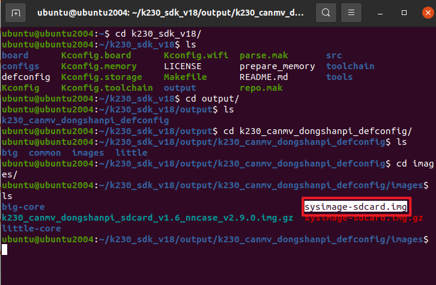

将此镜像拷贝到windows中，并将此镜像使用镜像烧录软件烧录到SD卡中，SD卡镜像烧录方法见**“3.2.4SDK烧录章节”**；

烧录完成将SD卡插到开发板上，将拨码开关拨为off,off,SD卡启动，启动后我们进入到rt-smart大核中，查看是否有我们想要的hello驱动，如下图所示：

使用 “ls /dev” 查看：

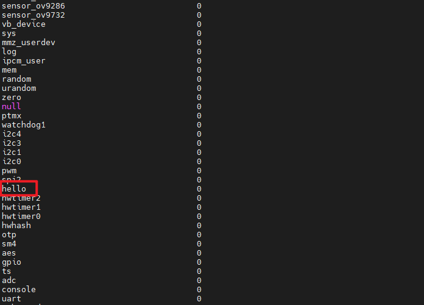

这时我们已经成功添加了“hello”驱动，接下来就可以添加应用程序了。

1.  **添加drv\_hello\_test.c 应用程序**

到k230\_sdk/src/big/rt-smart/userapps目录下创建一个文件夹，命名为drv\_hello\_test:

```text
cd k230_sdk/src/big/rt-smart/userapps
mkdir drv_hello_test
cd drv_hello_test
```

并创建以下三个文件：

1.  **drv\_hello\_test.c：**

```text
#include <rtthread.h>
#include <rtdevice.h>
/* APP函数定义 */
int main(void)
{
rt_device_t dev;
char write_data = 1;  
char read_data[20] = {0};  
 rt_size_t length;
    
/* 查找设备 */
dev = rt_device_find("hello");
if (dev == RT_NULL)
{
rt_kprintf("find device failed!\n");
return -1;
}
    
/* 打开设备 */
if (rt_device_open(dev, RT_DEVICE_FLAG_RDWR) != RT_EOK)
{
rt_kprintf("open device failed!\n");
return -1;
}
    
/* 向设备写入数据 */
if (rt_device_write(dev, 0, &write_data, sizeof(write_data)) != sizeof(write_data))
{	
rt_kprintf("write to device failed!\n");
rt_device_close(dev);
return -1;
}
    
/* 从设备读取数据 */
length = rt_device_read(dev, 0, read_data, sizeof(read_data) - 1);
if (length == 0)
{
rt_kprintf("read from device failed!\n");
rt_device_close(dev);
return -1;
}
    
/* 输出读取到的数据 */
read_data[length] = '\0';
rt_kprintf("Read from device: %s\n", read_data);
    
/* 关闭设备 */
rt_device_close(dev);
    
 	return 0;
}
MSH_CMD_EXPORT(main, sample for hello device);
```

1.  **SConscript:**

```text
# RT-Thread building script for component
from building import *
cwd = GetCurrentDir()
src = Glob('*.c')
CPPPATH = [cwd]
CPPDEFINES = [
'HAVE_CCONFIG_H',
]
group = DefineGroup('drv_hello_test', src, depend=[''], CPPPATH=CPPPATH, CPPDEFINES=CPPDEFINES)
Return('group')
```

1.  **SConstruct:**

```text
import os
import sys
# add building.py path
sys.path = sys.path + [os.path.join('..','..','tools')]
from building import *
BuildApplication('drv_hello_test', 'SConscript', usr_root = '../')
```

之后回到k230\_sdk/src/big/rt-smart/目录，配置环境变量：

```text
ubuntu@ubuntu2004:~/k230_sdk/src/big/rt-smart$ source smart-env.sh riscv64
Arch         => riscv64CC           => gccPREFIX       => riscv64-unknown-linux-musl-EXEC_PATH    => /home/canaan/k230_sdk/src/big/rt-smart/../../../toolchain/riscv64-linux-musleabi_for_x86_64-pc-linux-gnu/bin
```

进入k230\_sdk/src/big/rt-smart/userapps目录，编译程序：

```text
ubuntu@ubuntu2004:~/k230_sdk/src/big/rt-smart/userapps$ scons --directory=drv_hello_test
scons: Entering directory `/home/canaan/k230_sdk/src/big/rt-smart/userapps/drv_hello_test'
scons: Reading SConscript files ...
scons: done reading SConscript files.
scons: Building targets ...
scons: building associated VariantDir targets: build/drv_hello_test
CC build/drv_hello_test/drv_hello_test.o
LINK drv_hello_test.elf
/home/canaan/k230_sdk/toolchain/riscv64-linux-musleabi_for_x86_64-pc-linux-gnu/bin/../lib/gcc/riscv64-unknown-linux-musl/12.0.1/../../../../riscv64-unknown-linux-musl/bin/ld: warning: hello.elf has a LOAD segment with RWX permissions
scons: done building targets.
```

编译好的程序在drv\_hello\_test文件夹下：


我们可以看到名为“drv\_hello\_test.elf”的可执行程序；

之后即可将drv\_hello\_test.elf使用ADBpush到小核linux的sharefs目录下，然后大核rt-smart的sharefs下也会出现该程序：

```text
sudo abd push drv_hello_test.elf /sharefs 
```


之后我们分别进入小核linux和大核rt-smart下的sharefs目录下分别查看是否有drv\_hello\_test.elf：

小核：

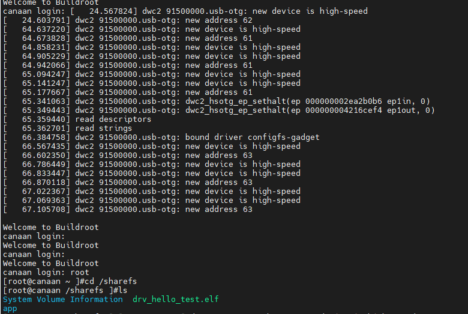

大核：

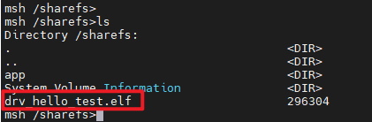

之后我们便可以在大核里直接运行drv\_hello\_test.elf：

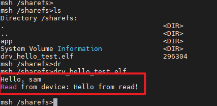

注意：使用ADB的前提时提前安装ADB,详情请见**“3.4开发板文件传输”**章节！

### LED驱动程序示例

1.  **添加drv\_hello.c驱动程序**

在“k230\_sdk/src/big/rt\_smart/kernel/rt-thread/components/drivers/misc”路径下新建drv\_led.c文件:

```text
cd k230_sdk/src/big/rt_smart/kernel/rt-thread/components/drivers/misc
vi drv_led.c
```

并将下面程序添加到drv\_led.c文件中：

```text
#include <board.h>
#include <rtthread.h>
#include <rtdevice.h>
#include "ioremap.h"
#include "drv_gpio.h"
#include "drv_hardlock.h"
static struct rt_device led_drv;
static int hardlock;
static volatile uint32_t *g_gpio0_base_reg;
static rt_size_t led_read(rt_device_t dev, rt_off_t pos, void *buffer, rt_size_t size);
static rt_size_t led_read(rt_device_t dev, rt_off_t pos, void *buffer, rt_size_t size)
{
int *p = buffer;
int val = *(g_gpio0_base_reg+0) & (1<<20);
if (val)
val = 1;
else
val = 0;
p[0] = val;
return 4;
}
static rt_size_t led_write(rt_device_t dev, rt_off_t pos, const void *buffer, rt_size_t size);
static rt_size_t led_write(rt_device_t dev, rt_off_t pos, const void *buffer, rt_size_t size)
{
// 根据写入的数据控制 LED 的开关
const char *cmd = (const char *)buffer;
if (strncmp(cmd, "on", 2) == 0)
{
	//while(0 != kd_hardlock_lock(hardlock));
	*(g_gpio0_base_reg+0) &= ~(1<<6);  
	//kd_hardlock_unlock(hardlock);
 }
else if (strncmp(cmd, "off", 3) == 0)
{
	//while(0 != kd_hardlock_lock(hardlock));
	*(g_gpio0_base_reg+0) |= (1<<6);
	//kd_hardlock_unlock(hardlock);
}
else
{
    rt_kprintf("Invalid command\n");
    return 0;
}
return size;
}
// LED 驱动操作结构体
const static struct rt_device_ops led_ops =
{
RT_NULL,
RT_NULL,
RT_NULL,
RT_NULL,
led_write,
RT_NULL,
};
// LED 驱动初始化函数
static int led_drv_init(void)
{
int ret;
	
g_gpio0_base_reg = rt_ioremap(0x9140B000, 0x1000);
if (!g_gpio0_base_reg)
{
     rt_kprintf("Failed to map GPIO registers\n");
     return -RT_ERROR;
}
/* 配置为GPIO,output */
//while(0 != kd_hardlock_lock(hardlock));
*(g_gpio0_base_reg+1) |= (1<<6);  
//kd_hardlock_unlock(hardlock);
	
/* 初始化 LED 设备结构体 */
led_drv.type = RT_Device_Class_Miscellaneous;
led_drv.rx_indicate = RT_NULL;
led_drv.tx_complete = RT_NULL;
led_drv.ops = &led_ops;
/* 注册 LED 设备 */
ret = rt_device_register(&led_drv, "led", RT_DEVICE_FLAG_RDWR);
rt_kprintf("rt_device_register led, ret = %d\n", ret);
 return ret;
}
INIT_BOARD_EXPORT(led_drv_init);
```

添加完以后我们还要在misc目录下“SConscript”中添加drv\_hello.c驱动：

```text
src = src + ['drv_led.c']
```

之后就可以打包镜像，烧录到我们的板子上。

1.  **编译打包、烧录镜像**

退回到“k230\_sdk”路径下执行以下命令：

```text
make CONF=k230_canmv_dongshanpi_defconfig
```

以上命令会编译dshanpi-canmv开发板配置，会编译生成相应配置的固件

进入到“k230\_sdk/output/k230\_canmv\_dongshanpi\_defconfig/images”路径下我们会看到此路径下有一个名为**sysimage-sdcard.img** 的镜像


将此镜像拷贝到windows中，并将此镜像使用镜像烧录软件烧录到SD卡中，SD卡镜像烧录方法见**“3.2.4SDK烧录章节”**；

烧录完成将SD卡插到开发板上，将拨码开关拨为off,off,SD卡启动，启动后我们进入到rt-smart大核中，查看是否有我们想要的hello驱动，如下图所示：

使用 “ls /dev” 查看：

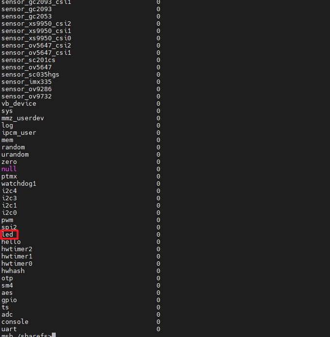

这时我们已经成功添加了“led”驱动，接下来就可以添加应用程序了。

1.  **添加drv\_hello\_test.c 应用程序**

到k230\_sdk/src/big/rt-smart/userapps目录下创建一个文件夹，命名为drv\_hello\_test:

```text
cd k230_sdk/src/big/rt-smart/userapps
mkdir drv_led_test
cd drv_led_test
```

并创建以下三个文件：

1.  **drv\_led\_test.c：**

```text
#include <rtthread.h>
#include <rtdevice.h>
#include <string.h>
// LED 控制函数
static void led_control(const char *cmd)
{
struct rt_device *led_dev;
/* 查找LED设备 */
led_dev = rt_device_find("led");
if (led_dev == RT_NULL)
{
    rt_kprintf("find led device failed!\n");
    return;
}
/* 打开LED设备 */
if (rt_device_open(led_dev, RT_DEVICE_FLAG_RDWR) != RT_EOK)
{
    rt_kprintf("open led device failed!\n");
    return;
}
/* 写入命令到LED设备 */
if (strcmp(cmd, "on") == 0)
{
    rt_device_write(led_dev, 0, "on", 2);
}
else if (strcmp(cmd, "off") == 0)
{
    rt_device_write(led_dev, 0, "off", 3);
}
else
{
    rt_kprintf("Invalid command: %s", cmd);
}
/* 关闭LED设备 */
rt_device_close(led_dev);
}
// 主函数
int main(int argc, char **argv)
{
if (argc != 2)
{
    rt_kprintf("Usage: %s <on/off>\n", argv[0]);
    return -1;
}
led_control(argv[1]);
return 0;
}
```

1.  **SConscript:**

```text
# RT-Thread building script for component
from building import *
cwd = GetCurrentDir()
src = Glob('*.c')
CPPPATH = [cwd]
CPPDEFINES = [
'HAVE_CCONFIG_H',
]
group = DefineGroup('drv_hello_test', src, depend=[''], CPPPATH=CPPPATH, CPPDEFINES=CPPDEFINES)
Return('group')
```

1.  **SConstruct:**

```text
import os
import sys
# add building.py path
sys.path = sys.path + [os.path.join('..','..','tools')]
from building import *
BuildApplication('drv_led_test', 'SConscript', usr_root = '../')
```

之后回到k230\_sdk/src/big/rt-smart/目录，配置环境变量：

```text
ubuntu@ubuntu2004:~/k230_sdk/src/big/rt-smart$ source smart-env.sh riscv64
Arch         => riscv64CC           => gccPREFIX       => riscv64-unknown-linux-musl-EXEC_PATH    => /home/canaan/k230_sdk/src/big/rt-smart/../../../toolchain/riscv64-linux-musleabi_for_x86_64-pc-linux-gnu/bin
```

进入k230\_sdk/src/big/rt-smart/userapps目录，编译程序：

```text
ubuntu@ubuntu2004:~/k230_sdk/src/big/rt-smart/userapps$ scons --directory=drv_led_test
scons: Entering directory `/home/ubuntu/k230_sdk/src/big/rt-smart/userapps/drv_led_test'
scons: Reading SConscript files ...
scons: done reading SConscript files.
scons: Building targets ...
scons: building associated VariantDir targets: build/drv_led_test
CC build/drv_led_test/drv_led_test.o
LINK drv_led_test.elf
/home/ubuntu/k230_sdk/toolchain/riscv64-linux-musleabi_for_x86_64-pc-linux-gnu/bin/../lib/gcc/riscv64-unknown-linux-musl/12.0.1/../../../../riscv64-unknown-linux-musl/bin/ld: warning: drv_led_test.elf has a LOAD segment with RWX permissions
scons: done building targets.
```

编译好的程序在drv\_led\_test文件夹下：

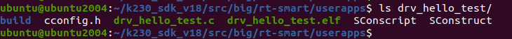

我们可以看到名为“drv\_hello\_test.elf”的可执行程序；

之后即可将drv\_hello\_test.elf使用ADBpush到小核linux的sharefs目录下，然后大核rt-smart的sharefs下也会出现该程序：

```text
sudo abd push drv_hello_test.elf /sharefs 
```

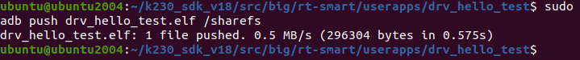

这时我们还没有完成对led 的配置，led是使用的引脚是GPIO6,但是在“k230\_canmv\_dongshanpi.dts”的iomux中的GPIO6默认的配置为JTAG功能,所以我们要将GPIO6更改为**GPIO功能；**

```text
cd k230_sdk/src/little/uboot/arch/riscv/dts
vi k230_canmv_dongshanpi.dts
(IO6 ) ( 0<<SEL | 0<<SL | BANK_VOLTAGE_IO2_IO13 <<MSC | 1<<IE | 1<<OE | 0<<PU | 0<<PD | 4<<DS | 1<<ST )
```

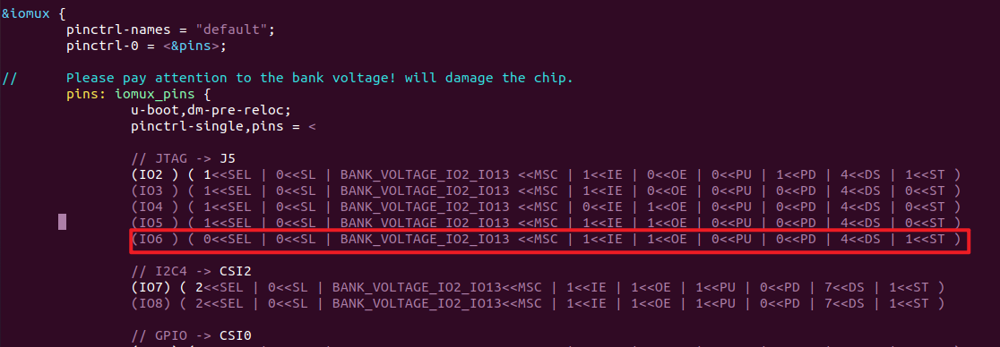

之后在重新参照“2.编译打包、烧录镜像”，重新编译，烧录镜像。

烧录完成启动开发板分别进入小核linux和大核rt-smart下的sharefs目录下分别查看是否有drv\_hello\_test.elf：

小核：

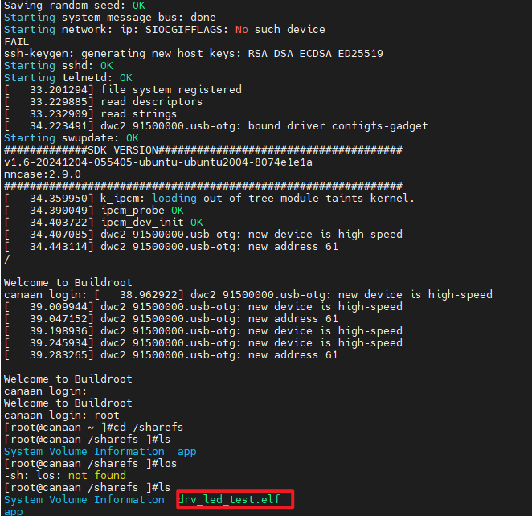

大核：

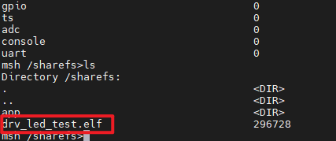

之后我们便可以在大核里直接运行drv\_hello\_test.elf on/off控制led灯的亮灭了：

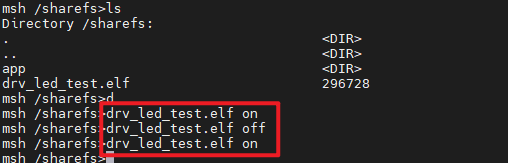

注意：使用ADB的前提时提前安装ADB,详情请见**“3.4开发板文件传输”**章节！

## I/O设备驱动

### I/O设备模型与分类

RT-Thread中，就是引入了驱动框架层，实现了各类UART驱动的统一、实现了各类I2C控制器驱动的统一、实现了各类SPI控制器驱动的统一，等等。I/O设备模型如下图所示：

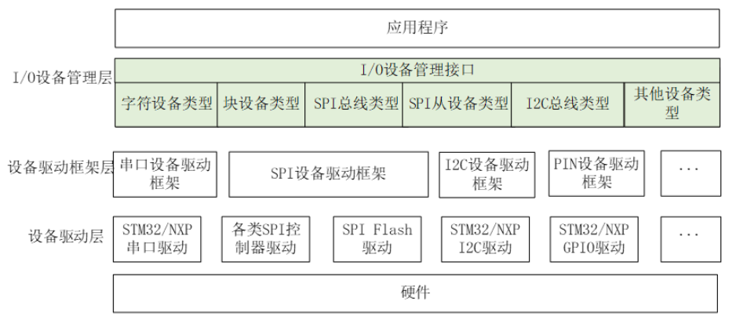

以上一节的hello驱动为例，hello\_frame\_drv.c驱动框架层里调用的“rt\_device\_register”就是在“I/O设备管理层”实现的。“I/O设备管理层”起到承上启下的作用：下面具体的驱动程序调用“rt\_device\_register”把驱动程序注册进某个链表。上层应用程序使用“rt\_device\_find”在这个链表里找到驱动程序，然后调用“rt\_device\_open/read/write”等函数使用驱动程序。

设备驱动框架层，类似hello\_frame\_drv.c，它提供了xxx\_register函数，比如“register\_hello\_dev”、“rt\_hw\_serial\_register”、“rt\_spi\_bus\_register”，这些函数会设置rt\_device结构体，给它提供事先写好的各类接口函数，然后调用“rt\_device\_register”注册驱动。

谁来调用设备驱动框架层的“xxx\_register”函数？底下的设备驱动层，比如hello\_sam.c。设备驱动层的代码，实现了具体设备的操作，然后调用设备驱动框架层提供的“xxx\_register”函数来注册驱动。

RT-Thread驱动的核心，是rt\_devcie结构体。即使使用各种“设备驱动框架层”，它最终也是构造、注册一个rt\_device结构体。这个结构体中，有一个type成员，如下：

```text
struct rt_device
{
    struct rt_object          parent;                   /**< inherit from rt_object */
    enum rt_device_class_type type;                     /**< device type */
```

它的取值有这些，表示各类驱动程序：

```text
enum rt_device_class_type
{
    RT_Device_Class_Char = 0,                           /**< character device */
    RT_Device_Class_Block,                              /**< block device */
    RT_Device_Class_NetIf,                              /**< net interface */
    RT_Device_Class_MTD,                                /**< memory device */
    RT_Device_Class_CAN,                                /**< CAN device */
    RT_Device_Class_RTC,                                /**< RTC device */
    RT_Device_Class_Sound,                              /**< Sound device */
    RT_Device_Class_Graphic,                            /**< Graphic device */
    RT_Device_Class_I2CBUS,                             /**< I2C bus device */
    RT_Device_Class_USBDevice,                          /**< USB slave device */
    RT_Device_Class_USBHost,                            /**< USB host bus */
    RT_Device_Class_SPIBUS,                             /**< SPI bus device */
    RT_Device_Class_SPIDevice,                          /**< SPI device */
    RT_Device_Class_SDIO,                               /**< SDIO bus device */
    RT_Device_Class_PM,                                 /**< PM pseudo device */
    RT_Device_Class_Pipe,                               /**< Pipe device */
    RT_Device_Class_Portal,                             /**< Portal device */
    RT_Device_Class_Timer,                              /**< Timer device */
    RT_Device_Class_Miscellaneous,                      /**< Miscellaneous device */
    RT_Device_Class_Sensor,                             /**< Sensor device */
    RT_Device_Class_Touch,                              /**< Touch device */
    RT_Device_Class_PHY,                                /**< PHY device */
    RT_Device_Class_Unknown                             /**< unknown device */
};
```

### I/O设备管理接口

**1\.** [**驱动程序使用的接口**](https://www.rt-thread.org/document/site/#/rt-thread-version/rt-thread-standard/programming-manual/thread/thread?id=%e5%90%af%e5%8a%a8%e7%ba%bf%e7%a8%8b)

驱动程序使用“rt\_device\_create/rt\_device\_destroy”来分配、销毁rt\_device结构体，使用“rt\_device\_register/rt\_device\_unregister”来注册、反注册rt\_device。这些函数的接口定义如下：

```text
rt_device_t rt_device_create(int type, int attach_size);
void rt_device_destroy(rt_device_t dev);
rt_err_t rt_device_register(rt_device_t dev,
                        const char *name,
                        rt_uint16_t flags);
rt_err_t rt_device_unregister(rt_device_t dev);
```

rt\_device\_create函数用来分配一个rt\_device结构体，它的参数和返回值入下表所示：

| 输入参数 | 功能描述 |
| --- | --- |
| type | 设备类型，取值为enum rt_device_class_type的值 |
| attach_size | 额外的空间，要分配的空间大小=rt_device结构体的大小+attach_size |
| 返回值 | 功能描述 |
| rt_device_t | 线程创建成功，返回rt_device的指针 |
| RT_NULL | 分配rt_device创建失败 |

rt\_device\_destroy函数用来销毁rt\_device结构体，它的参数和返回值入下表所示：

| 输入参数 | 功能描述 |
| --- | --- |
| dev | rt_devcie_t类型，即rt_device指针，表示要销毁的rt_device |
| 返回值 | 无 |

rt\_device\_register函数用来注册一个rt\_device结构体，它的参数和返回值入下表所示：

| 输入参数 | 功能描述 |
| --- | --- |
| dev | rt_devcie_t类型，即rt_device指针，表示要注册的rt_device |
| name | 设备的名字，以后可以根据名字找到这个设备 |
| flags | 表示设备的属性，可取的值见后面 |
| 返回值 | 功能描述 |
| RT_EOK | 成功 |
| 其他值 | 失败 |

flags能取的值如下：

```text
/**
 * device flags defitions
 */
#define RT_DEVICE_FLAG_DEACTIVATE       0x000           /**< device is not not initialized */
#define RT_DEVICE_FLAG_RDONLY           0x001           /**< read only */
#define RT_DEVICE_FLAG_WRONLY           0x002           /**< write only */
#define RT_DEVICE_FLAG_RDWR             0x003           /**< read and write */
#define RT_DEVICE_FLAG_REMOVABLE        0x004           /**< removable device */
#define RT_DEVICE_FLAG_STANDALONE       0x008           /**< standalone device */
#define RT_DEVICE_FLAG_ACTIVATED        0x010           /**< device is activated */
#define RT_DEVICE_FLAG_SUSPENDED        0x020           /**< device is suspended */
#define RT_DEVICE_FLAG_STREAM           0x040           /**< stream mode */
#define RT_DEVICE_FLAG_INT_RX           0x100           /**< INT mode on Rx */
#define RT_DEVICE_FLAG_DMA_RX           0x200           /**< DMA mode on Rx */
#define RT_DEVICE_FLAG_INT_TX           0x400           /**< INT mode on Tx */
#define RT_DEVICE_FLAG_DMA_TX           0x800           /**< DMA mode on Tx */
```

rt\_device\_unregister函数用来反注册一个rt\_device结构体，它的参数和返回值入下表所示：

| 输入参数 | 功能描述 |
| --- | --- |
| dev | rt_devcie_t类型，即rt_device指针，表示要注册的rt_device |
| 返回值 | 功能描述 |
| RT_EOK | 成功（必定成功） |

**2\.** [**应用程序使用的接口**](https://www.rt-thread.org/document/site/#/rt-thread-version/rt-thread-standard/programming-manual/thread/thread?id=%e5%90%af%e5%8a%a8%e7%ba%bf%e7%a8%8b)

应用程序先使用“rt\_device\_find”找到驱动程序，然后使用“rt\_device\_open”打开设备（第1次打开时，内部会调用rt\_device\_init函数来初始化设备，应用程序无需自己调用rt\_device\_init函数）；接着，就可以调用“rt\_devcice\_control/rt\_device\_read/rt\_device\_write”来控制、读、写设备了；最后，不再使用这个设备时，就可以调用“rt\_device\_close”来关闭它。

这些函数的原型如下：

```text
rt_device_t rt_device_find(const char *name);
rt_err_t rt_device_open(rt_device_t dev, rt_uint16_t oflag);
rt_err_t rt_device_close(rt_device_t dev);
rt_err_t rt_device_init(rt_device_t dev);
rt_err_t rt_device_control(rt_device_t dev, int cmd, void *arg);
rt_size_t rt_device_read(rt_device_t dev,
                     rt_off_t    pos,
                     void       *buffer,
                     rt_size_t   size);
rt_size_t rt_device_write(rt_device_t dev,
                      rt_off_t    pos,
                      const void *buffer,
                      rt_size_t   size);
```

rt\_device\_find函数用来寻找rt\_device结构体，它的参数和返回值入下表所示：

| 输入参数 | 功能描述 |
| --- | --- |
| name | 设备的名字，根据名字找到这个设备 |
| 返回值 | 功能描述 |
| rt_device_t | 成功，返回rt_device的指针 |
| RT_NULL | 失败 |

rt\_device\_open函数用来打开设备，它的参数和返回值入下表所示：

| 输入参数 | 功能描述 |
| --- | --- |
| dev | 要打开的设备 |
| oflag | 打开设备的flag |
| 返回值 | 功能描述 |
| RT_EOK | 成功 |
| 其他负值 | 失败 |

rt\_device\_init函数用来初始化设备，它是被rt\_device\_open调用的，它的参数和返回值入下表所示：

| 输入参数 | 功能描述 |
| --- | --- |
| dev | 要初始化的设备 |
| 返回值 | 功能描述 |
| RT_EOK | 成功 |
| 其他负值 | 失败 |

rt\_device\_control函数用来控制设备，它的参数和返回值入下表所示：

| 输入参数 | 功能描述 |
| --- | --- |
| dev | 要控制的设备 |
| cmd | 这是一个宏，一个数字，用来表示“控制什么”，它的取值是驱动程序决定的 |
| arg | 这是输入或输出参数，由cmd决定 |
| 返回值 | 功能描述 |
| RT_EOK | 成功 |
| 其他负值 | 失败 |

rt\_device\_read函数用来读设备，它的参数和返回值入下表所示：

| 输入参数 | 功能描述 |
| --- | --- |
| dev | 要读的设备 |
| pos | 偏移地址 |
| size | 要读取的字节数 |
| 输出参数 | 功能描述 |
| buffer | 缓冲区，用来保存读到的数据 |
| 返回值 | 功能描述 |
|  | 读取到的数据的个数（单位：字节） |

rt\_device\_write函数用来写设备，它的参数和返回值入下表所示：

| 输入参数 | 功能描述 |
| --- | --- |
| dev | 要读的设备 |
| pos | 偏移地址 |
| buffer | 缓冲区，用来保存要写给设备的数据 |
| size | 要写出去的数据的字节数 |
| 返回值 | 功能描述 |
|  | 真正写到设备的数据的个数（单位：字节） |

rt\_device\_close函数用来关闭设备，它的参数和返回值入下表所示：

| 输入参数 | 功能描述 |
| --- | --- |
| dev | 要关闭的设备 |
| 返回值 | 功能描述 |
| RT_EOK | 成功 |
| 其他负值 | 失败 |

### 驱动编写流程与规范

编写驱动程序时，有2种方法：

① 直接构造、注册rt\_device

② 使用设备驱动框架层。

**1\.** [**直接构造、注册rt\_device**](https://www.rt-thread.org/document/site/#/rt-thread-version/rt-thread-standard/programming-manual/thread/thread?id=%e5%90%af%e5%8a%a8%e7%ba%bf%e7%a8%8b)

流程为：分配、设置、注册rt\_device结构体。分配rt\_device结构体时，可以定义一个全局变量，也可以使用rt\_device\_create函数用来分配。设置rt\_device结构体时，根据需要设置它的init/open/control/read/write/close成员，无需全部设置。最后，使用rt\_device\_register注册，提供的名字必须是唯一的。

**2\. 使用设备驱动框架层**

需要根据具体的设备驱动框架层，分配、设置、注册具体的结构体。以UART驱动为例，要分配一个rt\_serial\_device结构体，设置它的时候，要提供配置信息、操作函数（rt\_uart\_ops结构体），最后使用rt\_hw\_serial\_register函数注册。

示例代码如下：

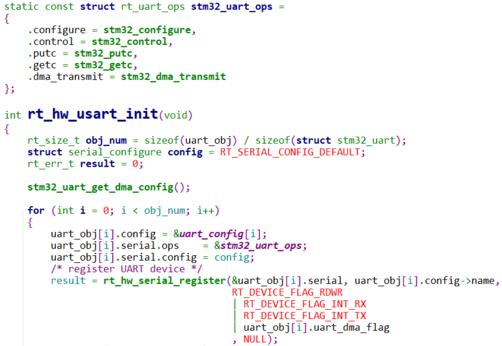

**3\. 驱动程序编程规范**

驱动程序是给应用开发人员使用，要避免暴露复杂的硬件操作细节，力求让没有硬件知识的人也知道如何使用驱动程序。

驱动程序要屏蔽不同硬件的差异，编写一个新的驱动程序时，要考虑可扩展性，力求能支持同类、不同型号的硬件。

## 驱动程序分层

使用驱动程序的目的，是给上层应用程序提供统一的接口，比如都使用“rt\_deivce\_init/rt\_device\_open/rt\_device\_read/rt\_device\_write”等固定的函数来访问硬件，如下图：

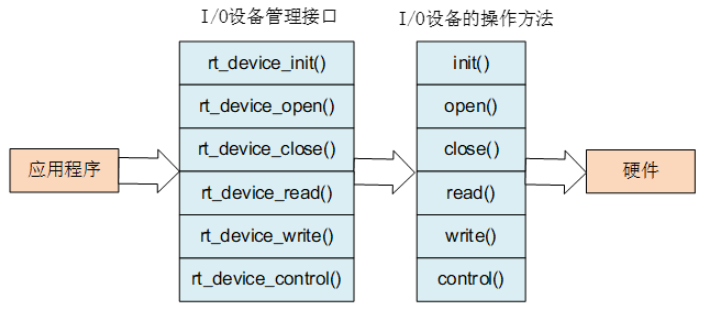

怎么实现驱动程序呢？构造一个rt\_device结构体，填充里面的init、open、close等成员，然后注册它。以drv\_hello.c驱动为例，它的代码如下：

```text
25 static rt_size_t hello_write(rt_device_t dev, rt_off_t pos, const void *buffer, rt_size_t size)
26 {
27     if (buffer[0] == 1)
28         rt_kprintf("Hello, sam\n\r");
29     else if (buffer[0] == 0)
30         rt_kprintf("Bye, sam\n\r");
31     else
32         rt_kprintf("Invalid\n\r");
33     return size;
34 }
/* 省略 */
48 static int hello_drv_init(void)
49 {
50     int ret;
51
52     /* 分配一个 rt_device */
53     /* 设置 */
54     hello_drv.type = RT_Device_Class_Miscellaneous;
55     hello_drv.rx_indicate = RT_NULL;
56     hello_drv.tx_complete = RT_NULL;
57
58 #ifdef RT_USING_DEVICE_OPS
59     hello_drv.ops          = &hello_ops;
60 #else
61     hello_drv.init     = RT_NULL;
62     hello_drv.open     = RT_NULL;
63     hello_drv.close    = RT_NULL;
64     hello_drv.read     = RT_NULL;
65     hello_drv.write    = hello_write;
66     hello_drv.control  = RT_NULL;
67 #endif
68
69     /* 注册 */
70     ret = rt_device_register(&hello_drv, "hello", RT_DEVICE_FLAG_RDWR);
71     rt_kprintf("rt_device_register hello, ret = %d\n", ret);
72
73
74     return ret;
75 }
76 INIT_BOARD_EXPORT(hello_drv_init);
77
```

第25~34行实现了一个hello\_write函数。

第65行，设置了rt\_device结构体，它的write成员设置为hello\_write函数。

第70行注册这个rt\_device结构体。

以后，应用程序就可以如下使用这个驱动程序：

```text
char buf[1];
rt_device_t hello_dev;
hello_dev = rt_device_find("hello");
rt_device_open(hello_dev, RT_DEVICE_OFLAG_RDWR);
buf[0] = 1;
rt_device_write(hello_dev, 0, buf, 1);
```

运行上面的代码，串口就会打印出“Hello，sam”。

但是，还不够：除了接口函数统一之外，还想把这些接口函数的参数类型也统一起来。比如还想实现另一个驱动程序，比如“hello2”驱动程序，希望应用程序调用rt\_device\_write时，传入的buf中，数值也只能是1或0才有效。怎么规定驱动程序只接收1或0，发现是其他数值就报错？当然可以编写文档来约束驱动开发人员：你必须按照文档来实现驱动。但是也许驱动开发人员根本没看到这个文档。RT-Thread的做法是引入设备驱动框架层，比如引入hello驱动框架层hello\_frame\_drv.c。

先在hello\_frame\_drv.h里定义一个新的结构体，代码如下：

```text
24 struct hello_dev {
25      struct rt_device parent;
26      char *name;
27 };
28
29 int register_hello_dev(struct hello_dev *dev);
```

第24行定义了一个hello\_dev类型，它的第1项必须是struct rt\_device（第25行），其他的内容（第26行）就是自定义的内容。

然后，在hello\_drame\_drv.c里，实现一个register\_hello\_dev函数，代码如下：

```text
23 static rt_size_t hello_write(rt_device_t dev, rt_off_t pos, const void *buffer, rt_size_t size)
24 {
25     struct hello_dev *hello_dev = (struct hello_dev *)dev;
26     if (buffer[0] == 1)
27         rt_kprintf("Hello, %s\n\r", hello_dev->name);
28     else if (buffer[0] == 0)
29         rt_kprintf("Bye, %s\n\r", hello_dev->name);
30     else
31         rt_kprintf("Invalid\n\r");
32     return size;
33 }
/* 省略 */
47 int register_hello_dev(struct hello_dev *dev)
48 {
49     int ret;
50
51     /* 设置 */
52
53     dev->parent.type = RT_Device_Class_Miscellaneous;
54     dev->parent.rx_indicate = RT_NULL;
55     dev->parent.tx_complete = RT_NULL;
56
57 #ifdef RT_USING_DEVICE_OPS
58     dev->parent.ops        = &hello_ops;
59 #else
60     dev->parent.init       = RT_NULL;
61     dev->parent.open       = RT_NULL;
62     dev->parent.close      = RT_NULL;
63     dev->parent.read       = RT_NULL;
64     dev->parent.write      = hello_write;
65     dev->parent.control  = RT_NULL;
66 #endif
67
68     /* 注册 */
69     ret = rt_device_register(&dev->parent, dev->name, RT_DEVICE_FLAG_RDWR);
70     rt_kprintf("rt_device_register %s, ret = %d\n", dev->name, ret);
71
72     return ret;
73 }
```

在第47行的register\_hello\_dev函数中，初始化了rt\_device结构体（第53~66行），里面使用的都是预先实现的、固定的函数，比如第64行的hello\_write。这就把驱动程序的参数统一起来了：应用程序最终调用到驱动的hello\_write时，hello\_write里面保证了buf中数据必须是1或0才是正确的。

最后，谁来调用hello\_drame\_drv.c里的register\_hello\_dev函数？可以是hello\_sam.c，也可以是hello\_bill.c，比如：

```text
17 #include "hello_frame_drv.h"
18
19 static struct hello_dev sam = {
20     .name = "sam",
21 };
22
23 static int hello_sam_init(void)
24 {
25     return register_hello_dev(&sam);
26 }
27 INIT_BOARD_EXPORT(hello_sam_init);
```

有了hello驱动框架层hello\_frame\_drv.c后，编写具体的驱动程序反而简单了：只需要定义一个hello\_dev结构体（第19行），然后注册它即可（第25行）。

应用程序去使用hello\_sam.c驱动程序时，代码如下（接口函数、参数没有变化）：

```text
char buf[1];
rt_device_t hello_dev;
hello_dev = rt_device_find("sam");
rt_device_open(hello_dev, RT_DEVICE_OFLAG_RDWR);
buf[0] = 1;
rt_device_write(hello_dev, 0, buf, 1);
```

从这个例子里，可以看到hello驱动的框架为（设备管理层源码为在rt-thread\\src\\device.c里，它实现了rt\_device\_register等函数，用来管理驱动）：

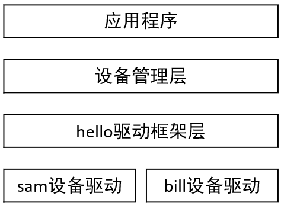

---

版权所有：深圳百问网科技有限公司
未经授权不得拷贝、复制、修改、传播本文档，否则将追究法律责任。
