# 搭建AI应用开发环境

> 本文档根据《嘉楠K230开发手册》V1.0（2024-11-30）整理。正文、表格、示例代码与插图均来自原始手册。

由于每个AI算法使用的环境不同和K230需要用到特定的库进行模型转换，所以提前准备了Vmware使用的Ubuntu 20.04版本的虚拟机。

## 使用Vmware开启Ubuntu虚拟机

访问资料目录中的 03\_Ubuntu虚拟机/

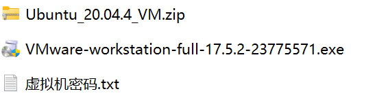

该目录中包含Vmware安装包和Ubuntu虚拟机。下面将演示如何安装Vmware并打开Ubuntu虚拟机。

-   双击打开VMware-workstation-full-17.5.2-23775571.exe文件


一直点击下一步即可安装VMware虚拟机软件。

-   解压Ubuntu虚拟机压缩包Ubuntu\_20.04.4\_VM.zip
-   使用VMware开启Ubuntu虚拟机：
-   打开Vmware软件
-   查看软件顶部的选项卡，点击**文件**，如下图所示：


-   点击打开，弹出文件资源管理器，此我们我们需要跳转至解压后的Ubuntu虚拟机路径
-   选择Ubuntu\_20.04.4\_VM目录下的Ubuntu镜像文件Ubuntu\_20.04.4\_VM\_LinuxVMImages.COM.vmx，如下图所示：


-   点击开启此虚拟机


-   第一次打开会提示虚拟机已经复制的对话框，点击**我已复制虚拟机**

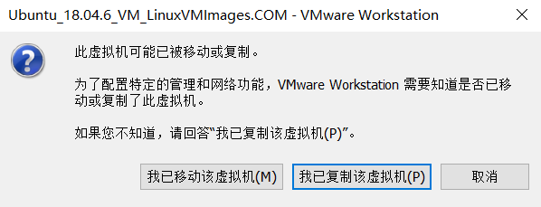

-   等待数秒，系统就会自动启动了，启动以后 鼠标点击 **Ubuntu** 字样，就可以进入登录对话框，输入 密码 ubuntu 即可登录进入ubuntu系统内。

## 体验不同的开发环境

由于开发过程我们需要在不同环境进行切换，请务必体验并熟悉不同环境的使用与切换。

1.  **进入人脸模型相关环境**

在Ubuntu端新建终端，直接在终端输入：

```text
conda activate py39_mobilenet
```

Ubuntu中已经默认安装了该环境，可直接激活。您也可以查看该环境中安装的包。

如果想退出conda环境可执行

```text
conda deactivate
```

**注意：**如果您想创建自己的conda环境可执行以下操作：

```text
conda create -n py39_mymobilenet python=3.9
conda activate py39_mymobilenet
```

在Ai应用开发资料中02\_人脸模型相关目录下有requirements.txt文件，该文件保存了此人脸模型算法的环境，可将该文件传输进Ubuntu虚拟机中（直接拖进虚拟机即可）。

```text
pip install -r requirements.txt 
```

1.  **进入目标检测相关环境**

在Ubuntu端新建终端，直接在终端输入：

```text
conda activate py39_yolov8
```

Ubuntu中已经默认安装了该环境，可直接激活。您也可以查看该环境中安装的包。

如果想退出conda环境可执行：

```text
conda deactivate
```

**注意：**如果您想创建自己的conda环境可执行以下操作：

```text
conda create -n py39_yolov8 python=3.9
pip3 install torch==2.4.1 torchvision==0.19.1 torchaudio==2.4.1
pip install ultralytics==8.3.31
pip install onnx==1.17.0 onnxruntime==1.19.2 onnxsim==0.4.36
pip install numpy==1.26.4
```

参考文档：[YOLOv8 -Ultralytics YOLO 文档](https://docs.ultralytics.com/zh/models/yolov8/)

1.  **进入Kmodel模型转换环境**

①进入k230 SDK目录

```text
cd k230_sdk
```

②激活

```text
sudo docker run -u root -it -v $(pwd):$(pwd) -v $(pwd)/toolchain:/opt/toolchain -w $(pwd) ghcr.io/kendryte/k230_sdk /bin/bash
```

③安装nncase库

```text
pip install nncase==2.9.0
pip install nncase-kpu==2.9.0
```

**注：**如果想退出docker，请输入**exit** 并按回车即可。

如果您想从头配置docker环境可在Ubuntu新建终端并安装docker包

```text
sudo apt-get install docker-ce docker-ce-cli containerd.io docker-buildx-plugin docker-compose-plugin
#获取K230 Docker镜像
docker pull ghcr.io/kendryte/k230_sdk
```

获取完成后即可执行步骤①和步骤②进入docker环境。

如果安装过程出现任何问题，导致安装失败，可使用Ubuntu中默认的docker环境。

## 访问开发板串口终端

由于K230中有两套系统，一套为rt-smart大核系统，一套为Linux小核，所以K230中有两个串口，一个串口A ，访问的是Linux系统；另一个为串口B，访问的是RT-Smart系统。后续文档中，访问Linux小核系统串口简称 串口A；访问RT-Smart大核系统串口简称 串口B。

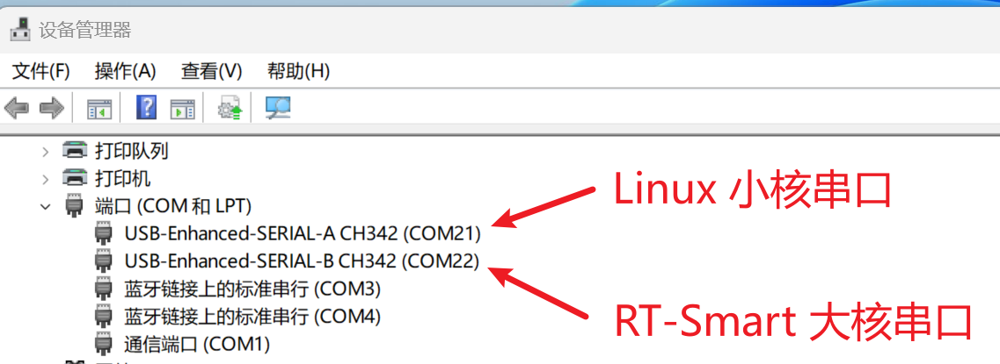

下面将使用[MobaXterm](https://mobaxterm.mobatek.net/)串口应用程序访问该端口号。下面是使用串口访问开发板调试控制台的指南，点击**Session** 会话，并选择Serial 串口，如下图所示：

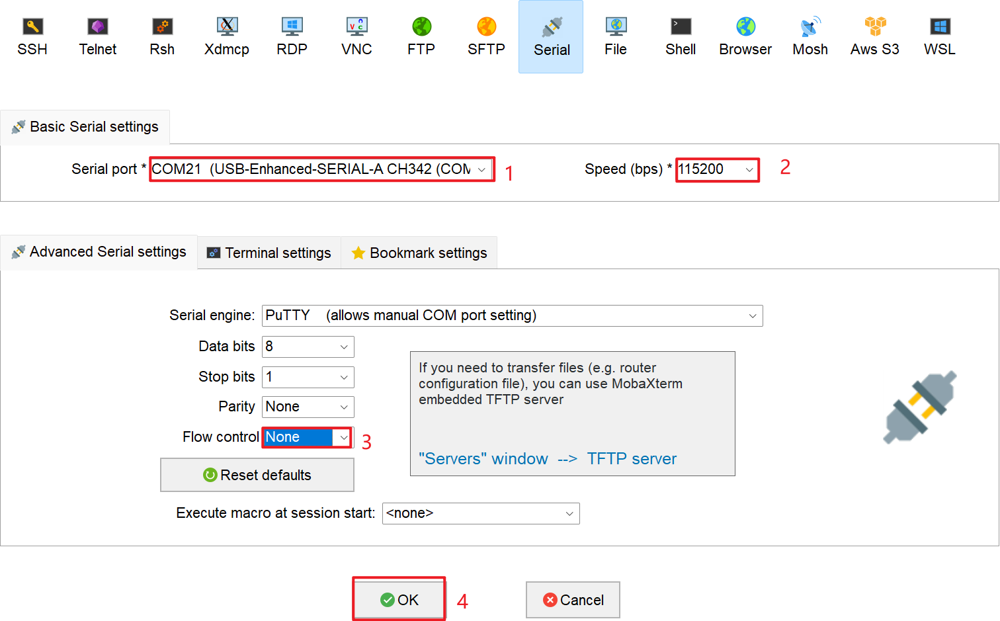

其中步骤您可以选择串口A和串口B，分别去访问Linux小核串口信息和和RT-Smart大核串口信息。

## 开发板与Ubuntu的文件传输

开发板与Ubuntu可使用ADB功能进行传输，使用两条数据线连接PC电脑端，并等待开发板系统完全启动（需要等待1分钟左右），当Ubuntu虚拟机处于开启状态时，会弹出ADB设备选项卡，如下所示：

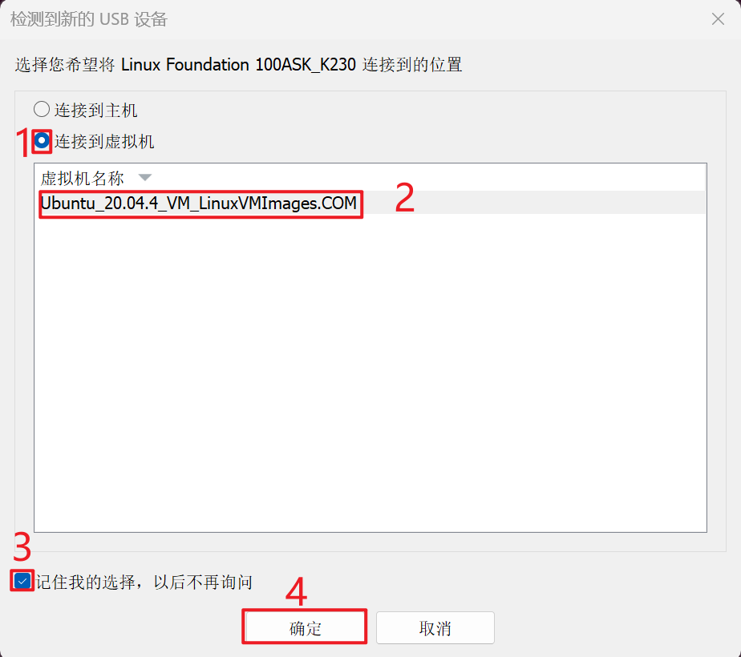

1.  点击连接到虚拟机
2.  选择Ubuntu 20.04虚拟机
3.  点击记住我的选择，以后不再询问 （后续开发板启动后会自动连接至虚拟机）
4.  点击确定

如果没有弹出对应设备，可能是Vmware自动选择了。可通过以下方式进行设备的切换连接。

1.  可点击Vmware上方的选项框中的**虚拟机**


1.  选择可移动设备
2.  找到设备**Linux Foundation 100ASK\_K230** 的ADB设备
3.  点击 **连接（断开与主机的连接）**

假设您已经成功将adb设备连接至Ubuntu虚拟机，此时在Ubuntu端新建终端，并输入：

```text
sudo adb devices
```

执行结构如下：

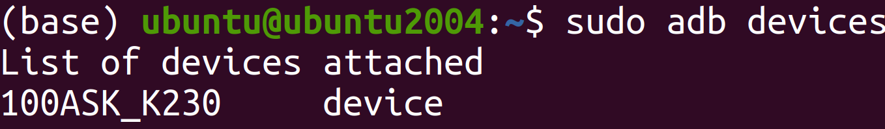

可以看到对应的adb设备，此时您可以使用adb进行开发板与Ubuntu之间的文件传输。

假设您需要将1.txt文件从Ubuntu端传输至开发板，可执行以下操作：

1.  创建1.txt文件

```text
touch 1.txt
echo 100ask > 1.txt
```

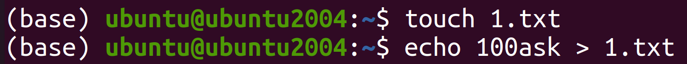

1.  使用adb 传输文件至开发板（其中1.txt 可替换任意文件）

```text
adb push 1.txt /sharefs
```

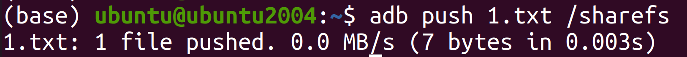

1.  此时可打开串口A进入Linux小核串口控制台

```text
cd /sharefs/
cat 1.txt
```

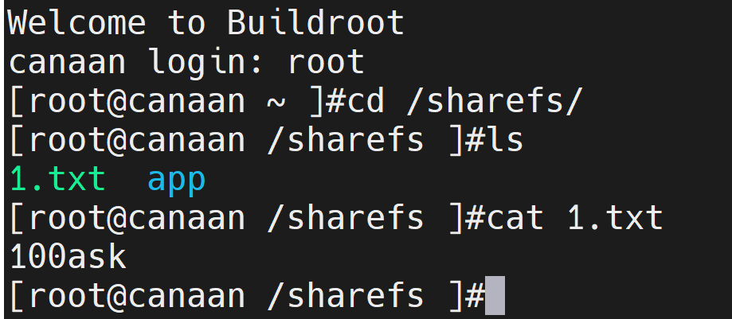

**注意：**在/sharefs目录下的文件，rt-smart和Linux都可访问该文件夹

假设您需要从开发板中拉取文件至Ubuntu端，可执行以下操作：

1.  在小核目录中新建2.txt ，并写入任意文本

```text
touch 2.txt
echo 100ask > 2.txt
```

1.  在Ubuntu端，新建终端，并执行以下命令：

```text
adb pull /sharefs/2.txt
```

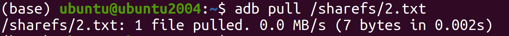

拉取的文件会保存在当前目录。

1.  此时执行以下命令，查看当前目录和拉取的文件

```text
ls
cat 2.txt
```

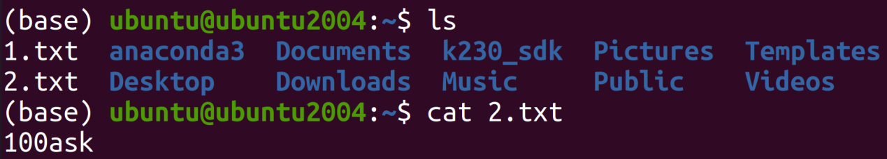

---

版权所有：深圳百问网科技有限公司
未经授权不得拷贝、复制、修改、传播本文档，否则将追究法律责任。
