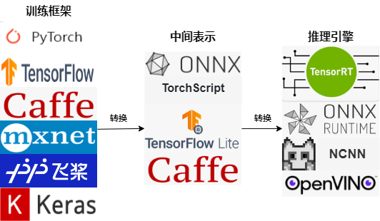
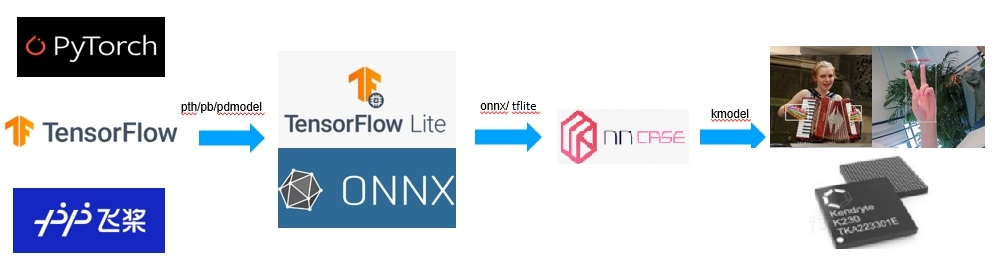
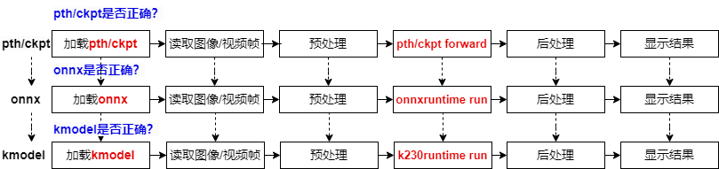
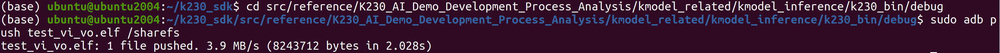
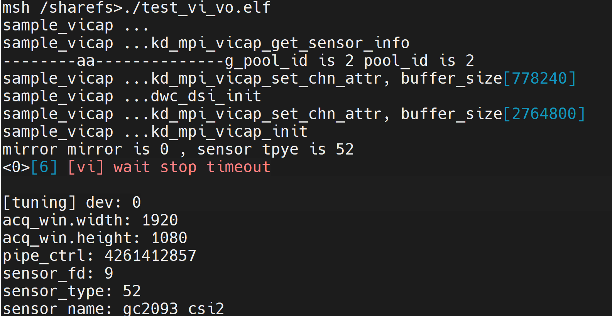

# 嵌入式AI的推理流程理论

> 本文档根据《嘉楠K230开发手册》V1.0（2024-11-30）整理。正文、表格、示例代码与插图均来自原始手册。

## 常规AI开发流程

AI开发流程可分为训练迭代和部署上线两个方面：

1.  训练迭代，即从选定特定数据集、模型结构、损失函数和评价指标入手，通过模型参数的不断优化，致力于实现尽可能接近或超越领域内最先进技术（SOTA）的结果。
2.  部署上线，即把训练好的模型在特定环境中推理运行的过程，更多关注于部署场景、部署方式、吞吐率和延迟。

AI模型通常通过PyTorch、TensorFlow、飞桨等深度学习框架训练完成，但直接使用训练模型推理有两个问题：直接通过这些模型来进行推理需要依赖这些训练框架，用起来比较复杂；不同的硬件的对算子的底层优化方式可能不同，相同模型运行在不同硬件上效率并不高，特别是对延时要求严格的线上场景；由此，经过工业界和学术界数年的探索，AI开发流程有了一条主流的流水线。



这一条流水线解决了模型部署中的两大问题：使用对接深度学习框架和推理引擎的中间表示，开发者不必担心如何在新环境中运行各个复杂的框架；通过中间表示的网络结构优化、推理引擎对运算的底层优化，模型的运算效率大幅提升。

## 基于K230的AI开发流程

****

基于K230的AI开发流程与主流AI开发流程类似，也是先训练，再部署。训练时开发者可以使用常见深度学习框架，例如：Pytorch、TensorFlow、飞桨等来定义网络结构，并通过训练确定网络中的参数。之后，模型的结构和参数会被转换成一种只描述网络结构的中间表示，例如：onnx、tflite，一些针对网络结构的优化会在中间表示上进行。最终，将中间表示转换成特定的文件格式（kmodel），并利用面向K230的推理引擎（K230Runtime），在K230硬件平台上实现模型的高效运行。

相信大家都对训练过程非常熟悉，因此本文着重介绍部署过程。选择开源repo[人脸检测](https://github.com/biubug6/Pytorch_Retinaface)、[人脸识别](https://github.com/Xiaoccer/MobileFaceNet_Pytorch)（稍后会详细解释两者含义），这两个开源repo都提供了基于Pytorch训练好的模型；因此，本文以Pytorch模型为例，对AI模型在K230的部署过程展开叙述。



对于Pytorch模型来说，从训练好到部署到K230上，会经过三种文件格式：pth/ckpt->onnx->kmodel，每转成新的文件格式之后，我们都需要验证转换模型的正确性，以保证成功部署。

1.  已经训练好的Pytorch模型，我们会用pth推理脚本验证它的正确性；
2.  验证pth/ckpt没有问题后，转onnx；
3.  转onnx后，验证onnx模型的正确性，需要使用ONNXRuntime来验证，验证流程与Pytorch推理流程类似，包括加载onnx、读取图像/视频流、图像/视频帧预处理、onnx run、后处理、显示结果；
4.  验证onnx没有问题，将其转换为kmodel；
5.  此时使用K230Runtime来验证kmodel的正确性，验证流程与ONNXRuntime推理流程类似，包括加载kmodel、读取图像/视频流、图像/视频帧预处理、kmodel run、后处理、显示结果；
6.  kmodel推理流程正确了，我们AI模型就可以成功部署了。
7.  PyTorch模型从训练到在K230上部署经过三个阶段：pth/ckpt验证（通常已验证）、onnx验证（使用ONNXRuntime），最后是kmodel验证（使用K230Runtime）。

每个阶段都需要确保模型的正确性，以保证成功部署。验证流程包括加载模型、处理输入数据、运行推理、处理输出结果，最终确保K230上的AI模型部署成功。

## 基于k230的AI推理流程

1.  **AI推理的完整流程分析**

本章介绍了K230 AI推理的完整流程，让大家对基于K230的AI推理过程有个大概印象，它包括视频采集，图像预处理，模型推理、后处理、显示等过程。

视频输入：VI（Video Input），视频采集

视频输出：VO（Video Output），显示

基于OpenCV(C++)的K230 AI推理，简要介绍了使用c++语言实现的视频采集，图像预处理（OpenCV），模型推理、后处理、显示等过程。

**1.1 视频采集**

视频采集：（视频输入，VI）与摄像头相关，本小节简要介绍基于c++的摄像头设置、摄像头启动、从摄像头中获取一帧数据、摄像头停止的整体流程。

1.  **设置摄像头属性**：

设置的sensor两路输出；

一路输出用于显示，输出大小设置1080p，图像格式为PIXEL\_FORMAT\_YVU\_PLANAR\_420，直接绑定到vo；

另一路输出用于AI计算，输出大小720p，图像格式为PIXEL\_FORMAT\_BGR\_888\_PLANAR（实际为rgb,chw,uint8）；

**注意：**显示屏的输出大小要根据实际而定。

**创建摄像头（sensor）输出缓存（VB）**：用于存放摄像头两路输出

```text
//vi_vo.h/***************************unfixed：不同AI Demo可能需要修改***********************/#define SENSOR_CHANNEL (3)     // 通道数#define SENSOR_HEIGHT (720)    // sensor ch1输出高度，AI输入#define SENSOR_WIDTH (1280)    // sensor ch1输出宽度，AI输入#define ISP_CHN0_WIDTH  (1920) // sensor ch0输出宽度，vo#define ISP_CHN0_HEIGHT (1080) // sensor ch0输出高度，vo/*****************************************************************************/​/***************************fixed：无需修改***********************************/memset(&config, 0, sizeof(config));config.max_pool_cnt = 64;//VB for YUV420SP outputconfig.comm_pool[0].blk_cnt = 5;config.comm_pool[0].mode = VB_REMAP_MODE_NOCACHE;config.comm_pool[0].blk_size = VICAP_ALIGN_UP((ISP_CHN0_WIDTH * ISP_CHN0_HEIGHT * 3 / 2), VICAP_ALIGN_1K);​//VB for RGB888 outputconfig.comm_pool[1].blk_cnt = 5;config.comm_pool[1].mode = VB_REMAP_MODE_NOCACHE;config.comm_pool[1].blk_size = VICAP_ALIGN_UP((SENSOR_HEIGHT * SENSOR_WIDTH * 3 ), VICAP_ALIGN_1K);​ret = kd_mpi_vb_set_config(&config);if (ret) {    printf("vb_set_config failed ret:%d\n", ret);    return ret;}/*****************************************************************************/
```

**设置摄像头属性**：设置sensor\_type；一般无需换摄像头，无需修改。

```text
//vi_vo.h/***************************fixed：无需修改***********************************/vicap_dev = VICAP_DEV_ID_0;ret = kd_mpi_vicap_get_sensor_info(sensor_type, &sensor_info);if (ret) {    printf("sample_vicap, the sensor type not supported!\n");    return ret;}......dev_attr.cpature_frame = 0;memcpy(&dev_attr.sensor_info, &sensor_info, sizeof(k_vicap_sensor_info));ret = kd_mpi_vicap_set_dev_attr(vicap_dev, dev_attr);if (ret) {    printf("sample_vicap, kd_mpi_vicap_set_dev_attr failed.\n");    return ret;}/*****************************************************************************/
```

**设置摄像头通道0属性：**设置摄像头通道0分辨率为1080p，格式为PIXEL\_FORMAT\_YVU\_PLANAR\_420；并将摄像头通道0绑定到显示；一般只需要关注chn\_attr.out\_win.width、chn\_attr.out\_win.height、chn\_attr.pix\_format即可，其它不用修改。

```text
//vi_vo.h/***************************unfixed：不同AI Demo可能需要修改***********************/#define ISP_CHN0_WIDTH  (1920) // sensor ch0输出宽度，vo#define ISP_CHN0_HEIGHT (1080) // sensor ch0输出高度，vo/*****************************************************************************//***************************unfixed：不同AI Demo可能需要修改******************///set chn0 output yuv420sp......chn_attr.out_win.width = ISP_CHN0_WIDTH;chn_attr.out_win.height = ISP_CHN0_HEIGHT;......chn_attr.chn_enable = K_TRUE;chn_attr.pix_format = PIXEL_FORMAT_YVU_PLANAR_420;/*****************************************************************************/ ....../***************************fixed：无需修改***********************************/chn_attr.buffer_num = VICAP_MAX_FRAME_COUNT;        //at least 3 buffers for ispchn_attr.buffer_size = config.comm_pool[0].blk_size;vicap_chn = VICAP_CHN_ID_0;printf("sample_vicap ...kd_mpi_vicap_set_chn_attr, buffer_size[%d]\n", chn_attr.buffer_size);ret = kd_mpi_vicap_set_chn_attr(vicap_dev, vicap_chn, chn_attr);if (ret) {    printf("sample_vicap, kd_mpi_vicap_set_chn_attr failed.\n");    return ret;}//bind vicap chn 0 to vovicap_mpp_chn.mod_id = K_ID_VI;vicap_mpp_chn.dev_id = vicap_dev;vicap_mpp_chn.chn_id = vicap_chn;vo_mpp_chn.mod_id = K_ID_VO;vo_mpp_chn.dev_id = K_VO_DISPLAY_DEV_ID;vo_mpp_chn.chn_id = K_VO_DISPLAY_CHN_ID1;sample_vicap_bind_vo(vicap_mpp_chn, vo_mpp_chn);printf("sample_vicap ...dwc_dsi_init\n");/*****************************************************************************/
```

**设置摄像头通道1属性：**设置通道1分辨率为720p，格式为PIXEL\_FORMAT\_BGR\_888\_PLANAR。

```text
//vi_vo.h/***************************unfixed：不同AI Demo可能需要修改***********************/#define SENSOR_CHANNEL (3)     // 通道数#define SENSOR_HEIGHT (720)    // sensor ch1输出高度，AI输入#define SENSOR_WIDTH (1280)    // sensor ch1输出宽度，AI输入/*****************************************************************************/....../***************************unfixed：不同AI Demo可能需要修改******************///set chn1 output rgb888p....chn_attr.out_win.width = SENSOR_WIDTH ;chn_attr.out_win.height = SENSOR_HEIGHT;......chn_attr.chn_enable = K_TRUE;chn_attr.pix_format = PIXEL_FORMAT_BGR_888_PLANAR;/*****************************************************************************/ /***************************fixed：无需修改***********************************/chn_attr.buffer_num = VICAP_MAX_FRAME_COUNT;//at least 3 buffers for ispchn_attr.buffer_size = config.comm_pool[1].blk_size;printf("sample_vicap ...kd_mpi_vicap_set_chn_attr, buffer_size[%d]\n", chn_attr.buffer_size);ret = kd_mpi_vicap_set_chn_attr(vicap_dev, VICAP_CHN_ID_1, chn_attr);if (ret) {    printf("sample_vicap, kd_mpi_vicap_set_chn_attr failed.\n");    return ret;}/*****************************************************************************/
```

**设置初始化、并启动摄像头：**

```text
//vi_vo.h/***************************fixed：无需修改***********************************/ret = kd_mpi_vicap_init(vicap_dev);if (ret) {    printf("sample_vicap, kd_mpi_vicap_init failed.\n");    // goto err_exit;}printf("sample_vicap ...kd_mpi_vicap_start_stream\n");ret = kd_mpi_vicap_start_stream(vicap_dev);if (ret) {    printf("sample_vicap, kd_mpi_vicap_init failed.\n");    // goto err_exit;}/*****************************************************************************/
```

**使用示例**：

```text
//main.ccvivcap_start();
```

1.  **获取摄像头图像**：

**摄像头数据临时地址**：创建vaddr，临时存放摄像头最新数据，它与摄像头通道1大小相同。

```text
// main.cc/***************************fixed：无需修改***********************************/// alloc memory for sensorsize_t paddr = 0;void *vaddr = nullptr;size_t size = SENSOR_CHANNEL * SENSOR_HEIGHT * SENSOR_WIDTH;int ret = kd_mpi_sys_mmz_alloc_cached(&paddr, &vaddr, "allocate", "anonymous", size);if (ret){    std::cerr << "physical_memory_block::allocate failed: ret = " << ret << ", errno = " << strerror(errno) << std::endl;    std::abort();}/*****************************************************************************/
```

**读取最新帧**：

dump：从摄像头通道1读取一帧图像,即从VB中dump一帧数据到dump\_info

映射：将dump\_info对应DDR地址（物理地址）映射到当前系统地址（虚拟地址）进行访问

转cv::Mat：将摄像头数据转换为cv::Mat，sensor（rgb,chw）->cv::Mat（bgr，hwc）；将摄像头数据转换为为cv::Mat不是必须的，这里只是为了以大家比较熟悉的方式（cv::Mat）进行讲解。

```text
//vi_vo.h/***************************fixed：无需修改***********************************///VB for RGB888 outputconfig.comm_pool[1].blk_cnt = 5;config.comm_pool[1].mode = VB_REMAP_MODE_NOCACHE;config.comm_pool[1].blk_size = VICAP_ALIGN_UP((SENSOR_HEIGHT * SENSOR_WIDTH * 3 ), VICAP_ALIGN_1K);/*****************************************************************************///main.ccwhile (!isp_stop){    cv::Mat ori_img;    //sensor to cv::Mat    {        /***************************fixed：无需修改***********************************/        //从摄像头通道1读取一帧图像,即从VB中dump一帧数据到dump_info        memset(&dump_info, 0 , sizeof(k_video_frame_info));        ret = kd_mpi_vicap_dump_frame(vicap_dev, VICAP_CHN_ID_1, VICAP_DUMP_YUV, &dump_info, 1000);        if (ret) {            printf("sample_vicap...kd_mpi_vicap_dump_frame failed.\n");            continue;        }        //将dump_info对应DDR地址（物理地址）映射到当前系统（虚拟地址）进行访问        //vbvaddr是实时改变的，因此我们最好把最新数据拷贝到【固定地址】vaddr，以便其它部分进行访问        auto vbvaddr = kd_mpi_sys_mmap_cached(dump_info.v_frame.phys_addr[0], size);        memcpy(vaddr, (void *)vbvaddr, SENSOR_HEIGHT * SENSOR_WIDTH * 3);         kd_mpi_sys_munmap(vbvaddr, size);        /*****************************************************************************/                //将摄像头数据转换为为cv::Mat,sensor（rgb,chw）->cv::Mat（bgr，hwc）        cv::Mat image_r = cv::Mat(SENSOR_HEIGHT,SENSOR_WIDTH, CV_8UC1, vaddr);        cv::Mat image_g = cv::Mat(SENSOR_HEIGHT,SENSOR_WIDTH, CV_8UC1, vaddr+SENSOR_HEIGHT*SENSOR_WIDTH);        cv::Mat image_b = cv::Mat(SENSOR_HEIGHT,SENSOR_WIDTH, CV_8UC1, vaddr+2*SENSOR_HEIGHT*SENSOR_WIDTH);        std::vector<cv::Mat> color_vec(3);        color_vec.clear();        color_vec.push_back(image_b);        color_vec.push_back(image_g);        color_vec.push_back(image_r);        cv::merge(color_vec, ori_img);    }    //使用当前帧数据    ......    ......    {        /***************************fixed：无需修改***********************************/        // 释放sensor当前帧        ret = kd_mpi_vicap_dump_release(vicap_dev, VICAP_CHN_ID_1, &dump_info);        if (ret) {            printf("sample_vicap...kd_mpi_vicap_dump_release failed.\n");        }        /*****************************************************************************/    }}
```

1.  **停止摄像头**：

```text
//vi_vo.h/***************************fixed：无需修改***********************************/int vivcap_stop(){    // 摄像头停止    printf("sample_vicap ...kd_mpi_vicap_stop_stream\n");    int ret = kd_mpi_vicap_stop_stream(vicap_dev);    if (ret) {        printf("sample_vicap, kd_mpi_vicap_init failed.\n");        return ret;    }​    // 摄像头资源释放    ret = kd_mpi_vicap_deinit(vicap_dev);    if (ret) {        printf("sample_vicap, kd_mpi_vicap_deinit failed.\n");        return ret;    }​    kd_mpi_vo_disable_video_layer(K_VO_LAYER1);​    vicap_mpp_chn.mod_id = K_ID_VI;    vicap_mpp_chn.dev_id = vicap_dev;    vicap_mpp_chn.chn_id = vicap_chn;​    vo_mpp_chn.mod_id = K_ID_VO;    vo_mpp_chn.dev_id = K_VO_DISPLAY_DEV_ID;    vo_mpp_chn.chn_id = K_VO_DISPLAY_CHN_ID1;​    // vi vo解绑    sample_vicap_unbind_vo(vicap_mpp_chn, vo_mpp_chn);​    /*Allow one frame time for the VO to release the VB block*/    k_u32 display_ms = 1000 / 33;    usleep(1000 * display_ms);​    // 退出vb    ret = kd_mpi_vb_exit();    if (ret) {        printf("sample_vicap, kd_mpi_vb_exit failed.\n");        return ret;    }​    return 0;}/*****************************************************************************/
只需在main.cc中调用：
//main.ccvivcap_start();......vivcap_stop();
```

**1.2 预处理**

对当前帧数据进行resize处理。

```text
//main.ccwhile (!isp_stop){    cv::Mat ori_img;        //ori：uint8,chw,rgb    //sensor to cv::Mat    {        ......    }    /***************************unfixed：不同AI Demo可能需要修改******************/    // pre_process，cv::Mat((1280,720),bgr,hwc)->kmodel((224,224),rgb,hwc)    cv::Mat pre_process_img;    {        cv::Mat rgb_img;        cv::cvtColor(ori_img, rgb_img, cv::COLOR_BGR2RGB);        cv::resize(rgb_img, pre_process_img, cv::Size(kmodel_input_width, kmodel_input_height), cv::INTER_LINEAR);    }    /*****************************************************************************/​    //已在ai_base.cc中给出通用实现    /***************************fixed：无需修改***********************************/    // set kmodel input    {        runtime_tensor tensor0 = kmodel_interp.input_tensor(0).expect("cannot get input tensor");        auto in_buf = tensor0.impl()->to_host().unwrap()->buffer().as_host().unwrap().map(map_access_::map_write).unwrap().buffer();        memcpy(reinterpret_cast<unsigned char *>(in_buf.data()), pre_process_img.data,sizeof(uint8_t)* kmodel_input_height * kmodel_input_width * 3);        hrt::sync(tensor0, sync_op_t::sync_write_back, true).expect("sync write_back failed");    }    /*****************************************************************************/     ......}
```

**1.3 模型推理**

设置好模型输入后，进行模型推理，得到模型推理结果。

```text
//main.ccstring kmodel_path = argv[1];cout<<kmodel_path<<endl;float cls_thresh=0.5;//已在ai_base.cc中给出通用实现，并且将在第6章给出开源代码/***************************fixed：无需修改***********************************/// kmodel解释器，从kmodel文件构建，负责模型的加载、输入输出设置和推理interpreter kmodel_interp;        // load modelstd::ifstream ifs(kmodel_path, std::ios::binary);kmodel_interp.load_model(ifs).expect("Invalid kmodel");// inputs initfor (size_t i = 0; i < kmodel_interp.inputs_size(); i++){    auto desc = kmodel_interp.input_desc(i);    auto shape = kmodel_interp.input_shape(i);    auto tensor = host_runtime_tensor::create(desc.datatype, shape, hrt::pool_shared).expect("cannot create input tensor");    kmodel_interp.input_tensor(i, tensor).expect("cannot set input tensor");} auto shape0 = kmodel_interp.input_shape(0);      //nhwcint kmodel_input_height = shape0[1];int kmodel_input_width = shape0[2];// outputs initfor (size_t i = 0; i < kmodel_interp.outputs_size(); i++){    auto desc = kmodel_interp.output_desc(i);    auto shape = kmodel_interp.output_shape(i);    auto tensor = host_runtime_tensor::create(desc.datatype, shape, hrt::pool_shared).expect("cannot create output tensor");    kmodel_interp.output_tensor(i, tensor).expect("cannot set output tensor");}/*****************************************************************************/     while (!isp_stop){    cv::Mat ori_img;    //sensor to cv::Mat    {        ......    }    // pre_process    cv::Mat pre_process_img;    {        ......    }    // set kmodel input    {        ......    }    //已在ai_base.cc中给出通用实现，并且将在第6章给出开源代码    /***************************fixed：无需修改***********************************/    // kmodel run    kmodel_interp.run().expect("error occurred in running model");    // get kmodel output    vector<float *> k_outputs;    {        for (int i = 0; i < kmodel_interp.outputs_size(); i++)        {            auto out = kmodel_interp.output_tensor(i).expect("cannot get output tensor");            auto buf = out.impl()->to_host().unwrap()->buffer().as_host().unwrap().map(map_access_::map_read).unwrap().buffer();            float *p_out = reinterpret_cast<float *>(buf.data());            k_outputs.push_back(p_out);        }    }    /*****************************************************************************/}
```

**1.4 后处理**

对模型结果进行后处理，并结果放到results中。

```text
//main.ccvector<cls_res> results;while (!isp_stop){    cv::Mat ori_img;    //sensor to cv::Mat    {        ......    }    // pre_process    cv::Mat pre_process_img;    {        ......    }    // set kmodel input    {        ......    }    // kmodel run    ......    // get kmodel output    vector<float *> k_outputs;    {        ......    }    //post process    results.clear();    {        /***************************unfixed：不同AI Demo可能需要修改******************/        float* output0 = k_outputs[0];        //softmax        float sum = 0.0;        for (int i = 0; i < labels.size(); i++){            sum += exp(output0[i]);        }        int max_index;        for (int i = 0; i < labels.size(); i++)        {            output0[i] = exp(output0[i]) / sum;        }        max_index = std::max_element(output0,output0+labels.size()) - output0;         cls_res b;        if (output0[max_index] >= cls_thresh)        {            b.label = labels[max_index];            b.score = output0[max_index];            results.push_back(b);        }        /*****************************************************************************/       }}
```

**1.5 显示**

显示（视频输出，VO）与display相关，本小节简要介绍基于c++的显示设置、显示叠加的整体流程；

显示设置：设置显示大小，格式

显示叠加：显示由2个图层构成，其中下边的图层（原图图层）直接显示摄像头输出，上边的图层（osd图层）用于画框、画点，写文字等。

1.  **显示设置**：设置显示大小，格式。

```text
//vi_vo.h/***************************fixed：无需修改***********************************/static k_s32 sample_connector_init(void){    ......    k_connector_type connector_type = LT9611_MIPI_4LAN_1920X1080_30FPS;    ......}static k_s32 vo_layer_vdss_bind_vo_config(void){    ......    sample_connector_init();    // config lyaer    info.act_size.width = ISP_CHN0_WIDTH;//ISP_CHN0_HEIGHT;//1080;//640;//1080;    info.act_size.height = ISP_CHN0_HEIGHT;//ISP_CHN0_WIDTH;//1920;//480;//1920;    info.format = PIXEL_FORMAT_YVU_PLANAR_420;    ......}/*****************************************************************************/ 
```

1.  **显示叠加**：由于摄像头和显示的通道进行了绑定，我们无法对vo进行直接操作，因此采用叠加的方式进行显示。

**原图图层**：由于摄像头（vi）通道0绑定了显示（vo）的通道1；随着摄像头的启动，摄像头通道0的数据会自动流到vo的通道1。

```text
//vi_vo.h....../***************************fixed：无需修改***********************************///bind vicap chn 0 to vovicap_mpp_chn.mod_id = K_ID_VI;vicap_mpp_chn.dev_id = vicap_dev;vicap_mpp_chn.chn_id = vicap_chn;vo_mpp_chn.mod_id = K_ID_VO;vo_mpp_chn.dev_id = K_VO_DISPLAY_DEV_ID;vo_mpp_chn.chn_id = K_VO_DISPLAY_CHN_ID1;sample_vicap_bind_vo(vicap_mpp_chn, vo_mpp_chn);printf("sample_vicap ...dwc_dsi_init\n");/*****************************************************************************/ ......
```

**osd图层**：cv::Mat上画框、画点、写文字之后，将数据插入vo对应通道。

```text
// vi_vo.h#define osd_id                              K_VO_OSD3/***************************unfixed：不同AI Demo可能需要修改******************/#define ISP_CHN0_WIDTH                      (1920) // sensor ch0输出宽度，vo#define ISP_CHN0_HEIGHT                     (1080) // sensor ch0输出高度，vo#define osd_width                           (1920)#define osd_height                          (1080)/*****************************************************************************/...../***************************fixed：无需修改***********************************/k_vb_blk_handle vo_insert_frame(k_video_frame_info *vf_info, void **pic_vaddr){    k_u64 phys_addr = 0;    k_u32 *virt_addr;    k_vb_blk_handle handle;    k_s32 size;    if (vf_info == NULL)        return K_FALSE;    if (vf_info->v_frame.pixel_format == PIXEL_FORMAT_ABGR_8888 || vf_info->v_frame.pixel_format == PIXEL_FORMAT_ARGB_8888)        size = vf_info->v_frame.height * vf_info->v_frame.width * 4;    else if (vf_info->v_frame.pixel_format == PIXEL_FORMAT_RGB_565 || vf_info->v_frame.pixel_format == PIXEL_FORMAT_BGR_565)        size = vf_info->v_frame.height * vf_info->v_frame.width * 2;    else if (vf_info->v_frame.pixel_format == PIXEL_FORMAT_ABGR_4444 || vf_info->v_frame.pixel_format == PIXEL_FORMAT_ARGB_4444)        size = vf_info->v_frame.height * vf_info->v_frame.width * 2;    else if (vf_info->v_frame.pixel_format == PIXEL_FORMAT_RGB_888 || vf_info->v_frame.pixel_format == PIXEL_FORMAT_BGR_888)        size = vf_info->v_frame.height * vf_info->v_frame.width * 3;    else if (vf_info->v_frame.pixel_format == PIXEL_FORMAT_ARGB_1555 || vf_info->v_frame.pixel_format == PIXEL_FORMAT_ABGR_1555)        size = vf_info->v_frame.height * vf_info->v_frame.width * 2;    else if (vf_info->v_frame.pixel_format == PIXEL_FORMAT_YVU_PLANAR_420)        size = vf_info->v_frame.height * vf_info->v_frame.width * 3 / 2;    size = size + 4096;         // 强制4K ，后边得删了    printf("vb block size is %x \n", size);    handle = kd_mpi_vb_get_block(g_pool_id, size, NULL);    if (handle == VB_INVALID_HANDLE)    {        printf("%s get vb block error\n", __func__);        return K_FAILED;    }    phys_addr = kd_mpi_vb_handle_to_phyaddr(handle);    if (phys_addr == 0)    {        printf("%s get phys addr error\n", __func__);        return K_FAILED;    }    virt_addr = (k_u32 *)kd_mpi_sys_mmap(phys_addr, size);    // virt_addr = (k_u32 *)kd_mpi_sys_mmap_cached(phys_addr, size);    if (virt_addr == NULL)    {        printf("%s mmap error\n", __func__);        return K_FAILED;    }    vf_info->mod_id = K_ID_VO;    vf_info->pool_id = g_pool_id;    vf_info->v_frame.phys_addr[0] = phys_addr;    if (vf_info->v_frame.pixel_format == PIXEL_FORMAT_YVU_PLANAR_420)        vf_info->v_frame.phys_addr[1] = phys_addr + (vf_info->v_frame.height * vf_info->v_frame.stride[0]);    *pic_vaddr = virt_addr;    printf("phys_addr is %lx g_pool_id is %d \n", phys_addr, g_pool_id);    return handle;}/*****************************************************************************/
```

**使用示例**：

```text
// main.cc/***************************fixed：无需修改***********************************/// osd createk_video_frame_info vf_info;void *pic_vaddr = NULL;       memset(&vf_info, 0, sizeof(vf_info));vf_info.v_frame.width = osd_width;vf_info.v_frame.height = osd_height;vf_info.v_frame.stride[0] = osd_width;vf_info.v_frame.pixel_format = PIXEL_FORMAT_ARGB_8888;block = vo_insert_frame(&vf_info, &pic_vaddr);/*****************************************************************************/ while (!isp_stop){    cv::Mat ori_img;    // sensor to cv::Mat    // pre_process    // set kmodel input    // kmodel run    // get kmodel output    // post process    results.clear();    {        ......    }    // draw result to vo    {        // draw osd        {            cv::Mat osd_frame(osd_height, osd_width, CV_8UC4, cv::Scalar(0, 0, 0, 0));            /***************************unfixed：不同AI Demo可能需要修改******************/            {                //draw cls                double fontsize = (osd_frame.cols * osd_frame.rows * 1.0) / (1100 * 1200);                for(int i = 0; i < results.size(); i++)                {                       std::string text = "class: " + results[i].label + ", score: " + std::to_string(round(results[i].score * 100) / 100.0).substr(0, 4);                    cv::putText(osd_frame, text, cv::Point(1, 40), cv::FONT_HERSHEY_SIMPLEX, 0.8, cv::Scalar(255, 255, 255, 0), 2);                    std::cout << text << std::endl;                }            }                        /*************************************************************************/                        /***************************fixed：无需修改***********************************/            memcpy(pic_vaddr, osd_frame.data, osd_width * osd_height * 4);        }        // insert osd to vo        {            kd_mpi_vo_chn_insert_frame(osd_id+3, &vf_info);            printf("kd_mpi_vo_chn_insert_frame success \n");        }        /*****************************************************************************/     }    ......}
vi_vo.h
/* Copyright (c) 2023, Canaan Bright Sight Co., Ltd
```

1.  **简单的VI\_VO程序编译与运行**

①在Ubuntu中新建终端，并进入k230\_SDK目录下

```text
cd k230_sdk/
```


②激活Kmodel模型转换环境

```text
sudo docker run -u root -it -v $(pwd):$(pwd) -v $(pwd)/toolchain:/opt/toolchain -w $(pwd) ghcr.io/kendryte/k230_sdk /bin/bash
```


③进入kmodel推理程序源码目录

```text
cd src/reference/K230_AI_Demo_Development_Process_Analysis/kmodel_related/kmodel_inference/
```


④执行编译脚本

```text
./build_app.sh debug
```

编译完成后，可在k230\_bin/debug目录下看到可执行程序test\_vi\_vo.elf。

⑤退出docker环境

```text
exit
```


⑥进入可执行文件目录并使用adb将编译出来的程序传输至开发板端

```text
cd src/reference/K230_AI_Demo_Development_Process_Analysis/kmodel_related/kmodel_inference/k230_bin/debug
sudo adb push test_vi_vo.elf /sharefs
```



⑦ 打开开发板的串口B ，访问rt-smart大核系统的串口。由于rt-smart系统有开机自启程序，可输入q + 回车键结束开机自启程序。

⑧ 进入可执行文件目录：

```text
cd sharefs/
```

⑨ 执行程序摄像头实时预览程序

```text
./test_vi_vo.elf
```


