# 人脸检测模型部署实战

> 本文档根据《嘉楠K230开发手册》V1.0（2024-11-30）整理。正文、表格、示例代码与插图均来自原始手册。

针对Pytorch，基于K230的AI开发流程由训练和部署两个部分组成，其中训练包括Pytorch训练模型，部署包括PyTorch到ONNX转换、使用ONNXRuntime进行推理、ONNX到kmodel转换、使用K230Runtime进行推理。

1.  PyTorch训练模型：

使用PyTorch框架定义并训练人脸检测和人脸识别模型。训练完成后，保存模型参数到.pth文件。

1.  PyTorch到ONNX转换：

利用PyTorch工具，将训练好的模型转换为ONNX格式。这一步会针对网络结构进行一些优化。

1.  使用ONNXRuntime进行推理：

在PC上加载ONNX模型，并利用ONNXRuntime进行推理，以验证onnx模型的正确性和性能。ONNXRuntime推理的主要流程包括预处理、运行、后处理。

1.  ONNX到kmodel转换：

利用K230支持的转换工具，将ONNX模型转换为K230可用的kmodel格式。这一步会优化模型以适应K230，生成在K230上能高效运行的模型。

1.  使用K230Runtime进行推理：

在K230上加载kmodel，使用K230Runtime进行推理。这确保模型在K230的运行效果。K230Runtime推理的主要流程包括预处理、运行、后处理。


整个流程通过将PyTorch模型经由ONNX中间格式，最终优化为适合K230的kmodel格式，实现了从PC端到K230的无缝部署。从pth/ckpt->onnx->kmodel，模型文件有3种文件格式，各种文件格式推理流程一一对应，因此转换完成后，我们需要在对应的推理流程下，验证转换模型的准确性。

#运行环境：常规pc环境

```text
├── onnx_related               
├── onnx_export            #导出onnx
│   ├── face_detection_convert_to_onnx.py       #对应3.1.1
│   ├── face_recognition_convert_to_onnx.py
│   └── readme.txt
└── onnx_inference         #onnx推理流程
    ├── face_detection     #人脸检测onnx推理流程   #对应3.1.2
    └── face_recognition   #人脸识别onnx推理流程
```

\# 编译环境：k230的编译环境，运行环境：K230开发板

```text
├── kmodel_related     
│   ├── kmodel_export         #导出kmodel，
│   │   ├── build_model.sh    #生成kmodel脚本
│   │   ├── face_detection    #对应3.1.3+3.1.4.1（两者都是python写的，为了写起来简单，把两者放在一起，逻辑上放到3.1.4更好）
│   │   ├── face_recognition
│   │   ├── k230_kmodel       #生成kmodel
│   │   └── k230_utils        #生成其它辅助文件，bin、图片等
│   └── kmodel_inference      #kmodel推理             
│       ├── build_app.sh      #生成可执行文件脚本
│       ├── cmake
│       ├── CMakeLists.txt
│       ├── face_detection    #人脸检测kmodel推理流程，对应3.1.4.2+3.1.4.3（两者都是c++写的）
│       ├── face_recognition  #人脸识别kmodel推理流程
│       ├── k230_bin          #生成的可执行文件、kmodel，上板执行脚本等
│       ├── main_nncase       #kmodel上板验证工具
│       ├── shell
│       └── test_demo  
```

人脸检测是指对于任意一幅给定的图像，采用一定的策略对其进行搜索以确定其中是否含有人脸，如果有则返回人脸检测框、五官关键点。参考人脸检测源码链接： [https://github.com/biubug6/Pytorch\_Retinaface](https://github.com/biubug6/Pytorch_Retinaface)

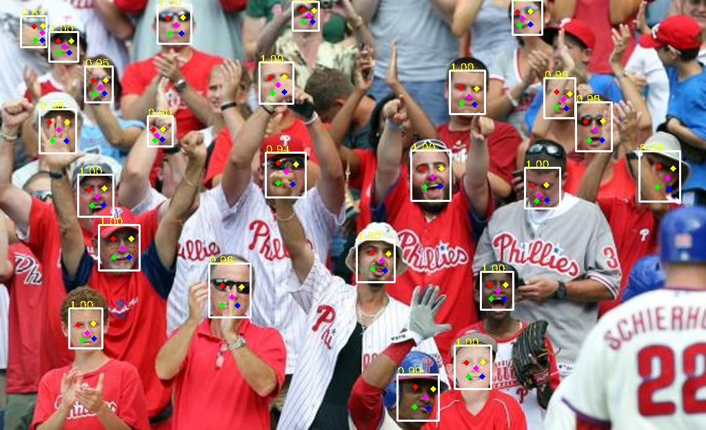

## PyTorch到ONNX转换

1.  **模型转换流程**

选择人脸检测模型时，一般应选择轻量化的模型，backbone一般小于resnet50参数量较好。因此我们选择基于MobileNetV1的RetinaFace 作为人脸检测模型。

1.  加载pth或ckpt模型到cpu
2.  构建随机模型输入
3.  导出onnx模型

**注：**pth、onnx都支持动态输入，而K230的模型暂时不支持动态输入，所以导出onnx时，onnx输入shape固定。

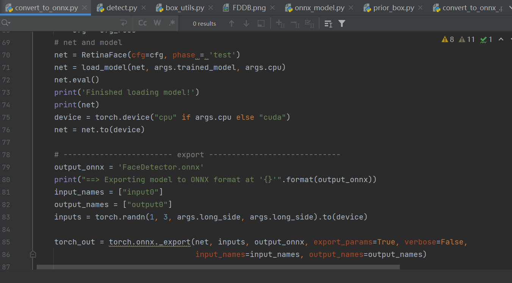

1.  **模型转换执行步骤**
2.  在Ubuntu中新建终端，并激活conda的人脸相关环境

```text
conda activate py39_mobilenet
```

1.  进入人脸检测源码目录

```text
cd k230_sdk/src/reference/Pytorch_Retinaface/
```

执行效果：

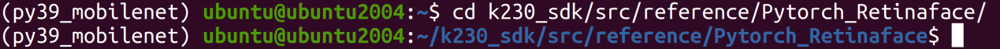

1.  拷贝ONNX转换程序至当前目录

```text
cp ../K230_AI_Demo_Development_Process_Analysis/onnx_related/onnx_export/face_detection_convert_to_onnx.py .
```

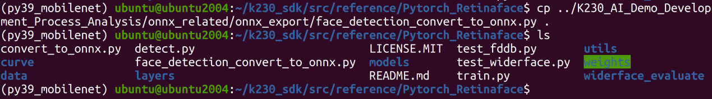

可根据Pytorch\_Retinaface说明文档下载预训练模型，模型文件位于weights目录下。

1.  执行转换程序

```text
python face_detection_convert_to_onnx.py
```

执行完成后即可在当前目录看到生成的FaceDetector.onnx模型文件。执行效果如下所示：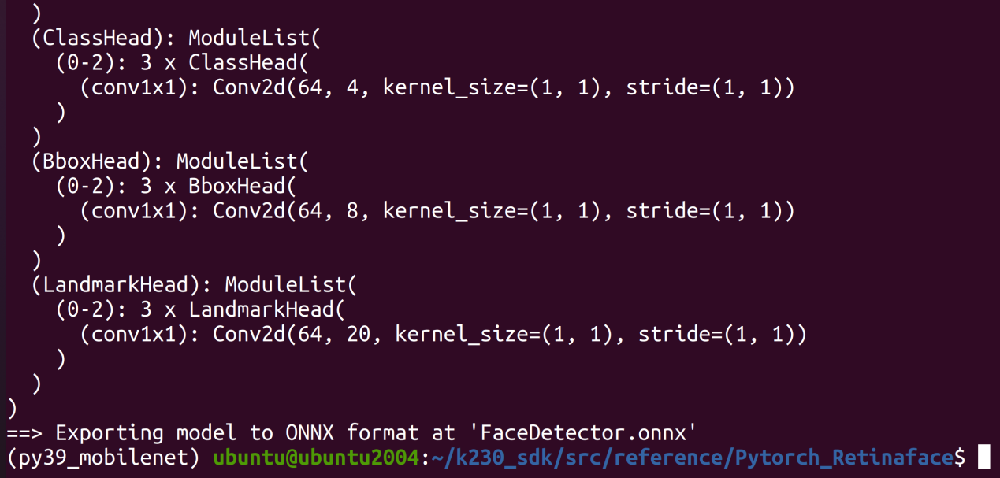

## 使用ONNXRuntime进行推理

为了验证onnx正确性，我们需要使用ONNXRuntime对onnx进行推理，推理时保证读取图片、预处理、run、后处理、显示结果与pth/ckpt的推理流程一致。

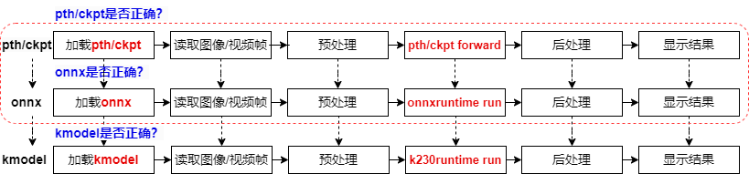

1.  **读取图像**

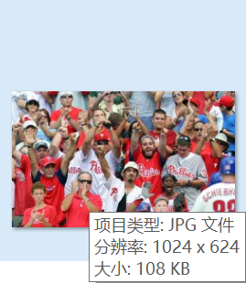

```text
#ori_img（1024,624,3）,opencv读入图片的默认格式为hwc,bgr
ori_img = cv2.imread('bin/test.jpg')
```

1.  **图像预处理**

预处理构建（常用的方法：padding\_resize，crop\_resize，resize，affine、normalization）：参考train.py，test.py、predict.py、现成的onnx推理脚本。

**构建人脸检测预处理代码：**

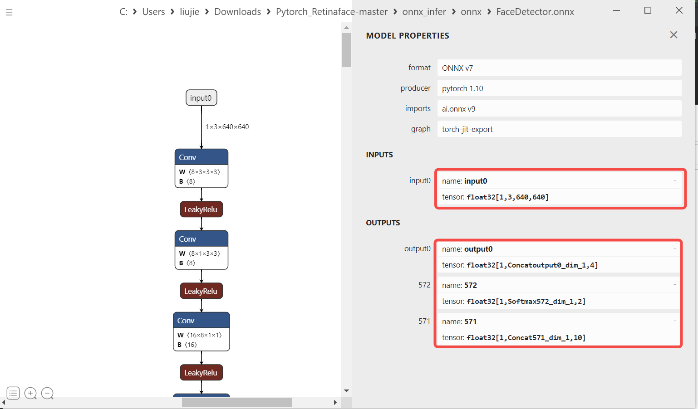

```text
#face_detector.py
def pre_process(self,ori_img):
max_ori_img = max(ori_img.shape[1], ori_img.shape[0])
self.scale = [max_ori_img] * 4
self.scale1 = [max_ori_img] * 10
# (1) padding：将原图padding为正方形，pad_img(1024,1024,3)
pad_img = pad_to_square(ori_img,self.normalize_mean,True)
# (2) resize+tranpose+normalization：将padding之后的图像缩放到640，hwc转chw，并归一化，resize_img(3,640,640)
resize_img = resize_subtract_mean(pad_img,self.in_size,self.normalize_mean)
# (3) dequantize：将缩放的图像转换为float32,resize_img_float(3,640,640)
resize_img_float = np.float32(resize_img)
#（4）3维扩张为4维：input_data(1,3,640,640)
input_data = np.expand_dims(resize_img_float, 0)
return input_data
```

**参考：**（与pth预处理流程一致）人脸检测预处理代码参考train.py（k230模型的输入shape目前只支持固定输入，训练时都是批量固定输入的，因此可以借鉴）中调用的预处理，去掉不适合推理使用的crop、distort、mirror（数据增强），只留下onnx推理时必要的pad\_to\_square、resize\_subact\_mean处理，保证onnx与pth预处理一致。

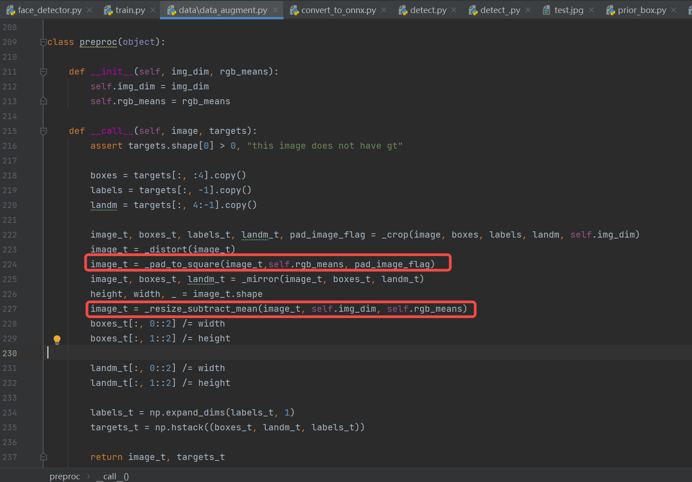

1.  **onnx推理**

将预处理好的数据，喂给模型，得到onnx推理结果

```text
#onnx_model.py
def forward(self, image_tensor):
'''
image_tensor = image.transpose(2, 0, 1)
image_tensor = image_tensor[np.newaxis, :]
onnx_session.run([output_name], {input_name: x})
:param image_tensor:
:return:
'''
input_feed = self.get_input_feed(image_tensor)
output = self.sess.run(self.out_names, input_feed=input_feed)
return output
#face_detector.py
loc,conf,landms = self.model.forward(input_data)
```

**3.1后处理**

后处理构建（常用的方法：softmax、loc解码、nms等）：参考test.py或predict.py等测试脚本、现成的onnx推理脚本。

构建人脸检测后处理代码：包括解码、nms等，由于后处理较多，我们只截取部分代码进行说明，具体实现参考K230\_AI\_Demo\_Development\_Process\_Analysis。

```text
#face_detector.py
def post_process(self,loc,conf,landms):
loc, conf, landms = loc[0],conf[0],landms[0]
boxes = decode(loc, self.priors_numpy, self.cfg['variance'])
boxes = boxes * self.scale / 1                     #右、下padding
......
```

**参考：**人脸检测repo的detect.py，对模型输入结果：loc（检测框）、conf（得分）、landms（关键点）进行后处理，进而得到人脸检测框、得分、五官点。

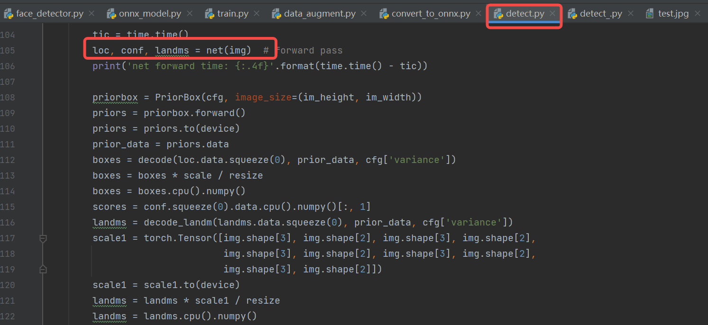

1.  **显示结果**

显示结果：将后处理之后的结果画到原图，执行人脸检测推理流程，若是检测效果正确，则说明使用ONNXRuntime推理人脸检测的流程是正确的，转换的onnx也是正确的。

1.  **执行步骤**

① 在Ubuntu中新建终端，并激活人脸相关环境，若已激活，请忽略此步骤

```text
conda activate py39_mobilenet
```

② 进入ONNX模型推理源码目录

```text
cd k230_sdk/src/reference/K230_AI_Demo_Development_Process_Analysis/onnx_related/onnx_inference/face_detection
```

③ 拷贝转换后ONNX模型至onnx文件夹中

```text
cp ../../../../Pytorch_Retinaface/FaceDetector.onnx onnx/
```

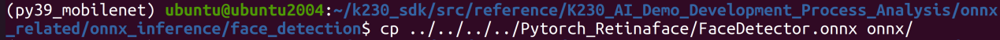

④执行ONNX推理程序

```text
python face_detector.py
```

执行效果图如下所示：

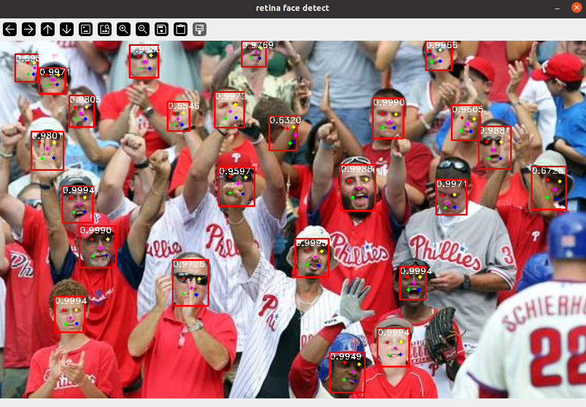
如果想退出显示，请按下q键退出。

## ONNX到kmodel转换

1.  **Kmodel模型转换源码解析**

人脸检测onnx模型经过nncase编译之后，可以生成在k230上推理的模型kmodel，生成kmodel需要调用nncase的编译模型APIs(Python)。

**1.1 配置生成kmodel参数**

编译参数包括编译目标参数、预处理参数、后处理参数，编译目标参数指定编译目标, 如’cpu’, ‘k230’；常用预处理参数由Transpose参数、SwapRB参数、Dequantize参数、Normalization参数构成；后处理参数目前只支持Transpose参数。

| 参数类别 | 参数名称 |
| --- | --- |
| 编译目标参数 | target |
| 预处理参数 | input_shape、input_layout、 swapRB、input_type、input_range、mean、std等 |
| 后处理参数 | output_layout |

编译目标参数：

```text
# 指定编译目标, 如'cpu', 'k230'
compile_options.target = args.target
```

1.  target = “cpu”，生成cpu上推理的kmodel，此时不进行量化；
2.  target = “k230”，生成在k230(kpu)上推理的kmodel，此时模型进行量化（默认uint8量化）；

预处理参数：由于预处理参数比较复杂，接下来我们着重介绍下常用预处理参数。

```text
# 是否开启前处理，默认为False
compile_options.preprocess = True
```

1.  预处理参数（preprocess = False时，不进行任何预处理，kmodel ≈ onnx）
2.  预处理参数（preprocess = True时，kmodel ≈ 预处理 + onnx，此时kmodel包含设置的预处理，这些预处理会在KPU计算，KPU计算较快，因此最好将尽可能多预处理放到kmodel上）

| 预处理操作类型 | 相关参数 |
| --- | --- |
| Transpose | input_shape、input_layout |
| SwapRB | swapRB |
| Dequantize | input_type、input_range |
| Normalization | mean、std |

【onnx输入数据】的格式决定了【新的输入】的格式；

【kmodel实际输入】的格式决定了【kmodel输入】的格式；

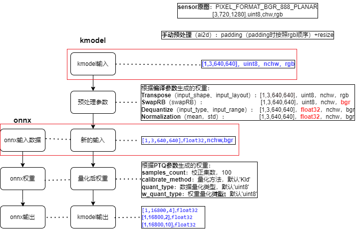

1.  **Transpose参数：**

```text
# 指定输入数据的shape，input_shape的layout需要与input layout保持一致
compile_options.input_shape = [1, 3, 640, 640]
# 当按照字符串（`"NHWC"`、`"NCHW"`）形式配置 `input_layout`时，表示新的输入数据的layout
compile_options.input_layout = "NCHW"
```

相关参数：

1.  input\_shape：输入数据的shape，input\_shape的layout需要与“input\_layout”保持一致；当 preprocess为 True时，必须指定。
2.  input\_layout：支持字符串（"NHWC"、"NCHW"）和index。当按照字符串（"NHWC"、"NCHW"）形式配置 “input\_layout”时，表示新的输入数据的layout；当按照index形式配置 “input\_layout”时，表示输入数据会按照当前配置的 “input\_layout”进行数据转置，即 “input\_layout”为 “Transpose”的 “perm”参数；**当 preprocess为 True时，必须指定**。
3.  分析说明（以字符串配置格式为例）：

新的输入layout与input\_layout一致；新的输入layout与onnx输入layout一致；因此input\_layout与onnx输入layout一致；

当input\_layout与kmodel输入layout一致时，kmodel输入经过transpose之后，生成的新的输入仍是与kmodel输入layout一致；

当input\_layout与kmodel输入layout不一致时，kmodel输入经过transpose之后，变成与input\_layout一致的新的输入。

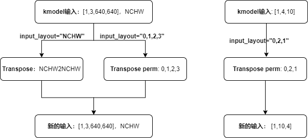

实际推理时，人脸检测onnx输入layout：“NCHW”，shape是\[1, 3, 640, 640\]，所以“input\_layout = "NCHW",input\_shape=\[1, 3, 640, 640\]”

1.  **SwapRB参数：**

```text
compile_options.swapRB = True
```

相关参数：

1.  swapRB：是否在“channel”维度反转数据，默认为False
2.  分析说明：

**实际推理时**，人脸检测kmodel输入：rgb、onnx输入（新的输入）：bgr，两者顺序不同，所以需要反转channel维度，故swapRB = True

1.  **Dequantize参数：**

```text
# 当preprocess为 True时，必须指定为"uint8"或者"float32"
compile_options.input_type = 'uint8'            
# input_type=‘uint8’时反量化有效，反量化之后的数据范围
compile_options.input_range = [0, 255]
```

相关参数：

1.  input\_type：与kmodel实际输入数据类型一致；**当 preprocess为 True时，必须指定为”uint8”或者”float32。**
2.  input\_range：指定输入数据反量化后的**浮点数范围**；**当 preprocess为 True且 input\_type为 uint8时，必须指定。**
3.  分析说明：

若kmodel input\_type为float32，不进行反量化

若kmodel input\_type为uint8，range为\[0,255\]，当input\_range为\[0,255\]时，则反量化的作用只是进行类型转化，将uint8的数据转化为float32

若kmodel input\_type为uint8，range为\[0,255\]，当input\_range为\[0,1\]，则反量化会将定点数转化为\[0.0,1.0\]的浮点数

**实际推理时**，人脸检测kmodel实际输入从sensor中获取，数据类型为uint8，所以input\_type = 'uint8',input\_range = \[0,255\]或\[0,1\]均可

1.  **Normalization参数：**

相关参数

1.  mean：预处理标准化参数均值，默认为\[0,0,0\]
2.  std：预处理标准化参数方差，默认为\[1,1,1\]

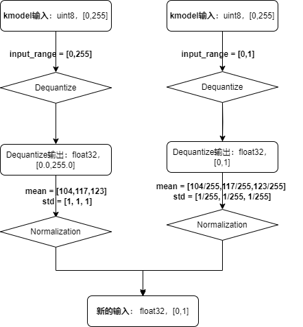

实际推理时，人脸检测onnx的“mean = \[104,117,123\],std = \[1, 1, 1\]”显然上图左边的设置更加简洁，人脸检测kmodel的input\_range = \[0,255\],mean = \[104,117,123\],std = \[1, 1, 1\]。

1.  **后处理参数：**

```text
# 后处理
compile_options.output_layout = "NCHW"
```

相关参数：

output\_layout：指定输出数据的layout, 如’NCHW’, ‘NHWC’，默认为“”，不进行transpose。

与预处理参数的input\_layout类似，若模型本身输出（oldKmodelOutput）的layout与output\_layout相同，则transpose之后，newKmodelOutput layout仍与oldKmodelOutput layout一致；若模型本身输出（oldKmodelOutput）的layout与output\_layout不同，则transpose之后，newKmodelOutput layout将变为与output\_layout一致。

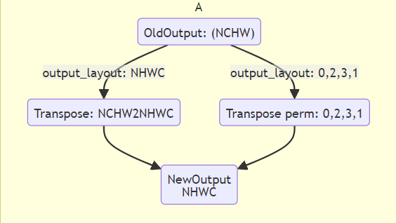

生成的人脸检测kmodel：

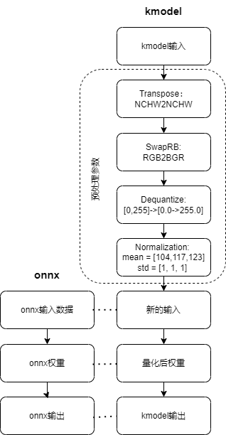

**1.2导入参数：ImportOptions**

ImportOptions类, 用于配置nncase导入选项，很少单独设置，使用默认参数即可。

```text
# 2. 设置导入参数，import_options（一般默认即可）
import_options = nncase.ImportOptions()
model_file = onnx_simplify(args.model, dump_dir)
model_content = read_model_file(model_file)
compiler.import_onnx(model_content, import_options)
```

**1.3训练后量化参数：PTQTensorOptions**

训练后量化参数(Post Training Quantization，PTQ)，PTQ是一种通过将模型权重从float32映射uint8或int16方法，保持模型的准确性的同时，减少推理所需的计算资源；当target = “k230”，PTQ是必选参数，默认uint8量化。

使用uint8量化可以满足人脸检测精度要求，故使用默认uint8量化；校正集个数为100；假设使用100个校正集生成kmodel的时间很久，可以适当的减少校正集。

```text
# 3. 设置训练后量化参数，ptq_options
ptq_options = nncase.PTQTensorOptions()
ptq_options.samples_count = 100
ptq_options.set_tensor_data(generate_data(input_shape, ptq_options.samples_count, args.dataset))
compiler.use_ptq(ptq_options)
```

**1.4校正集准备**

因为生成kmodel时，使用了后处理量化，因此需要准备校正集。使用少量校正集计算量化因子，可以快速得到量化模型。使用该量化模型进行预测，可在保证模型准确性的同时，减少计算量、降低计算内存、减小模型大小。

**校正集**一般选用**验证集**的**100张图片**即可，[人脸检测模型](https://github.com/biubug6/Pytorch_Retinaface)的**验证集**“WIDER\_val”\{，故选用“WIDER\_val”的100张图像作为校正集。

**注：**

1.  若是kmodel生成时间很久或者验证集数据很少，也可尝试少于100个数据
2.  “generate\_data”函数，生成的数据格式，需要**尽量保证**与实际推理时喂给kmodel的数据格式一致，否则会导致生成kmodel有问题。

```text
def generate_data(shape, batch, calib_dir):
  #获取所有校正集图片名称
  img_paths = [os.path.join(calib_dir, p) for p in os.listdir(calib_dir)]
  data = []
  for i in range(batch):
      assert i < len(img_paths), "calibration images not enough."
      #生成的数据需要做的预处理 ≈ onnx预处理 - 根据预处理参数设置的，包含在kmodel中预处理
      #onnx预处理：bgr,padding,reisze,transpose,normalization,dequantize,3维度转4维度
      #kmodel中包含的预处理：rgb->bgr,dequantize,normalization
      img_data = Image.open(img_paths[i]).convert('RGB')
      #为了省事，这里没有用padding
      img_data = img_data.resize((shape[3], shape[2]), Image.BILINEAR)  
      img_data = np.asarray(img_data, dtype=np.uint8)
      img_data = np.transpose(img_data, (2, 0, 1))
      data.append([img_data[np.newaxis, ...]])
  return np.array(data)
input_shape = [1, 3, 640, 640]
......
ptq_options = nncase.PTQTensorOptions()
  ptq_options.samples_count = 100
  # 校正集数据预处理，将原图处理为kmodel需要数据
  ptq_options.set_tensor_data(generate_data(input_shape, ptq_options.samples_count, args.dataset))
  # 使用100个校准数据计算量化因子
  compiler.use_ptq(ptq_options)
......
```

**1.5生成kmodel**

生成人脸检测kmodel完整代码示例： K230\_AI\_Demo\_Development\_Process\_Analysis/ kmodel\_related/kmodel\_export/face\_detection/mobile\_retinaface\_data\_100\_640.py

1.  **Kmodel模型转换执行步骤**
2.  在Ubuntu中新建终端，并进入k230\_SDK目录下


1.  激活Kmodel模型转换环境

```text
sudo docker run -u root -it -v $(pwd):$(pwd) -v $(pwd)/toolchain:/opt/toolchain -w $(pwd) ghcr.io/kendryte/k230_sdk /bin/bash
```


1.  进入kmodel转换程序源码目录

```text
cd src/reference/K230_AI_Demo_Development_Process_Analysis/kmodel_related/kmodel_export/
```

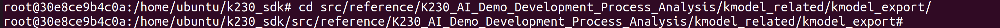

1.  拷贝转换后的ONNX模型文件至face\_detection/onnx/目录下。

```text
cp ../../../Pytorch_Retinaface/FaceDetector.onnx face_detection/onnx/
```

1.  安装nncase相关库

```text
pip install nncase==2.9.0
pip install nncase-kpu==2.9.0
```

1.  执行模型转换脚本

```text
./build_model.sh
```

等待其转换完成，转换完成后的kmodel文件会保存在目录下。

1.  查看生成的Kmodel模型文件

```text
ll k230_kmodel/face_detect_640.kmodel
```

文件格式如下所示：

```text
-rw-r--r-- 1 root root  715216 Feb 28 16:08 face_detect_640.kmodel     #人脸检测kmodel
```

**温馨提示**：生成kmodel时需要配置多个参数，正确理解和配置这些参数是确保成功生成kmodel的**关键**。我们深知参数配置的复杂性，但是为了给用户提供正确的参数配置，我们一次性提供了所有正确的配置，但对于不太熟悉kmodel生成的用户来说，仍然存在配置错误的可能性。错误的参数配置将导致生成的kmodel存在问题。

为了帮助大家更好地理解这一过程，建议尝试修改配置参数为不同值，观察生成的kmodel的变化和对最终推理结果的影响。通过这样的实践，可以更深入地理解各参数的作用和相互关系。这种方式将使用户更熟悉kmodel生成的流程，有助于更准确地配置参数以获得所需的结果。

## 使用K230Runtime进行验证

为了验证kmodel正确性，我们需要使用K230Runtime对kmodel进行推理，推理时保证读取图片、预处理、run、后处理、显示结果与onnx的对应流程一致。

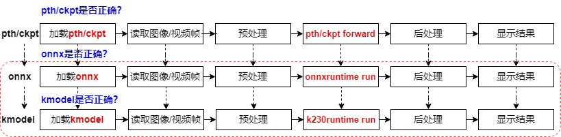

由于K230开发板调试起来比较复杂，因此我们提供一些辅助工具，并分享相关经验来帮助用户验证K230端推理的正确性。由于推理过程中，主要的部分是run、预处理、后处理，接下来我们分别对这3个部分调试的常用方法进行说明。

**run：**

Simulator：在PC端模拟kmodel在k230的推理过程，用于对比kmodel和onnx输出是否一致；

main\_nncase：在K230端推理kmodel，用于对比模拟推理kmodel与实际推理kmodel结果是否一致；

若是两者都没有问题，则说明生成kmodel是正确的。

**预处理：**

原图预处理之后，dump预处理后的图像，查看预处理是否正确。

**后处理：**

在Simulator正确的情况下，将Simulator输出bin文件作为kmodel输出，喂给后处理，看后处理结果是否与ONNX后处理结果是否一致。

1.  **Simulator验证kmodel**

Simulator：在PC端模拟kmodel在k230的推理过程，用于对比kmodel和onnx输出是否一致；

**1.1 生成input.bin**

在使用Simulator验证kmodel之前，需要先准备好输入文件。由于kmodel包括部分预处理，因此对于同一张图片，需要分别利用不同预处理生成onnx\_input.bin、kmodel\_input.bin。

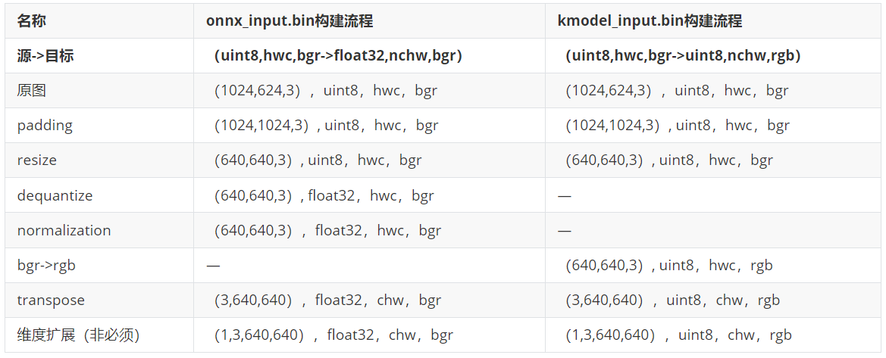

**注**：由于生成的kmodel中包含部分预处理，生成kmodel\_input.bin需要的预处理 ≈ 生成onnx\_input.bin需要的预处理 - kmodel中包含的预处理（人脸检测kmodel中预处理transpose、dequantize、normalization、swapRB）

1.  维度扩展可以省略（读取时bin文件可以用reshape，生成bin时可以省略）。
2.  kmodel\_input.bin为什么无需进行dequantize、normalization操作？dequantize、normalization已放到kmodel中。
3.  为什么需要生成kmodel\_input.bin需要bgr->rgb？生成人脸检测kmode时，由于实际需要，预处理打开了swapRB开关，用于rgb->bgr，对应的，生成kmodel\_input.bin时，则需要先将数据转成rgb顺序；
4.  transpose也放到kmodel中，为什么生成kmodel\_input.bin仍需transpose？由于生成kmodel，若是打开了预处理开关，transpose的相关参数必须设置，我们人脸检测kmodel的实际输入是\`NCHW\`，input\_layout设置为\`NCHW\`，两者是一致的，因此transpose是NCHW2NCHW，实际上并没有转换。

**生成input.bin的过程：**（放在onnx推理的预处理方法中）

代码位置：

```text
k230_sdk/src/reference/K230_AI_Demo_Development_Process_Analysis/onnx_related/onnx_inference/face_detection/face_detector.py
```


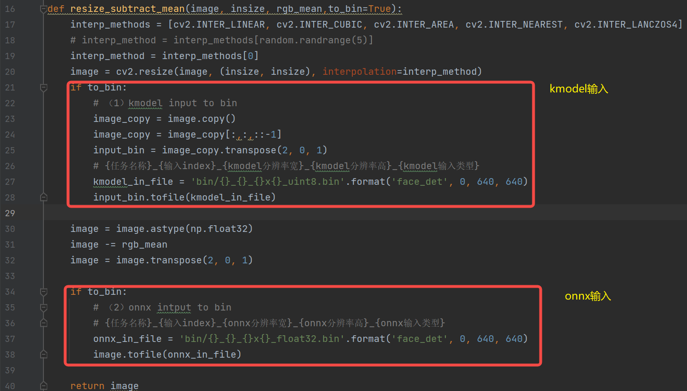

**1.2 Simulator验证**

对于同一张图片，分别利用不同预处理生成不同的onnx\_input.bin、kmodel\_input.bin，

1.  将onnx\_input.bin喂给onnx，经过onnx推理得cpu\_results；
2.  将kmodel\_input.bin喂给kmodel，经过Simulator推理得到nncase\_results；
3.  计算cpu\_results和nncase\_results的余弦相似度，通过相似度的大小来判断生成的kmodel是否正确。

```text
# mobile_retinaface_onnx_simu_640.py
import os
import copy
import argparse
import numpy as np
import onnx
import onnxruntime as ort
import nncase
def read_model_file(model_file):
with open(model_file, 'rb') as f:
    model_content = f.read()
return model_content
def cosine(gt, pred):
return (gt @ pred) / (np.linalg.norm(gt, 2) * np.linalg.norm(pred, 2))
def main():
parser = argparse.ArgumentParser(prog="nncase")
parser.add_argument("--target", type=str, help='target to run')
parser.add_argument("--model", type=str, help='original model file')
parser.add_argument("--model_input", type=str, help='input bin file for original model')
parser.add_argument("--kmodel", type=str, help='kmodel file')
parser.add_argument("--kmodel_input", type=str, help='input bin file for kmodel')
args = parser.parse_args()
# 1. onnx推理，得到cpu_results
ort_session = ort.InferenceSession(args.model)
output_names = []
model_outputs = ort_session.get_outputs()
for i in range(len(model_outputs)):
    output_names.append(model_outputs[i].name)
model_input = ort_session.get_inputs()[0]
  
model_input_name = model_input.name
model_input_type = np.float32
model_input_shape = model_input.shape
print('onnx_input：',model_input_shape)
model_input_data = np.fromfile(args.model_input, model_input_type).reshape(model_input_shape)
cpu_results = []
cpu_results = ort_session.run(output_names, { model_input_name : model_input_data })
# 2. Simulator推理，得到nncase_results
# create Simulator
sim = nncase.Simulator()
# read kmodel
kmodel = read_model_file(args.kmodel)
# load kmodel
sim.load_model(kmodel)
# read input.bin
input_shape = [1, 3, 640, 640]
dtype = sim.get_input_desc(0).dtype
input = np.fromfile(args.kmodel_input, dtype).reshape(input_shape)
# set input for Simulator
sim.set_input_tensor(0, nncase.RuntimeTensor.from_numpy(input))
# Simulator inference
nncase_results = []
sim.run()
for i in range(sim.outputs_size):
    nncase_result = sim.get_output_tensor(i).to_numpy()
    # print("nncase_result:",nncase_result)
input_bin_file = 'bin/face_det_{}_{}_simu.bin'.format(i,args.target)
    nncase_result.tofile(input_bin_file)
    nncase_results.append(copy.deepcopy(nncase_result))
# 3. 计算onnx和Simulator相似度
for i in range(sim.outputs_size):
    cos = cosine(np.reshape(nncase_results[i], (-1)), np.reshape(cpu_results[i], (-1)))
    print('output {0} cosine similarity : {1}'.format(i, cos))
if __name__ == '__main__':
main()
```

 -
上边的脚本可以满足大部分onnx及其kmodel的对比验证，一般不用太多修改。只需根据模型实际输入大小修改\`input\_shape\`即可。

1.  **Simulator验证kmodel执行步骤**

注意：若已经激活Kmodel模型转换环境，请忽略步骤①和步骤②。

①在Ubuntu中新建终端，并进入k230\_SDK目录下


②激活Kmodel模型转换环境

```text
sudo docker run -u root -it -v $(pwd):$(pwd) -v $(pwd)/toolchain:/opt/toolchain -w $(pwd) ghcr.io/kendryte/k230_sdk /bin/bash
```


③进入kmodel转换程序源码目录

```text
cd src/reference/K230_AI_Demo_Development_Process_Analysis/kmodel_related/kmodel_export/
```


④进入人脸检测kmodel模型验证源码目录

```text
cd face_detection/
```

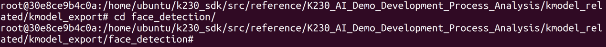

⑤ 拷贝生成的kmodel模型至onnx目录下

```text
cp ../k230_kmodel/face_detect_640.kmodel onnx/
```

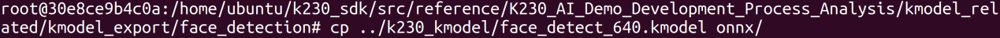

⑥ 安装nncase和onnx相关库

```text
pip install nncase==2.9.0
pip install nncase-kpu==2.9.0pip install onnx==1.17.0
pip install onnxruntime==1.16.3
pip install onnxsim==0.4.36
```

⑦增加环境变量

```text
export NNCASE_PLUGIN_PATH=$NNCASE_PLUGIN_PATH:/usr/local/lib/python3.8/dist-packages/
export PATH=$PATH:/usr/local/lib/python3.8/dist-packages/
source /etc/profile
```

⑧拷贝onnx推理时生成的bin当当前目录下

```text
cp ../../../onnx_related/onnx_inference/face_detection/bin/* bin/
python mobile_retinaface_onnx_simu_640.py \
    --target k230 --model onnx/FaceDetector.onnx \
    --model_input bin/face_det_0_640x640_float32.bin \
    --kmodel onnx/face_detect_640.kmodel \
    --kmodel_input bin/face_det_0_640x640_uint8.bin
```

⑨执行效果如下所示：

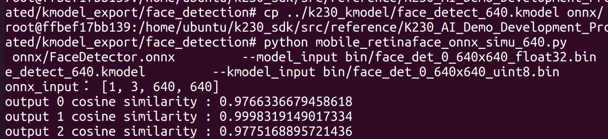

onnx和Simulator余弦相似度越高越好，一般0.99以上即可满足条件；若是达不到0.99，但是在0.95以上，可以通过进一步**上板验证**来判断生成的kmodel是否满足实际需求。

1.  **使用K230验证kmodel**

Simulator推理kmodel和上板推理kmodel一般来说是一致的，但是不排除个别情况下Simulator与实际上板仍有一定差异，为了验证两者是否一致，需要使用main\_nncase工具辅助验证Simulator推理kmodel与实际推理kmodel结果是否一致；使用这个工具需要调用nncase的KPU运行时APIs(C++)。

**main\_nncase验证流程**（对K230的KPU调用有个大概的印象）：

1.  加载kmodel
2.  设置kmodel输入：读取kmodel\_input.bin文件
3.  设置kmodel输出
4.  推理kmodel
5.  获取kmodel输出
6.  对比Simulator推理kmodel、上板推理kmodel结果相似性

**注：**main\_nncase工具可以适配所有kmodel的验证，无需自己修改。只需执行时，修改命令行的对应参数即可。

```text
//main_nncase.cc
#include <chrono>
#include <fstream>
#include <iostream>
#include <nncase/runtime/runtime_tensor.h>
#include <nncase/runtime/interpreter.h>
#include <nncase/runtime/runtime_op_utility.h>
using namespace nncase;
using namespace nncase::runtime;
using namespace nncase::runtime::detail;
#define USE_CACHE 1
template <class T>
std::vector<T> read_binary_file(const char *file_name)
{
std::ifstream ifs(file_name, std::ios::binary);
ifs.seekg(0, ifs.end);
size_t len = ifs.tellg();
std::vector<T> vec(len / sizeof(T), 0);
ifs.seekg(0, ifs.beg);
ifs.read(reinterpret_cast<char *>(vec.data()), len);
ifs.close();
return vec;
}
void read_binary_file(const char *file_name, char *buffer)
{
std::ifstream ifs(file_name, std::ios::binary);
ifs.seekg(0, ifs.end);
size_t len = ifs.tellg();
ifs.seekg(0, ifs.beg);
ifs.read(buffer, len);
ifs.close();
}
template <typename T>
double dot(const T *v1, const T *v2, size_t size)
{
double ret = 0.f;
for (size_t i = 0; i < size; i++)
{
    ret += v1[i] * v2[i];
}
    return ret;
}
template <typename T>
double cosine(const T *v1, const T *v2, size_t size)
{
return dot(v1, v2, size) / ((sqrt(dot(v1, v1, size)) * sqrt(dot(v2, v2, size))));
}
void dump(const std::string &info, volatile float *p, size_t size)
{
std::cout << info << " dump: p = " << std::hex << (void *)p << std::dec << ", size = " << size << std::endl;
volatile unsigned int *q = reinterpret_cast<volatile unsigned int *>(p);
for (size_t i = 0; i < size; i++)
{
    if ((i != 0) && (i % 4 == 0))
    {
        std::cout << std::endl;
    }
    std::cout << std::hex << q[i] << " ";
}
std::cout << std::dec << std::endl;
}
int main(int argc, char *argv[])
{
std::cout << "case " << argv[0] << " build " << __DATE__ << " " << __TIME__ << std::endl;
if (argc < 4)
{
    std::cerr << "Usage: " << argv[0] << " <kmodel> <input_0.bin> <input_1.bin> ... <input_N.bin> <output_0.bin> <output_1.bin> ... <output_N.bin>" << std::endl;
    return -1;
}
interpreter interp;                             
// 1. load model
std::ifstream in_before_load_kmodel("/proc/media-mem");
std::string line_before_load_kmodel;
// 逐行读取文件内容，查看MMZ使用情况
while (std::getline(in_before_load_kmodel, line_before_load_kmodel)) { 
    std::cout << line_before_load_kmodel << std::endl;
}
std::ifstream ifs(argv[1], std::ios::binary);
interp.load_model(ifs).expect("Invalid kmodel");
std::ifstream in_after_load_kmodel("/proc/media-mem");
std::string line_after_load_kmodel;
// 逐行读取文件内容，查看MMZ使用情况
while (std::getline(in_after_load_kmodel, line_after_load_kmodel)) {  
    std::cout << line_after_load_kmodel << std::endl;  
}
// 2. set inputs
for (size_t i = 2, j = 0; i < 2 + interp.inputs_size(); i++, j++)
{
    auto desc = interp.input_desc(j);
    auto shape = interp.input_shape(j);
    auto tensor = host_runtime_tensor::create(desc.datatype, shape, hrt::pool_shared).expect("cannot create input tensor");
    auto mapped_buf = std::move(hrt::map(tensor, map_access_::map_write).unwrap());
#if USE_CACHE
        read_binary_file(argv[i], reinterpret_cast<char *>(mapped_buf.buffer().data()));
#else
    auto vec = read_binary_file<unsigned char>(argv[i]);
    memcpy(reinterpret_cast<void *>(mapped_buf.buffer().data()), reinterpret_cast<void *>(vec.data()), vec.size());
    // dump("app dump input vector", (volatile float *)vec.data(), 32);
#endif
    auto ret = mapped_buf.unmap();
    ret = hrt::sync(tensor, sync_op_t::sync_write_back, true);
    if (!ret.is_ok())
    {
        std::cerr << "hrt::sync failed" << std::endl;
        std::abort();
    }
    // dump("app dump input block", (volatile float *)block.virtual_address, 32);
    interp.input_tensor(j, tensor).expect("cannot set input tensor");
}
// 3. set outputs
for (size_t i = 0; i < interp.outputs_size(); i++)
{
    auto desc = interp.output_desc(i);
    auto shape = interp.output_shape(i);
    auto tensor = host_runtime_tensor::create(desc.datatype, shape, hrt::pool_shared).expect("cannot create output tensor");
    interp.output_tensor(i, tensor).expect("cannot set output tensor");
}
// 4. run
auto start = std::chrono::steady_clock::now();
interp.run().expect("error occurred in running model");
auto stop = std::chrono::steady_clock::now();
double duration = std::chrono::duration<double, std::milli>(stop - start).count();
std::cout << "interp run: " << duration << " ms, fps = " << 1000 / duration << std::endl;
// 5. get outputs
for (int i = 2 + interp.inputs_size(), j = 0; i < argc; i++, j++)
{
    auto out = interp.output_tensor(j).expect("cannot get output tensor");
    auto mapped_buf = std::move(hrt::map(out, map_access_::map_read).unwrap());
    auto expected = read_binary_file<unsigned char>(argv[i]);
    // 6. compare
    int ret = memcmp((void *)mapped_buf.buffer().data(), (void *)expected.data(), expected.size());
    if (!ret)
    {
        std::cout << "compare output " << j << " Pass!" << std::endl;
    }
    else
    {
        auto cos = cosine((const float *)mapped_buf.buffer().data(), (const float *)expected.data(), expected.size()/sizeof(float));
        std::cerr << "compare output " << j << " Fail: cosine similarity = " << cos << std::endl;
    }
}
return 0;
}
```

**注意：**源码位于

k230\_sdk/src/reference/K230\_AI\_Demo\_Development\_Process\_Analysis/kmodel\_related/kmodel\_inference/main\_nncase目录下。

1.  **使用K230验证Kmodel执行步骤**

**注意：**若已经激活Kmodel模型转换环境，请忽略步骤①和步骤②。

1.  在Ubuntu中新建终端，并进入k230\_SDK目录下

```text
cd k230_sdk/
```


1.  激活Kmodel模型转换环境

```text
sudo docker run -u root -it -v $(pwd):$(pwd) -v $(pwd)/toolchain:/opt/toolchain -w $(pwd) ghcr.io/kendryte/k230_sdk /bin/bash
```


1.  进入kmodel推理程序源码目录

```text
cd src/reference/K230_AI_Demo_Development_Process_Analysis/kmodel_related/kmodel_inference/
```

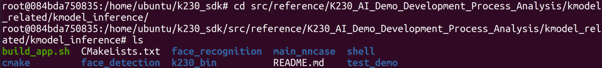

1.  安装nncase和onnx相关库

```text
pip install nncase==2.9.0
pip install nncase-kpu==2.9.0
```

1.  执行脚本编译程序

```text
./build_app.sh debug
```

**注意：**该脚本会自动编译main\_nncase目录下的程序。

1.  进入可执行文件夹目录，查看编译出来的程序

```text
cd k230_bin/debug/
```

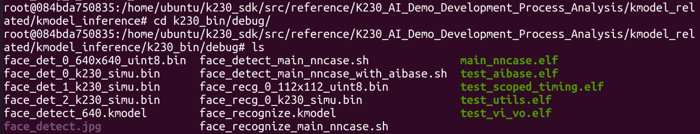

可执行文件中的内容：

```text
k230_bin├── debug            #调试用到的文件│   ├── face_det_0_640x640_uint8.bin    #人脸检测kmodel输入文件│   ├── face_det_0_k230_simu.bin        #人脸检测simulator第1个输出文件│   ├── face_det_1_k230_simu.bin        #人脸检测simulator第2个输出文件│   ├── face_det_2_k230_simu.bin        #人脸检测simulator第3个输出文件│   ├── face_detect_640.kmodel          #人脸检测kmodel│   ├── face_detect.jpg                 #人脸检测基于图像推理时的输入图像│   ├── face_detect_main_nncase.sh      #人脸检测kmodel上板验证运行脚本│   ├── face_detect_main_nncase_with_aibase.sh #人脸检测kmodel上板验证运行脚本│   ├── face_recg_0_112x112_uint8.bin│   ├── face_recg_0_k230_simu.bin│   ├── face_recognize.kmodel│   ├── face_recognize_main_nncase.sh│   ├── main_nncase.elf                 #人脸检测kmodel上板验证可执行文件│   ├── test_aibase.elf                 #test_aibase demo生成可执行文件│   ├── test_scoped_timing.elf          #test_scoped_timing demo生成可执行文件
```

1.  退出docker环境

```text
exit
```

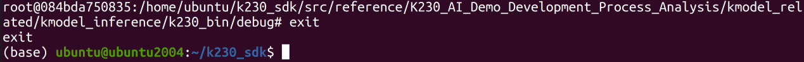

1.  参考文件传输章节，使用两条Type-C数据线连接至PC电脑，并等待开发板启动并将ADB设备连接至Ubuntu虚拟机。
2.  进入可执行文件目录

```text
cd src/reference/K230_AI_Demo_Development_Process_Analysis/kmodel_related/kmodel_inference/k230_bin/
```

1.  使用adb将可执行程序传输至开发板端

```text
adb push debug/ /sharefs
```

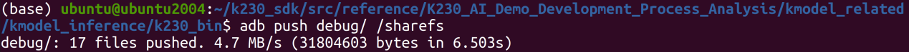

1.  打开开发板的串口B ，访问rt-smart大核系统的串口。由于rt-smart系统有开机自启程序，可输入q + 回车键结束开机自启程序。

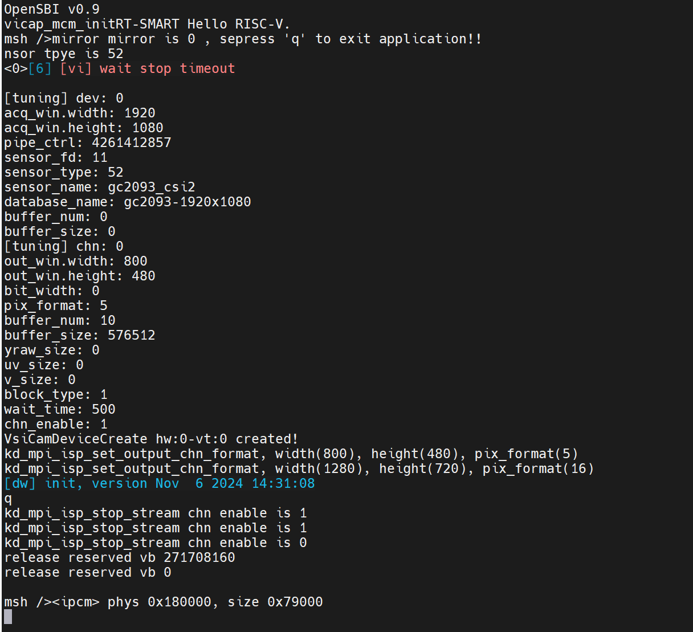

结束程序之后，可多按几次回车键，进入rt-smart命令行控制终端。

1.  进入可执行文件目录

```text
cd /sharefs/debug/
```

1.  执行可执行程序

```text
./main_nncase.elf face_detect_640.kmodel face_det_0_640x640_uint8.bin face_det_0_k230_simu.bin face_det_1_k230_simu.bin face_det_2_k230_simu.bin
```

您也可以执行脚本face\_detect\_main\_nncase.sh，该脚本包含了上面的整个命令

```text
./face_detect_main_nncase.sh
```

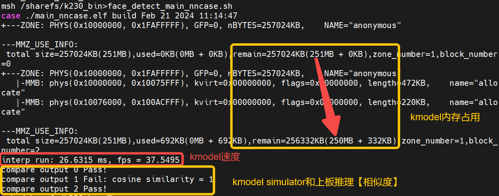

通过执行结果，可以发现：

1.  人脸检测kmodel**内存**：大概占用1M左右
2.  人脸检测kmodel**推理速度**：26.6ms
3.  人脸检测Simulator和上板推理相似度：输出0,2 pass，byte级别完全一致；输出1 fail，float级别余弦相似度为1。一般0.99以上即可以满足要求

人脸检测simulator结果大致满足要求，main\_nncase的结果也满足要求，因此生成的人脸检测kmodel大概率是没有问题的。

## 使用K230Runtime进行推理

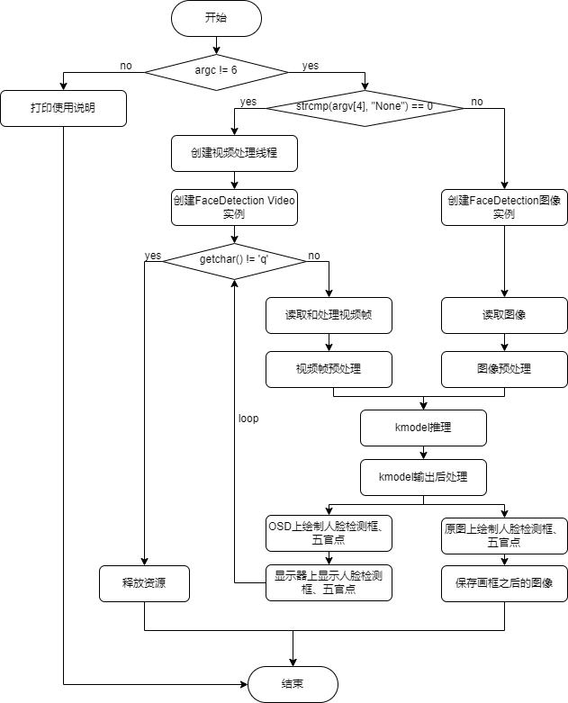

代码位置：

K230\_AI\_Demo\_Development\_Process\_Analysis\\kmodel\_related\\kmodel\_inference\\face\_detection

```text
├── ai_base.cc                  #AI基类，封装KPU(K230)运行时API，简化kmodel相关操作
├── ai_base.h
├── anchors_640.cc              #人脸检测640分辨率输入对应anchor
├── CMakeLists.txt
├── face_detection.cc           #人脸检测demo，预处理，kmodel推理、后处理
├── face_detection.h
├── main.cc                     #人脸检测demo主流程
├── README.md
├── scoped_timing.hpp           #计时类
├── utils.cc                    #工具类，封装常用函数及AI2D运行时APIs，简化预处理操作
├── utils.h
└── vi_vo.h                     #封装sensor、display操作
```

使用K230Runtime推理kmodel需要详细了解K230Runtime的说明文档，为了简化推理流程，对K230Runtime的接口进行封装，其中\`ai\_base.cc、scoped\_timing.hpp、utils.cc、vi\_vo.h\`是封装好的方法，无需修改；对于不同模型，用户无需关心K230Runtime相关操作，只需将\`face\_detection.cc\`、\`main.cc\`拷贝一份，只修改对应构造函数、预处理（pre\_process）、后处理（post\_process）即可。

1.  **读取图像或视频帧**

1.1 读取图片或视频帧

（1）读取图片

```text
cv::Mat ori_img = cv::imread(xxx);
```

（2）**读取视频帧**

**背景知识：**

**vi\_vo.h简介**：vi\_vo.h主要封装了视频输入、视频输出相关配置。我们根据vi\_vo.h构建了test\_vi\_vo示例，示例中讲解了如何使用vi，vo部分。

vi：视频输入，与sensor相关，详细介绍见[K230\_VICAP\_API参考.md](https://github.com/kendryte/k230_docs/blob/main/zh/01_software/board/mpp/K230_VICAP_API参考.md)、[K230\_VICAP\_SENSOR\_参数分区参考.md](https://github.com/kendryte/k230_docs/blob/main/zh/01_software/board/mpp/K230_VICAP_SENSOR_参数分区参考.md)、[K230\_Camera\_Sensor适配指南.md](https://github.com/kendryte/k230_docs/blob/main/zh/01_software/board/mpp/K230_Camera_Sensor适配指南.md)。

1.  sensor启动
2.  从sensor中dump一帧数据
3.  将sensor中数据保存为png
4.  释放sensor当前帧
5.  sensor停止

vo：视频输出，与display相关，详细介绍见[K230\_视频输出\_API参考.md](https://github.com/kendryte/k230_docs/blob/main/zh/01_software/board/mpp/K230_视频输出_API参考.md)

1.  框或文字画到cv::Mat，并插入到vo osd对应通道中
2.  释放osd block

读取视频帧示例： K230\_AI\_Demo\_Development\_Process\_Analysis/ kmodel\_related/kmodel\_inference/test\_demo/test\_vi\_vo

1.  **图像预处理**

**背景知识：**

1.  Uitls简介：Uitls主要封装了常用函数、nncase AI2D相关操作，AI2D相关部分包括Affine、Crop、Resize、Padding预处理操作，可以加速图像的预处理操作。
2.  预处理示例： K230\_AI\_Demo\_Development\_Process\_Analysis/ /kmodel\_related/kmodel\_inference/test\_demo/test\_utils

**人脸检测预处理：**

**背景知识：**参数不变的情况下，ai2d\_builder\_可以反复调用；参数改变则需要创建新的ai2d\_builder\_。

对于图像预处理：由于不同图像的尺寸不同，对于padding\_resize方法来说，AI2D的参数每次都会改变，需要重新调用Utils::padding\_resize\_one\_side创建新的ai2d\_builder\_来进行预处理。


对于视频流预处理：由于不同帧的尺寸相同，padding的数值也未改变；故对于padding\_resize方法来说，AI2D的参数一直不变，将新一帧的图像拷贝给ai2d\_in\_tensor\_后，只需ai2d\_builder\_->invoke（人脸构造函数中已经构造好ai2d\_builder\_）调用。

1.  **kmodel端侧模型推理**

**背景知识：**

1.  **AIBase简介：**AIBase主要封装了KPU相关操作，包括在AI设备（如k230）加载kmodel，设置kmodel输入数据，执行kpu/cpu计算， 获取kmodel输出数据等，AIBase的封装简化了KPU调用过程。
2.  **kmodel推理示例**（main\_nncase修改为基于AIBase类的demo）：K230\_AI\_Demo\_Development\_Process\_Analysis\\kmodel\_related\\kmodel\_inference\\test\_demo\\test\_aibase。

人脸检测kmode推理：

```text
//ai_base.cc
void AIBase::run()
{
ScopedTiming st(model_name_ + " run", debug_mode_);
kmodel_interp_.run().expect("error occurred in running model");
}
void AIBase::get_output()
{
ScopedTiming st(model_name_ + " get_output", debug_mode_);
p_outputs_.clear();
for (int i = 0; i < kmodel_interp_.outputs_size(); i++)
{
    auto out = kmodel_interp_.output_tensor(i).expect("cannot get output tensor");
    auto buf = out.impl()->to_host().unwrap()->buffer().as_host().unwrap().map(map_access_::map_read).unwrap().buffer();
    float *p_out = reinterpret_cast<float *>(buf.data());
    p_outputs_.push_back(p_out);
}
}
//face_detection.cc
void FaceDetection::inference()
{
this->run();
this->get_output();
}
//main.cc，验证kmodel推理是否正确：我们使用simulator和main_nncase已经验证过
......
FaceDetection fd;
fd.inference();
......
```

1.  **推理结果后处理**

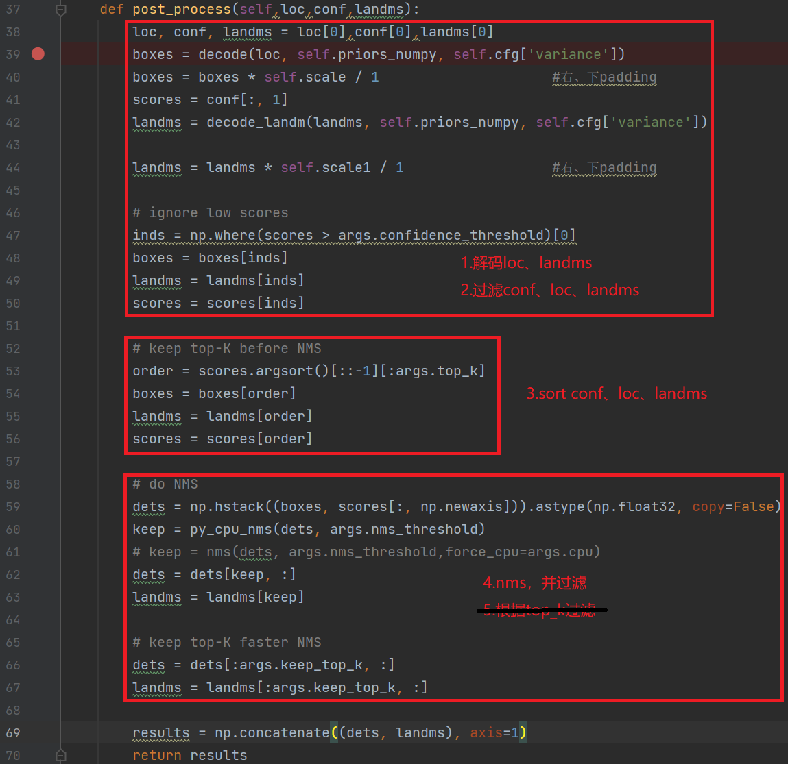

**c++后处理（详情见代码）：**

```text
//face_detection.cc
void FaceDetection::post_process(FrameSize frame_size, vector<FaceDetectionInfo> &results)
{
ScopedTiming st(model_name_ + " post_process", debug_mode_);
if (debug_mode_ > 3)
{
    //验证后处理流程是否正确：排除预处理、模型推理，直接拿Simulator kmodel数据，判断后处理代码正确性。
    ......
}
else
{
    filter_confs(p_outputs_[1]);
    filter_locs(p_outputs_[0]);
    filter_landms(p_outputs_[2]);
}
std::sort(confs_.begin(), confs_.end(), nms_comparator);
nms(results);
transform_result_to_src_size(frame_size, results);
}
```

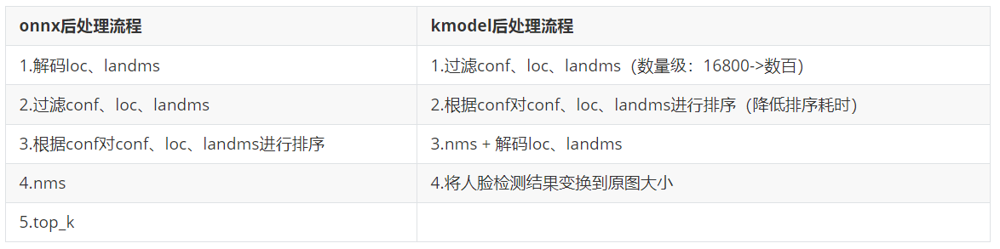

调整顺序之后的kmodel推理流程，更适合c++代码。

**人脸检测后处理代码：**

```text
//face_detection.cc
void FaceDetection::post_process(FrameSize frame_size, vector<FaceDetectionInfo> &results)
{
ScopedTiming st(model_name_ + " post_process", debug_mode_);
if (debug_mode_ > 2)
{
    //验证后处理流程是否正确：排除预处理、模型推理，直接拿Simulator kmodel数据，判断后处理代码正确性。
    vector<float> out0 = Utils::read_binary_file<float>("../debug/face_det_0_k230_simu.bin");
    vector<float> out1 = Utils::read_binary_file<float>("../debug/face_det_1_k230_simu.bin");
    vector<float> out2 = Utils::read_binary_file<float>("../debug/face_det_2_k230_simu.bin");
    filter_confs(out1.data());
    filter_locs(out0.data());
    filter_landms(out2.data());
}
else
{
    filter_confs(p_outputs_[1]);
    filter_locs(p_outputs_[0]);
    filter_landms(p_outputs_[2]);
}
std::sort(confs_.begin(), confs_.end(), nms_comparator);
nms(results);
transform_result_to_src_size(frame_size, results);
}
/********************根据检测阈值kmodel数据结果***********************/
void FaceDetection::filter_confs(float *conf)
{
NMSRoiObj inter_obj;
confs_.clear();
for (uint32_t roi_index = 0; roi_index < objs_num_; roi_index++)
{
    float score = conf[roi_index * CONF_SIZE + 1];
    if (score > obj_thresh_)
    {
        inter_obj.ori_roi_index = roi_index;
        inter_obj.before_sort_conf_index = confs_.size();
        inter_obj.confidence = score;
        confs_.push_back(inter_obj);
    }
}
}
void FaceDetection::filter_locs(float *loc)
{
boxes_.clear();
boxes_.resize(confs_.size());
int roi_index = 0;
for (uint32_t conf_index = 0; conf_index < boxes_.size(); conf_index++)
{
    roi_index = confs_[conf_index].ori_roi_index;
    int start = roi_index * LOC_SIZE;
    for (int i = 0; i < LOC_SIZE; ++i)
    {
        boxes_[conf_index][i] = loc[start + i];
    }
}
}
void FaceDetection::filter_landms(float *landms)
{
landmarks_.clear();
landmarks_.resize(confs_.size());
int roi_index = 0;
for (uint32_t conf_index = 0; conf_index < boxes_.size(); conf_index++)
{
    roi_index = confs_[conf_index].ori_roi_index;
    int start = roi_index * LAND_SIZE;
    for (int i = 0; i < LAND_SIZE; ++i)
    {
        landmarks_[conf_index][i] = landms[start + i];
    }
}
}
/********************根据anchor解码检测框、五官点***********************/
Bbox FaceDetection::decode_box(int obj_index)
{
float cx, cy, w, h;
int box_index = confs_[obj_index].before_sort_conf_index;
int anchor_index = confs_[obj_index].ori_roi_index;
cx = boxes_[box_index][0];
cy = boxes_[box_index][1];
w = boxes_[box_index][2];
h = boxes_[box_index][3];
cx = g_anchors[anchor_index][0] + cx * 0.1 * g_anchors[anchor_index][2];
cy = g_anchors[anchor_index][1] + cy * 0.1 * g_anchors[anchor_index][3];
w = g_anchors[anchor_index][2] * std::exp(w * 0.2);
h = g_anchors[anchor_index][3] * std::exp(h * 0.2);
Bbox box;
box.x = cx - w / 2;
box.y = cy - h / 2;
box.w = w;
box.h = h;
return box;
}
SparseLandmarks FaceDetection::decode_landmark(int obj_index)
{
SparseLandmarks landmark;
int landm_index = confs_[obj_index].before_sort_conf_index;
int anchor_index = confs_[obj_index].ori_roi_index;
for (uint32_t ll = 0; ll < 5; ll++)
{
    landmark.points[2 * ll + 0] = g_anchors[anchor_index][0] + landmarks_[landm_index][2 * ll + 0] * 0.1 * g_anchors[anchor_index][2];
    landmark.points[2 * ll + 1] = g_anchors[anchor_index][1] + landmarks_[landm_index][2 * ll + 1] * 0.1 * g_anchors[anchor_index][3];
}
return landmark;
}
/********************iou计算***********************/
float FaceDetection::overlap(float x1, float w1, float x2, float w2)
{
float l1 = x1 - w1 / 2;
float l2 = x2 - w2 / 2;
float left = l1 > l2 ? l1 : l2;
float r1 = x1 + w1 / 2;
float r2 = x2 + w2 / 2;
float right = r1 < r2 ? r1 : r2;
return right - left;
}
float FaceDetection::box_intersection(Bbox a, Bbox b)
{
float w = overlap(a.x, a.w, b.x, b.w);
float h = overlap(a.y, a.h, b.y, b.h);
if (w < 0 || h < 0)
    return 0;
return w * h;
}
float FaceDetection::box_union(Bbox a, Bbox b)
{
float i = box_intersection(a, b);
float u = a.w * a.h + b.w * b.h - i;
return u;
}
float FaceDetection::box_iou(Bbox a, Bbox b)
{
return box_intersection(a, b) / box_union(a, b);
}
/********************nms***********************/
void FaceDetection::nms(vector<FaceDetectionInfo> &results)
{
// nms
for (int conf_index = 0; conf_index < confs_.size(); ++conf_index)
{
    if (confs_[conf_index].confidence < 0)
        continue;
    FaceDetectionInfo obj;
    obj.bbox = decode_box(conf_index);
    obj.sparse_kps = decode_landmark(conf_index);
    obj.score = confs_[conf_index].confidence;
    results.push_back(obj);
    for (int j = conf_index + 1; j < confs_.size(); ++j)
    {
        if (confs_[j].confidence < 0)
            continue;
        Bbox b = decode_box(j);
        if (box_iou(obj.bbox, b) >= nms_thresh_) // iou大于nms阈值的，之后循环将会忽略
            confs_[j].confidence = -1;
    }
}
}
/********************将人脸检测结果变换到原图***********************/
void FaceDetection::transform_result_to_src_size(FrameSize &frame_size, vector<FaceDetectionInfo> &results)
{
// transform result to dispaly size
int max_src_size = std::max(frame_size.width, frame_size.height);
for (int i = 0; i < results.size(); ++i)
{
    auto &l = results[i].sparse_kps;
    for (uint32_t ll = 0; ll < 5; ll++)
    {
        l.points[2 * ll + 0] = l.points[2 * ll + 0] * max_src_size;
        l.points[2 * ll + 1] = l.points[2 * ll + 1] * max_src_size;
    }
    auto &b = results[i].bbox;
    float x0 = b.x * max_src_size;
    float x1 = (b.x + b.w) * max_src_size;
    float y0 = b.y * max_src_size;
    float y1 = (b.y + b.h) * max_src_size;
    x0 = std::max(float(0), std::min(x0, float(frame_size.width)));
    x1 = std::max(float(0), std::min(x1, float(frame_size.width)));
    y0 = std::max(float(0), std::min(y0, float(frame_size.height)));
    y1 = std::max(float(0), std::min(y1, float(frame_size.height)));
    b.x = x0;
    b.y = y0;
    b.w = x1 - x0;
    b.h = y1 - y0;
}
}
```

**扩展：**

检测后处理写起来比价复杂，因此对于常见的检测模型，我们给出了一些示例代码。

1.  \- **retinaface**：[人脸检测post\_process](https://github.com/kendryte/k230_sdk/blob/main/src/reference/ai_poc/face_detection/face_detection.cc)
2.  \- **yolov5**：[摔倒检测post\_process](https://github.com/kendryte/k230_sdk/blob/main/src/reference/ai_poc/falldown_detect/falldown_detect.cc)
3.  \- **yolov8**：[人头检测post\_process](https://github.com/kendryte/k230_sdk/blob/main/src/reference/ai_poc/head_detection/head_detection.cc)
4.  **显示结果**

**显示结果示例：**K230\_AI\_Demo\_Development\_Process\_Analysis\\kmodel\_related\\kmodel\_inference\\test\_demo\\test\_vi\_vo

1.  **执行步骤**

**注意：**若已经激活Kmodel模型转换环境，请忽略步骤①和步骤②。

1.  在Ubuntu中新建终端，并进入k230\_SDK目录下

```text
cd k230_sdk/
```


1.  激活Kmodel模型转换环境

```text
sudo docker run -u root -it -v $(pwd):$(pwd) -v $(pwd)/toolchain:/opt/toolchain -w $(pwd) ghcr.io/kendryte/k230_sdk /bin/bash
```

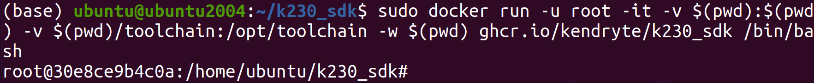

1.  进入kmodel推理程序源码目录

```text
cd src/reference/K230_AI_Demo_Development_Process_Analysis/kmodel_related/kmodel_inference/
```

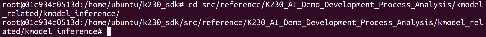

1.  执行编译脚本

```text
./build_app.sh
```

编译完成后，可在k230\_bin/face\_detect目录下看到可执行程序与配套测试文件。

1.  退出docker环境

```text
exit
```


1.  进入可执行文件目录并使用adb将编译出来的程序、模型、测试图像传输至开发板端

```text
cd src/reference/K230_AI_Demo_Development_Process_Analysis/kmodel_related/kmodel_inference/k230_bin/
sudo adb push face_detect/ /sharefs
```

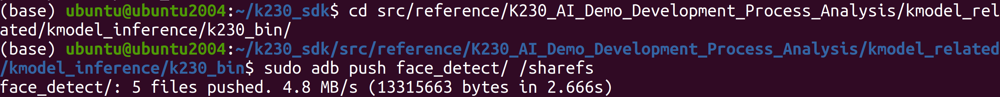

1.  打开开发板的串口B ，访问rt-smart大核系统的串口。由于rt-smart系统有开机自启程序，可输入q + 回车键结束开机自启程序。
2.  进入可执行文件目录：

```text
cd sharefs/face_detect/
```

1.  执行程序推理程序

1)检测预处理是否正确

在rt-smart大核串口终端执行：

```text
./face_detection.elf face_detect_640.kmodel 0.5 0.2 face_detect.jpg 2
```

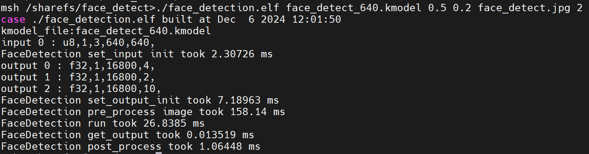

执行完成后可在当前目录查看到FaceDetection\_input\_padding.png图片文件，可查看该图片来确定前处理是否正确。若是有问题，则需要看sensor原图有没有问题，设置的预处理参数是否正确。

在Ubuntu中新建终端，并使用ADB拉取开发板端的前处理图像：

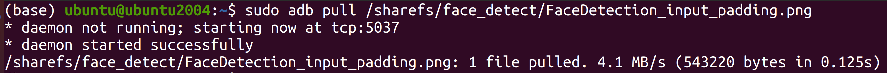

此时可访问Ubuntu虚拟机中的图片，如下所示：


2)检测后处理是否正确

在rt-smart大核串口终端执行：

```text
./face_detection.elf face_detect_640.kmodel 0.5 0.2 face_detect.jpg 3
```

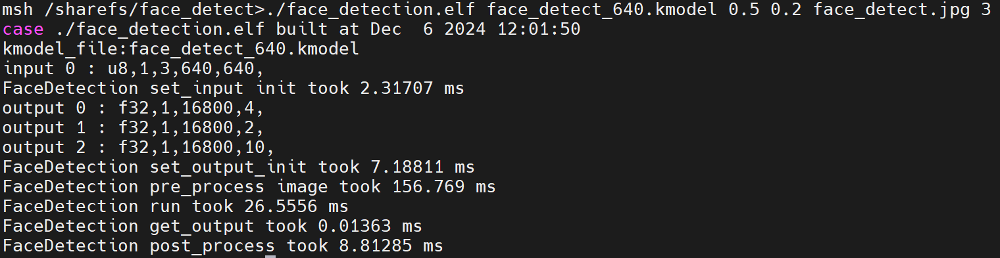

执行完成后可在当前目录查看到face\_detection\_result.jpg图片文件，可查看该图片来确定后处理代码是否正确。若是不正确就需要对后处理部分代码进行仔细检查，打印调试。

在Ubuntu中新建终端，并使用ADB拉取开发板端的前处理图像：

```text
adb pull /sharefs/face_detect/face_detection_resul.jpg
```

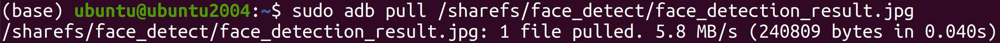

此时可访问Ubuntu虚拟机中的图片，如下所示：

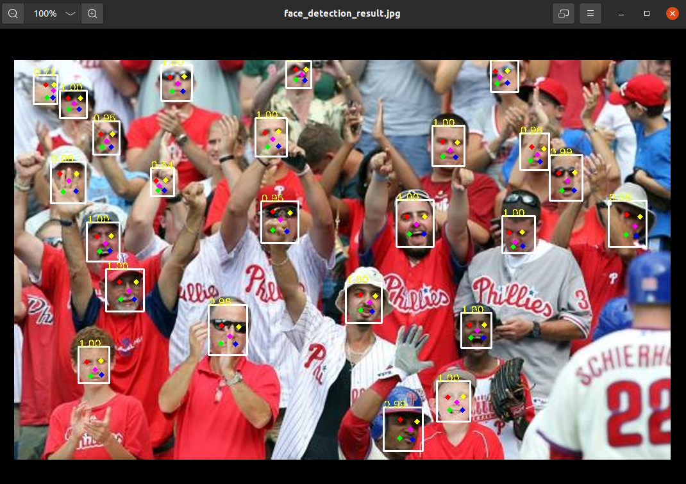

1.  如果想基于视频流进行模型推理，即从摄像头获取视频流并在显示屏上进行显示，可在大核串口B终端执行：

```text
#在大核上
cd /sharefs/face_detect
./face_detect_isp.sh
```
