# 人脸识别模型部署实战

> 本文档根据《嘉楠K230开发手册》V1.0（2024-11-30）整理。正文、表格、示例代码与插图均来自原始手册。

人脸识别是广泛使用的人脸任务，它将当前人脸与已知的人脸身份库进行比较，判断是否认识当前人脸。

人脸识别一般包含2个步骤：人脸注册和人脸识别，人脸注册用于构建人脸数据库，人脸识别用于识别存在数据库中的人脸。

**人脸注册**：图像采集->人脸定位->人脸对齐->特征提取->数据库保存

**人脸识别**：图像采集->人脸定位->人脸对齐->特征提取->特征比对->给出识别结果 **人脸对齐**：对于一张图像，人脸检测模型输出人脸目标框坐标和5个人脸关键点，在进行人脸识别前，需要对检测得到的人脸框进行对齐；即在2D平面将人脸转正，减少人脸旋转造成的差异，以便于后续更准确的人脸识别。

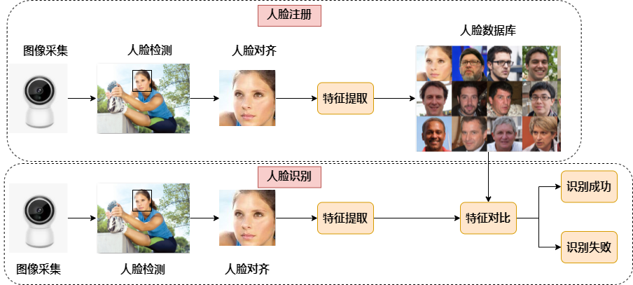

## PyTorch到ONNX转换

1.  **模型转换流程分析**

选择人脸识别模型时，一般应选择轻量化的模型，backbone一般小于resnet50参数量较好。因此我们选择基于MobileNet且精度较高MobileFaceNet作为我们的人脸识别模型。

1.  加载pth或ckpt模型到cpu
2.  构建随机模型输入
3.  导出onnx模型

**注：**pth、onnx都支持动态输入，而K230的模型暂时不支持动态输入，所以导出onnx时，onnx输入shape固定。

```text
#convert_to_onnx.py
import numpy as np
import torch
from core import model               #因模型而不同
def convert_onnx(net, path_module, output, opset=11):
assert isinstance(net, torch.nn.Module)
img = np.random.randint(0, 255, size=(112, 112, 3), dtype=np.int32)
img = img.astype(np.float)
img = (img / 255. - 0.5) / 0.5  # torch style norm
img = img.transpose((2, 0, 1))
img = torch.from_numpy(img).unsqueeze(0).float()
ckpt = torch.load(path_module,map_location='cpu')
net.load_state_dict(ckpt['net_state_dict'],strict=True)
net.eval()
torch.onnx.export(net, img, output, input_names=["data"], keep_initializers_as_inputs=False, verbose=False,
                      opset_version=opset)
if __name__ == '__main__':
net = model.MobileFacenet()
input_file = 'model/best/068.ckpt'
output_file = 'model/best/MobileFaceNet.onnx'
convert_onnx(net, input_file, output_file)
```

1.  **模型转换执行步骤**
2.  在Ubuntu中新建终端，并激活conda的人脸相关环境

```text
conda activate py39_mobilenet
```

1.  进入人脸检测源码目录

```text
cd k230_sdk/src/reference/Pytorch_Retinaface/
```

执行效果：

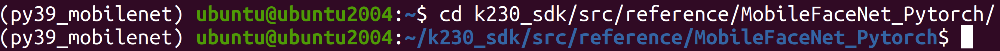

1.  拷贝转换程序至人脸识别源码目录

```text
cp ../K230_AI_Demo_Development_Process_Analysis/onnx_related/onnx_export/face_recognition_convert_to_onnx.py .
```

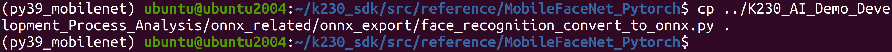

执行转换程序

```text
python face_recognition_convert_to_onnx.py
```

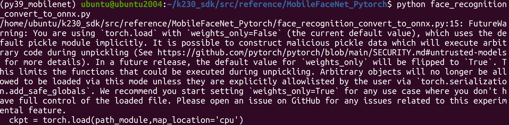

1.  查看生成的模型文件

```text
ls model/best/
```

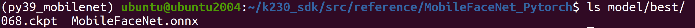

其中MobileFaceNet.onnx为从068.ckpt转换过来的ONNX模型文件。

## 使用ONNXRuntime进行推理

1.  **人脸对齐**

常用人脸识别训练集主要有：MS1MV2、MS1MV3、Glint360K，制作这些数据集一般需要对完整的人脸原图进行预处理，即先进行人脸检测，然后对每个人脸进行人脸对齐，然后保存对齐后的人脸图片。

**人脸对齐：**对于一张图像，人脸检测模型输出人脸目标框坐标和5个人脸关键点，在进行人脸识别前，需要对检测得到的人脸进行对齐；即在2D平面将人脸转正，减少人脸旋转造成的差异，以便于后续更准确的人脸识别。

x.png：原始图片，x\_affine.png：对齐后的人脸

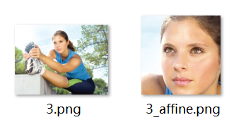

```text
def st_image(ori_image, landmarks):
#标准正脸人脸五官位置（112x112分辨率）
le_g = [38.2946, 51.6963]
re_g = [73.5318, 51.5014]
nose_g = [56.0252, 71.7366]
l_mouth_g = [41.5493, 92.3655]
r_mouth_g = [70.7299, 92.2041]
#实际人脸五官位置
le = landmarks[0, :]
re = landmarks[1, :]
nose = landmarks[2, :]
l_mouth = landmarks[3, :]
r_mouth = landmarks[4, :]
landmark_get = np.float32([le, re, nose, l_mouth, r_mouth])
landmark_golden = np.float32([le_g, re_g, nose_g, l_mouth_g, r_mouth_g])
#计算从实际人脸->标准正脸需要经过的变换
tform = trans.SimilarityTransform()
tform.estimate(np.array(landmark_get), landmark_golden)
M = tform.params[0:2, :]
#得到变换后的人脸
affine_output = cv2.warpAffine(ori_image, M, (112, 112), borderValue=0.0)
return affine_output
```

1.  **图像预处理**

预处理构建（常用的方法：padding\_resize，crop\_resize，resize，affine、normalization）：参考train.py，test.py、predict.py、现成的onnx推理脚本。

**构建人脸识别预处理代码：**

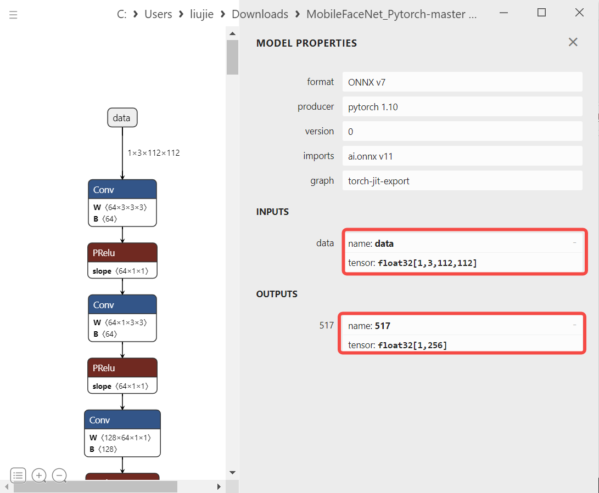

```text
#mobile_face_net.py：MobileFaceNet
def pre_process(self,img,to_bin = True):
# bgr->rgb,uint8,(112,112,3)
img = img[..., ::-1]
# Dequantize,float32,(112,112,3)
img = np.array(img, dtype='float32')
#Normalization ，float32,(112,112,3)
for i in range(3):
    img[:, :, i] -= self.normalize_mean
    img[:, :, i] /= self.normalize_std
# transpose，hcw->chw,float32,(3,112,112)
img = np.transpose(img, [2, 0, 1])
# 3维扩张为4维，input_data,float32,(1,3,112,112)
input_data = np.expand_dims(img, 0)
return input_data
```

**参考：**人脸识别预处理代码参考train.py中调用的dataloader，去掉不适合推理使用的flip（数据增强），只留下onnx推理时必要的bgr->rgb（[scipy](https://so.csdn.net/so/search?q=scipy&spm=1001.2101.3001.7020).misc.imread 读取的图片数据是 RGB 格式）、Normalization（减mean除std）、hwc->chw（transpose）。

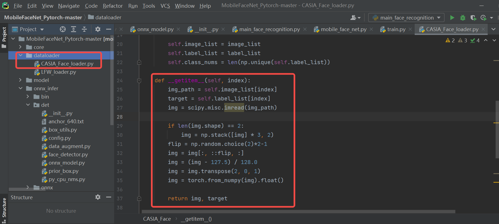

1.  **onnx推理**

将预处理好的数据，喂给模型，得到onnx推理结果

```text
#onnx_model.py
def forward(self, image_tensor):
'''
image_tensor = image.transpose(2, 0, 1)
image_tensor = image_tensor[np.newaxis, :]
onnx_session.run([output_name], {input_name: x})
:param image_tensor:
:return:
'''
input_feed = self.get_input_feed(image_tensor)
output = self.sess.run(self.out_names, input_feed=input_feed)
return output
#mobile_face_net.py
def farward(self, input_data):
embedding = self.model.forward(input_data)
return embedding[0]
```

1.  后处理

模型提取完特征后，放到数据库中，以备后续人脸对比使用。为了简化代码，我们暂时不写准备数据库的过程了，把它放在人脸对比的过程中。

**人脸对比结果**

读取多张人脸，对每个人脸提取特征，并将Normalization之后的特征保存到列表中。最后对比当前列表的第一个人脸和列表的相似度。

```text
face_recg = MobileFaceNet()
embeddings = []
for i,img_file in enumerate(img_lists):
    ori_img = cv2.imread(img_file)
    input_data = face_recg.pre_process(ori_img)
    embedding = face_recg.farward(input_data)
    # 模型特征归一化，然后放到数据库中
    embedding_norm = preprocessing.normalize(embedding)
    embeddings.append(embedding_norm)       #模拟构建数据库过程
# 获取第一个人脸特征，和其它人脸特征进行对比   
embedding_one = embeddings[0]
scores = np.array([np.sum(embedding_one * emb_database) / 2 + 0.5 for emb_database in embeddings])
print("scores:",scores)
```

“img\_lists”：

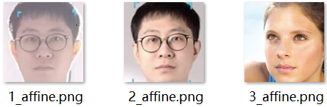

假如阈值设置为0.75的话，说明第0、1是同一个人脸，第0、2是不同人。

1.  **执行步骤**
2.  在Ubuntu中新建终端，并激活conda的人脸相关环境，若已激活，请忽略此步骤

```text
conda activate py39_mobilenet
```

1.  进入ONNX模型推理源码目录

```text
cd k230_sdk/src/reference/K230_AI_Demo_Development_Process_Analysis/onnx_related/onnx_inference/face_recognition
```

执行效果：

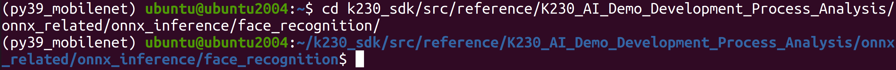

1.  拷贝人脸检测ONNX模型至推理源码目录

```text
cp ../../../../Pytorch_Retinaface/FaceDetector.onnx onnx/
```

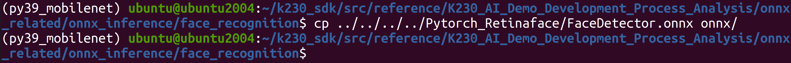

1.  拷贝人脸识别ONNX模型至推理源码目录

```text
cp ../../../../MobileFaceNet_Pytorch/model/best/MobileFaceNet.onnx  onnx/
```

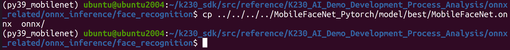

1.  执行人脸识别推理程序

```text
python main_face_recognition.py
```

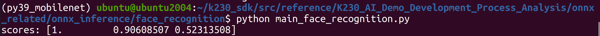

运行之后会得到bin目录下，1.png中的人脸与2.png/3.png中的人脸进行对比，可以看到与2.png相似度是最高的。

## ONNX到kmodel转换

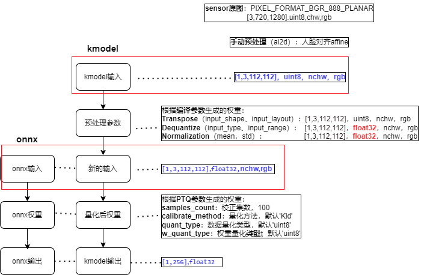

1.  **配置kmodel生成参数**

**编译参数：CompileOptions**

```text
# 1. 设置编译参数，compile_options
compile_options = nncase.CompileOptions()
# 指定编译目标, 如'cpu', 'k230',cpu生成cpu上推理的kmodel,k230生成在k230(kpu)上推理的kmodel
compile_options.target = args.target
# 预处理
compile_options.preprocess = True
# （1）预处理---Transpose相关参数
# 当 preprocess为 True时，必须指定
input_shape = [1, 3, 112, 112]
compile_options.input_shape = input_shape
# 输入数据的layout，默认为""
# compile_options.input_layout = "NCHW"
compile_options.input_layout = "0,1,2,3"
# （2）预处理---SwapRB相关参数
compile_options.swapRB = False
# （3）预处理---Dequantize（反量化）相关参数
# 开启预处理时指定输入数据类型，默认为"float"；当 preprocess为 True时，必须指定为"uint8"或者"float32"
compile_options.input_type = 'uint8'            
# input_type=‘uint8’时反量化有效，反量化之后的数据范围
compile_options.input_range = [0, 255]
# （4）预处理---Normalization相关参数
compile_options.mean = [ 127.5,127.5,127.5]
compile_options.std = [128.0, 128.0, 128.0]
# 后处理
# compile_options.output_layout = "NCHW"
#Compiler类, 根据编译参数配置Compiler，用于编译神经网络模型
compiler = nncase.Compiler(compile_options)
```

**导入参数：ImportOptions**

ImportOptions类, 用于配置nncase导入选项，很少单独设置，使用默认参数即可。

```text
# 2. 设置导入参数，import_options（一般默认即可）
import_options = nncase.ImportOptions()	
model_file = onnx_simplify(args.model, dump_dir)
model_content = read_model_file(model_file)
compiler.import_onnx(model_content, import_options)
```

**训练后量化参数：PTQTensorOptions**

训练后量化参数(Post Training Quantization，PTQ)，PTQ是一种通过将模型权重从float32映射uint8或int16方法，保持模型的准确性的同时，减少推理所需的计算资源；当target = “k230”，PTQ是必选参数，默认uint8量化。

使用uint8量化可以满足人脸识别精度要求，故使用默认uint8量化；校正集个数为100；假设使用100个校正集生成kmodel的时间很久，可以适当的减少校正集。

```text
# 3. 设置量化参数，ptq_options
ptq_options = nncase.PTQTensorOptions()
ptq_options.samples_count = 100
ptq_options.set_tensor_data(generate_data(input_shape, ptq_options.samples_count, args.dataset))
compiler.use_ptq(ptq_options)
```

1.  **校正集准备**

使用少量校正集计算量化因子，可以快速得到量化模型。使用该量化模型进行预测，可以减少计算量、降低计算内存、减小模型大小。

**校正集**一般选用验证集的100张图片即可。该[人脸识别模型](https://github.com/Xiaoccer/MobileFaceNet_Pytorch)的验证集为\`LFW\`，故选用\`LFW\`的100张图像作为校正集。

**注：**

1.  若是kmodel生成时间很久或者验证集数据很少，也可尝试少于100个数据
2.  “generate\_data”函数，生成的数据格式，需要大致保证与实际推理时喂给kmodel的数据格式一致，否则会导致生成kmodel有问题。

```text
def generate_data(shape, batch, calib_dir):
# 生成的数据和实际kmodel输入数据保持一致，因为生成kmodel时，只会做参数中设置的预处理
# 生成的校正集数据需要做的预处理 ≈ onnx预处理 - 根据预处理参数设置的，包含在kmodel中预处理
# onnx预处理：bgr->rgb,transpose,normalization,dequantize,3维度转4维度
# kmodel中包含的预处理：dequantize,normalization
img_paths = [os.path.join(calib_dir, p) for p in os.listdir(calib_dir)]
data = []
for i in range(batch):
    assert i < len(img_paths), "calibration images not enough."
    # 读取图像，并转为RGB
    img_data = Image.open(img_paths[i]).convert('RGB')
    # transpose 
    img_data = np.transpose(img_data, (2, 0, 1))
    data.append([img_data[np.newaxis, ...]])
return np.array(data)
input_shape = [1, 3, 112, 112]
......
ptq_options = nncase.PTQTensorOptions()
ptq_options.samples_count = 100
# 校正集数据预处理，将原图处理为kmodel需要数据
ptq_options.set_tensor_data(generate_data(input_shape, ptq_options.samples_count, args.dataset))
# 使用samples_count个校准数据计算量化因子
compiler.use_ptq(ptq_options)
......
```

1.  **执行步骤**
2.  在Ubuntu中新建终端，并进入k230\_SDK目录下


1.  激活Kmodel模型转换环境

```text
sudo docker run -u root -it -v $(pwd):$(pwd) -v $(pwd)/toolchain:/opt/toolchain -w $(pwd) ghcr.io/kendryte/k230_sdk /bin/bash
```


1.  进入kmodel转换程序源码目录

```text
cd src/reference/K230_AI_Demo_Development_Process_Analysis/kmodel_related/kmodel_export/face_recognition
```

1.  拷贝人脸识别ONNX模型文件至onnx目录下

```text
cp ../../../onnx_related/onnx_inference/face_recognition/onnx/MobileFaceNet.onnx onnx/
```

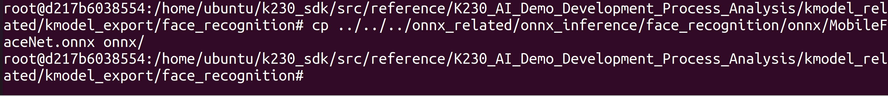

1.  安装nncase相关库

```text
pip install nncase==2.9.0
pip install nncase-kpu==2.9.0
```

1.  执行模型转换程序

```text
python mobile_face.py --target k230 --model onnx/MobileFaceNet.onnx --dataset lfw
```

其中lfw文件中指定了校正图像集。

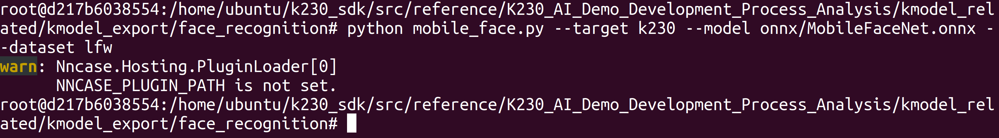

等待模型转换完成，转换完成后，会在onnx目录下生成k230\_mobile\_face.kmodel文件。模型文件格式如下：

```text
-rw-r--r--+ 1 root root 1319744 Feb 29 14:56 face_recognize.kmodel
```

## 使用K230Runtime进行验证

1.  **Simulator验证kmodel**

生成人脸识别kmodel之后，为了验证kmodel的准确性，需要在使用Simulator对比kmodel的输出和onnx的输出是否一致，这时就需要调用**模拟器APIs(Python)**。

**1.1 生成input.bin**

使用simulator验证kmodel之前，需要先准备好输入文件。由于kmodel包括部分预处理，因此对于同一张图片，需要分别利用不同预处理生成不同的onnx\_input.bin、kmodel\_input.bin。

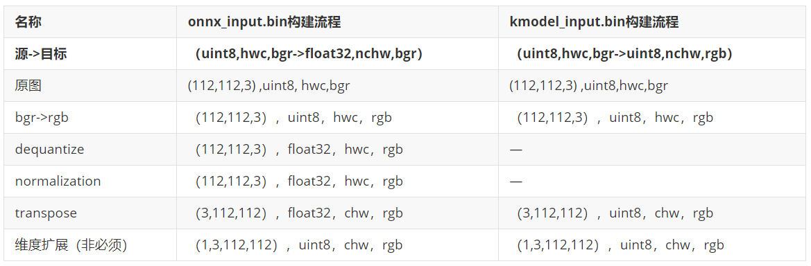

**注：**生成的kmodel中包含部分预处理，生成kmodel\_input.bin需要的预处理 ≈ 生成onnx\_input.bin需要的预处理 - kmodel中包含的预处理（人脸识别kmodel中预处理transpose、dequantize、normalization）

1.  维度扩展可以省略（读取时bin文件可以用reshape，生成bin时可以省略）
2.  transpose也放到kmodel中，为什么生成kmodel\_input.bin仍需transpose？由于生成kmodel，若是打开了预处理开关，transpose的相关参数必须设置，我们人脸识别kmodel的实际输入是\`NCHW\`，input\_layout设置为\`NCHW\`，两者是一致的，因此transpose是NCHW2NCHW，实际上并没有转换。

具体代码位置：

```text
k230_sdk/src/reference/K230_AI_Demo_Development_Process_Analysis/onnx_related/onnx_inference/face_recognition/main_face_recognition.py
```

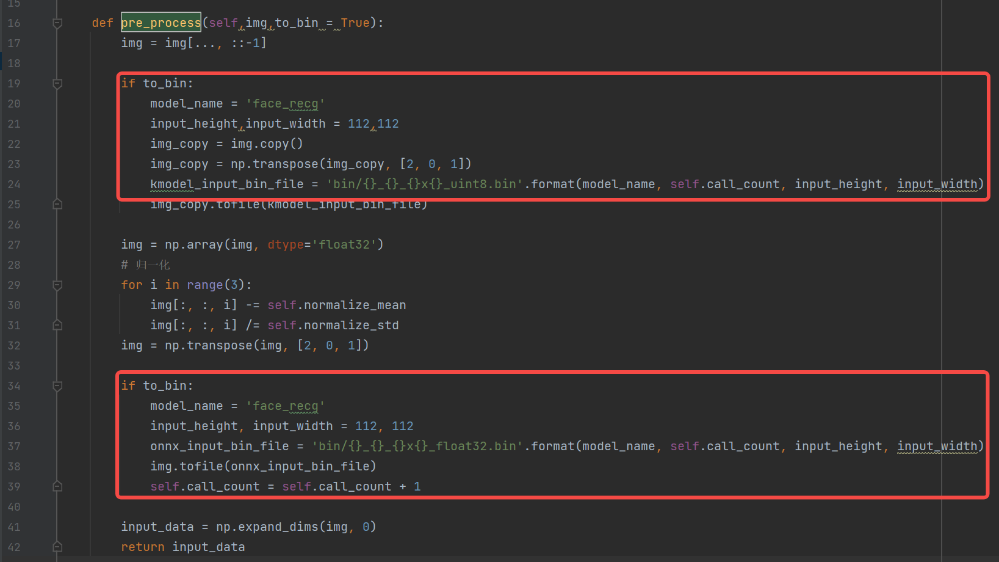

```text
-rw-r--r-- 1 root root 147K Feb 26 16:37 face_recg_0_112x112_float32.bin
-rw-r--r-- 1 root root  37K Feb 26 16:37 face_recg_0_112x112_uint8.bin
```

**1.2 Simulator验证**

Simulator流程：（与人脸检测流程基本一致，只需修改input\_shape、input\_bin\_file即可）

1.  对于同一张图片，分别利用不同预处理生成不同的onnx\_input.bin、kmodel\_input.bin；
2.  将onnx\_input.bin喂给onnx，经过onnx推理得cpu\_results；
3.  将kmodel\_input.bin喂给kmodel，经过Simulator推理得到nncase\_results；
4.  计算cpu\_results和nncase\_results的余弦相似度，通过相似度的大小判断kmodel的模拟推理和onnx的推理结果是否一致。

```text
import os
import copy
import argparse
import numpy as np
import onnx
import onnxruntime as ort
import nncase
def read_model_file(model_file):
with open(model_file, 'rb') as f:
    model_content = f.read()
return model_content
def cosine(gt, pred):
return (gt @ pred) / (np.linalg.norm(gt, 2) * np.linalg.norm(pred, 2))
def main():
parser = argparse.ArgumentParser(prog="nncase")
parser.add_argument("--target", type=str, help='target to run')
parser.add_argument("--model", type=str, help='original model file')
parser.add_argument("--model_input", type=str, help='input bin file for original model')
parser.add_argument("--kmodel", type=str, help='kmodel file')
parser.add_argument("--kmodel_input", type=str, help='input bin file for kmodel')
args = parser.parse_args()
# 1. onnx推理，得到cpu_results
ort_session = ort.InferenceSession(args.model)
output_names = []
model_outputs = ort_session.get_outputs()
for i in range(len(model_outputs)):
    output_names.append(model_outputs[i].name)
model_input = ort_session.get_inputs()[0]
  
model_input_name = model_input.name
model_input_type = np.float32
model_input_shape = model_input.shape
print('onnx_input：',model_input_shape)
model_input_data = np.fromfile(args.model_input, model_input_type).reshape(model_input_shape)
cpu_results = []
cpu_results = ort_session.run(output_names, { model_input_name : model_input_data })
    
# 2. Simulator推理，得到nncase_results
# create Simulator
sim = nncase.Simulator()
# read kmodel
kmodel = read_model_file(args.kmodel)
# load kmodel
sim.load_model(kmodel)
# read input.bin
input_shape = [1, 3, 112, 112]
dtype = sim.get_input_desc(0).dtype
input = np.fromfile(args.kmodel_input, dtype).reshape(input_shape)
# set input for Simulator
sim.set_input_tensor(0, nncase.RuntimeTensor.from_numpy(input))
# Simulator inference
nncase_results = []
sim.run()
for i in range(sim.outputs_size):
    nncase_result = sim.get_output_tensor(i).to_numpy()
    # print("nncase_result:",nncase_result)
    input_bin_file = 'bin/face_recg_{}_{}_simu.bin'.format(i,args.target)
    nncase_result.tofile(input_bin_file)
    nncase_results.append(copy.deepcopy(nncase_result))
# 3. 计算onnx和Simulator相似度
for i in range(sim.outputs_size):
    cos = cosine(np.reshape(nncase_results[i], (-1)), np.reshape(cpu_results[i], (-1)))
    print('output {0} cosine similarity : {1}'.format(i, cos))
if __name__ == '__main__':
main()
```

上边的脚本可以满足大部分onnx及其kmodel的对比验证，一般不用太多修改。只需根据模型实际输入大小修改input\_shape即可。

1.  **Simulator验证kmodel执行步骤**

**注意：**若已经激活Kmodel模型转换环境，请忽略步骤①和步骤②。

1.  在Ubuntu中新建终端，并进入k230\_SDK目录下

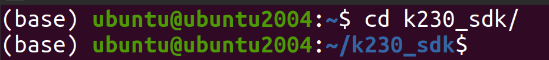

1.  激活Kmodel模型转换环境

```text
sudo docker run -u root -it -v $(pwd):$(pwd) -v $(pwd)/toolchain:/opt/toolchain -w $(pwd) ghcr.io/kendryte/k230_sdk /bin/bash
```


1.  进入kmodel验证程序源码目录

```text
cd src/reference/K230_AI_Demo_Development_Process_Analysis/kmodel_related/kmodel_export/face_recognition
```

1.  安装nncase相关库

```text
pip install nncase==2.9.0
pip install nncase-kpu==2.9.0
```

1.  添加环境变量

```text
export NNCASE_PLUGIN_PATH=$NNCASE_PLUGIN_PATH:/usr/local/lib/python3.8/dist-packages/
export PATH=$PATH:/usr/local/lib/python3.8/dist-packages/
source /etc/profile
```

1.  拷贝onnx推理时生成的bin中文件到bin目录下

```text
cp ../../../onnx_related/onnx_inference/face_recognition^Cin/* bin/
```

1.  执行验证程序

```text
python mobile_face_onnx_simu.py --target k230 --model onnx/MobileFaceNet.onnx --model_input bin/face_recg_0_112x112_float32.bin --kmodel onnx/k230_mobile_face.kmodel --kmodel_input bin/face_recg_0_112x112_uint8.bin
```

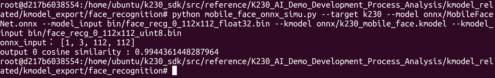

一般onnx和Simulator余弦相似度越高越好，一般0.99以上即可满足条件；若是达不到0.99，但是在0.96以上，可以通过进一步上板推理验证生成的kmodel是否满足实际效果需求。

1.  **使用K230验证kmodel**

Simulator推理kmodel和上板推理kmodel一般来说是一致的，但是不排除个别情况下Simulator与实际上板仍有一定差异，为了验证两者是否一致，需要使用main\_nncase工具辅助验证Simulator推理kmodel与上板实际推理kmodel结果是否一致；使用这个工具需要调用nncase的**KPU运行时APIs(C++)**。

**main\_nncase验证流程：**

1.  加载kmodel
2.  设置kmodel输入：读取kmodel\_input.bin文件
3.  设置kmodel输出
4.  推理kmodel
5.  获取kmodel输出
6.  对比Simulator推理kmodel、上板推理kmodel结果相似性

```text
//main_nncase
#include <chrono>
#include <fstream>
#include <iostream>
#include <nncase/runtime/runtime_tensor.h>
#include <nncase/runtime/interpreter.h>
#include <nncase/runtime/runtime_op_utility.h>
using namespace nncase;
using namespace nncase::runtime;
using namespace nncase::runtime::detail;
#define USE_CACHE 1
template <class T>
std::vector<T> read_binary_file(const char *file_name)
{
std::ifstream ifs(file_name, std::ios::binary);
ifs.seekg(0, ifs.end);
size_t len = ifs.tellg();
std::vector<T> vec(len / sizeof(T), 0);
ifs.seekg(0, ifs.beg);
ifs.read(reinterpret_cast<char *>(vec.data()), len);
ifs.close();
return vec;
}
void read_binary_file(const char *file_name, char *buffer)
{
std::ifstream ifs(file_name, std::ios::binary);
ifs.seekg(0, ifs.end);
size_t len = ifs.tellg();
ifs.seekg(0, ifs.beg);
ifs.read(buffer, len);
ifs.close();
}
template <typename T>
double dot(const T *v1, const T *v2, size_t size)
{
double ret = 0.f;
for (size_t i = 0; i < size; i++)
{
    ret += v1[i] * v2[i];
}
return ret;
}
template <typename T>
double cosine(const T *v1, const T *v2, size_t size)
{
return dot(v1, v2, size) / ((sqrt(dot(v1, v1, size)) * sqrt(dot(v2, v2, size))));
}
void dump(const std::string &info, volatile float *p, size_t size)
{
std::cout << info << " dump: p = " << std::hex << (void *)p << std::dec << ", size = " << size << std::endl;
volatile unsigned int *q = reinterpret_cast<volatile unsigned int *>(p);
for (size_t i = 0; i < size; i++)
{
    if ((i != 0) && (i % 4 == 0))
    {
        std::cout << std::endl;
    }
    std::cout << std::hex << q[i] << " ";
}
std::cout << std::dec << std::endl;
}
int main(int argc, char *argv[])
{
std::cout << "case " << argv[0] << " build " << __DATE__ << " " << __TIME__ << std::endl;
if (argc < 4)
{
    std::cerr << "Usage: " << argv[0] << " <kmodel> <input_0.bin> <input_1.bin> ... <input_N.bin> <output_0.bin> <output_1.bin> ... <output_N.bin>" << std::endl;
        return -1;
}
interpreter interp;                             
// 1. load model
std::ifstream in_before_load_kmodel("/proc/media-mem");
std::string line_before_load_kmodel;
// 逐行读取文件内容，查看MMZ使用情况
while (std::getline(in_before_load_kmodel, line_before_load_kmodel)) { 
    std::cout << line_before_load_kmodel << std::endl;
}
std::ifstream ifs(argv[1], std::ios::binary);
interp.load_model(ifs).expect("Invalid kmodel");
std::ifstream in_after_load_kmodel("/proc/media-mem");
std::string line_after_load_kmodel;
// 逐行读取文件内容，查看MMZ使用情况
while (std::getline(in_after_load_kmodel, line_after_load_kmodel)) {  
    std::cout << line_after_load_kmodel << std::endl;  
}
// 2. set inputs
for (size_t i = 2, j = 0; i < 2 + interp.inputs_size(); i++, j++)
{
    auto desc = interp.input_desc(j);
    auto shape = interp.input_shape(j);
    auto tensor = host_runtime_tensor::create(desc.datatype, shape, hrt::pool_shared).expect("cannot create input tensor");
    auto mapped_buf = std::move(hrt::map(tensor, map_access_::map_write).unwrap());
#if USE_CACHE
    read_binary_file(argv[i], reinterpret_cast<char *>(mapped_buf.buffer().data()));
#else
    auto vec = read_binary_file<unsigned char>(argv[i]);
    memcpy(reinterpret_cast<void *>(mapped_buf.buffer().data()), reinterpret_cast<void *>(vec.data()), vec.size());
    // dump("app dump input vector", (volatile float *)vec.data(), 32);
#endif
    auto ret = mapped_buf.unmap();
    ret = hrt::sync(tensor, sync_op_t::sync_write_back, true);
    if (!ret.is_ok())
    {
        std::cerr << "hrt::sync failed" << std::endl;
        std::abort();
    }
    // dump("app dump input block", (volatile float *)block.virtual_address, 32);
    interp.input_tensor(j, tensor).expect("cannot set input tensor");
}
// 3. set outputs
for (size_t i = 0; i < interp.outputs_size(); i++)
{
    auto desc = interp.output_desc(i);
    auto shape = interp.output_shape(i);
    auto tensor = host_runtime_tensor::create(desc.datatype, shape, hrt::pool_shared).expect("cannot create output tensor");
    interp.output_tensor(i, tensor).expect("cannot set output tensor");
}
// 4. run
auto start = std::chrono::steady_clock::now();
interp.run().expect("error occurred in running model");
auto stop = std::chrono::steady_clock::now();
double duration = std::chrono::duration<double, std::milli>(stop - start).count();
std::cout << "interp run: " << duration << " ms, fps = " << 1000 / duration << std::endl;
// 5. get outputs
for (int i = 2 + interp.inputs_size(), j = 0; i < argc; i++, j++)
{
    auto out = interp.output_tensor(j).expect("cannot get output tensor");
    auto mapped_buf = std::move(hrt::map(out, map_access_::map_read).unwrap());
    auto expected = read_binary_file<unsigned char>(argv[i]);
    // 6. compare
    int ret = memcmp((void *)mapped_buf.buffer().data(), (void *)expected.data(), expected.size());
    if (!ret)
    {
        std::cout << "compare output " << j << " Pass!" << std::endl;
    }
    else
    {
        auto cos = cosine((const float *)mapped_buf.buffer().data(), (const float *)expected.data(), expected.size()/sizeof(float));
        std::cerr << "compare output " << j << " Fail: cosine similarity = " << cos << std::endl;
    }
}
return 0;
}
```

1.  **使用K230验证Kmodel执行步骤**

**注意：**若已经激活Kmodel模型转换环境，请忽略步骤①和步骤②。

1.  在Ubuntu中新建终端，并进入k230\_SDK目录下


1.  激活Kmodel模型转换环境

```text
sudo docker run -u root -it -v $(pwd):$(pwd) -v $(pwd)/toolchain:/opt/toolchain -w $(pwd) ghcr.io/kendryte/k230_sdk /bin/bash
```


1.  进入kmodel验证程序源码目录

```text
cd src/reference/K230_AI_Demo_Development_Process_Analysis/kmodel_related/kmodel_inference/
```

1.  安装nncase相关库

```text
pip install nncase==2.9.0
pip install nncase-kpu==2.9.0
```

1.  编译K230 验证可执行程序

```text
./build_app.sh debug
```

注意：该脚本会自动编译main\_nncase目录下的程序。

1.  退出docker环境

```text
exit
```

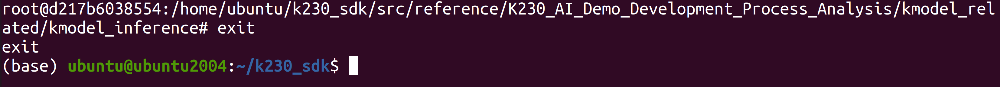

1.  参考文件传输章节，使用两条Type-C数据线连接至PC电脑，并等待开发板启动并将ADB设备连接至Ubuntu虚拟机。
2.  进入可执行文件目录

```text
cd src/reference/K230_AI_Demo_Development_Process_Analysis/kmodel_related/kmodel_inference/k230_bin/
```

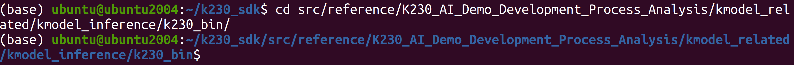

使用adb将可执行程序传输至开发板端

```text
adb push debug/ /sharefs
```


1.  打开开发板的串口B ，访问rt-smart大核系统的串口。由于rt-smart系统有开机自启程序，可输入q + 回车键结束开机自启程序。
2.  进入共享文件夹中可执行文件目录的运行程序

```text
cd /sharefs/debug/
```

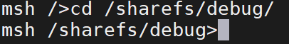

```text
./main_nncase.elf face_recognize.kmodel face_recg_0_112x112_uint8.bin face_recg_0_k230_simu.bin
```

当然您也可以之间执行脚本face\_recognize\_main\_nncase.sh进行模型验证

```text
face_recognize_main_nncase.sh
```

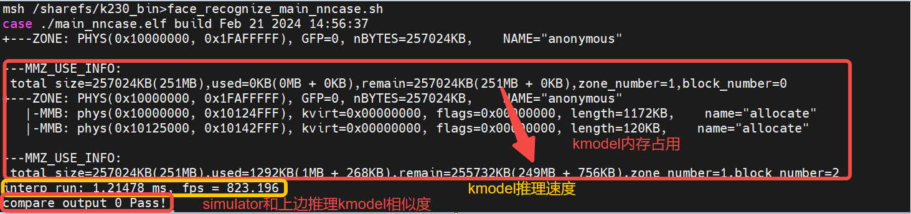

通过执行结果，可以发现：

1.  人脸识别kmodel内存：大概占用2M左右
2.  人脸识别kmodel推理速度：1.21ms
3.  人脸识别\*\*Simulator和上板推理相似度：输出完全一致（byte级别一致）

## 使用K230Runtime进行推理

**整体流程：**

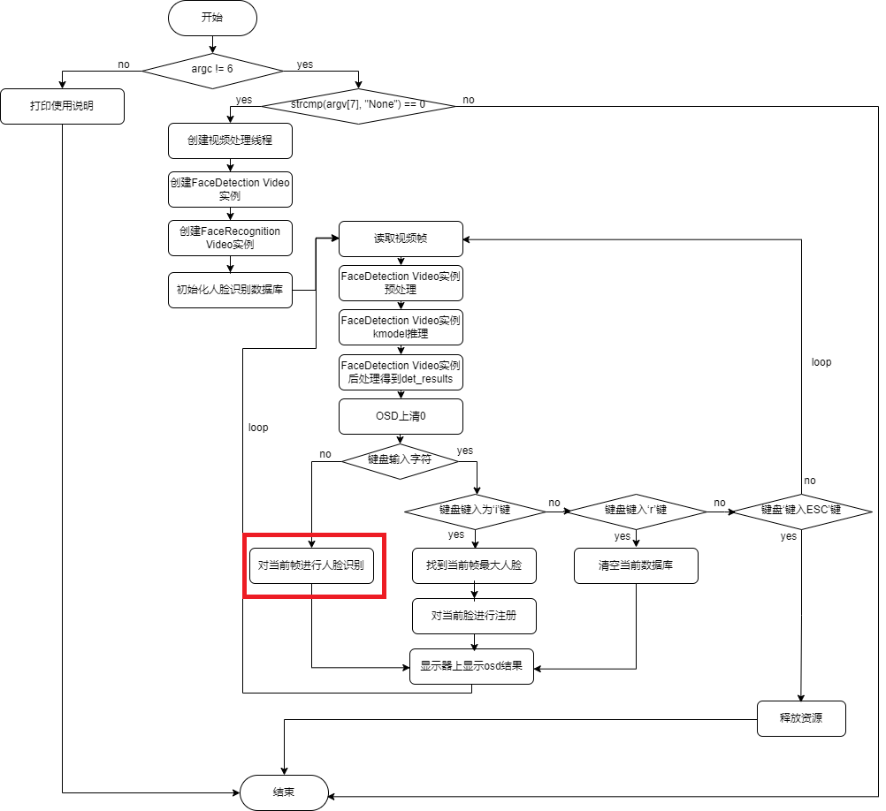

**识别流程：**

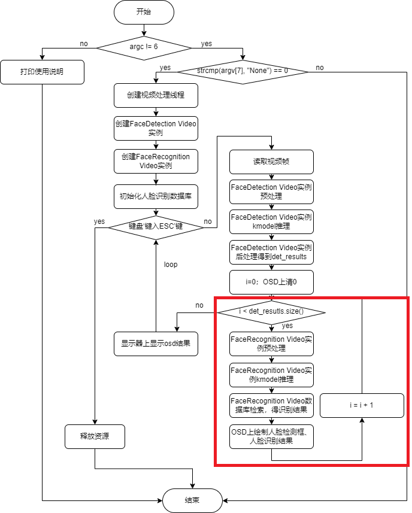

代码位置：K230\_AI\_Demo\_Development\_Process\_Analysis\\kmodel\_related\\kmodel\_inference\\face\_recognition

```text
├── ai_base.cc                  #AI基类，封装KPU运行时API，简化kmodel相关操作
├── ai_base.h
├── anchors_640.cc              #人脸检测640分辨率输入对应anchor
├── CMakeLists.txt
├── face_detection.cc           #人脸检测，预处理，kmodel推理、后处理
├── face_detection.h
├── face_recognition.cc         #人脸识别，预处理，kmodel推理、数据库比对
├── face_recognition.h
├── main.cc                     #人脸识别demo主流程
├── README.md
├── scoped_timing.hpp           #计时类
├── utils.cc                    #工具类，封装常用函数及AI2D 运行时APIs，简化预处理操作
├── utils.h
└── vi_vo.h                     #封装sensor、display操作
```

使用K230Runtime推理kmodel需要详细了解K230Runtime的说明文档，为了简化推理流程，对K230Runtime的接口进行封装，其中\`ai\_base.cc、scoped\_timing.hpp、utils.cc、vi\_vo.h\`是封装好的方法，无需修改；\`face\_detection.cc\`已经在人脸检测demo中实现，直接拷贝即可；\`face\_recognition.cc\`只需将\`face\_detection.cc\`拷贝一份，修改对应构造函数、预处理（pre\_process）、后处理（post\_process）即可。

1.  **读取图片或视频帧**
2.  **读取图片**

```text
cv::Mat ori_img = cv::imread(xxx);
```

1.  读取视频帧

读取视频帧示例：

K230\_AI\_Demo\_Development\_Process\_Analysis\\kmodel\_related\\kmodel\_inference\\test\_demo\\test\_vi\_vo

1.  **图像预处理**

**背景知识**：参数不变的情况下，\`ai2d\_builder\_\`可以反复调用；参数改变则需要创建新的\`ai2d\_builder\_\`。

**人脸识别图像预处理**：由于输入的人脸五官点位置不同，计算得到仿射变换也不同；人脸对齐（affine）时需要用生成的仿射变换作为参数来设置AI2D，AI2D的参数每次都会改变，需要重新调用Utils::affine创建新的\`ai2d\_builder\_\`来进行预处理。

**人脸识别视频流预处理**：同理，由于不同帧的人脸五官点位置不同，也需要重新调用Utils::affine创建新的\`ai2d\_builder\_\`来进行预处理。

```text
// ai2d for image
void FaceRecognition::pre_process(cv::Mat ori_img, float *sparse_points)
{
ScopedTiming st(model_name_ + " pre_process image", debug_mode_);
get_affine_matrix(sparse_points);
std::vector<uint8_t> chw_vec;
Utils::bgr2rgb_and_hwc2chw(ori_img, chw_vec);
Utils::affine({ori_img.channels(), ori_img.rows, ori_img.cols}, chw_vec, matrix_dst_, ai2d_out_tensor_);
if (debug_mode_ > 1)
{
    auto vaddr_out_buf = ai2d_out_tensor_.impl()->to_host().unwrap()->buffer().as_host().unwrap().map(map_access_::map_read).unwrap().buffer();
    unsigned char *output = reinterpret_cast<unsigned char *>(vaddr_out_buf.data());
        Utils::dump_color_image("FaceRecognition_input_affine.png",{input_shapes_[0][3],input_shapes_[0][2]},output);
}
}
// ai2d for video
void FaceRecognition::pre_process(float *sparse_points)
{
ScopedTiming st(model_name_ + " pre_process_video", debug_mode_);
get_affine_matrix(sparse_points);
size_t isp_size = isp_shape_.channel * isp_shape_.height * isp_shape_.width;
auto buf = ai2d_in_tensor_.impl()->to_host().unwrap()->buffer().as_host().unwrap().map(map_access_::map_write).unwrap().buffer();
memcpy(reinterpret_cast<char *>(buf.data()), (void *)vaddr_, isp_size);
hrt::sync(ai2d_in_tensor_, sync_op_t::sync_write_back, true).expect("sync write_back failed");
Utils::affine(matrix_dst_, ai2d_builder_, ai2d_in_tensor_, ai2d_out_tensor_);
if (debug_mode_ > 1)
{
    auto vaddr_out_buf = ai2d_out_tensor_.impl()->to_host().unwrap()->buffer().as_host().unwrap().map(map_access_::map_read).unwrap().buffer();
    unsigned char *output = reinterpret_cast<unsigned char *>(vaddr_out_buf.data());
        Utils::dump_color_image("FaceRecognition_input_affine.png",{input_shapes_[0][3],input_shapes_[0][2]},output);
}
}
sparse_point（人脸五官点）的获取方式：先进行人脸检测，人脸检测结果中包含sparse_point。
//main.cc
......
//人脸检测、人脸识别示例创建时都共享同一块地址vaddr
FaceDetection face_det(argv[1], atof(argv[2]),atof(argv[3]), {SENSOR_CHANNEL, SENSOR_HEIGHT, SENSOR_WIDTH}, reinterpret_cast<uintptr_t>(vaddr), reinterpret_cast<uintptr_t>(paddr), atoi(argv[8]));
FaceRecognition face_recg(argv[4],atoi(argv[5]),recg_thres, {SENSOR_CHANNEL, SENSOR_HEIGHT, SENSOR_WIDTH}, reinterpret_cast<uintptr_t>(vaddr), reinterpret_cast<uintptr_t>(paddr), atoi(argv[8]));
//每从sensor读取一帧图像，都会将数据拷贝到vaddr
while (!isp_stop)
{
ScopedTiming st("total time", 1);
{
    // 每从sensor读取一帧图像
    ScopedTiming st("read capture", atoi(argv[8]));
    memset(&dump_info, 0, sizeof(k_video_frame_info));
    ret = kd_mpi_vicap_dump_frame(vicap_dev, VICAP_CHN_ID_1, VICAP_DUMP_YUV, &dump_info, 1000);
    if (ret)
    {
        printf("sample_vicap...kd_mpi_vicap_dump_frame failed.\n");
        continue;
    }
}
{
    // 将从sensor中读取数据拷贝到vaddr
    ScopedTiming st("isp copy", atoi(argv[8]));
    auto vbvaddr = kd_mpi_sys_mmap_cached(dump_info.v_frame.phys_addr[0], size);
    memcpy(vaddr, (void *)vbvaddr, SENSOR_HEIGHT * SENSOR_WIDTH * 3);  // 这里以后可以去掉，不用copy
    kd_mpi_sys_munmap(vbvaddr, size);
}
det_results.clear();
// 将vaddr数据拷贝给人脸检测ai2d输入，预处理后，预处理结果会放到ai2d输出;ai2d输出，其实是指向人脸检测kmodel输入的
face_det.pre_process();
face_det.inference();
face_det.post_process({SENSOR_WIDTH, SENSOR_HEIGHT}, det_results);
cv::Mat osd_frame(osd_height, osd_width, CV_8UC4, cv::Scalar(0, 0, 0, 0));
for (int i = 0; i < det_results.size(); ++i)
{
    //***for face recg***
    // 将vaddr数据拷贝给人脸识别ai2d输入，预处理后，预处理结果会放到ai2d输出;ai2d输出，其实是指向人脸识别kmodel输入的
    face_recg.pre_process(det_results[i].sparse_kps.points);
    face_recg.inference();
    FaceRecognitionInfo recg_result;
    face_recg.database_search(recg_result); 
    face_recg.draw_result(osd_frame,det_results[i].bbox,recg_result,false);
}
{
    ScopedTiming st("osd copy", atoi(argv[8]));
    memcpy(pic_vaddr, osd_frame.data, osd_width * osd_height * 4);
    // 显示通道插入帧
    kd_mpi_vo_chn_insert_frame(osd_id + 3, &vf_info); // K_VO_OSD0
    ret = kd_mpi_vicap_dump_release(vicap_dev, VICAP_CHN_ID_1, &dump_info);
    if (ret)
    {
        printf("sample_vicap...kd_mpi_vicap_dump_release failed.\n");
    }
}
}
......
```

1.  **kmodel模型推理**

```text
//ai_base.cc
void AIBase::run()
{
ScopedTiming st(model_name_ + " run", debug_mode_);
kmodel_interp_.run().expect("error occurred in running model");
}
void AIBase::get_output()
{
ScopedTiming st(model_name_ + " get_output", debug_mode_);
p_outputs_.clear();
for (int i = 0; i < kmodel_interp_.outputs_size(); i++)
{
    auto out = kmodel_interp_.output_tensor(i).expect("cannot get output tensor");
    auto buf = out.impl()->to_host().unwrap()->buffer().as_host().unwrap().map(map_access_::map_read).unwrap().buffer();
    float *p_out = reinterpret_cast<float *>(buf.data());
    p_outputs_.push_back(p_out);
}
}
//face_recognition.cc
void FaceRecognition::inference()
{
this->run();
this->get_output();
}
//main.cc，验证kmodel推理是否正确：我们使用simulator和main_nncase已经验证过
......
FaceRecognition face_recg;
face_recg.inference();
......
```

1.  **后处理**

拿到人脸识别kmodel推理结果embeding后，需要将当前embeding与数据库中embedding进行对比，若对比结果大于某一阈值，则识别成功，说明该人脸已注册；否则，识别失败。

```text
//face_recognition.cc
void FaceRecognition::l2_normalize(float *src, float *dst, int len)
{
float sum = 0;
for (int i = 0; i < len; ++i)
{
    sum += src[i] * src[i];
}
sum = sqrtf(sum);
for (int i = 0; i < len; ++i)
{
    dst[i] = src[i] / sum;
}
}
float FaceRecognition::cal_cosine_distance(float *feature_0, float *feature_1, int feature_len)
{
float cosine_distance = 0;
// calculate the sum square
for (int i = 0; i < feature_len; ++i)
{
    float p0 = *(feature_0 + i);
    float p1 = *(feature_1 + i);
    cosine_distance += p0 * p1;
}
// cosine distance
return (0.5 + 0.5 * cosine_distance) * 100;
}
void FaceRecognition::database_search(FaceRecognitionInfo &result)
{
int i;
int v_id = -1;
float v_score;
float v_score_max = 0.0;
float basef[feature_num_], testf[feature_num_];
// current frame
l2_normalize(p_outputs_[0], testf, feature_num_);
for (i = 0; i < valid_register_face_; i++)
{
    l2_normalize(feature_database_ + i * feature_num_, basef, feature_num_);
    v_score = cal_cosine_distance(testf, basef, feature_num_);
    if (v_score > v_score_max)
    {
        v_score_max = v_score;
        v_id = i;
    }
}
if (v_id == -1)
{
    result.id = v_id;
    result.name = "unknown";
    result.score = 0;
}
else
{
    result.id = v_id;
    result.name = names_[v_id];
    result.score = v_score_max;
}
}
```

1.  **显示结果**

显示结果示例程序：

```text
K230_AI_Demo_Development_Process_Analysis\kmodel_related\kmodel_inference\test_demo\test_vi_vo
```

1.  **执行步骤**

**注意：**若已经激活Kmodel模型转换环境，请忽略步骤①和步骤②。

1.  在Ubuntu中新建终端，并进入k230\_SDK目录下

```text
cd k230_sdk/
```


1.  激活Kmodel模型转换环境

```text
sudo docker run -u root -it -v $(pwd):$(pwd) -v $(pwd)/toolchain:/opt/toolchain -w $(pwd) ghcr.io/kendryte/k230_sdk /bin/bash
```


1.  进入kmodel推理程序源码目录

```text
cd src/reference/K230_AI_Demo_Development_Process_Analysis/kmodel_related/kmodel_inference/
```


1.  执行编译脚本

```text
./build_app.sh
```

编译完成后，可在k230\_bin/face\_detect目录下看到可执行程序与配套测试文件。

1.  退出docker环境

```text
exit
```

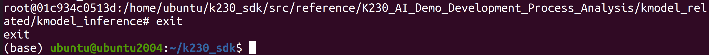

1.  进入可执行文件目录并使用adb将编译出来的程序、模型、测试图像传输至开发板端

```text
cd src/reference/K230_AI_Demo_Development_Process_Analysis/kmodel_related/kmodel_inference/k230_bin/
sudo adb push face_recognize/ /sharefs
```

1.  打开开发板的串口B ，访问rt-smart大核系统的串口。由于rt-smart系统有开机自启程序，可输入q + 回车键结束开机自启程序。
2.  进入可执行文件目录：

```text
cd /sharefs/face_recognize/
```

1.  执行程序推理程序

在rt-smart大核串口终端执行：

```text
./face_recognition.elf face_detect_640.kmodel 0.6 0.2 face_recognize.kmodel 100 75 None 2 db
```

执行程序之后 当摄像头检测到人脸后按下i键，可进入注册环节：

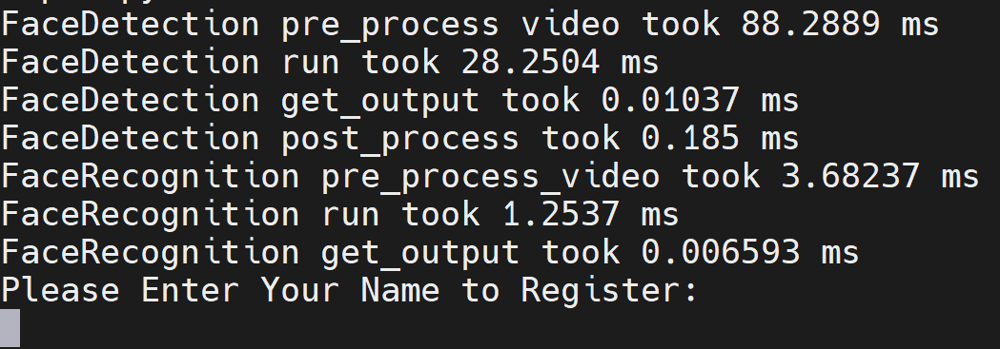

可填入对应人脸的任意名称，假设我这里填 A，则下一帧开始就识别到对应人脸会在显示屏中显示注册的名称A，实现人脸识别效果。如果想退出程序可按下Esc键。

1)检测预处理是否正确

由于执行程序时将debug\_mode设置为2，即可保存预处理之后的图像。

在Ubuntu端新建终端，使用ADB拉取前处理图片

```text
adb pull /sharefs/face_recognize/FaceDetection_input_padding.png
```

该图像为程序运行时注册人脸时前处理图像。若是有问题，则需要看sensor原图有没有问题，设置的预处理参数是否正确。

当然您可以使用ADB拉取人脸对齐图片

```text
adb pull /sharefs/face_recognize/FaceRecognition_input_affine.png
```

该图像为注册人脸时处理的人脸图像。


2) 后处理是否正确

人脸识别的后处理比较简单，比较当前人脸和数据库人脸的相似度即可，这里我们就不单独进行验证。
