# 目标检测模型部署

> 本文档根据《嘉楠K230开发手册》V1.0（2024-11-30）整理。正文、表格、示例代码与插图均来自原始手册。

YOLOv8 是YOLO 系列实时物体检测器的最新迭代产品，在精度和速度方面都具有尖端性能。在之前YOLO 版本的基础上，YOLOv8 引入了新的功能和优化，使其成为广泛应用中各种目标检测任务的理想选择。

主要功能：

1.  **先进的骨干和颈部架构：** YOLOv8 采用了最先进的骨干和颈部架构，从而提高了[特征提取](https://www.ultralytics.com/glossary/feature-extraction)和物体检测性能。
2.  **无锚分裂Ultralytics 头：** YOLOv8 采用无锚分裂Ultralytics 头，与基于锚的方法相比，它有助于提高检测过程的准确性和效率。
3.  **优化精度与**速度之间**的权衡：** YOLOv8 专注于保持精度与速度之间的最佳平衡，适用于各种应用领域的实时目标检测任务。
4.  **各种预训练模型：** YOLOv8 提供一系列预训练模型，以满足各种任务和性能要求，从而更容易为您的特定用例找到合适的模型。

YOLOv8 系列提供多种模型，每种模型都专门用于计算机视觉中的特定任务。这些模型旨在满足从物体检测到[实例分割](https://www.ultralytics.com/glossary/instance-segmentation)、姿态/关键点检测、定向物体检测和分类等更复杂任务的各种要求。

YOLOv8 系列的每个变体都针对各自的任务进行了优化，以确保高性能和高精确度。此外，这些模型还兼容各种操作模式，包括[推理](https://docs.ultralytics.com/zh/modes/predict/)、[验证](https://docs.ultralytics.com/zh/modes/val/)、[训练](https://docs.ultralytics.com/zh/modes/train/)和[输出](https://docs.ultralytics.com/zh/modes/export/)，便于在部署和开发的不同阶段使用。

## PyTorch到ONNX转换

1.  **流程分析**

选择目标检测模型时，一般应选择轻量化的模型。因此我们选择基于YOLO的yolov8n 作为目标检测模型，该模型参数量较小，更适合在嵌入式设备上进行部署。

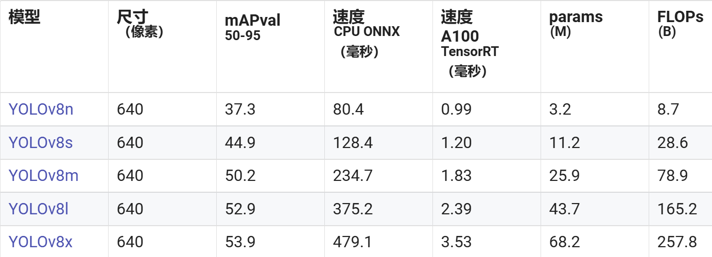

1.  加载pth或ckpt模型到cpu
2.  构建随机模型输入
3.  导出onnx模型

**注：**pth、onnx都支持动态输入，而K230的模型暂时不支持动态输入，所以导出onnx时，onnx输入shape固定。

1.  **执行步骤**
2.  在Ubuntu端新建终端，直接在终端输入：

```text
conda activate py39_yolov8
```

1.  进入yolov8模型存放目录

```text
cd yolov8_model/
```

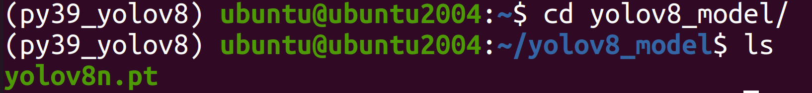

其中yolov8n.pt可通过下面的链接进行下载：

[https://github.com/ultralytics/assets/releases/download/v8.2.0/yolov8n.pt](https://github.com/ultralytics/assets/releases/download/v8.2.0/yolov8n.pt)

模型对应的代码可访问：[ultralytics/ultralytics at v8.2.0](https://github.com/ultralytics/ultralytics/tree/v8.2.0)

1.  执行转换命令，将pytorch模型转换为onnx模型，并支持320\*320像素的图像输入：

```text
yolo export model=yolov8n.pt format=onnx imgsz=320	
```

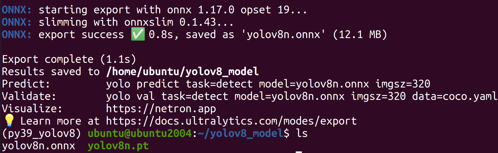

执行完成后可以在当前目录下查看生成的onnx模型文件。

## 使用ONNXRuntime进行推理

为了验证onnx正确性，我们需要使用ONNXRuntime对onnx进行推理，推理时保证读取图片、预处理、run、后处理、显示结果与pth/ckpt的推理流程一致。

1.  **读取图像**

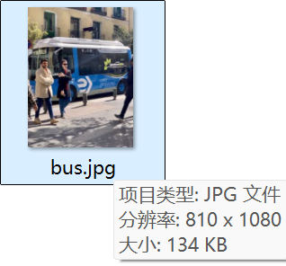

```text
#ori_img（810,1080,3）,opencv读入图片的默认格式为hwc,bgr
image = cv2.imread(image_path)
```

1.  **图像预处理**

预处理构建（常用的方法：padding\_resize，crop\_resize，resize，affine、normalization）：参考train.py，test.py、predict.py、现成的onnx推理脚本。

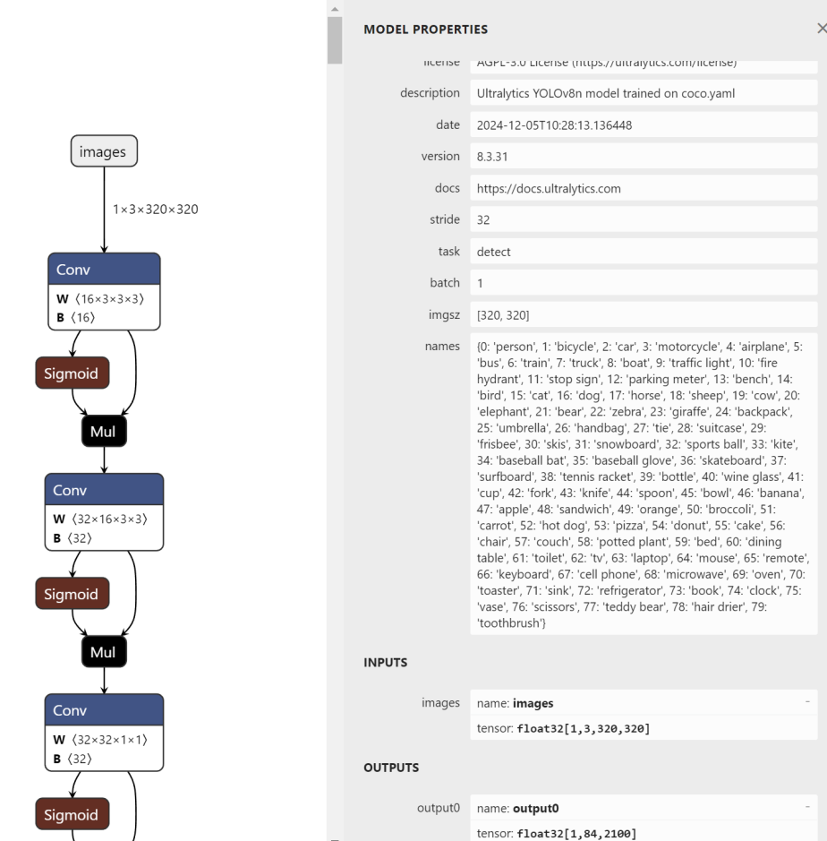

```text
def preprocess(image,input_width=320, input_height=320,mean=[0,0,0],std=[1,1,1]):"""预处理输入图像，调整大小、归一化、转换通道顺序、添加批次维度。"""# 获取原始图像尺寸orig_h, orig_w = image.shape[:2]# 计算缩放比例，保持长宽比scale = min(input_width / orig_w, input_height / orig_h)new_w = int(orig_w * scale)new_h = int(orig_h * scale)# 缩放图像resized_image = cv2.resize(image, (new_w, new_h))# 创建一个背景图像canvas = np.ones((input_height, input_width, 3),dtype=np.uint8)*128# 将缩放后的图像粘贴到背景图像中canvas[0:new_h, 0:new_w, :] = resized_image# BGR 转 RGBimg = canvas[:, :, ::-1]# 转换为 float32img = img.astype(np.float32) / 255for i in range(3):    img[:, :, i] -= mean[i]    img[:, :, i] /= std[i]# HWC 转 CHWimg = np.transpose(img, (2, 0, 1))# 添加批次维度img = np.expand_dims(img, axis=0)onnx_input=img.copy()return onnx_input, scale
```

参考：（与pth预处理流程一致）人脸检测预处理代码参考predictor.py（k230模型的输入shape目前只支持固定输入，训练时都是批量固定输入的，因此可以借鉴）中调用的预处理，增加onnx推理时必要的pad\_to\_square、resize\_subact\_mean处理，保证onnx与pth预处理一致。

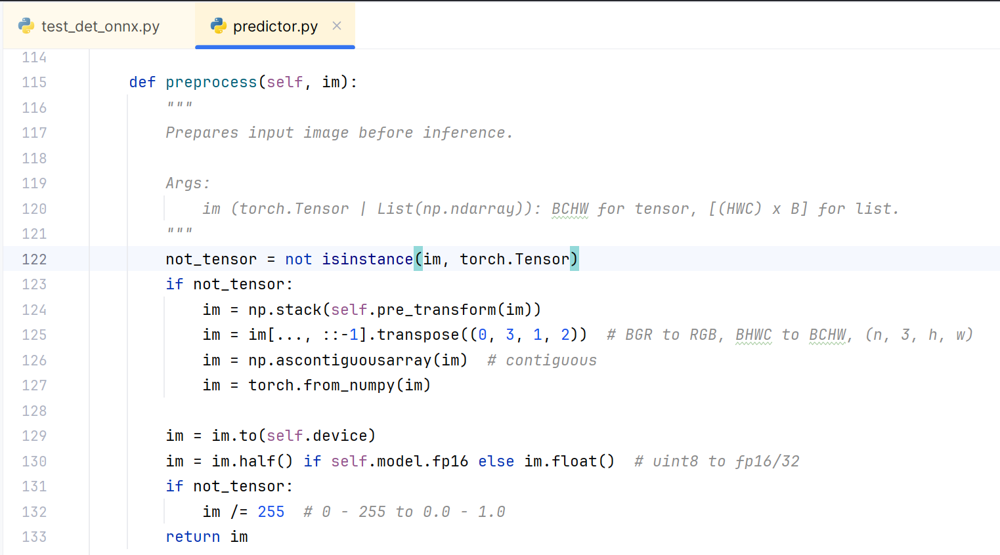

1.  **onnx推理**

将预处理好的数据，喂给模型，得到onnx推理结果

```text
outputs = ort_session.run(None, {input_name: img_input})
```

1.  **后处理**

后处理构建（常用的方法：softmax、loc解码、nms等）：参考predict.py等测试脚本、现成的onnx推理脚本。

```text
def postprocess(predictions, scale, original_image, conf_threshold=0.25, iou_threshold=0.45, classes=None):"""后处理推理结果，进行非极大抑制（NMS），并将检测框映射回原始图像。"""predictions = predictions[0]  # 移除批次维度predictions=np.transpose(predictions,(1,0))# 分离边界框、置信度和类别概率boxes = predictions[:, :4]  # x_center, y_center, w, hclass_scores = predictions[:, 4:]scores=np.max(class_scores,axis=1)# 计算置信度class_ids = class_scores.argmax(axis=1)# 过滤低置信度的框mask = scores > conf_thresholdboxes = boxes[mask]scores = scores[mask]class_ids = class_ids[mask]# 转换边界框格式，从 (x_center, y_center, w, h) 转为 (x1, y1, x2, y2)boxes_xy = boxes[:, :2]boxes_wh = boxes[:, 2:4]boxes_xy -= boxes_wh / 2boxes_xy = boxes_xy/scaleboxes_wh = boxes_wh/scaleboxes_xy2 = boxes_xy + boxes_whboxes = np.concatenate([boxes_xy, boxes_xy2], axis=1)# 转换为 float32 类型boxes = boxes.astype(np.float32)scores = scores.astype(np.float32)# 使用 OpenCV 的 NMS 进行非极大抑制indices = cv2.dnn.NMSBoxes(boxes.tolist(), scores.tolist(), conf_threshold, iou_threshold)# 如果没有检测到目标，返回空列表if len(indices) == 0:    return []indices = indices.flatten()detections = []for i in indices:    box = boxes[i]    score = scores[i]    class_id = class_ids[i]    detections.append({        "box": box,        "score": score,        "class_id": class_id    })return detections
```

参考：目标检测源码中的predict.py，对模型输入结果：loc（边界框）、conf（得分）、坐标点等进行后处理，进而得到预测框、得分、坐标。

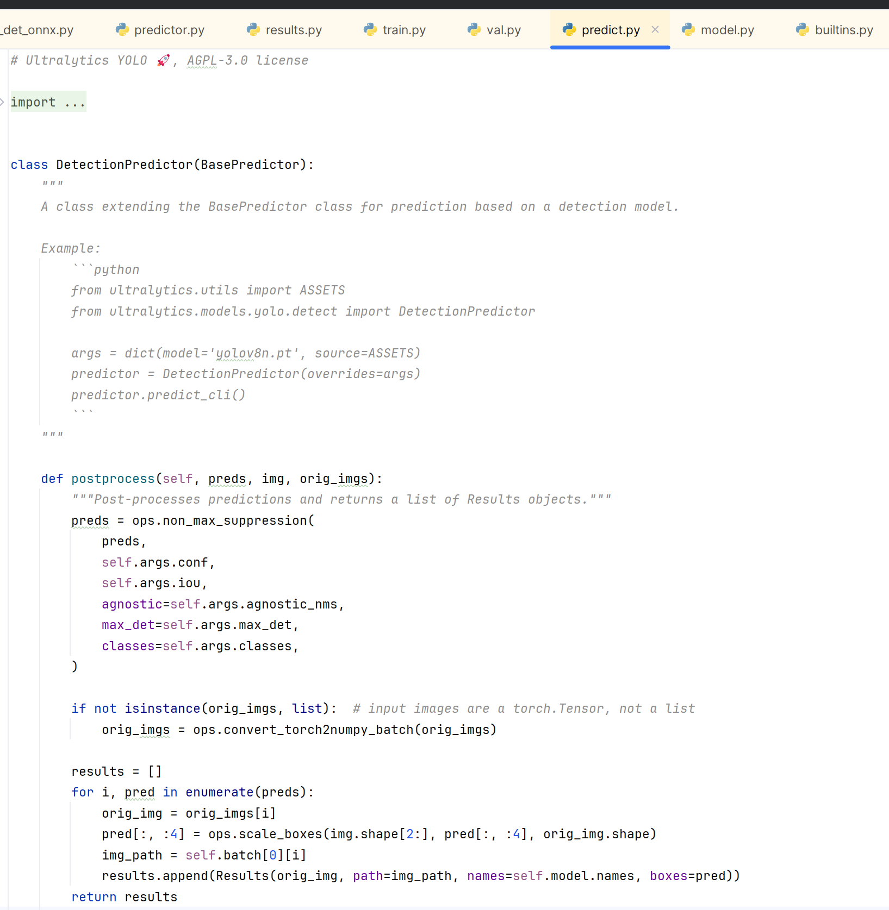

1.  **显示结果**

显示结果：将后处理之后的结果画到原图。

```text
def draw_boxes(image, detections, class_names,colors):"""在图像上绘制检测框和类别标签。"""for det in detections:    box = det["box"]    score = det["score"]    class_id = det["class_id"]    x1, y1, x2, y2 = map(int, box)    label = f"{class_names[class_id]}: {score:.2f}"    # 绘制边界框    cv2.rectangle(image, (x1, y1), (x2, y2), colors[class_id], 2)    # 绘制标签    (text_width, text_height), _ = cv2.getTextSize(label, cv2.FONT_HERSHEY_SIMPLEX, 0.5, 1)    cv2.putText(image, label, (x1, y1 - 5), cv2.FONT_HERSHEY_SIMPLEX, 0.5, colors[class_id], 1)return image
```

1.  **执行步骤**
2.  在Ubuntu端新建终端，直接在终端输入：

```text
conda activate py39_yolov8
```

1.  进入ONNX推理源码目录

```text
cd k230_sdk/src/reference/yolov8_Analysis/detect/
```

1.  拷贝ONNX模型至当前目录

```text
cp ~/yolov8_model/yolov8n.onnx .
```

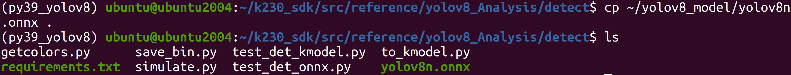

1.  执行onnx推理程序

```text
python test_det_onnx.py
```

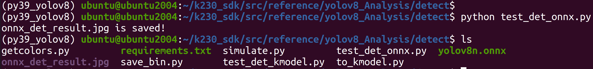

程序会去读取 ../test-images/bus.pg图像进行推理，推理后的图像会保存为当前目录下的onnx\_det\_result.jpg。推理结果图像如下所示：

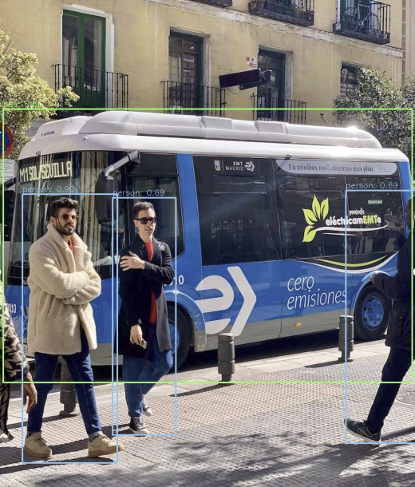

## ONNX到Kmodel转换

目标检测onnx模型经过nncase编译之后，可以生成在k230上推理的模型kmodel，生成kmodel需要调用nncase的**编译模型APIs(Python)**。

1.  **配置生成kmodel参数**

**1.1 编译参数：CompileOptions**

| 参数类别 | 参数名称 |
| --- | --- |
| 编译目标参数 | target |
| 预处理参数 | input_shape、input_layout、 swapRB、input_type、input_range、mean、std等 |
| 后处理参数 | output_layout |

**编译目标参数：**

```text
# 指定编译目标, 如'cpu', 'k230'
compile_options.target = args.target
```

1.  target = “cpu”，生成cpu上推理的kmodel，此时不进行量化；
2.  target = “k230”，生成在k230(kpu)上推理的kmodel，此时模型进行量化（默认uint8量化）；

**预处理参数**：由于预处理参数比较复杂，接下来我们着重介绍下常用预处理参数。

```text
# 是否开启前处理，默认为False
compile_options.preprocess = True
```

1.  预处理参数（preprocess = False时，不进行任何预处理，kmodel ≈ onnx）
2.  预处理参数（preprocess = True时，kmodel ≈ 预处理 + onnx，此时kmodel包含设置的预处理，这些预处理会在KPU计算，KPU计算较快，因此最好将尽可能多预处理放到kmodel上）

| 预处理操作类型 | 相关参数 |
| --- | --- |
| Transpose | input_shape、input_layout |
| SwapRB | swapRB |
| Dequantize | input_type、input_range |
| Normalization | mean、std |

**Transpose参数**：

```text
# 输入图像的shape 320*320compile_options.input_shape = input_shape
compile_options.input_layout = "NCHW"
```

**实际推理时**，目标检测onnx输入layout：NCHW，shape是\[1, 3, 320, 320\]，所以input\_layout = "NCHW",input\_shape=\[1, 3, 320, 320\]

**SwapRB参数：**

```text
compile_options.swapRB = False
```

相关参数：swapRB：是否在 channel维度反转数据，默认为False

```text
# 模型输入格式‘uint8’或者‘float32’compile_options.input_type = 'uint8'# 如果输入是‘uint8’格式，输入反量化之后的范围compile_options.input_range = [0, 1]
```

相关参数：

-   input\_type：与kmodel实际输入数据类型一致；**当 preprocess为 True时，必须指定为”uint8”或者”float32**。
-   input\_range：指定输入数据反量化后的**浮点数范围**；**当 preprocess为 True且 input\_type为 uint8时，必须指定**。
-   分析说明：
-   若kmodel input\_type为float32，不进行反量化
-   若kmodel input\_type为uint8，range为\[0,255\]，当input\_range为\[0,255\]时，则反量化的作用只是进行类型转化，将uint8的数据转化为float32
-   若kmodel input\_type为uint8，range为\[0,255\]，当input\_range为\[0,1\]，则反量化会将定点数转化为\[0.0,1.0\]的浮点数
-   **实际推理时**，目标检测kmodel实际输入从sensor中获取，数据类型为uint8，所以input\_type = 'uint8',input\_range = \[0,255\]或\[0,1\]均可

**Normalization参数**：

```text
compile_options.mean = [0, 0, 0] compile_options.std = [1, 1, 1]
```

-   mean：预处理标准化参数均值，默认为\[0,0,0\]
-   std：预处理标准化参数方差，默认为\[1,1,1\]

**1.2 导入参数：ImportOptions
**ImportOptions类, 用于配置nncase导入选项，很少单独设置，使用默认参数即可。

```text
model_content = read_model_file(model_file)import_options = nncase.ImportOptions()compiler.import_onnx(model_content, import_options)
```

**1.3 训练后量化参数：PTQTensorOptions**

训练后量化参数(Post Training Quantization，PTQ)，PTQ是一种通过将模型权重从float32映射uint8或int16方法，保持模型的准确性的同时，减少推理所需的计算资源；当target = “k230”，PTQ是必选参数，默认uint8量化。

使用uint8量化可以满足目标检测精度要求，故使用默认uint8量化；校正集个数为100；假设使用100个校正集生成kmodel的时间很久，可以适当的减少校正集。

```text
ptq_options = nncase.PTQTensorOptions()ptq_options.samples_count = 100
#ptq_options.set_tensor_data(generate_data_ramdom(input_shape, ptq_options.samples_count))ptq_options.set_tensor_data(generate_data(input_shape, ptq_options.samples_count, args.dataset))compiler.use_ptq(ptq_options)
```

1.  **校正集准备**

```text
因为生成kmodel时，使用了后处理量化，因此需要准备校正集。使用少量校正集计算量化因子，可以快速得到量化模型。使用该量化模型进行预测，可在保证模型准确性的同时，减少计算量、降低计算内存、减小模型大小。
校正集一般选用验证集的100张图片即可，目标检测模型的验证集coc128_val，故选用coco128_val的100张图像作为校正集。
```

**注：**

1.  若是kmodel**生成时间很久**或者验证集数据很少，也可尝试少于100个数据
2.  generate\_data函数，生成的数据格式，需要**尽量保证**与实际推理时喂给kmodel的数据格式一致，否则会导致生成kmodel有问题。

```text
def generate_data(shape, batch, calib_dir):img_paths = [os.path.join(calib_dir, p) for p in os.listdir(calib_dir)]data = []for i in range(batch):    assert i < len(img_paths), "calibration images not enough."    img_data = Image.open(img_paths[i]).convert('RGB')    img_data = img_data.resize((shape[3], shape[2]), Image.BILINEAR)    img_data = np.asarray(img_data, dtype=np.uint8)    img_data = np.transpose(img_data, (2, 0, 1))    data.append([img_data[np.newaxis, ...]])return np.array(data)
```

1.  **执行步骤**

**注意：**若已经激活Kmodel模型转换环境，请忽略步骤①和步骤②。

在Ubuntu中新建终端，并进入k230\_SDK目录下


激活Kmodel模型转换环境

```text
sudo docker run -u root -it -v $(pwd):$(pwd) -v $(pwd)/toolchain:/opt/toolchain -w $(pwd) ghcr.io/kendryte/k230_sdk /bin/bash
```


进入kmodel转换程序源码目录

```text
cd src/reference/yolov8_Analysis/detect/
```

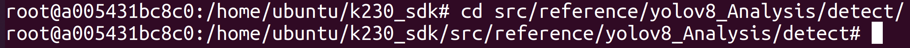

安装nncase相关库

```text
pip install nncase==2.9.0
pip install nncase-kpu==2.9.0
```

安装yolov8模型转换所需的额外的库

```text
pip install -r requirements.txt
```

执行模型转换程序

```text
python to_kmodel.py --target k230 --model ./yolov8n.onnx --dataset ../test --input_width 320 --input_height 320 --ptq_option 0
```

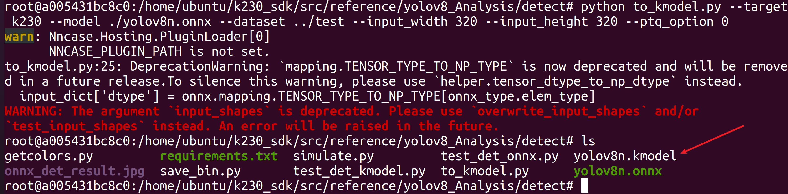

执行完成后，可在当前目录下看到生成的yolov8n.kmodel模型文件。生成的kmodel如下所示：

```text
-rw-r--r-- 1 root root 3495944 Dec  5 15:56 yolov8n.kmodel
```

## 使用K230Runtime进行验证

1.  **Simulator验证kmodel**

Simulator：在PC端模拟kmodel在k230的推理过程，用于对比kmodel和onnx输出是否一致；

**1.1 生成input.bin**

在使用Simulator验证kmodel之前，需要先准备好输入文件。由于kmodel包括部分预处理，因此对于同一张图片，需要分别利用不同预处理生成onnx\_input.bin、kmodel\_input.bin。


**注**：由于生成的kmodel中包含部分预处理，生成kmodel\_input.bin需要的预处理 ≈ 生成onnx\_input.bin需要的预处理 - kmodel中包含的预处理（人脸检测kmodel中预处理transpose、dequantize、normalization、swapRB）

1.  维度扩展可以省略（读取时bin文件可以用reshape，生成bin时可以省略）。
2.  kmodel\_input.bin为什么无需进行dequantize、normalization操作？dequantize、normalization已放到kmodel中。
3.  为什么需要生成kmodel\_input.bin需要bgr->rgb？生成人脸检测kmode时，由于实际需要，预处理打开了swapRB开关，用于rgb->bgr，对应的，生成kmodel\_input.bin时，则需要先将数据转成rgb顺序；
4.  transpose也放到kmodel中，为什么生成kmodel\_input.bin仍需transpose？由于生成kmodel，若是打开了预处理开关，transpose的相关参数必须设置，我们人脸检测kmodel的实际输入是\`NCHW\`，input\_layout设置为\`NCHW\`，两者是一致的，因此transpose是NCHW2NCHW，实际上并没有转换。

**生成input.bin的过程：**（放在onnx推理的预处理方法中）

代码位置：

```text
k230_sdk/src/reference/K230_AI_Demo_Development_Process_Analysis/onnx_related/onnx_inference/face_detection/face_detector.py
```

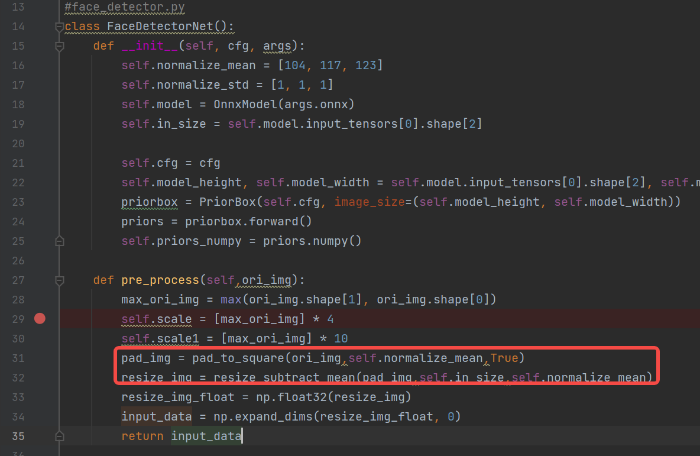


**1.2 Simulator验证**

对于同一张图片，分别利用不同预处理生成不同的onnx\_input.bin、kmodel\_input.bin，

1.  将onnx\_input.bin喂给onnx，经过onnx推理得cpu\_results；
2.  将kmodel\_input.bin喂给kmodel，经过Simulator推理得到nncase\_results；
3.  计算cpu\_results和nncase\_results的余弦相似度，通过相似度的大小来判断生成的kmodel是否正确。

```text
# mobile_retinaface_onnx_simu_640.py
import os
import copy
import argparse
import numpy as np
import onnx
import onnxruntime as ort
import nncase
def read_model_file(model_file):
with open(model_file, 'rb') as f:
    model_content = f.read()
return model_content
def cosine(gt, pred):
return (gt @ pred) / (np.linalg.norm(gt, 2) * np.linalg.norm(pred, 2))
def main():
parser = argparse.ArgumentParser(prog="nncase")
parser.add_argument("--target", type=str, help='target to run')
parser.add_argument("--model", type=str, help='original model file')
parser.add_argument("--model_input", type=str, help='input bin file for original model')
parser.add_argument("--kmodel", type=str, help='kmodel file')
parser.add_argument("--kmodel_input", type=str, help='input bin file for kmodel')
args = parser.parse_args()
# 1. onnx推理，得到cpu_results
ort_session = ort.InferenceSession(args.model)
output_names = []
model_outputs = ort_session.get_outputs()
for i in range(len(model_outputs)):
    output_names.append(model_outputs[i].name)
model_input = ort_session.get_inputs()[0]
  
model_input_name = model_input.name
model_input_type = np.float32
model_input_shape = model_input.shape
print('onnx_input：',model_input_shape)
model_input_data = np.fromfile(args.model_input, model_input_type).reshape(model_input_shape)
cpu_results = []
cpu_results = ort_session.run(output_names, { model_input_name : model_input_data })
    
# 2. Simulator推理，得到nncase_results
# create Simulator
sim = nncase.Simulator()
# read kmodel
kmodel = read_model_file(args.kmodel)
# load kmodel
sim.load_model(kmodel)
# read input.bin
input_shape = [1, 3, 640, 640]
dtype = sim.get_input_desc(0).dtype
input = np.fromfile(args.kmodel_input, dtype).reshape(input_shape)
# set input for Simulator
sim.set_input_tensor(0, nncase.RuntimeTensor.from_numpy(input))
# Simulator inference
nncase_results = []
sim.run()
for i in range(sim.outputs_size):
    nncase_result = sim.get_output_tensor(i).to_numpy()
    # print("nncase_result:",nncase_result)
    input_bin_file = 'bin/face_det_{}_{}_simu.bin'.format(i,args.target)
    nncase_result.tofile(input_bin_file)
    nncase_results.append(copy.deepcopy(nncase_result))
# 3. 计算onnx和Simulator相似度
for i in range(sim.outputs_size):
    cos = cosine(np.reshape(nncase_results[i], (-1)), np.reshape(cpu_results[i], (-1)))
    print('output {0} cosine similarity : {1}'.format(i, cos))
if __name__ == '__main__':
main()
```

 -
上边的脚本可以满足大部分onnx及其kmodel的对比验证，一般不用太多修改。只需根据模型实际输入大小修改\`input\_shape\`即可。

1.  **Simulator验证kmodel执行步骤**

**注意：**若已经激活Kmodel模型转换环境，请忽略步骤①和步骤②。

1.  在Ubuntu中新建终端，并进入k230\_SDK目录下


1.  激活Kmodel模型转换环境

```text
sudo docker run -u root -it -v $(pwd):$(pwd) -v $(pwd)/toolchain:/opt/toolchain -w $(pwd) ghcr.io/kendryte/k230_sdk /bin/bash
```


1.  进入kmodel验证程序源码目录

```text
cd src/reference/yolov8_Analysis/detect/
```

1.  安装nncase相关库与模型验证相关库

```text
pip install nncase==2.9.0
pip install nncase-kpu==2.9.0
pip install opencv-python==4.10.0.82
pip install opencv-python-headless
pip install onnx
pip install onnxruntime
pip install onnxsim
pip install --upgrade onnxruntime
```

1.  生成测试所需的bin文件

```text
python save_bin.py --image ../test-images/bus.jpg --input_width 320 --input_height 320
```

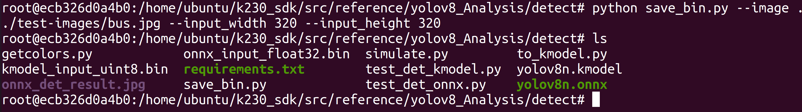

1.  添加Simulator环境变量

```text
export NNCASE_PLUGIN_PATH=$NNCASE_PLUGIN_PATH:/usr/local/lib/python3.8/dist-packages/
export PATH=$PATH:/usr/local/lib/python3.8/dist-packages/
source /etc/profile
```

1.  执行模型验证程序

```text
python simulate.py --model yolov8n.onnx --model_input onnx_input_float32.bin --kmodel yolov8n.kmodel --kmodel_input kmodel_input_uint8.bin --input_width 320 --input_height 320
```

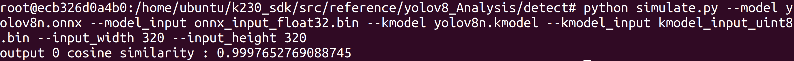

一般onnx和Simulator余弦相似度越高越好，一般0.99以上即可满足条件；若是达不到0.99，但是在0.96以上，可以通过进一步上板推理验证生成的kmodel是否满足实际效果需求。

## 使用K230Runtime进行推理

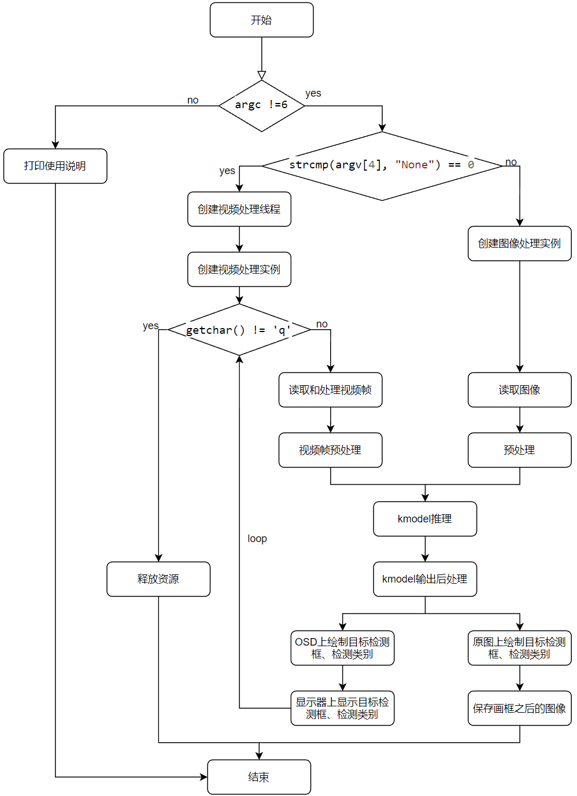

代码位置：

k230\_sdk/src/reference/ai\_poc/object\_detect\_yolov8n

```text
├── ai_base.cc                  #AI基类，封装KPU(K230)运行时API，简化kmodel相关操作
├── ai_base.h
├── CMakeLists.txt
├── ob_det.cc           #yolov8目标检测demo，预处理，kmodel推理、后处理
├── ob_det.h
├── main.cc                     #yolov8目标检测demo主流程
├── README.md
├── scoped_timing.hpp           #计时类
├── utils.cc                    #工具类，封装常用函数及AI2D运行时APIs，简化预处理操作
```

使用K230Runtime推理kmodel需要详细了解K230Runtime的说明文档，为了简化推理流程，对K230Runtime的接口进行封装，其中ai\_base.cc、scoped\_timing.hpp、utils.cc、vi\_vo.h是封装好的方法，无需修改；face\_detection.cc已经在人脸检测demo中实现，直接拷贝即可；face\_recognition.cc只需将face\_detection.cc拷贝一份，修改对应构造函数、预处理（pre\_process）、后处理（post\_process）即可。

1.  **读取图片或视频帧**
2.  **读取图片**

```text
cv::Mat ori_img = cv::imread(xxx);
```

1.  **读取视频帧**

读取视频帧示例：

K230\_AI\_Demo\_Development\_Process\_Analysis\\kmodel\_related\\kmodel\_inference\\test\_demo\\test\_vi\_vo

1.  **图像预处理**

**背景知识：**参数不变的情况下，\`ai2d\_builder\_\`可以反复调用；参数改变则需要创建新的\`ai2d\_builder\_\`。

对于图像预处理：由于不同图像的尺寸不同，对于padding\_resize方法来说，AI2D的参数每次都会改变，需要重新调用Utils::padding\_resize\_one\_side创建新的\`ai2d\_builder\_\`来进行预处理。

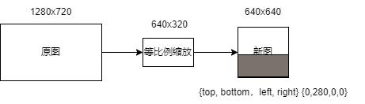

对于视频流预处理：由于不同帧的尺寸相同，padding的数值也未改变；故对于\`padding\_resize\`方法来说，AI2D的参数一直不变，将新一帧的图像拷贝给\`ai2d\_in\_tensor\_\`后，只需\`ai2d\_builder\_->invoke\`（目标检测构造函数中已经构造好\`ai2d\_builder\_\`）调用。

图像检测前处理示例：

```text
void OBDet::pre_process(cv::Mat ori_img)
{
ScopedTiming st(model_name_ + " pre_process image", debug_mode_);
std::vector<uint8_t> chw_vec;
Utils::bgr2rgb_and_hwc2chw(ori_img, chw_vec); //将BGR图片从hwc转为chw
Utils::resize({ori_img.channels(), ori_img.rows, ori_img.cols}, chw_vec, ai2d_out_tensor_);//对chw数据进行resize
// auto vaddr_out_buf = ai2d_out_tensor_.impl()->to_host().unwrap()->buffer().as_host().unwrap().map(map_access_::map_read).unwrap().buffer();
// unsigned char *output = reinterpret_cast<unsigned char *>(vaddr_out_buf.data());
// Utils::dump_color_image("input_color.png", {input_shapes_[0][3],input_shapes_[0][2]},output);
}
```

视频流检测前处理示例：

```text
void OBDet::pre_process()
{
ScopedTiming st(model_name_ + " pre_process video", debug_mode_);
size_t isp_size = isp_shape_.channel * isp_shape_.height * isp_shape_.width;
auto buf = ai2d_in_tensor_.impl()->to_host().unwrap()->buffer().as_host().unwrap().map(map_access_::map_write).unwrap().buffer();
memcpy(reinterpret_cast<char *>(buf.data()), (void *)vaddr_, isp_size);
hrt::sync(ai2d_in_tensor_, sync_op_t::sync_write_back, true).expect("sync write_back failed");
ai2d_builder_->invoke(ai2d_in_tensor_, ai2d_out_tensor_).expect("error occurred in ai2d running");
}
```

1.  **kmodel端侧模型推理**

**背景知识：**

**AIBase简介：**AIBase主要封装了KPU相关操作，包括在AI设备（如k230）加载kmodel，设置kmodel输入数据，执行kpu/cpu计算， 获取kmodel输出数据等，AIBase的封装简化了KPU调用过程。

目标检测kmode推理：

```text
//ai_base.cc
void AIBase::run()
{
ScopedTiming st(model_name_ + " run", debug_mode_);
kmodel_interp_.run().expect("error occurred in running model");
}
void AIBase::get_output()
{
ScopedTiming st(model_name_ + " get_output", debug_mode_);
p_outputs_.clear();
for (int i = 0; i < kmodel_interp_.outputs_size(); i++)
{
    auto out = kmodel_interp_.output_tensor(i).expect("cannot get output tensor");
    auto buf = out.impl()->to_host().unwrap()->buffer().as_host().unwrap().map(map_access_::map_read).unwrap().buffer();
    float *p_out = reinterpret_cast<float *>(buf.data());
    p_outputs_.push_back(p_out);
}
}
//face_detection.cc
void FaceDetection::inference()
{
this->run();
this->get_output();
}
//main.cc，验证kmodel推理是否正确：我们使用simulator已经验证过
......
FaceDetection fd;
fd.inference();
......
```

1.  **推理结果后处理**


**c++后处理（详情见代码）：**

```text
//face_detection.cc
void FaceDetection::post_process(FrameSize frame_size, vector<FaceDetectionInfo> &results)
{
ScopedTiming st(model_name_ + " post_process", debug_mode_);
if (debug_mode_ > 3)
{
 //验证后处理流程是否正确：排除预处理、模型推理，直接拿Simulator kmodel数据，判断后处理代码正确性。
 ......
}
else
{
    filter_confs(p_outputs_[1]);
    filter_locs(p_outputs_[0]);
    filter_landms(p_outputs_[2]);
 }
std::sort(confs_.begin(), confs_.end(), nms_comparator);
nms(results);
transform_result_to_src_size(frame_size, results);
}
```


调整顺序之后的kmodel推理流程，更适合c++代码。

**人脸检测后处理代码：**

```text
//face_detection.cc
void FaceDetection::post_process(FrameSize frame_size, vector<FaceDetectionInfo> &results)
{
ScopedTiming st(model_name_ + " post_process", debug_mode_);
if (debug_mode_ > 2)
{
    //验证后处理流程是否正确：排除预处理、模型推理，直接拿Simulator kmodel数据，判断后处理代码正确性。
    vector<float> out0 = Utils::read_binary_file<float>("../debug/face_det_0_k230_simu.bin");
    vector<float> out1 = Utils::read_binary_file<float>("../debug/face_det_1_k230_simu.bin");
    vector<float> out2 = Utils::read_binary_file<float>("../debug/face_det_2_k230_simu.bin");
    filter_confs(out1.data());
    filter_locs(out0.data());
    filter_landms(out2.data());
}
else
{
    filter_confs(p_outputs_[1]);
    filter_locs(p_outputs_[0]);
    ilter_landms(p_outputs_[2]);
}
std::sort(confs_.begin(), confs_.end(), nms_comparator);
nms(results);
transform_result_to_src_size(frame_size, results);
}
/********************根据检测阈值kmodel数据结果***********************/
void FaceDetection::filter_confs(float *conf)
{
NMSRoiObj inter_obj;
confs_.clear();
for (uint32_t roi_index = 0; roi_index < objs_num_; roi_index++)
{
    float score = conf[roi_index * CONF_SIZE + 1];
    if (score > obj_thresh_)
    {
        inter_obj.ori_roi_index = roi_index;
        inter_obj.before_sort_conf_index = confs_.size();
        inter_obj.confidence = score;
        confs_.push_back(inter_obj);
    }
}
}
void FaceDetection::filter_locs(float *loc)
{
boxes_.clear();
boxes_.resize(confs_.size());
int roi_index = 0;
for (uint32_t conf_index = 0; conf_index < boxes_.size(); conf_index++)
{
    roi_index = confs_[conf_index].ori_roi_index;
    int start = roi_index * LOC_SIZE;
    for (int i = 0; i < LOC_SIZE; ++i)
    {
        boxes_[conf_index][i] = loc[start + i];
    }
}
}
void FaceDetection::filter_landms(float *landms)
{
landmarks_.clear();
landmarks_.resize(confs_.size());
int roi_index = 0;
for (uint32_t conf_index = 0; conf_index < boxes_.size(); conf_index++)
{
    roi_index = confs_[conf_index].ori_roi_index;
    int start = roi_index * LAND_SIZE;
    for (int i = 0; i < LAND_SIZE; ++i)
    {
        landmarks_[conf_index][i] = landms[start + i];
    }
}
}
/********************根据anchor解码检测框、五官点***********************/
Bbox FaceDetection::decode_box(int obj_index)
{
float cx, cy, w, h;
int box_index = confs_[obj_index].before_sort_conf_index;
int anchor_index = confs_[obj_index].ori_roi_index;
cx = boxes_[box_index][0];
cy = boxes_[box_index][1];
w = boxes_[box_index][2];
h = boxes_[box_index][3];
cx = g_anchors[anchor_index][0] + cx * 0.1 * g_anchors[anchor_index][2];
cy = g_anchors[anchor_index][1] + cy * 0.1 * g_anchors[anchor_index][3];
w = g_anchors[anchor_index][2] * std::exp(w * 0.2);
h = g_anchors[anchor_index][3] * std::exp(h * 0.2);
Bbox box;
box.x = cx - w / 2;
box.y = cy - h / 2;
box.w = w;
box.h = h;
return box;
}
SparseLandmarks FaceDetection::decode_landmark(int obj_index)
{
SparseLandmarks landmark;
int landm_index = confs_[obj_index].before_sort_conf_index;
int anchor_index = confs_[obj_index].ori_roi_index;
for (uint32_t ll = 0; ll < 5; ll++)
{
    landmark.points[2 * ll + 0] = g_anchors[anchor_index][0] + landmarks_[landm_index][2 * ll + 0] * 0.1 * g_anchors[anchor_index][2];
    landmark.points[2 * ll + 1] = g_anchors[anchor_index][1] + landmarks_[landm_index][2 * ll + 1] * 0.1 * g_anchors[anchor_index][3];
}
return landmark;
}
/********************iou计算***********************/
float FaceDetection::overlap(float x1, float w1, float x2, float w2)
{
float l1 = x1 - w1 / 2;
float l2 = x2 - w2 / 2;
float left = l1 > l2 ? l1 : l2;
float r1 = x1 + w1 / 2;
float r2 = x2 + w2 / 2;
float right = r1 < r2 ? r1 : r2;
return right - left;
}
float FaceDetection::box_intersection(Bbox a, Bbox b)
{
float w = overlap(a.x, a.w, b.x, b.w);
float h = overlap(a.y, a.h, b.y, b.h);
if (w < 0 || h < 0)
    return 0;
return w * h;
}
float FaceDetection::box_union(Bbox a, Bbox b)
{
float i = box_intersection(a, b);
float u = a.w * a.h + b.w * b.h - i;
return u;
}
float FaceDetection::box_iou(Bbox a, Bbox b)
{
return box_intersection(a, b) / box_union(a, b);
}
/********************nms***********************/
void FaceDetection::nms(vector<FaceDetectionInfo> &results)
{
// nms
for (int conf_index = 0; conf_index < confs_.size(); ++conf_index)
{
    if (confs_[conf_index].confidence < 0)
        continue;
    FaceDetectionInfo obj;
    obj.bbox = decode_box(conf_index);
    obj.sparse_kps = decode_landmark(conf_index);
    obj.score = confs_[conf_index].confidence;
    results.push_back(obj);
    for (int j = conf_index + 1; j < confs_.size(); ++j)
    {
        if (confs_[j].confidence < 0)
            continue;
        Bbox b = decode_box(j);
        if (box_iou(obj.bbox, b) >= nms_thresh_) // iou大于nms阈值的，之后循环将会忽略
            confs_[j].confidence = -1;
    }
}
}
/********************将人脸检测结果变换到原图***********************/
void FaceDetection::transform_result_to_src_size(FrameSize &frame_size, vector<FaceDetectionInfo> &results)
{
// transform result to dispaly size
int max_src_size = std::max(frame_size.width, frame_size.height);
for (int i = 0; i < results.size(); ++i)
{
    auto &l = results[i].sparse_kps;
    for (uint32_t ll = 0; ll < 5; ll++)
    {
        l.points[2 * ll + 0] = l.points[2 * ll + 0] * max_src_size;
        l.points[2 * ll + 1] = l.points[2 * ll + 1] * max_src_size;
    }
    auto &b = results[i].bbox;
    float x0 = b.x * max_src_size;
    float x1 = (b.x + b.w) * max_src_size;
    float y0 = b.y * max_src_size;
    float y1 = (b.y + b.h) * max_src_size;
    x0 = std::max(float(0), std::min(x0, float(frame_size.width)));
    x1 = std::max(float(0), std::min(x1, float(frame_size.width)));
    y0 = std::max(float(0), std::min(y0, float(frame_size.height)));
    y1 = std::max(float(0), std::min(y1, float(frame_size.height)));
    b.x = x0;
    b.y = y0;
    b.w = x1 - x0;
        b.h = y1 - y0;
}
}
```

**扩展：**

检测后处理写起来比价复杂，因此对于常见的检测模型，我们给出了一些示例代码。

1.  \- **retinaface**：[人脸检测post\_process](https://github.com/kendryte/k230_sdk/blob/main/src/reference/ai_poc/face_detection/face_detection.cc)
2.  \- **yolov5**：[摔倒检测post\_process](https://github.com/kendryte/k230_sdk/blob/main/src/reference/ai_poc/falldown_detect/falldown_detect.cc)
3.  \- **yolov8**：[人头检测post\_process](https://github.com/kendryte/k230_sdk/blob/main/src/reference/ai_poc/head_detection/head_detection.cc)
4.  **显示结果**

**显示结果示例：**

K230\_AI\_Demo\_Development\_Process\_Analysis\\kmodel\_related\\kmodel\_inference\\test\_demo\\test\_vi\_vo

1.  **执行步骤**

**注意：**若已经激活Kmodel模型转换环境，请忽略步骤①和步骤②。

1.  在Ubuntu中新建终端，并进入k230\_SDK目录下

```text
cd k230_sdk/
```


1.  激活Kmodel模型转换环境

```text
sudo docker run -u root -it -v $(pwd):$(pwd) -v $(pwd)/toolchain:/opt/toolchain -w $(pwd) ghcr.io/kendryte/k230_sdk /bin/bash
```


```text
make CONF=k230_canmv_dongshanpi_defconfig prepare_memory
```

配置开发板环境变量

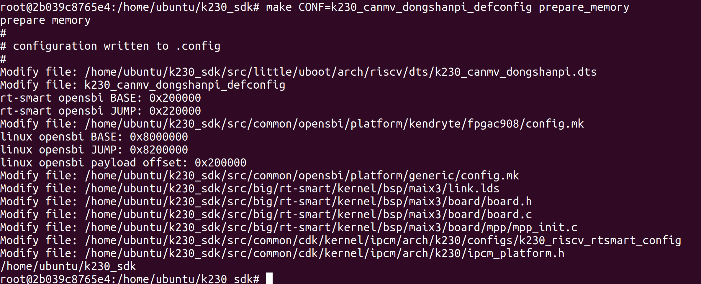

1.  进入kmodel推理程序源码目录

```text
cd src/reference/ai_poc/
```

1.  执行编译脚本

```text
./build_app.sh object_detect_yolov8n
```

编译完成后，可在k230\_bin/ object\_detect\_yolov8目录下看到可执行程序与配套测试文件。

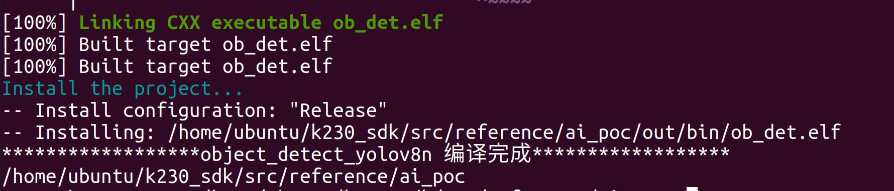

1.  退出docker环境

```text
exit
```

1.  将进入yolov8可执行文件目录并使用adb传输可执行文件至开发板端

```text
cd src/reference/ai_poc/k230_bin/
adb push object_detect_yolov8n /sharefs	
```

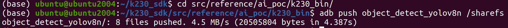

1.  进入yolov8模型转换目录并将转换后的模型传输至开发板端

```text
cd ../../yolov8_Analysis/detect/
adb push yolov8n.kmodel /sharefs/object_detect_yolov8n/
```

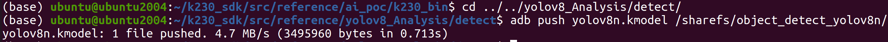

1.  打开开发板的串口B ，访问rt-smart大核系统的串口。由于rt-smart系统有开机自启程序，可输入q + 回车键结束开机自启程序。
2.  进入开发板中可执行文件目录

```text
cd /sharefs/object_detect_yolov8n/
```

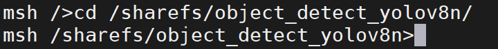

1.  执行程序推理程序

1）单张图片推理

```text
./ob_det.elf yolov8n_320.kmodel 0.5 0.6 bus.jpg 0
```

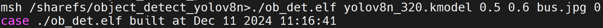

推理完成后，会在当前目录下生成推理结果图像object\_det.jpg。可在Ubuntu端使用ADB获取开发板生成的推理结果图像：

```text
adb pull /sharefs/object_detect_yolov8n/object_det.jpg
```

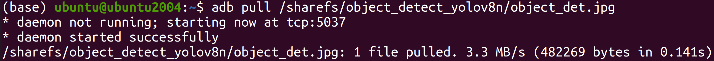

2）视频流推理

```text
./ob_det.elf yolov8n.kmodel 0.5 0.6 None 0
```

执行程序之后可在显示屏看到视频流推理yolov8模型的画面。

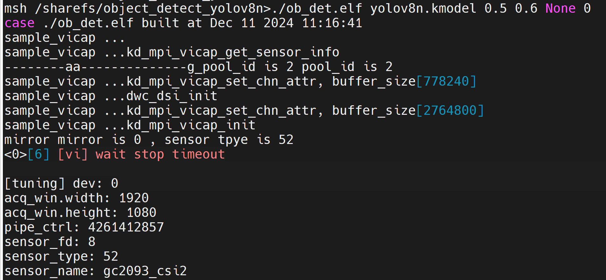
