# 云端模型训练平台的使用

> 本文档根据《嘉楠K230开发手册》V1.0（2024-11-30）整理。正文、表格、示例代码与插图均来自原始手册。

## 云训练平台简介

嘉楠科技开发者社区（https://developer.canaan-creative.com/）模型训练板块是为简化开发流程，提 高开发效率开放的训练平台。该平台使用户更加注重视觉场景的落地实现，更加快捷的完成从数据标注 到获得部署包，并在搭载嘉楠科技Kendryte®系列AIoT芯片中最新一代SOC产品K230的开发板上进行部 署的全部过程。该平台现支持图像分类和图像检测两类任务。

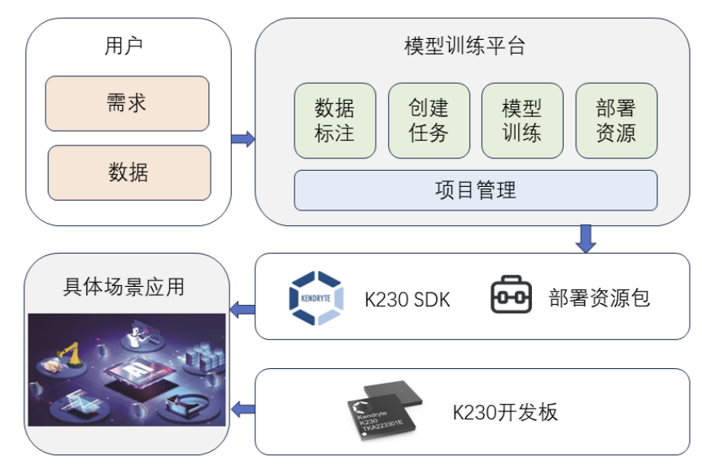

模型训练平台对接用户和板上开发人员，通过创建项目对具体场景下的AI落地过程进行管理，导入数据 后需要用户创建任务并配置训练参数，然后一键启动训练，训练结束后得到部署资源包。部署资源包可以和K230 SDK结合使用，完成后续的开发板开发工作，实现模型部署。

开始前请前往[嘉楠开发者社区模型训练平台](https://developer.canaan-creative.com/model/training)进行账户注册，注册完成后登录系统，进入模型训练界面。

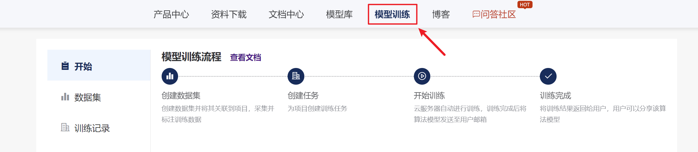

## 实现图像分类任务

1.  **创建数据集**

点击“数据集”选项，并点击“创建数据集”按钮。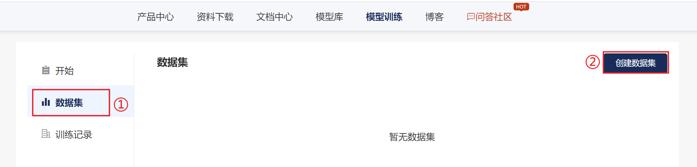

选择标注类型，点击”图像分类”，并填入数据集名称，这里数据集名称可自定义。最好点击提交即可。

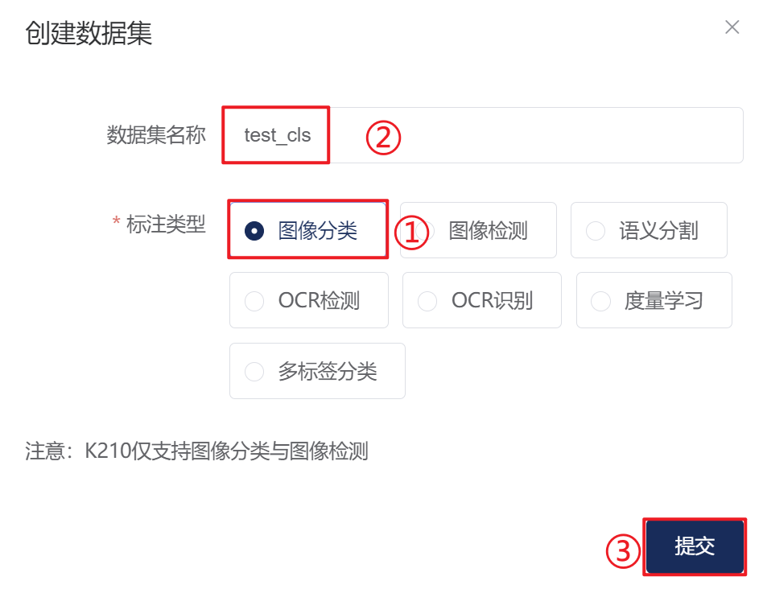

点击“配置“按钮，进入数据集配置界面。

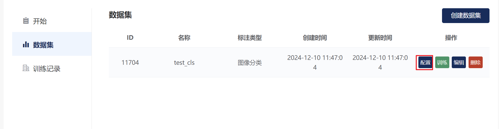

此时可进行数据集的配置，**推荐上传数据集压缩包**的方式。

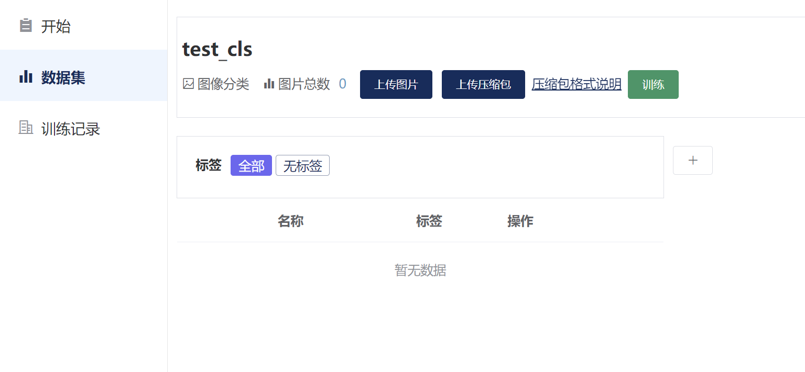

可点击“压缩包格式说明“了解需要如何准备数据集

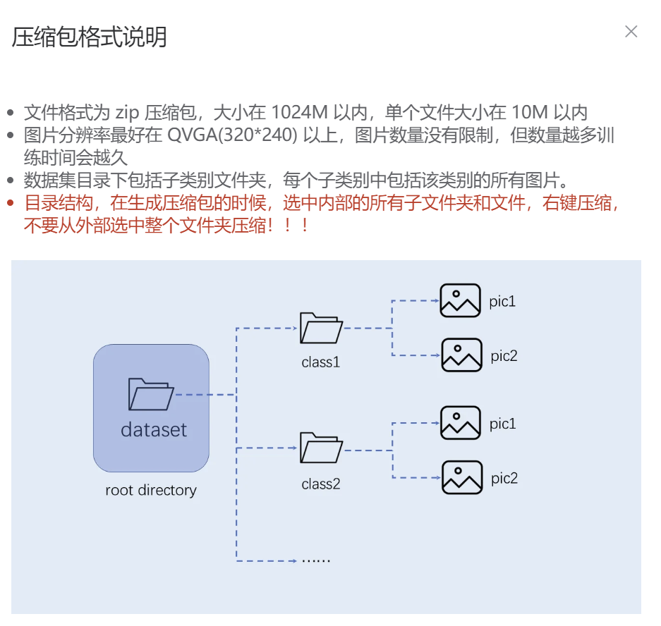

如果不清楚数据集压缩包格式，可前往嘉楠开发者社区资料下载中心：[https://developer.canaan-creative.com/resource](https://developer.canaan-creative.com/resource)。选择对应的数据集压缩包示例进行下载。

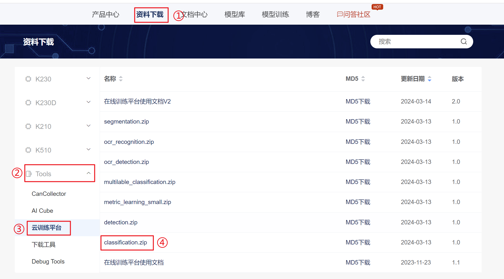

这里我以蔬菜分类数据集压缩包为例，上传至云训练平台。

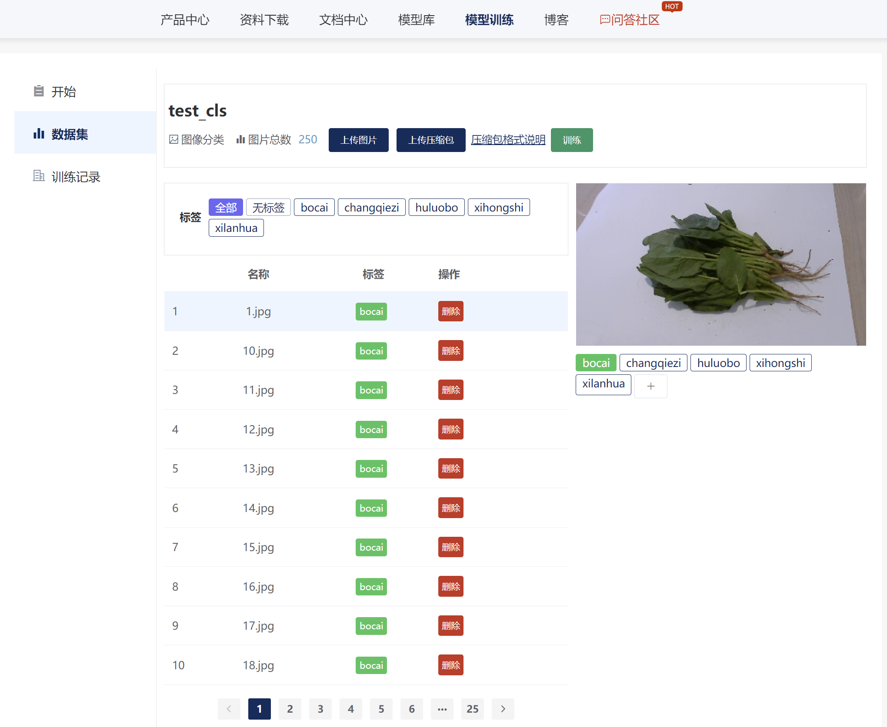

1.  **创建训练任务**

点击“训练“按钮

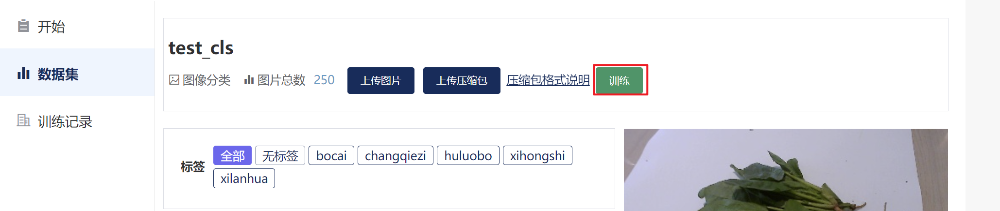

填写任意任务名称，选择运行芯片为K230,nncase版本为2.9.0，设置迭代次数与批数据量大小，设置学习率，最后点击确认即可。

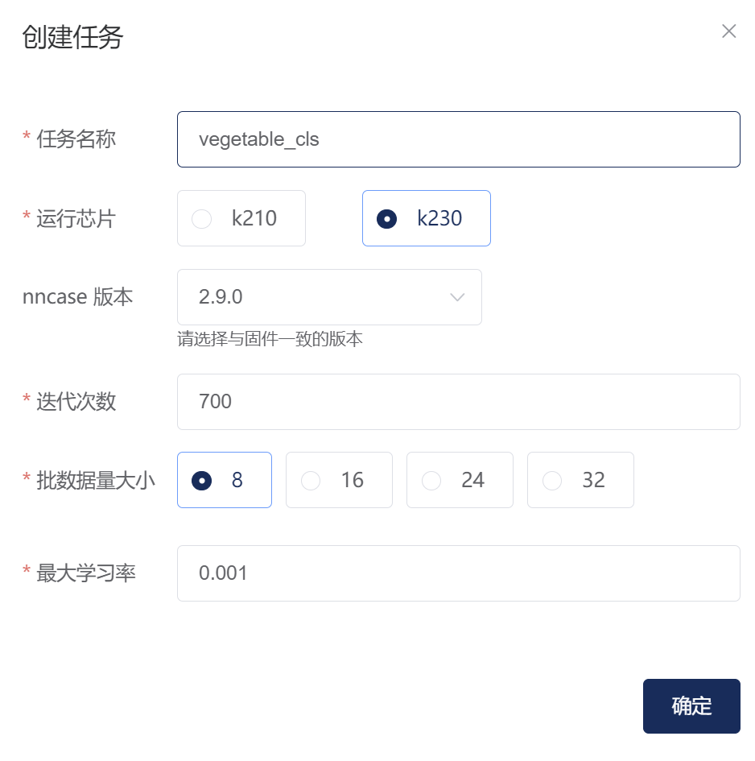

当云端服务器训练资源可用时，该任务会进入训练阶段。点击“训练记录“，并选择”详情“，如下图所示：

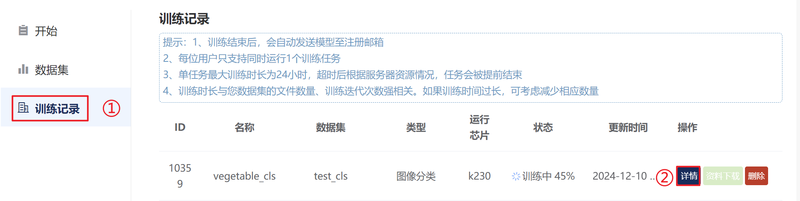

可查看任务的训练情况，如下图所示：

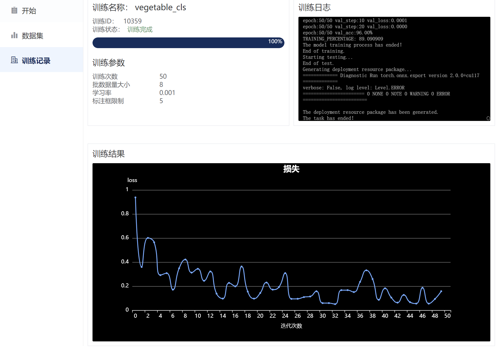

训练结束后可以下载部署包，同时部署包也会发送给您注册的邮箱。当然您也可以点击“训练记录“选项，点击“资料下载”，下载部署资源包。

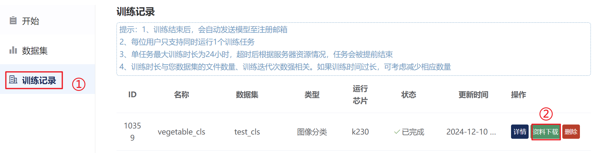

部署包解压后，目录如下：

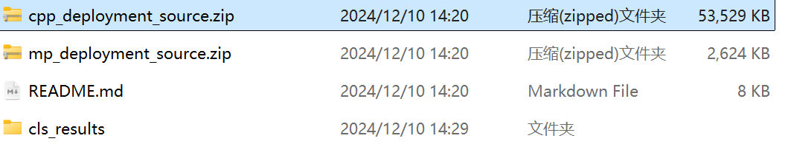

目录说明：

```text
|-cls_result # 此目录存放分类正确的示例图片|-*.kmodel # 开发板部署所用kmodel|-deploy_config.json # 部署配置文件|-cpp_deployment_source.zip # C++部署资源|-mp_deployment_source.zip # MicroPython部署资源
```

1.  **编译与运行分类任务**

**3.1解压部署资源包文件**

解压部署资源包中的cpp\_deployment\_source.zip压缩包，并进入cpp\_deployment\_source文件夹中。

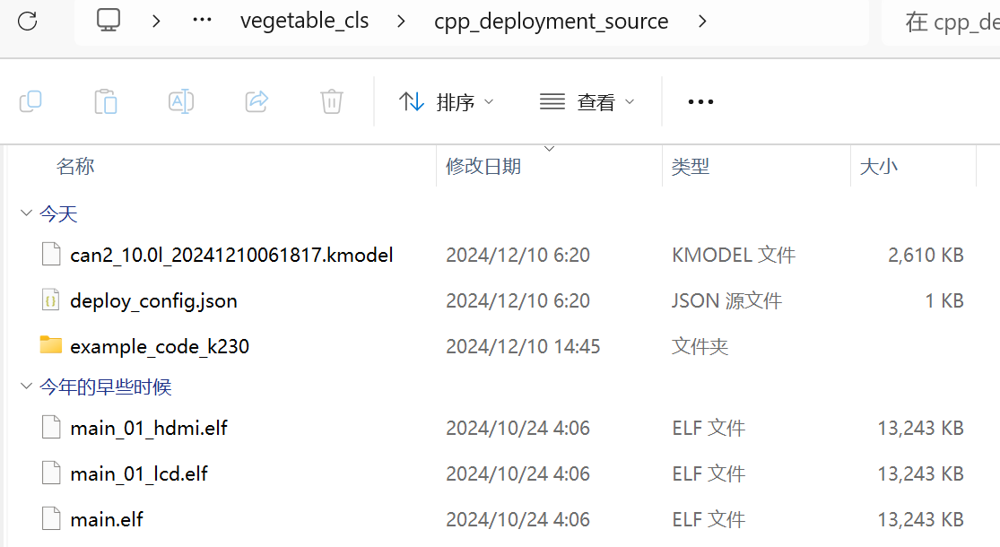

**3.2将示例代码拷贝至Ubuntu**

将示例代码文件夹example\_code\_k230传输至Ubuntu虚拟机中k230\_sdk目录下的src/big/nncase下。

**3.3修改k230\_deploy文件夹下的源码，适配对应的屏幕和摄像头**

1.  修改**vi\_vo.h**文件
2.  这里我们直接修改CANMV的配置，修改显示屏的通道和OSD叠加的宽高。

```text
#if defined(CONFIG_BOARD_K230_CANMV)
#define SENSOR_CHANNEL (3)    
#define SENSOR_HEIGHT (720)  
#define SENSOR_WIDTH (1280)   
#define ISP_CHN0_WIDTH  (960)
#define ISP_CHN0_HEIGHT (540)
#define ISP_INPUT_WIDTH (1920)
#define ISP_INPUT_HEIGHT (1080)
#define vicap_install_osd                   (1)
#define osd_id                              K_VO_OSD3
#define osd_width                           (540)
#define osd_height                          (960)
```


1.  修改显示屏的名称为NT33516。

```text
#if defined(CONFIG_BOARD_K230_CANMV)
k_connector_type connector_type = NT35516_MIPI_2LAN_540X960_30FPS;
```


1.  由于我们的屏幕分辨率使用横屏的方式，观看体验更佳，所以我们在K230D之后增加增加CANMV的配置，使得我们编译的时候也会将屏幕进行旋转横屏。

```text
#if defined(CONFIG_BOARD_K230D_CANMV) || defined(CONFIG_BOARD_K230_CANMV)
info.act_size.width = ISP_CHN0_HEIGHT;//1080;//640;//1080;
info.act_size.height = ISP_CHN0_WIDTH;//1920;//480;//1920;
info.format = PIXEL_FORMAT_YVU_PLANAR_420;
info.func = K_ROTATION_90;
```


1.  修改我们使用的摄像头为GC2093

```text
#if defined(CONFIG_BOARD_K230_CANMV)
sensor_type = GC2093_MIPI_CSI2_1920X1080_30FPS_10BIT_LINEAR;
```


1.  修改**main.c**主程序

找到函数**video\_proc\_cls**，该函数为视频流分类任务所执行的函数，由于叠加的osd框也需要旋转，所以在K230D后面也需要加上CANMV的配置。

```text
#if defined(CONFIG_BOARD_K230D_CANMV) || defined(CONFIG_BOARD_K230_CANMV)
       {
           ScopedTiming st("osd draw", atoi(argv[3]));
           cv::rotate(osd_frame, osd_frame, cv::ROTATE_90_COUNTERCLOCKWISE);
           Utils::draw_cls_res(osd_frame, results, {osd_height, osd_width}, {SENSOR_WIDTH, SENSOR_HEIGHT});
            cv::rotate(osd_frame, osd_frame, cv::ROTATE_90_CLOCKWISE);
        }
```

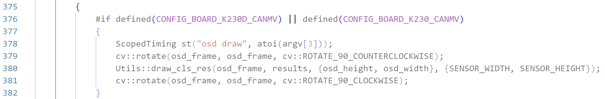

**3.4编译可执行程序**

**注意：**若已经激活Kmodel模型转换环境，请忽略步骤①和步骤②。

1.  在Ubuntu中新建终端，并进入k230\_SDK目录下

```text
cd k230_sdk/
```


1.  激活Kmodel模型转换环境

```text
sudo docker run -u root -it -v $(pwd):$(pwd) -v $(pwd)/toolchain:/opt/toolchain -w $(pwd) ghcr.io/kendryte/k230_sdk /bin/bash
```


1.  由于我们之前修改的源码是K230\_CANMV的配置，需要准备K230\_CANMV的环境

```text
make CONF=k230_canmv_defconfig prepare_memory
```

1.  编译多媒体相关源码。

```text
make mpp
```

1.  进入图像分类任务源码目录。

```text
cd src/big/nncase/example_code_k230/
```

1.  编译图像分类可执行程序。

```text
./build_app.sh
```

1.  退出docker环境。

```text
exit
```

**3.5运行可执行程序**

1.  进入源码目录并使用adb将编译出来的程序传输至开发板端。

```text
cd src/big/nncase/example_code_k230/
adb push k230_bin/main.elf /sharefs
```

1.  将部署资源包中的kmodel模型文件和deploy\_config.json部署配置文件传输至开发板端。这里我将模型文件和配置文件都传输至Ubuntu端的example\_code\_k230目录下。

```text
adb push deploy_config.json /sharefs
adb push *.kmodel /sharefs
```

**注意：**其中\*.kmodel需要替换为您实际的kmodel模型文件名称。

1.  打开开发板的串口B ，访问rt-smart大核系统的串口。由于rt-smart系统有开机自启程序，可输入q + 回车键结束开机自启程序。
2.  进入开发板中可执行文件目录

```text
cd /sharefs/
```

1.  进行视频流推理

```text
./main.elf deploy_config.json None 0
```

摄像头推理会将结果实时显示在屏幕上。

## 实现目标检测任务

1.  **创建数据集**

点击“数据集”选项，并点击”创建数据集”按钮。

选择标注类型，点击”目标检测”，并填入数据集名称，这里数据集名称可自定义。最好点击提交即可。

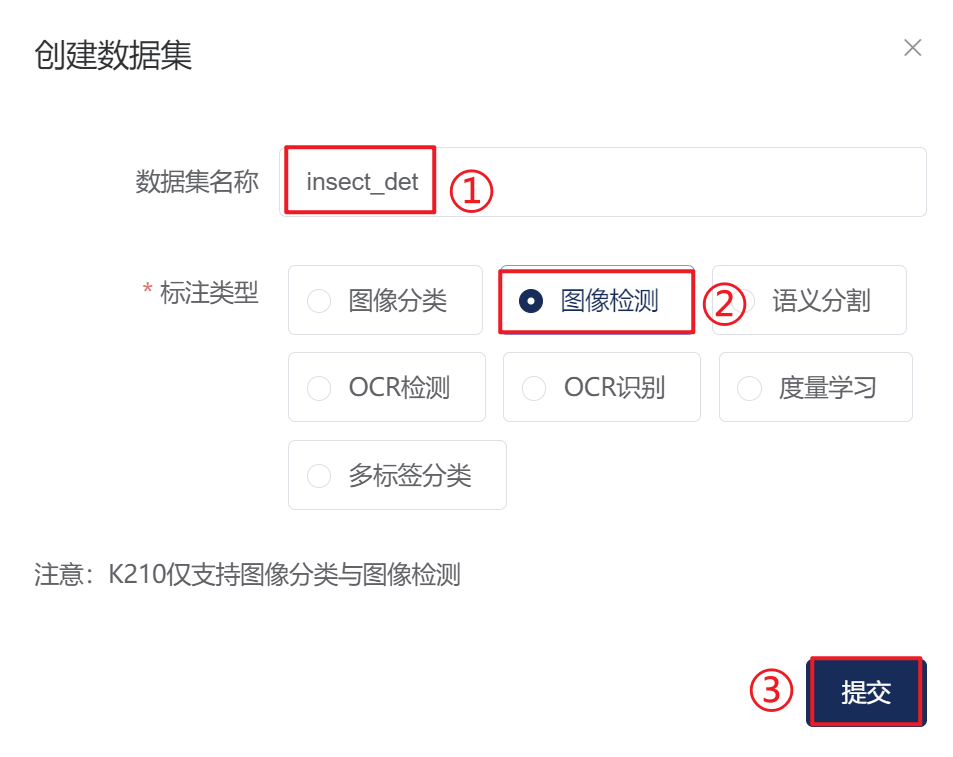

点击“配置“按钮，进入数据集配置界面。

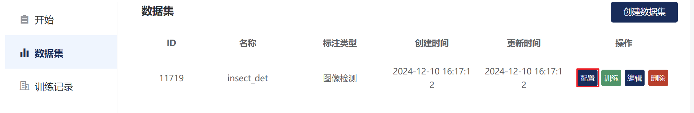

此时可进行数据集的配置，**推荐上传数据集压缩包**的方式。

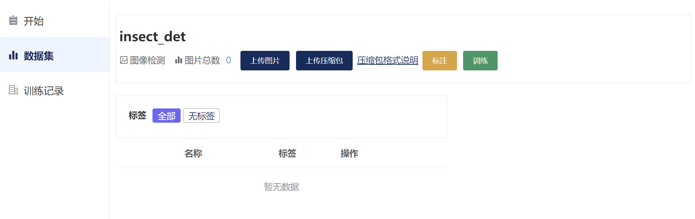

可点击“压缩包格式说明“了解需要如何准备数据集

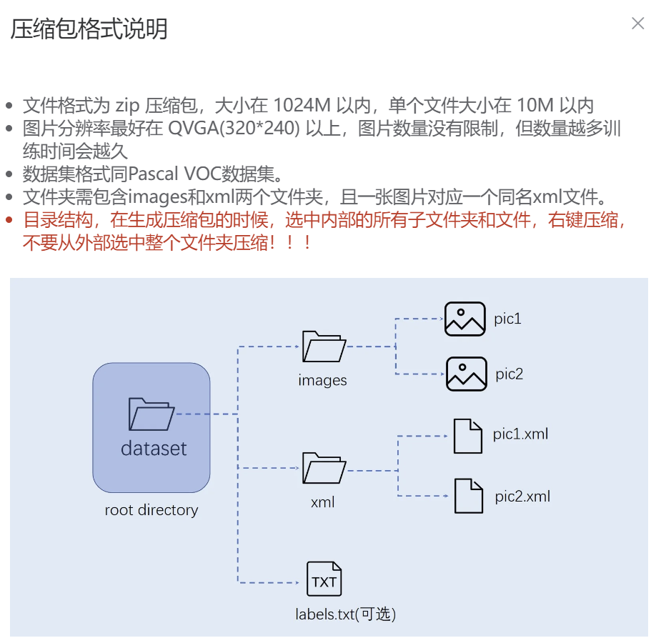

如果不清楚数据集压缩包格式，可前往嘉楠开发者社区资料下载中心：[https://developer.canaan-creative.com/resource](https://developer.canaan-creative.com/resource)。选择对应的数据集压缩包示例进行下载。

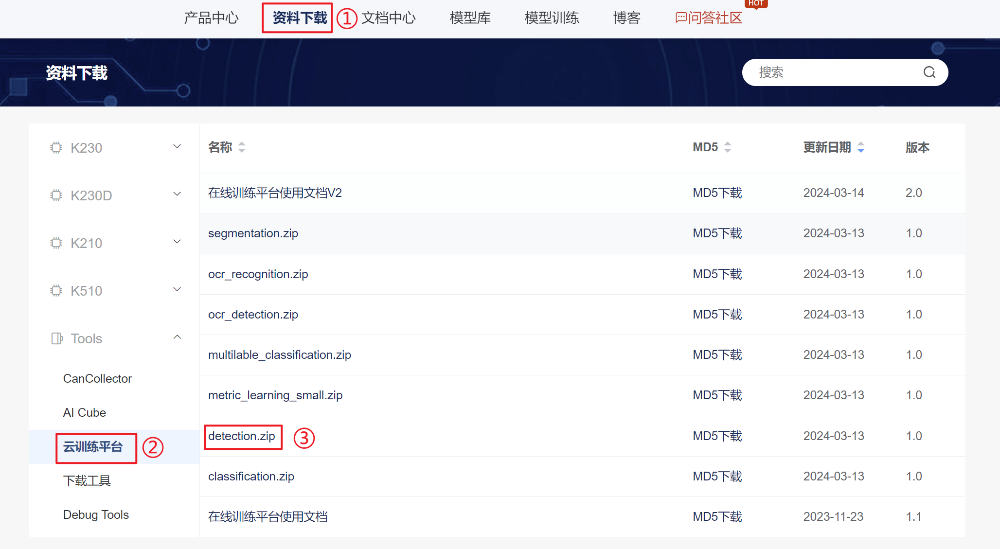

这里我以昆虫检测数据集压缩包为例，上传至云训练平台。

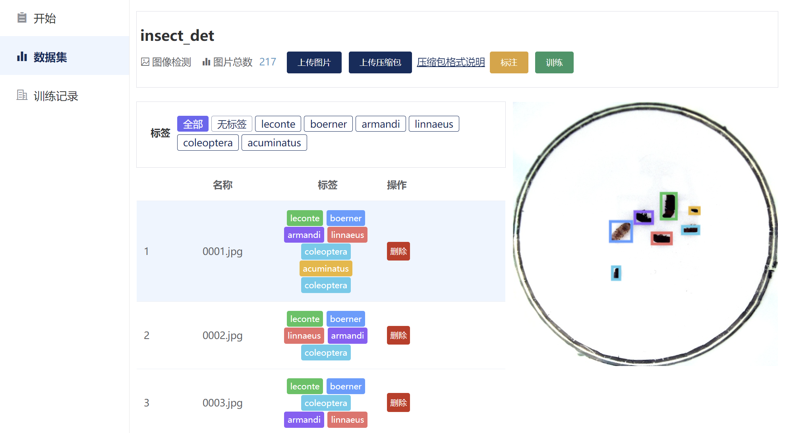

1.  **创建训练任务**

点击“训练“按钮


填写任意任务名称，选择运行芯片为K230,nncase版本为2.9.0，设置迭代次数与批数据量大小，设置学习率，最后点击确认即可。

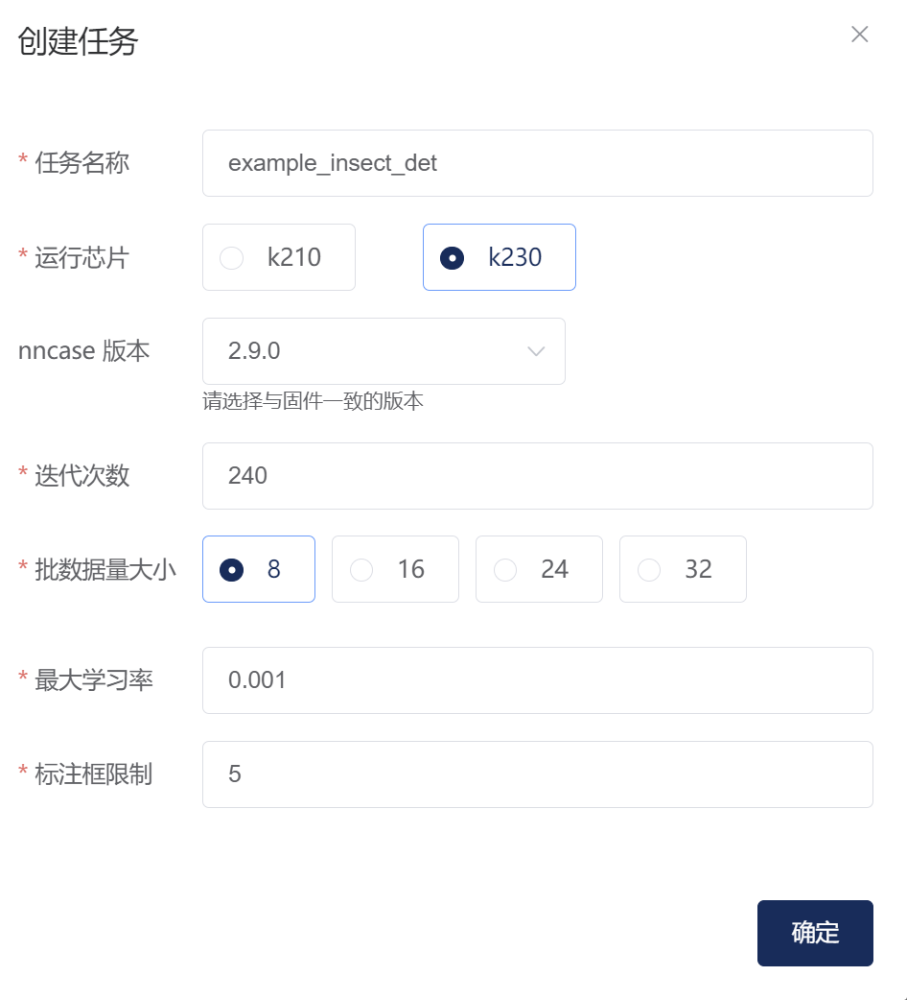

当云端服务器训练资源可用时，该任务会进入训练阶段。点击“训练记录“，并选择”详情“，如下图所示：

可查看任务的训练情况，如下图所示：

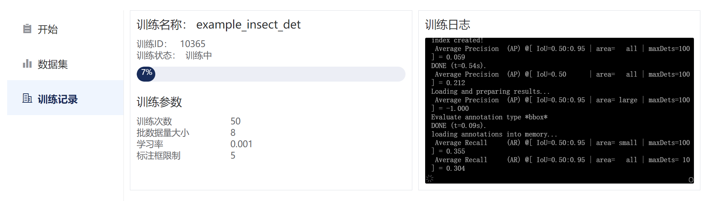

训练结束后可以下载部署包，同时部署包也会发送给您注册的邮箱。当然您也可以点击“训练记录“选项，点击“资料下载”，下载部署资源包。

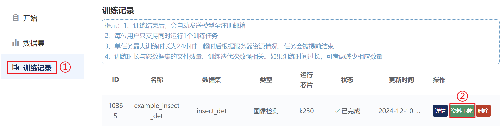

部署包解压后，目录如下：

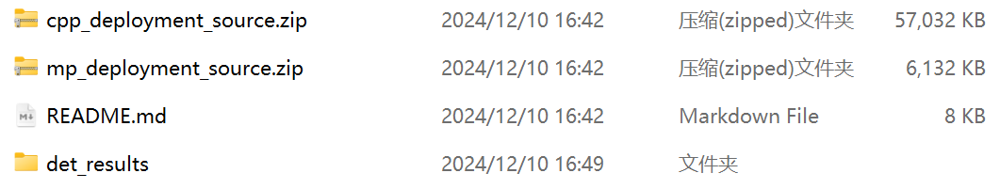

目录说明：

```text
|-det_result # 此目录存放部分测试样本检测结果
|-*.kmodel # 开发板部署所用kmodel
|-deploy_config.json # 部署配置文件
|-deployment_source.zip # C++部署资源
|-mp_deployment_source.zip # MicroPython部署资源
```

1.  **编译与运行分类任务**

**3.1解压部署资源包文件**

解压部署资源包中的cpp\_deployment\_source.zip压缩包，并进入cpp\_deployment\_source文件夹中。

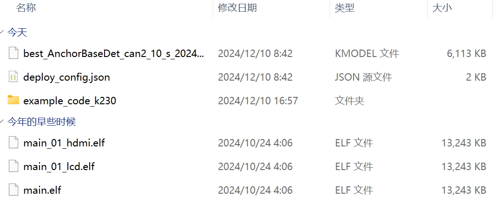

**3.2将示例代码拷贝至Ubuntu**

将示例代码文件夹example\_code\_k230传输至Ubuntu虚拟机中k230\_sdk目录下的src/big/nncase下。

**3.3修改k230\_deploy文件夹下的源码，适配对应的屏幕和摄像头**

1.  修改**vi\_vo.h**文件
2.  这里我们直接修改K230\_CANMV的配置，修改显示屏的通道和OSD叠加的宽高。

```text
#if defined(CONFIG_BOARD_K230_CANMV)
#define SENSOR_CHANNEL (3)    
#define SENSOR_HEIGHT (720)  
#define SENSOR_WIDTH (1280)   
#define ISP_CHN0_WIDTH  (960)
#define ISP_CHN0_HEIGHT (540)
#define ISP_INPUT_WIDTH (1920)
#define ISP_INPUT_HEIGHT (1080)
#define vicap_install_osd                   (1)
#define osd_id                              K_VO_OSD3
#define osd_width                           (540)
#define osd_height                          (560)
```

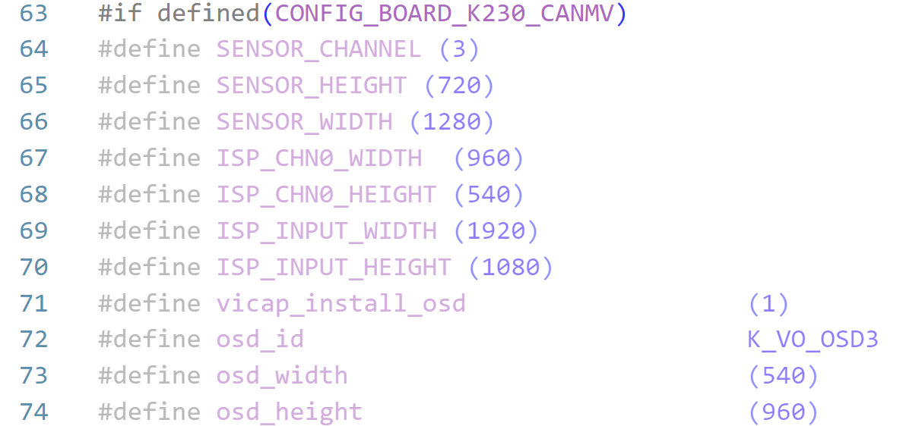

1.  修改显示屏的名称为NT33516。

```text
#if defined(CONFIG_BOARD_K230_CANMV)
    k_connector_type connector_type = NT35516_MIPI_2LAN_540X960_30FPS;
```

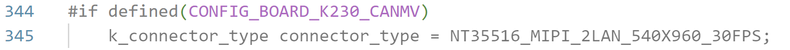

1.  由于我们的屏幕分辨率使用横屏的方式，观看体验更佳，所以我们在K230D之后增加增加CANMV的配置，使得我们编译的时候也会将屏幕进行旋转横屏。

```text
    #if defined(CONFIG_BOARD_K230D_CANMV) || defined(CONFIG_BOARD_K230_CANMV)
    info.act_size.width = ISP_CHN0_HEIGHT;//1080;//640;//1080;
    info.act_size.height = ISP_CHN0_WIDTH;//1920;//480;//1920;
    info.format = PIXEL_FORMAT_YVU_PLANAR_420;
    info.func = K_ROTATION_90;
```

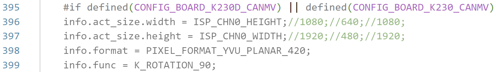

1.  修改我们使用的摄像头为GC2093

```text
    #if defined(CONFIG_BOARD_K230_CANMV)
    sensor_type = GC2093_MIPI_CSI2_1920X1080_30FPS_10BIT_LINEAR;
```


1.  修改**main.c**主程序

找到函数**video\_proc\_ob\_det**，该函数为视频流目标检测任务所执行的函数，由于叠加的osd框也需要旋转，所以在K230D后面也需要加上K230\_CANMV的配置。

```text
#if defined(CONFIG_BOARD_K230D_CANMV) || defined(CONFIG_BOARD_K230_CANMV)
        {
            ScopedTiming st("osd draw", atoi(argv[3]));
            cv::rotate(osd_frame, osd_frame, cv::ROTATE_90_COUNTERCLOCKWISE);
            Utils::draw_cls_res(osd_frame, results, {osd_height, osd_width}, {SENSOR_WIDTH, SENSOR_HEIGHT});
            cv::rotate(osd_frame, osd_frame, cv::ROTATE_90_CLOCKWISE);
        }
```

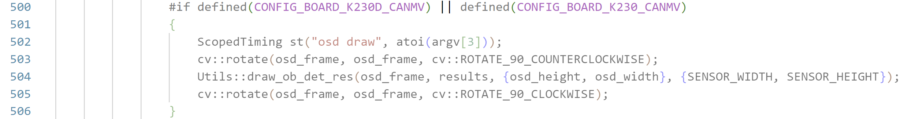

**3.4 编译可执行程序**

**注意：**若已经激活Kmodel模型转换环境，请忽略步骤①和步骤②。

1.  在Ubuntu中新建终端，并进入k230\_SDK目录下

```text
cd k230_sdk/
```


1.  激活Kmodel模型转换环境

```text
sudo docker run -u root -it -v $(pwd):$(pwd) -v $(pwd)/toolchain:/opt/toolchain -w $(pwd) ghcr.io/kendryte/k230_sdk /bin/bash
```


1.  由于我们之前修改的源码是K230\_CANMV的配置，需要准备K230\_CANMV的环境

```text
make CONF=k230_canmv_defconfig prepare_memory
```

1.  编译多媒体相关源码。

```text
make mpp
```

1.  进入图像分类任务源码目录。

```text
cd src/big/nncase/example_code_k230/
```

1.  编译图像分类可执行程序。

```text
./build_app.sh
```

1.  退出docker环境。

```text
exit
```

**3.5运行可执行程序**

1.  进入源码目录并使用adb将编译出来的程序传输至开发板端。

```text
cd src/big/nncase/example_code_k230/
adb push k230_bin/main.elf /sharefs
```

1.  将部署资源包中的kmodel模型文件和deploy\_config.json部署配置文件传输至开发板端。这里我将模型文件和配置文件都传输至Ubuntu端的example\_code\_k230目录下。

```text
adb push deploy_config.json /sharefs
adb push *.kmodel /sharefs
```

注意：其中\*.kmodel需要替换为您实际的kmodel模型文件名称。

1.  打开开发板的串口B ，访问rt-smart大核系统的串口。由于rt-smart系统有开机自启程序，可输入q + 回车键结束开机自启程序。
2.  进入开发板中可执行文件目录

```text
cd /sharefs/
```

1.  进行视频流推理

```text
./main.elf deploy_config.json None 0
```

摄像头推理会将结果实时显示在屏幕上。
